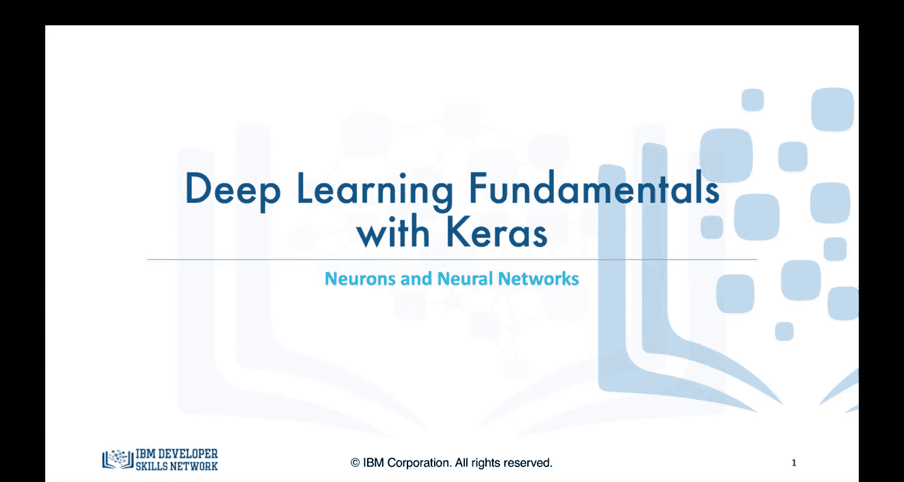
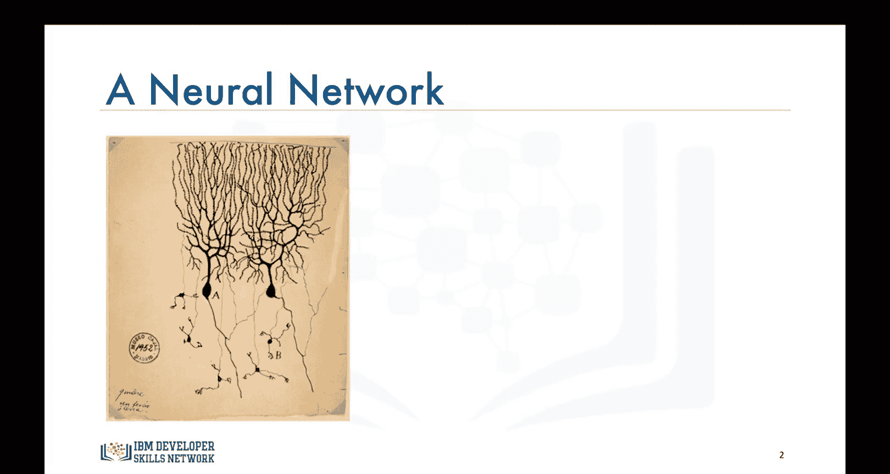
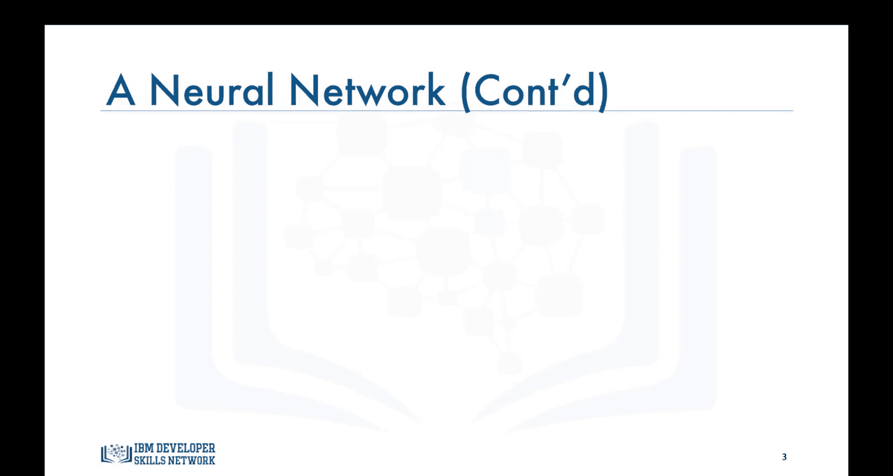
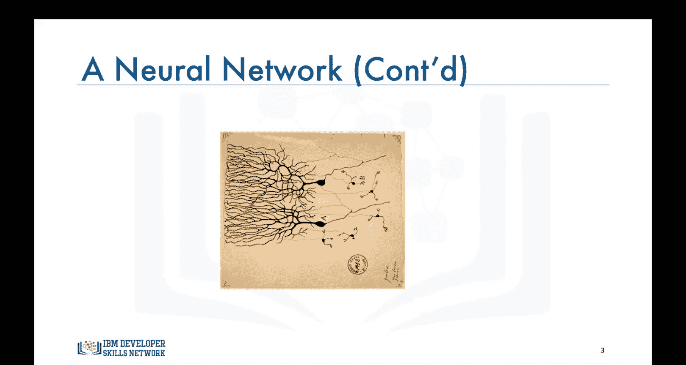
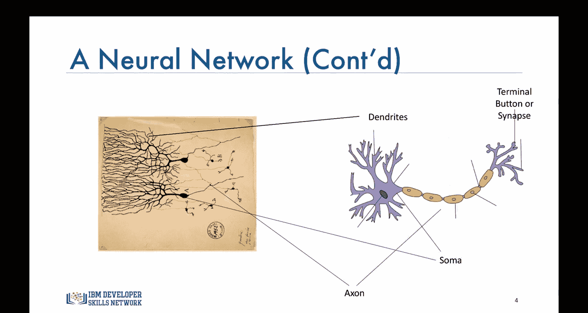
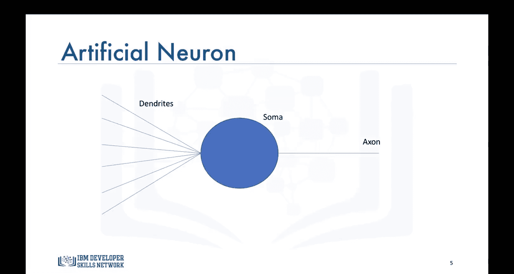

# 生成式人工智能工程：082：神经元与神经网络 🧠

在本节课中，我们将要学习深度学习算法的核心灵感来源——生物神经元与神经网络的工作原理。我们将从神经元的早期发现讲起，逐步理解其结构，并最终将其与人工神经元进行类比，为后续学习神经网络的信息处理方式打下基础。

## 神经元的早期发现

深度学习领域所使用的算法，其灵感很大程度上来源于大脑中神经元和神经网络处理数据的方式。

上图是最早的神经元绘图之一。这幅图由圣地亚哥·拉蒙·卡哈尔于1899年绘制，基于他在显微镜下观察鸽子大脑后的所见。他如今被誉为现代神经科学之父。根据他的绘图，神经元（其中一个标记为“a”）中间有一个较大的胞体，并伸出长长的“手臂”，这些“手臂”会分叉并与其他神经元相连接。

## 神经网络的密集结构

这里的另一张图片展示的是神经网络，它包含了看起来像脑组织中的成千上万个神经元。这张图让你感受到它们排列得多么紧密，以及在一小块脑组织中存在多少神经元。

回到拉蒙·卡哈尔的神经元绘图，让我们将其向左旋转90度。

我敢打赌，现在它看起来有点眼熟了，因为它与你可能见过的人工神经网络绘图略有相似。

## 生物神经元的结构与功能

这是一幅神经元的卡通示意图。神经元的主体称为**胞体**，其中包含神经元的细胞核。从胞体伸出的大量“手臂”网络称为**树突**。而从胞体另一端伸出的长“手臂”则称为**轴突**。轴突末端的细须被称为**终末按钮**或**突触**。

以下是神经元信息传递的基本流程：
1.  树突接收来自传感器或其他相邻神经元终末按钮的电脉冲，这些脉冲携带着信息或数据。
2.  树突将脉冲或数据传递到胞体和细胞核。
3.  电脉冲或数据通过组合在一起进行处理。
4.  处理后的信息被传递给轴突。
5.  轴突将处理后的信息携带至终末按钮或突触。
6.  这个神经元的输出成为其他成千上万个神经元的输入。

大脑中的学习过程是通过反复激活某些特定的神经连接（而非其他连接）来实现的，这强化了这些连接。这使得它们在给定特定输入时，更有可能产生期望的结果。一旦期望的结果出现，导致该结果的神经连接就会得到加强。

## 从生物到人工：人工神经元

人工神经元的行为方式与生物神经元相同，因此它也由胞体、树突和轴突组成，以将本神经元的输出传递给其他神经元。轴突的末端可以分叉以连接到许多其他神经元，但为了简化，我们在这里只显示一个分支。学习过程也非常类似于大脑中的学习方式，你将在接下来的几个视频中看到这一点。

## 迈向数学建模

既然我们已经理解了人工神经元的不同部分，接下来让我们学习如何阐述人工神经网络处理信息的方式。

本节课中，我们一起学习了神经元与神经网络的基础知识。我们从神经元的早期发现开始，了解了其基本结构（胞体、树突、轴突、突触）和信息传递流程，并看到了生物神经元如何启发了结构相似的人工神经元设计。理解这一生物学基础，是掌握后续深度学习算法原理的关键第一步。