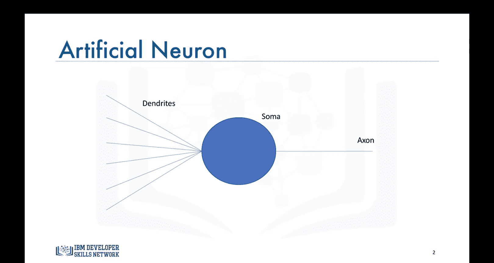
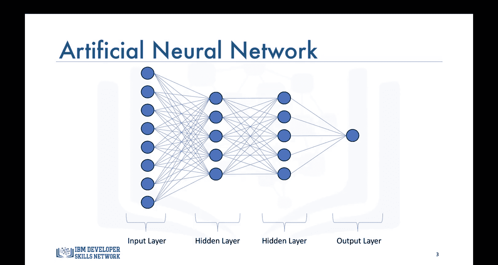
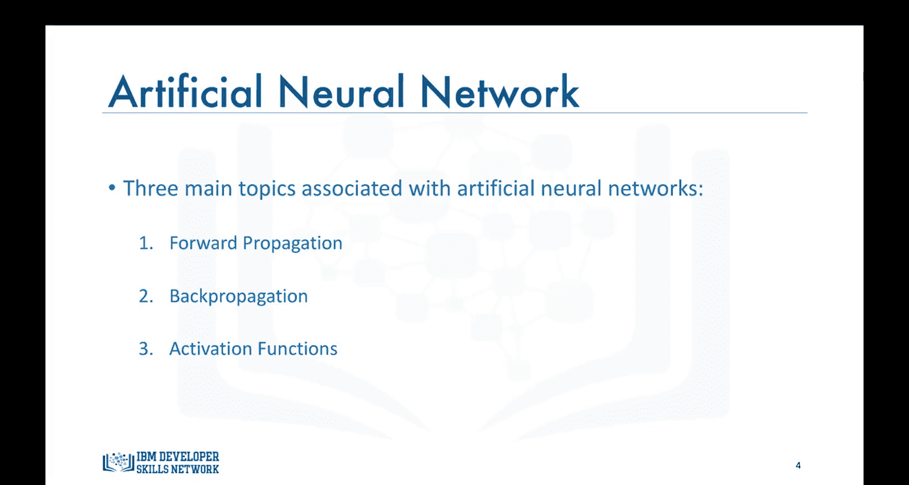
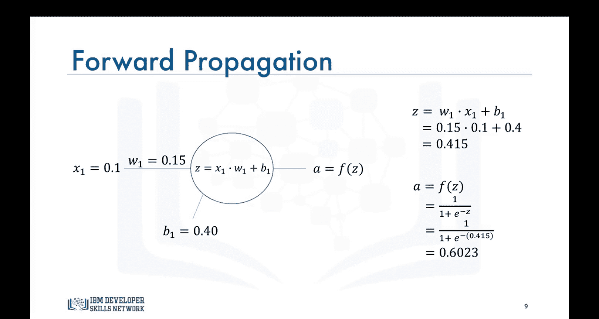
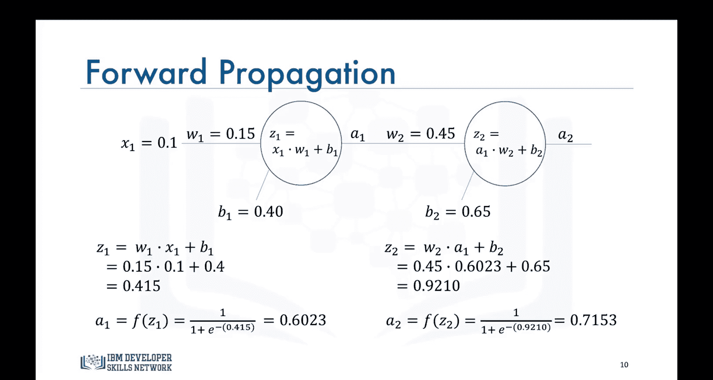
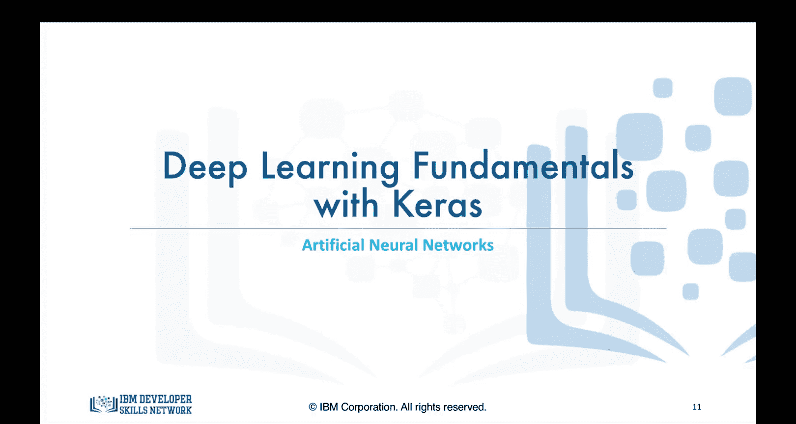

# 生成式人工智能工程：083：人工神经网络

在本节课中，我们将学习人工神经网络的数学表述。

## 概述

我们将从理解单个神经元的基本数学模型开始，逐步扩展到多层神经网络。核心内容包括神经网络的层级结构、前向传播的计算过程，以及激活函数的作用。

## 神经网络的结构

在上一节中，我们了解到人工神经元的形状是为了模仿真实的生物神经元而设计的。

对于一个神经元网络，我们通常将其划分为不同的层。

*   **输入层**：将数据馈送到网络的第一层。
*   **输出层**：提供网络最终输出结果的节点集合。
*   **隐藏层**：位于输入层和输出层之间的任何节点集合。

## 核心概念：前向传播、反向传播与激活函数

在处理神经网络时，我们主要涉及三个主题：**前向传播**、**反向传播**和**激活函数**。本节视频将重点介绍前向传播，并通过数字示例进行解释。

## 前向传播详解

前向传播是数据从神经网络的输入层开始，逐层穿过神经元，最终到达输出层的过程。

让我们从一个神经元开始，用数学公式描述信息流经它的方式，如下图所示。数据通过连接（或称树突）流经每个神经元。每个连接都有一个特定的**权重**，用于调节数据流。

这里，`x1` 和 `x2` 是两个输入值（可以是整数或浮点数）。当这些输入通过连接时，会根据连接权重 `W1` 和 `W2` 进行调整。神经元随后通过输出这些输入的加权和来处理这些信息，它还会在和中添加一个常数，称为**偏置**。

因此，这里的 `Z` 是输入、权重和偏置的线性组合。`A` 是神经元的输出。为保持一致性，我们在整个课程中将坚持使用这些字母：`Z` 始终代表输入的线性组合，`A` 始终代表神经元的输出。

然而，仅仅输出输入的加权和会限制神经网络能够执行的任务。因此，更好的数据处理方式是将加权和映射到一个非线性空间。一个常用的函数是 **Sigmoid 函数**：如果加权和是一个非常大的正数，那么神经元的输出接近 1；如果加权和是一个非常大的负数，那么神经元的输出接近 0。

像 Sigmoid 函数这样的非线性变换被称为**激活函数**。激活函数是人工神经网络另一个极其重要的特性，它们基本上决定了一个神经元是否应该被激活，换句话说，神经元接收到的信息是相关的还是应该被忽略。

这里的关键信息是：**没有激活函数的神经网络本质上只是一个线性回归模型**。激活函数对输入执行非线性变换，使神经网络能够学习和执行更复杂的任务，如图像分类和语言翻译。

为了进一步简化，我将使用一个只有一个神经元和一个输入的神经网络进行说明。

## 计算示例：单神经元网络

让我们看一个如何计算输出的例子。假设输入 `x1` 的值是 0.1，我们想预测这个输入对应的输出。网络已经优化了权重和偏置，其中 `W1` 是 0.15，`B1` 是 0.4。

第一步是计算 `Z`，它是输入与对应权重的点积加上偏置：
`Z = (x1 * W1) + B1 = (0.1 * 0.15) + 0.4 = 0.415`

然后，神经元使用 Sigmoid 函数对 `Z` 应用非线性变换。Sigmoid 函数的公式为：
`A = σ(Z) = 1 / (1 + e^(-Z))`

因此，神经元的输出 `A` 为：
`A = 1 / (1 + e^(-0.415)) ≈ 0.6023`

## 扩展到双神经元网络

对于一个有两个神经元的网络，第一个神经元的输出将成为第二个神经元的输入。其余过程完全相同。

第二个神经元接收输入 `A1`，计算输入（本例中为 `A1`）与权重 `W2` 的点积，并加上偏置 `B2`：
`Z2 = (A1 * W2) + B2`

假设 `W2 = 0.2`， `B2 = 0.5`，则：
`Z2 = (0.6023 * 0.2) + 0.5 = 0.62046`

再次使用 Sigmoid 函数作为激活函数，网络的最终输出 `A2` 为：
`A2 = σ(Z2) = 1 / (1 + e^(-0.62046)) ≈ 0.7153`

这个值（0.7153）就是输入 0.1 对应的预测值。**本质上，这就是神经网络为任何给定输入预测输出的方式**。无论网络变得多么复杂，过程都是完全相同的。

## 总结

本节课中，我们一起学习了人工神经网络的基础数学表述。总结如下：

给定一个具有一组权重和偏置的神经网络，你应该能够计算网络对于任何给定输入的输出。我们了解了神经网络的层级结构（输入层、隐藏层、输出层），深入探讨了**前向传播**的过程，并认识了**激活函数**（如 Sigmoid 函数）在引入非线性、使网络能够处理复杂任务中的关键作用。

在下一节视频中，我们将开始学习如何训练神经网络并优化其权重和偏置。

