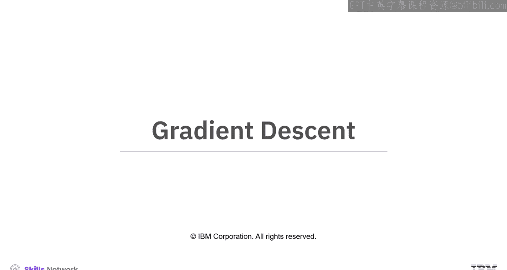
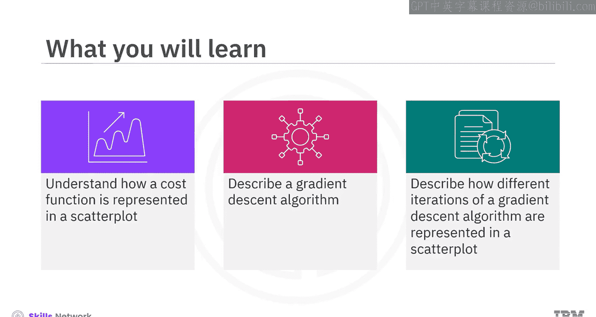
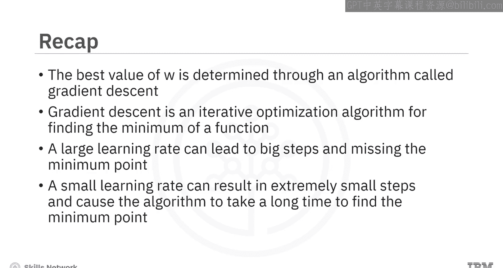

# 生成式人工智能工程：084：梯度下降 📉

在本节课中，我们将学习梯度下降算法。这是一种用于寻找函数最小值的迭代优化算法，在机器学习和神经网络训练中至关重要。我们将了解成本函数在散点图中的表示方式，理解梯度下降算法的工作原理，并描述算法不同迭代步骤在散点图中的表现。

## 成本函数与最佳拟合线

在开始探讨梯度下降之前，我们先理解一个核心概念：成本函数。假设我们有一些数据，如下方散点图所示。为简化起见，我们生成了数据，其中 `z` 的值是 `x` 值的两倍。

现在，我们希望找到一个 `W` 值，使得由 `z = W * x` 定义的直线能最好地拟合这些数据。为此，我们定义一个成本函数或损失函数 `J`。

一个常见的成本函数如下所示：

`J = Σ (z_i - W * x_i)^2`

其中，我们计算每个数据点的 `z` 值与 `W * x` 的差值，将其平方，并对所有数据点的平方差求和。最佳的 `W` 值就是能使这个成本函数值最小的那个值。

观察这个成本函数的图像，我们发现它是一个抛物线，具有一个全局最小值（即唯一解）。

对于给定的数据，使成本函数最小的 `W` 值是 `W = 2`，这意味着 `z = 2x`，这条直线将完美地拟合所有数据点。

然而，这是一个非常简化的例子。在现实世界的数据集中，目标变量 `Z` 通常依赖于多个变量，我们无法简单地绘制成本函数图并通过视觉直接确定最佳的权重值。

## 梯度下降算法介绍

那么，我们如何确定最佳的 `W` 值（或在需要优化多个权重时，最佳的 `W` 集合）呢？答案是通过一个称为**梯度下降**的算法。

梯度下降是一种用于寻找函数最小值的迭代优化算法。为了使用梯度下降找到函数的最小值，我们沿着当前点函数梯度的负方向，按一定比例（步长）移动。

这是什么意思呢？让我们用一个简单的过程来解释。

## 梯度下降的迭代过程

我们从一个随机的初始 `W` 值开始，假设为 `w0 = 0.2`。

1.  **计算梯度**：在当前位置 `w0`，计算损失函数的梯度。梯度由 `W = 0.2` 处切线的斜率给出。
2.  **确定步长**：步长的大小由一个称为**学习率**的参数控制。学习率越大，我们迈出的步伐就越大；学习率越小，步伐就越小。
3.  **更新参数**：我们沿着梯度下降的方向迈出一步，更新 `W` 值。更新公式为：
    `w1 = w0 - 学习率 * 在 w0 处的梯度`
    这代表了算法的第一次迭代。
4.  **重复迭代**：在 `w1` 处，我们重复相同的过程：计算在 `w1` 处的梯度，使用相同的学习率控制朝向最小值的步长。我们反复执行此步骤，直到达到最小值，或成本函数值非常接近最小值（在一个预先定义的小阈值内）。

## 学习率的选择与影响

选择学习率时必须谨慎。

*   **学习率过大**：会导致步伐过大，可能“跨过”最小值点，甚至导致算法无法收敛。
*   **学习率过小**：会导致步伐极小，使得算法需要非常长的时间才能找到最小值点。

## 梯度下降迭代可视化

现在，让我们看看在**学习率为 0.4** 的情况下，每次迭代如何影响生成的直线对数据的拟合效果。下图左侧展示了拟合直线的变化，右侧展示了 `W` 值在成本函数曲线上的移动。

*   **初始化**：我们将 `W` 初始化为 0，这意味着 `z = 0`，是一条水平线。此时成本很高，直线拟合效果很差。
*   **第一次迭代后**：由于在 `W = 0` 处斜率非常陡峭，`W` 值向 2 靠近了一大步。新的 `W` 值导致损失函数大幅下降。生成的直线比初始直线拟合得更好，但仍有改进空间。
*   **第二次迭代后**：`W` 继续向 2 移动。由于此时的斜率不如之前陡峭，步伐没有第一次大，但成本函数值仍在下降。生成的直线更接近理想的最佳拟合线。
*   **第三次与第四次迭代后**：观察到同样的趋势。经过四次迭代，`W` 值几乎达到 2，生成的直线几乎完美地拟合了散点图。

在每次迭代中，权重更新的方向与当前点函数梯度的负方向成比例。因此，如果你将权重初始化为最小值右侧的值，那么正的梯度将导致 `W` 向左移动，朝向最小值。

## 总结

本节课中，我们一起学习了梯度下降算法。

*   我们了解到，最佳权重值是通过**梯度下降**这一迭代优化算法确定的。
*   梯度下降通过计算成本函数的梯度，并沿负梯度方向更新参数，逐步逼近函数的最小值点。
*   **学习率**是一个关键超参数：过大会导致错过最优点；过小则会导致收敛速度过慢。
*   通过可视化迭代过程，我们直观地看到了权重如何更新，以及拟合直线如何逐步逼近数据的最佳拟合状态。

理解梯度下降是掌握神经网络如何学习和优化其权重与偏差的基础。