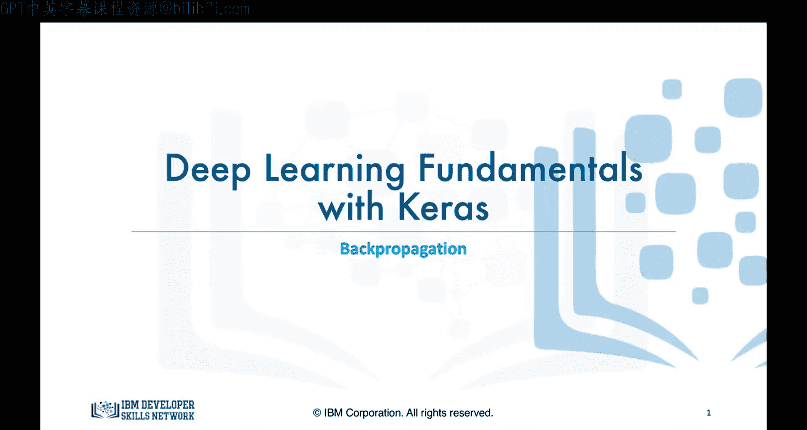
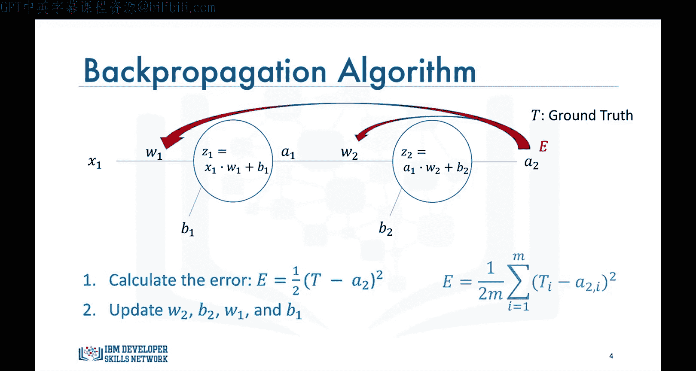
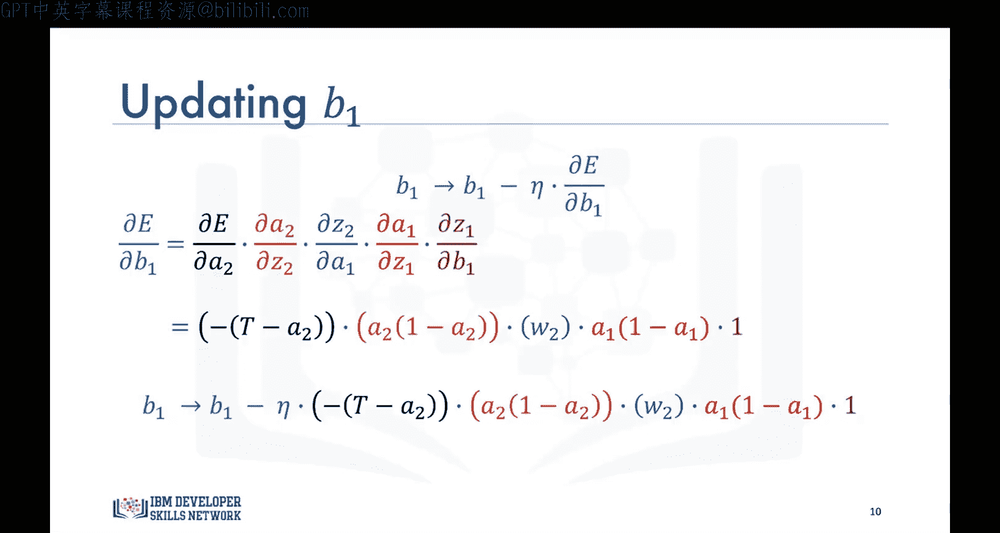
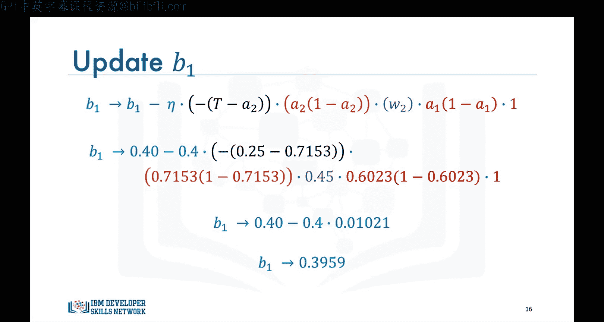
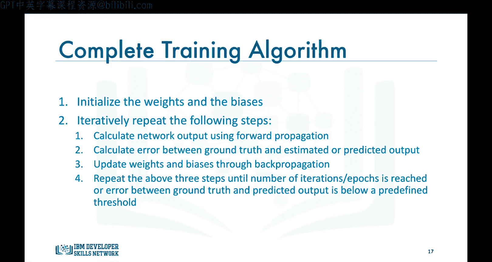
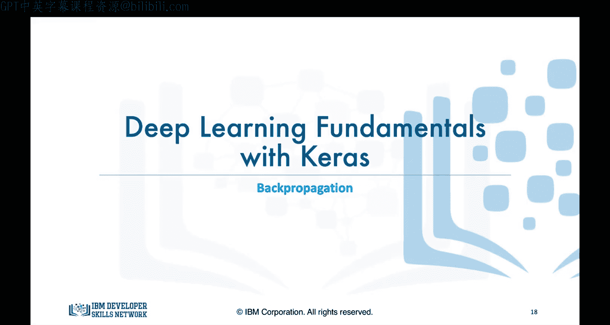

# 生成式人工智能工程：085：反向传播 🧠

在本节课中，我们将学习神经网络如何通过反向传播算法来训练和优化其权重与偏置。我们将从计算预测误差开始，逐步推导如何利用链式法则将误差反向传播至网络中的每一层，并更新参数。

---

在之前的视频中，我们讨论了神经网络如何使用前向传播进行预测，并假设网络已经拥有优化后的权重和偏置。然而，神经网络是如何针对特定问题和数据集来训练并优化这些权重与偏置的呢？

训练过程在监督学习的环境下进行，其中每个数据点都有对应的标签或真实值。当神经网络的预测值与给定输入的真实值明显不匹配时，就需要进行训练。

训练过程首先计算预测值与真实标签之间的误差 **E**。这个误差即代表我们在梯度下降视频中讨论过的成本或损失函数。因此，下一步是将此误差反向传播到网络中，并利用它来对网络中不同的权重和偏置执行梯度下降，使用我们在梯度下降视频中见过的相同方程进行优化。

对于一个仅有两个神经元、接收一个输入的简单网络，我们计算真实值 **T** 与预测值 **A2** 之间的平方误差。这代表了我们的成本或损失函数。当然，通常不会仅用一个数据点来训练网络，而是使用成千上万个数据点。因此，误差计算为如下所示的均方误差：

**公式：** `E = (1/n) * Σ(T - A2)^2`

然后，我们通过将误差反向传播到网络中，利用它来更新 **W2**、**B2**、**W1** 和 **B1**。

---

### 更新权重 W2

从梯度下降视频中我们知道，需要使用以下方程来更新 **W2**：

**公式：** `W2_new = W2_old - α * (∂E/∂W2)`

但由于误差并非 **W2** 的显式函数，我们需要使用链式法则来确定误差相对于 **W2** 的导数。

我们知道 **E** 是 **A2** 的函数，**A2** 是 **Z2** 的函数，而 **Z2** 是 **W2** 的函数。因此，我们可以分别求导：

**公式：** `∂E/∂W2 = (∂E/∂A2) * (∂A2/∂Z2) * (∂Z2/∂W2)`

其中：
*   `∂E/∂A2 = -(T - A2)`
*   `∂A2/∂Z2 = A2 * (1 - A2)` （假设使用Sigmoid激活函数）
*   `∂Z2/∂W2 = A1`

因此，**W2** 的更新方程如下：

**公式：** `W2_new = W2_old - α * [-(T - A2) * A2(1 - A2) * A1]`

### 更新偏置 B2

更新 **B2** 的过程完全相同，唯一的区别在于 `∂Z2/∂B2 = 1`，而不是输入 **A1**。

**公式：** `B2_new = B2_old - α * [-(T - A2) * A2(1 - A2) * 1]`

### 更新权重 W1 和偏置 B1

要更新更早层的参数（如 **W1**），我们再次使用链式法则，因为误差与 **W1** 没有直接关系。

误差 **E** 到 **W1** 的依赖路径更长：`E -> A2 -> Z2 -> A1 -> Z1 -> W1`。因此，其导数为这些中间导数的乘积：

**公式：** `∂E/∂W1 = (∂E/∂A2) * (∂A2/∂Z2) * (∂Z2/∂A1) * (∂A1/∂Z1) * (∂Z1/∂W1)`

其中：
*   `∂E/∂A2 = -(T - A2)`
*   `∂A2/∂Z2 = A2 * (1 - A2)`
*   `∂Z2/∂A1 = W2`
*   `∂A1/∂Z1 = A1 * (1 - A1)` （假设使用Sigmoid激活函数）
*   `∂Z1/∂W1 = X1` （输入）

因此，**W1** 的更新方程是一个较长的表达式：

**公式：** `W1_new = W1_old - α * [-(T - A2) * A2(1 - A2) * W2 * A1(1 - A1) * X1]`

使用相同的方法，我们可以推导出更新偏置 **B1** 的表达式（`∂Z1/∂B1 = 1`）。

---

### 反向传播实例演示

现在，让我们将反向传播应用到前向传播视频中的例子。回顾一下，我们有一个包含两个神经元的网络，其权重和偏置的初始值如图所示。

我们应用前向传播，计算出：
*   `Z1 = 0.415`
*   `A1 = 0.6023`
*   `Z2 = 0.9210`
*   `A2 = 0.7153` （这是网络对输入 `X1=0.1` 的预测值）

现在假设真实值 `T = 0.25`。我们首先计算预测值与真实值之间的误差。

接下来，我们将开始更新权重和偏置。迭代可以持续一个预定义的次数（例如1000个周期），或者直到误差低于一个预定义的阈值（例如0.001）。

假设学习率 `α = 0.4`，让我们看看第一次迭代后权重和偏置如何变化。

以下是更新计算：
1.  **更新 W2**：代入 `T`、`A2`、`A1` 的值计算梯度。`∂E/∂W2 = 0.05706`，因此 `W2` 更新为 `0.407`。
2.  **更新 B2**：代入 `T`、`A2` 的值计算梯度。`∂E/∂B2 = 0.0948`，因此 `B2` 更新为 `0.612`。
3.  **更新 W1**：代入 `T`、`A2`、`W2`、`A1`、`X1` 的值计算梯度。`∂E/∂W1 = 0.001021`，因此 `W1` 更新为 `0.1496`。
4.  **更新 B1**：`∂E/∂B1 = 0.01021`，因此 `B1` 更新为 `0.3959`。

这就完成了训练过程的第一次迭代或周期。使用更新后的权重和偏置，我们进行新一轮的前向传播，计算新的预测值，与真实值比较，计算新的误差，然后再进行一轮反向传播。

---

### 训练算法总结

综上所述，神经网络的训练算法可以概括为以下步骤：

首先，将权重和偏置初始化为随机值。

然后，迭代重复以下步骤：
1.  **前向传播**：计算网络的输出。
2.  **计算误差**：计算网络预测输出与真实值之间的误差。
3.  **反向传播**：通过反向传播更新权重和偏置。

重复以上三个步骤，直到达到预定的迭代次数（周期），或者预测输出与真实值之间的误差低于预定义的阈值。

---

在本节课中，我们一起学习了反向传播的基本原理和计算过程。我们看到了如何利用链式法则将输出层的误差梯度逐层反向传播，以更新网络中每一层的权重和偏置。这是神经网络能够从数据中学习的关键机制。

在下一个视频中，我们将继续讨论反向传播算法，并指出当Sigmoid函数用作深度网络隐藏层的激活函数时，存在的一个严重缺陷。