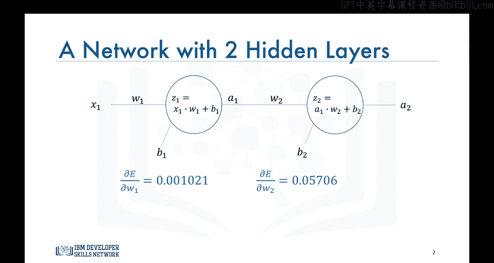
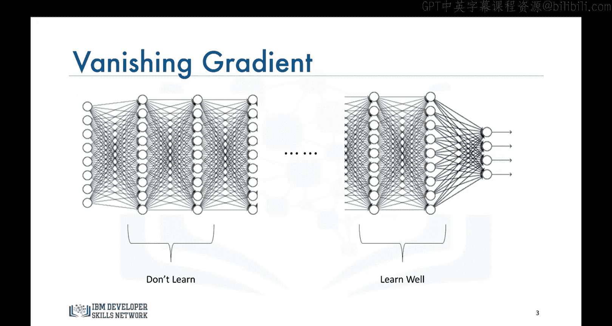

# 生成式人工智能工程：086：梯度消失问题

在本节课中，我们将讨论一个与Sigmoid激活函数相关的问题，正是这个问题曾阻碍了神经网络更早地蓬勃发展。这个问题被称为梯度消失问题。

## 概述

上一节我们介绍了反向传播算法。本节中，我们将深入探讨一个在早期神经网络训练中普遍存在的难题——梯度消失。理解这个问题，是理解为何现代神经网络采用不同激活函数的关键。

## 梯度消失问题详解

回忆上一节中那个非常简单的、仅有两个神经元的网络。误差相对于权重的导数如下所示：

可以看到梯度值非常小，但更重要的是，误差相对于第一个权重 `W1` 的梯度尤其微小。

问题的根源在于，当我们使用Sigmoid函数作为激活函数时，网络中所有中间层的输出值都被限制在0到1之间。

在反向传播过程中，我们不断地将小于1的因子相乘，导致梯度随着我们在网络中向后传播而变得越来越小。这意味着，与网络中后面层的神经元相比，前面层的神经元学习速度非常缓慢。

以下是梯度消失导致的核心影响：

*   **早期层训练最慢**：网络中最靠近输入层的部分参数更新幅度极小。
*   **训练过程漫长**：整体网络收敛需要极长的时间。
*   **预测精度受损**：由于早期层未能充分学习，模型无法捕捉数据中的深层特征，导致性能不佳。

因此，我们不使用Sigmoid函数或类似函数作为激活函数，因为它们容易导致梯度消失问题。其导数公式 `σ‘(x) = σ(x)(1 - σ(x))` 的最大值仅为0.25，在链式求导中极易使梯度指数级衰减。

## 总结与过渡

本节课中，我们一起学习了梯度消失问题的成因及其对神经网络训练的严重影响。它解释了为何Sigmoid等函数不再被用作隐藏层的默认激活函数。

正因为存在梯度消失的挑战，研究人员开始寻找更好的替代方案。因此，在下一节课中，我们将学习其他几种后来变得极为流行、如今几乎在所有神经网络隐藏层中使用的激活函数。这些函数正是为了帮助克服梯度消失问题而被广泛采纳的。

