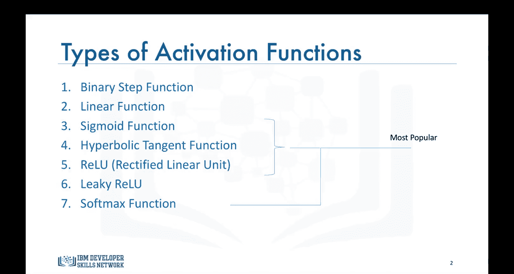
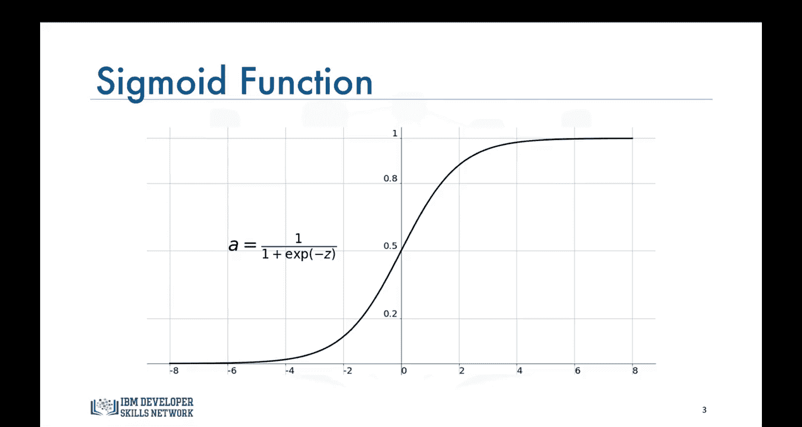
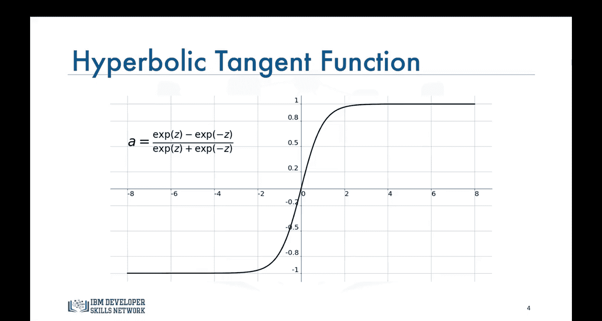
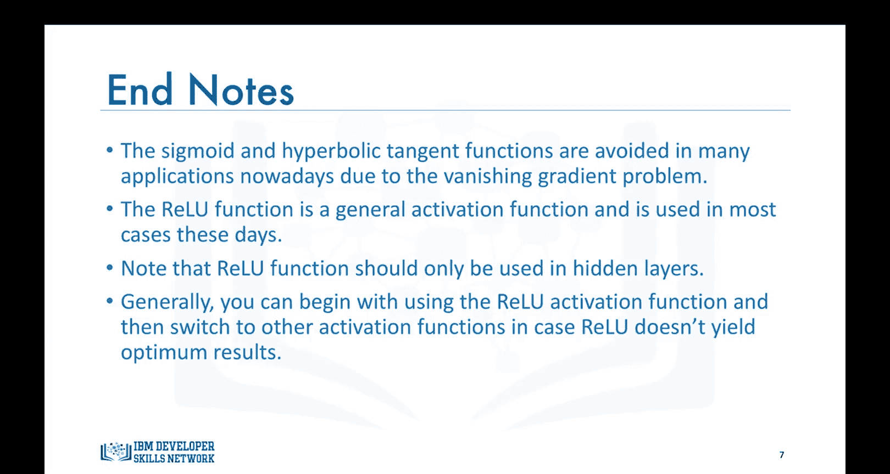

# 生成式人工智能工程：087：激活函数 🧠

在本节课中，我们将要学习神经网络中的激活函数。激活函数在神经网络的学习过程中扮演着核心角色，它决定了神经元是否应该被激活，并将输入信号转换为输出信号。我们将介绍几种常见的激活函数，分析它们的优缺点，并了解它们各自适用的场景。

## 概述

正如我们之前所讨论的，激活函数在神经网络的学习过程中起着重要作用。到目前为止，我们在网络中只使用了Sigmoid函数作为激活函数。但Sigmoid函数有其缺点，它可能导致早期层出现梯度消失问题。在本视频中，我们将讨论其他激活函数，这些函数使用效率更高，并且更适用于深度学习应用。

## 激活函数类型

以下是构建神经网络时可以使用的七种激活函数类型：

*   二元阶跃函数
*   线性或恒等函数
*   Sigmoid或Logistic函数
*   双曲正切或Tanh函数
*   修正线性单元函数
*   带泄露的ReLU函数
*   Softmax函数

在本视频中，我们将讨论其中流行的几种，即Sigmoid函数、双曲正切函数、ReLU函数和Softmax函数。

## Sigmoid函数

上一节我们介绍了激活函数的类型，本节中我们来看看最经典的Sigmoid函数。

这是Sigmoid函数。当 `Z = 0` 时，`a = 0.5`。当 `Z` 是一个非常大的正数时，`a` 接近 `1`。当 `Z` 是一个非常大的负数时，`a` 接近 `0`。

Sigmoid函数过去曾被广泛用作神经网络隐藏层的激活函数。然而，正如你所见，该函数在正负3区间之外的部分非常平坦。这意味着一旦函数值落入该区域，梯度会变得非常小。这导致了我们讨论过的梯度消失问题。随着梯度趋近于零，网络实际上无法有效学习。

Sigmoid函数的另一个问题是其值域仅在 `0` 到 `1` 之间。这意味着Sigmoid函数不是关于原点对称的，并且其输出值全部为正。然而，我们并非总是希望传递到下一个神经元的信号全部具有相同的符号。这个问题可以通过缩放Sigmoid函数来解决，这引出了下一个激活函数：双曲正切函数。

## 双曲正切函数

了解了Sigmoid函数的局限性后，我们来看一个它的改进版本。

这是双曲正切或Tanh函数，它与Sigmoid函数非常相似，实际上是Sigmoid函数的一个缩放版本。但与Sigmoid函数不同，它关于原点对称，值域在 `-1` 到 `+1` 之间。然而，尽管它克服了Sigmoid函数缺乏对称性的问题，但在非常深的神经网络中，它同样会导致梯度消失问题。

## ReLU函数

为了解决梯度消失问题并提升训练效率，ReLU函数应运而生，并成为目前最流行的选择。

修正线性单元函数是当今设计网络时使用最广泛的激活函数。除了其非线性特性外，ReLU函数相对于其他激活函数的主要优势在于它不会同时激活所有神经元。

根据这里的图示，如果输入是负数，它将被转换为零，该神经元不会被激活。这意味着在任何时刻，只有少数神经元被激活，使得网络稀疏且非常高效。此外，ReLU函数是深度学习领域克服梯度消失问题的主要进展之一。

## Softmax函数

最后，我们将讨论一个专门为分类任务设计的激活函数。

Softmax函数也是一种Sigmoid函数，但在处理分类问题时非常方便。Softmax函数通常用于分类器模型的输出层，目的是获取概率来定义每个输入所属的类别。

例如，如果一个具有三个输出神经元的网络输出值为 `[1.6, 0.55, 0.98]`，那么经过Softmax激活函数后，输出将被转换为 `[0.51, 0.18, 0.31]`。这样，我们就能更容易地对给定数据点进行分类，并确定它属于哪个类别。

## 总结

本节课中我们一起学习了神经网络中几种关键的激活函数。

总而言之，Sigmoid和Tanh函数如今在许多应用中已被避免使用，因为它们可能导致梯度消失问题。ReLU函数是当前广泛使用的函数，需要注意的是，它通常只用于隐藏层。最后，在构建模型时，你可以从使用ReLU函数开始，如果ReLU函数性能不佳，再尝试切换到其他激活函数。

本视频关于激活函数的内容到此结束，我们下个视频再见。