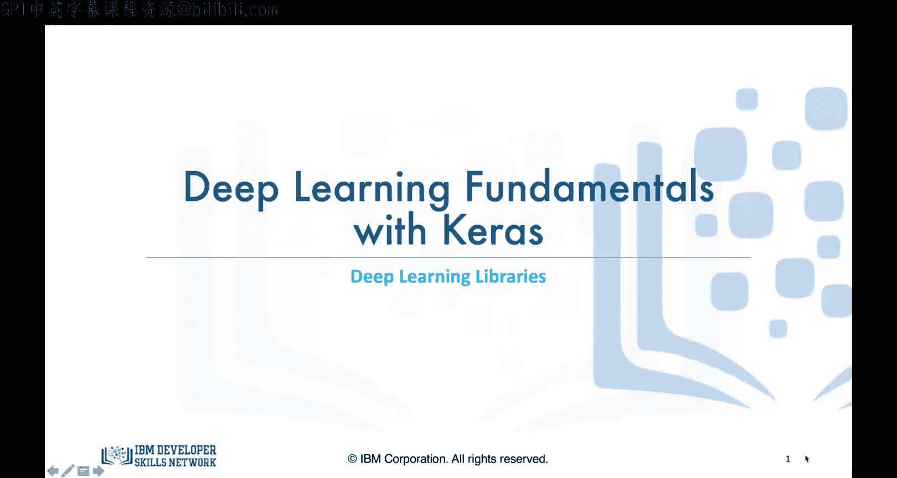
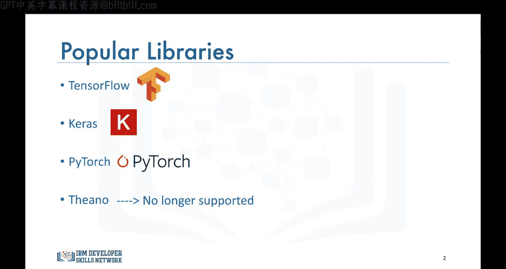
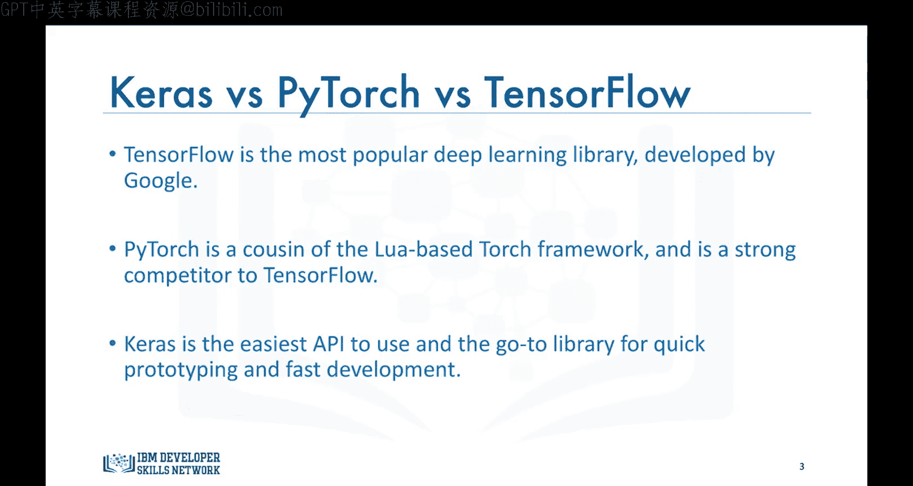
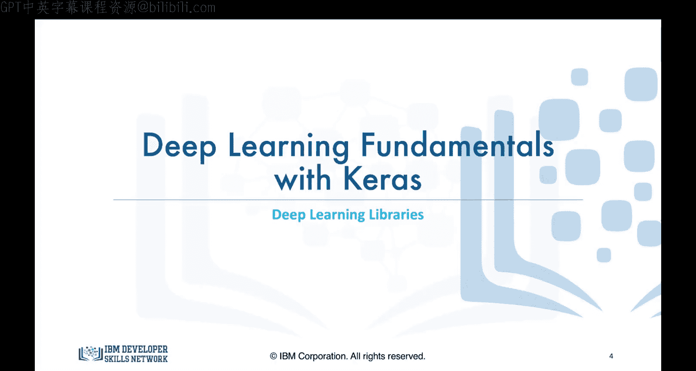

# 生成式人工智能工程：088：深度学习库 🧠

在本节课中，我们将学习不同的深度学习库和框架。在开始构建深度学习网络之前，了解可用的工具至关重要。本节将简要介绍本系列课程中将重点讲解的几个主流库。

## 主流深度学习库概览

上一节我们明确了学习深度学习库的重要性，本节中我们来看看目前最流行的几个选择。

根据流行度降序排列，最主要的库是 **TensorFlow**、**Keras** 和 **PyTorch**。此外还存在一个名为 **Theano** 的库，它由蒙特利尔学习算法研究所开发，甚至在 TensorFlow 和 PyTorch 出现之前就是深度学习开发的主要库。然而，其创始人无法持续提供支持和维护，因此该库逐渐失去了流行度。鉴于此，在本系列课程中，我们将专注于另外三个流行的库。

## 三大库详解

在介绍了主要的库之后，我们来深入了解这三个库各自的特点和适用场景。

### TensorFlow

**TensorFlow** 是其中最流行的库。它是深度学习模型生产环境中主要使用的库，拥有非常庞大的社区。只需快速浏览该库在 GitHub 仓库上的分支数量、提交次数和拉取请求数量，就足以了解其受欢迎程度。TensorFlow 由 Google 开发，于 2015 年向公众发布，目前仍在 Google 内部积极用于研究和生产需求。

### PyTorch

另一方面，**PyTorch** 是 Torch 框架的衍生产品。Torch 框架使用 Lua 语言，特别支持在 GPU 上运行的机器学习算法。然而，PyTorch 并非仅仅是一套支持 Python 这类流行语言的包装器。它实际上是经过重写和定制的，旨在追求速度并保持原生感。PyTorch 于 2016 年发布，最近获得了极大的关注，并且在某些领域正成为比 TensorFlow 更受青睐的选择，特别是在学术研究环境以及需要优化自定义表达式的深度学习应用中。PyTorch 由 Facebook 支持并积极使用。

### Keras

然而，尽管 PyTorch 和 TensorFlow 非常流行，但它们并不易用，学习曲线陡峭。因此，对于刚刚开始学习深度学习的人来说，没有比 **Keras** 库更好的选择了。Keras 是一个用于构建深度学习模型的高级 API。它因其易用性和语法简洁性而备受青睐，能够促进快速开发。正如您将在接下来的几个视频中看到的，使用 Keras 只需几行代码就能构建非常复杂的深度学习网络。

Keras 通常运行在 TensorFlow 这样的低级库之上。这意味着要使用 Keras 库，您必须先安装 TensorFlow。当您导入 Keras 时，它会明确显示用于安装 Keras 库的后端。Keras 同样由 Google 支持。

以下是三个库的核心特点对比：

*   **TensorFlow**：生产环境首选，社区庞大，由 Google 支持。
*   **PyTorch**：研究领域流行，动态计算图，由 Facebook 支持。
*   **Keras**：高级 API，易于上手，语法简洁，快速开发。

我不会深入探讨不同库的更多细节，但这里的关键要点是：如果您想快速构建某些东西，请选择 Keras 库，您不会失望。但是，如果您想对网络中的不同节点和层有更多控制，并想密切关注网络随时间的变化，那么 PyTorch 或 TensorFlow 将是更合适的库。这最终将取决于您的个人偏好。

## 总结与预告

本节课中我们一起学习了当前主流的三大深度学习库：TensorFlow、PyTorch 和 Keras。我们了解了它们各自的历史背景、主要特点及适用场景。简单来说，**Keras 适合快速入门和原型开发，PyTorch 在研究和灵活性上占优，而 TensorFlow 则在生产部署和社区生态上更强**。

基于此，在接下来的视频中，我们将开始学习如何使用 Keras 库来构建回归和分类问题的模型。