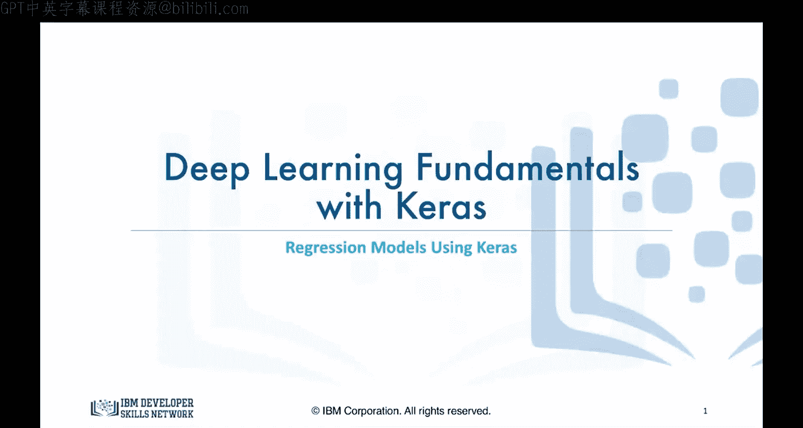
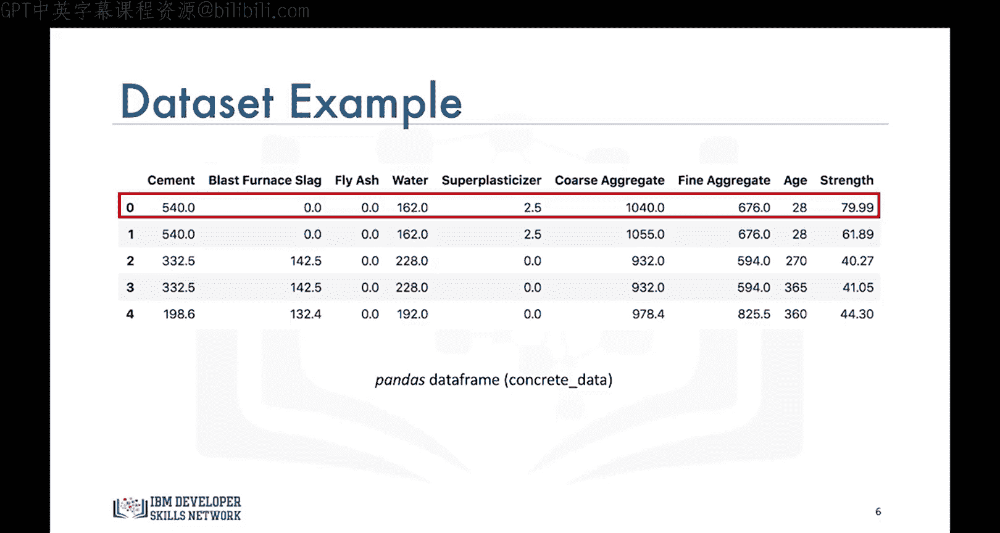
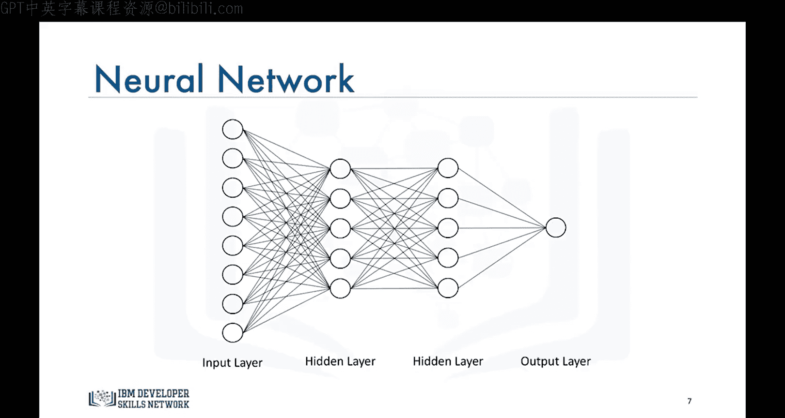
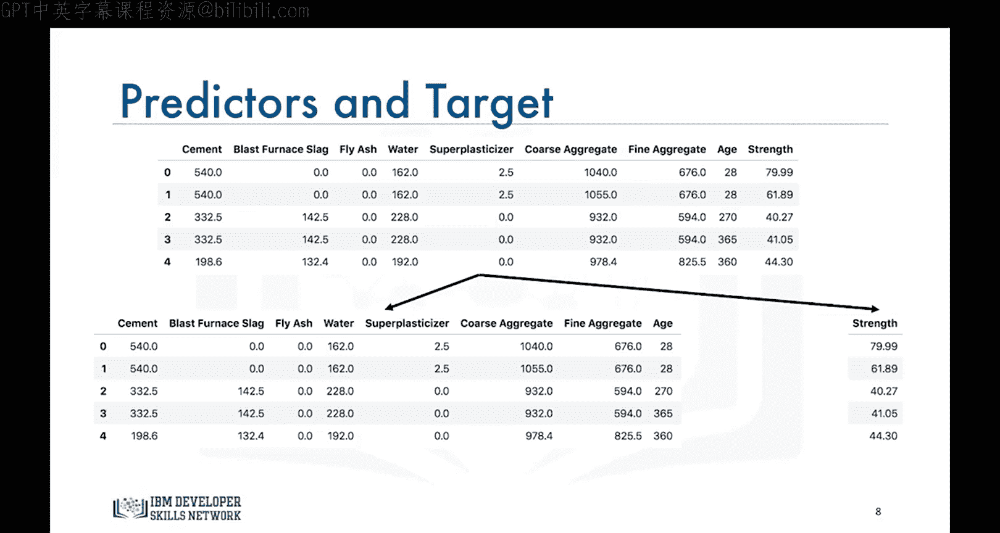
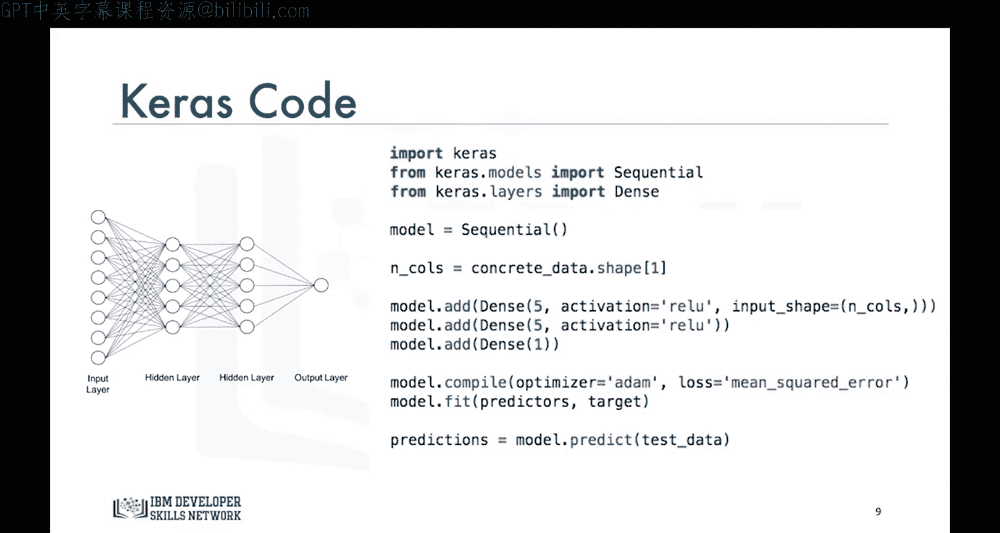
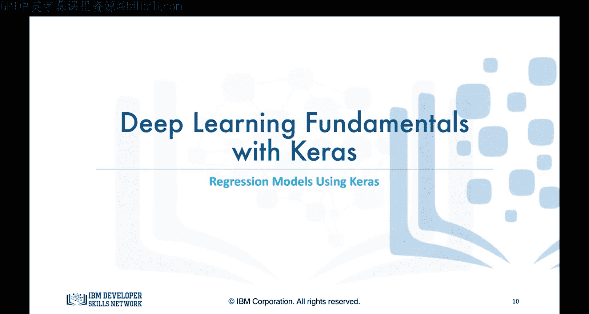

# 生成式人工智能工程：089：使用Keras构建回归模型



在本节课中，我们将学习如何使用Keras库来构建深度学习模型。我们将从解决回归问题开始，通过一个具体的混凝土抗压强度预测案例，展示构建、训练和使用神经网络的全过程。


## 数据准备与问题定义

上一节我们介绍了本课程的目标，本节中我们来看看具体的回归问题示例。

这里有一个关于混凝土抗压强度的数据集。数据记录了不同混凝土样本的抗压强度，该强度基于制作它们时所用各种材料的体积。例如，第一个样本包含540立方米的 cement、0立方米的 blast furnace slag、0立方米的 fly ash、162立方米的水、2.5立方米的 superplasticizer、1040立方米的 coarse aggregate 和 676立方米的 fine aggregate。这种养护了28天的混凝土混合物，其抗压强度为79.99兆帕。

数据以Pandas DataFrame的形式存储，名为 `concrete_data`。

我们的目标是使用Keras库快速构建一个深度神经网络来建模这个数据集，从而能够根据给定混凝土样本的配料成分自动预测其抗压强度。

## 网络架构设计



在开始编码之前，我们需要设计网络架构。我们计划构建的深度神经网络将接收所有八个特征作为输入。

以下是网络的结构：
*   输入层接收八个特征。
*   第一个隐藏层包含五个节点，使用ReLU激活函数。
*   第二个隐藏层同样包含五个节点，使用ReLU激活函数。
*   输出层包含一个节点，用于输出预测的抗压强度值。

请注意，在实际应用中，每个隐藏层通常会使用更多的神经元（例如50或100个），但为了简化说明，我们这里使用一个小型网络。这种每一层的所有节点都与下一层的所有节点相连的网络，被称为**密集网络**或全连接网络。

## 数据预处理

在使用Keras库之前，我们需要将数据准备成正确的格式。



唯一需要做的是将DataFrame拆分为两个部分：一个包含所有预测特征列，另一个包含目标列。我们将它们分别命名为 `predictors` 和 `target`。

```python
# 假设 concrete_data 是包含所有数据的DataFrame
# 最后一列是目标变量‘Strength’
predictors = concrete_data.iloc[:, :-1] # 获取除最后一列外的所有列作为特征
target = concrete_data.iloc[:, -1] # 获取最后一列作为目标
```



## 使用Keras构建与训练模型

现在，准备见证Keras的魔力。构建这样一个网络、训练它并用它预测新样本，只需要几行代码即可实现。

首先，需要导入必要的模块。因为我们的网络由线性堆叠的层构成，所以需要使用Sequential模型。这在大多数情况下都是适用的，除非你要构建一些特殊的结构。

```python
import keras
from keras.models import Sequential
from keras.layers import Dense
```

创建模型非常简单，只需调用Sequential构造函数。构建网络层也同样直接。我们使用 `add` 方法来添加每一个Dense层。我们需要指定每层的神经元数量以及要使用的激活函数。根据之前关于激活函数的讨论，ReLU是隐藏层的推荐激活函数之一，因此我们将使用它。

对于第一个隐藏层，我们需要传入 `input_shape` 参数，即数据集中预测特征的数量。

```python
# 定义回归模型
n_cols = predictors.shape[1] # 获取特征数量

model = Sequential()
model.add(Dense(5, activation='relu', input_shape=(n_cols,)))
model.add(Dense(5, activation='relu'))
model.add(Dense(1))
```

接下来是训练环节。我们需要定义优化器和误差指标。在之前的模块中，我们使用梯度下降作为优化算法，使用均方误差作为预测值与真实值之间的损失度量。这里我们将继续使用均方误差作为损失函数。

至于优化算法，对于深度学习应用，存在比梯度下降更高效的算法，其中之一是Adam。Adam优化器的一个主要优点是，你不需要指定我们在梯度下降视频中看到的学习率，这省去了为模型优化学习率的任务。

```python
# 编译模型
model.compile(optimizer='adam', loss='mean_squared_error')
```

然后，我们使用 `fit` 方法来训练模型。

```python
# 训练模型
model.fit(predictors, target, epochs=100)
```

训练完成后，我们就可以使用 `predict` 方法开始进行预测了。

```python
# 进行预测
predictions = model.predict(new_data)
```

视频下方你将找到一份文档，其中包含Keras库不同部分的链接，你可以参考它们以了解更多关于优化器、模型以及Keras库中其他可用方法的信息。

但这里的代码片段通常就是你在Keras中构建回归模型所需了解的全部内容。

## 总结与预告

本节课中我们一起学习了如何使用Keras库构建一个用于回归问题的深度神经网络。我们涵盖了从理解数据、设计网络架构、预处理数据，到使用Sequential模型、Dense层、Adam优化器进行模型构建、编译和训练的全过程。





在下一个视频中，我们将学习如何使用Keras库构建一个分类模型。