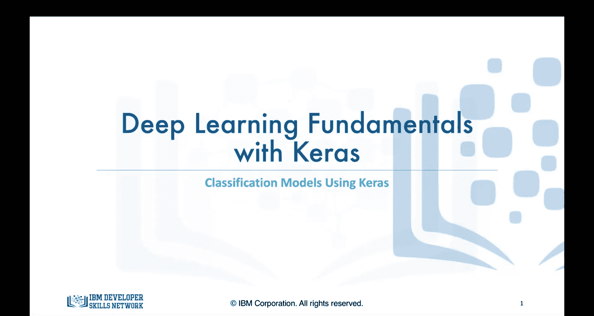
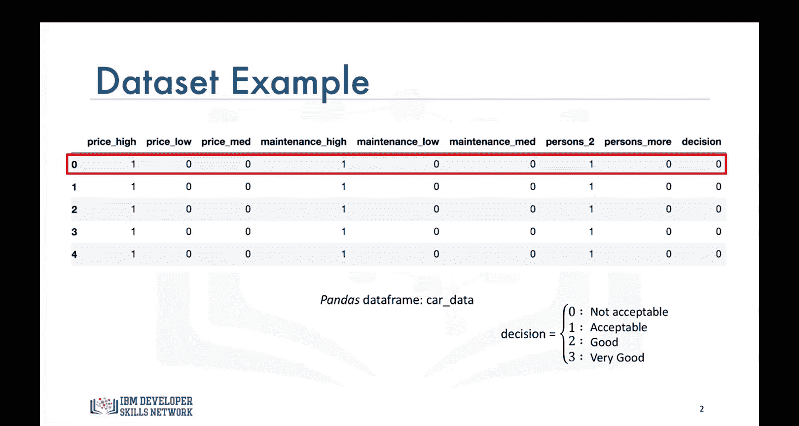
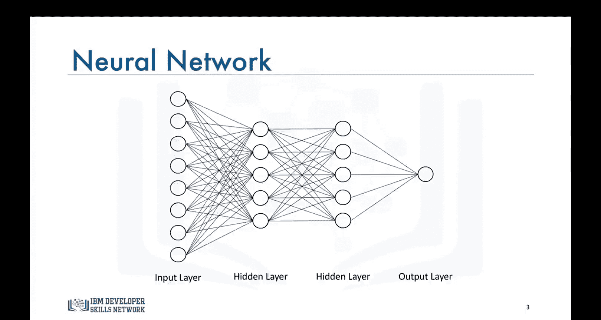
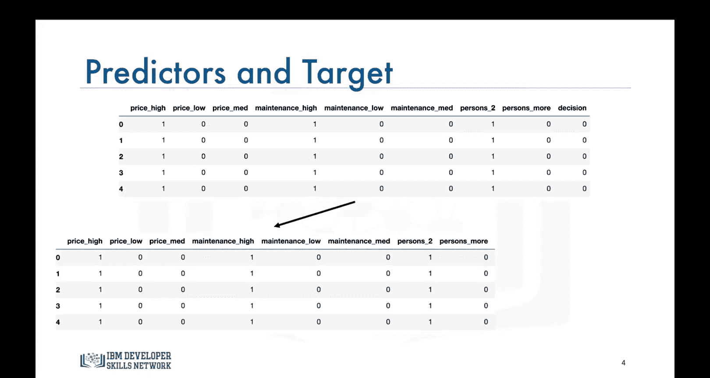
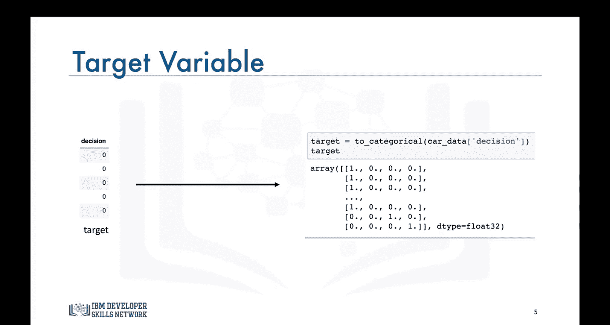
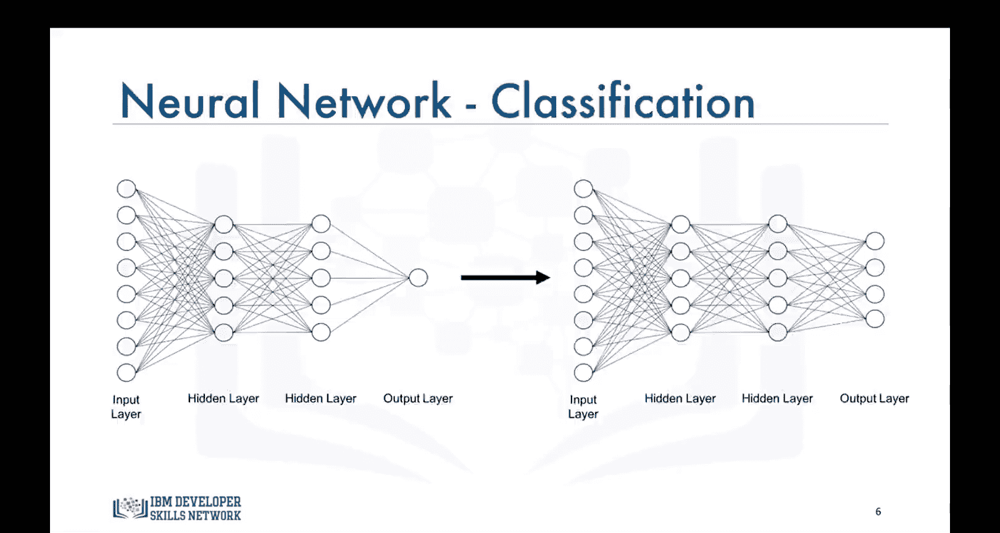
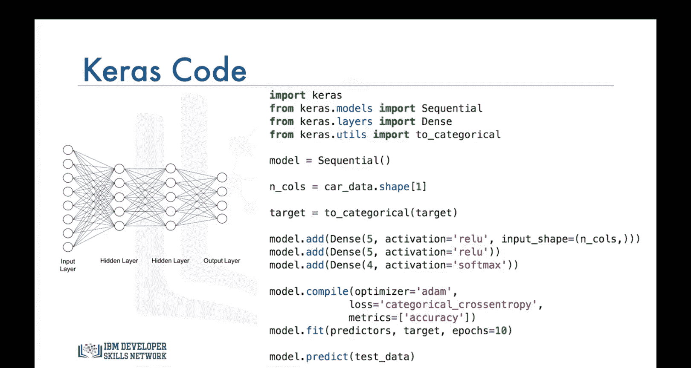
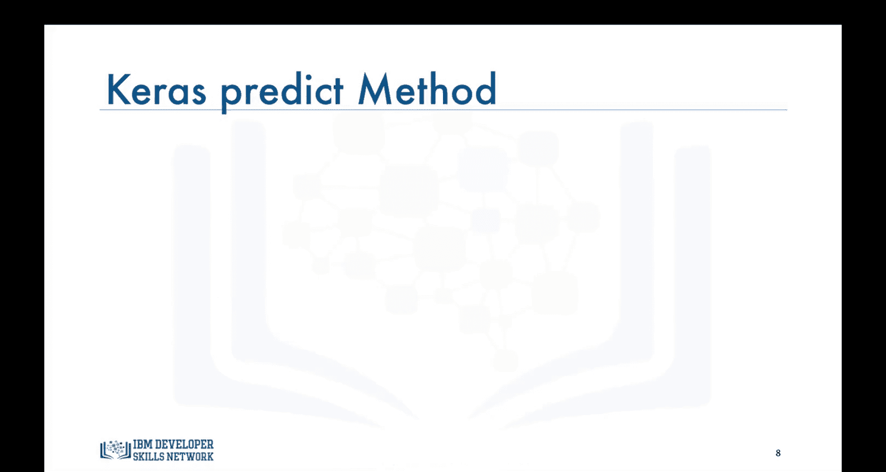
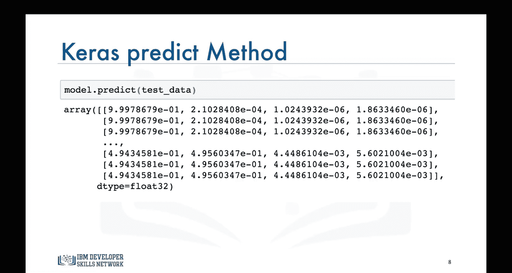
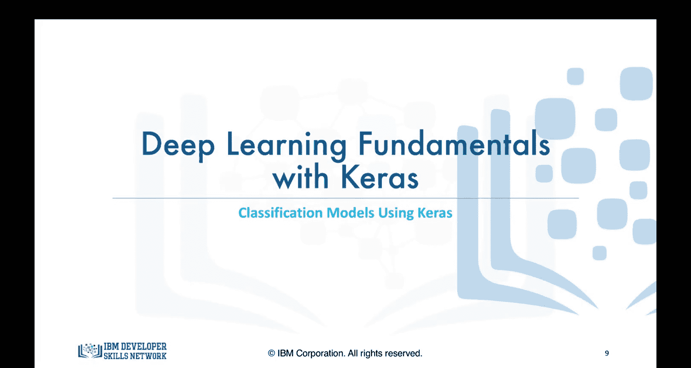

# 生成式人工智能工程：090：使用Keras构建分类模型



在本节课中，我们将学习如何使用Keras库来构建解决分类问题的模型。我们将通过一个具体的例子——基于汽车价格、维护成本和载客量来评估购买决策——来演示整个过程。

## 概述

上一节我们介绍了如何使用Keras解决回归问题。本节中，我们来看看如何构建一个用于分类任务的神经网络模型。分类问题与回归问题的核心区别在于，其目标是预测一个离散的类别标签，而非连续的数值。

## 数据准备

假设我们想构建一个模型，根据汽车的价格、维护成本以及是否能容纳两人或更多人，来告知某人购买某辆汽车是否是一个好选择。

以下是一个名为`car_data`的数据集。数据已经过清洗，如图所示，我们使用了独热编码将价格、维护成本和载客量的每个类别转换成了单独的列。


*   汽车价格可以是高、中或低。
*   同样，汽车的维护成本也可以是高、中或低。
*   汽车可以容纳两人或更多人。



以数据集中的第一辆车为例，它被认为是一辆昂贵、维护成本高且只能容纳两人的汽车。其决策标签是0，意味着购买这辆车是一个糟糕的选择。

决策标签的含义如下：
*   **0**: 糟糕的决策
*   **1**: 可接受的决策
*   **2**: 好的决策
*   **3**: 非常好的决策



## 模型架构



我们将使用与上一节回归问题中结构相同的神经网络。这是一个具有8个输入（或预测变量）的网络，包含两个隐藏层（每层5个神经元）和一个输出层。


## 数据处理



接下来，我们将数据集划分为预测变量（`X`）和目标变量（`y`）。




然而，对于Keras的分类问题，我们不能直接使用目标列。我们需要将该列转换为一个由二进制值组成的数组，类似于独热编码，如下方输出所示。我们可以使用Keras Utils包中的`to_categorical`函数轻松实现这一点。


换句话说，我们的模型在输出层将不再只有1个神经元，而是会有4个神经元，因为我们的目标变量包含4个类别。


## 代码实现

以下是构建分类模型的代码结构，它与我们构建回归模型的代码非常相似。

```python
# 导入必要的库
from tensorflow import keras
from tensorflow.keras.models import Sequential
from tensorflow.keras.layers import Dense
from tensorflow.keras.utils import to_categorical

# 构建模型
model = Sequential()
model.add(Dense(5, activation='relu', input_shape=(8,)))  # 第一隐藏层
model.add(Dense(5, activation='relu'))                     # 第二隐藏层
model.add(Dense(4, activation='softmax'))                  # 输出层，4个神经元对应4个类别

# 编译模型
model.compile(optimizer='adam',
              loss='categorical_crossentropy',  # 分类问题使用交叉熵损失
              metrics=['accuracy'])              # 评估指标为准确率

# 训练模型
model.fit(X_train, y_train_categorical, epochs=50)





# 进行预测
predictions = model.predict(X_test)
```

代码说明如下：

1.  **导入库**：我们首先导入Keras库、Sequential模型和Dense层。额外的导入语句是`to_categorical`函数，用于将目标列转换为分类所需的二进制数组。
2.  **构建层**：我们使用`add`方法创建两个隐藏层，每层5个神经元，并使用ReLU激活函数。请注意，这里我们为输出层指定了`softmax`激活函数，以确保输出层所有神经元的预测值之和为1，这代表了各个类别的概率分布。
3.  **编译模型**：在定义编译器时，我们将使用**分类交叉熵** `categorical_crossentropy` 作为损失度量，而不是回归中使用的均方误差。我们将评估指标指定为`accuracy`（准确率）。准确率是Keras内置的评估指标，但你也可以定义自己的评估指标并通过`metrics`参数传入。
4.  **训练模型**：然后我们拟合模型。请注意，这次我们明确指定了训练模型的轮数`epochs`。虽然在构建回归模型时我们没有指定，但同样可以这样做。
5.  **进行预测**：最后，我们使用`predict`方法进行预测。

## 理解预测结果

Keras `predict`方法的输出将类似于下图所示。对于每个数据点，输出是购买给定汽车的决策属于四个类别中每一个的概率。


对于每个数据点，这些概率之和应为1。概率越高，算法就越有信心认为该数据点属于相应的类别。

*   对于测试集中的第一个数据点（第一辆车），决策将是**0**（不可接受），因为第一个概率值最高，在本例中为0.99或接近1。
*   同样，对于第二个数据点，决策也是**0**，因为该类别的概率最高，同样为0.99或几乎为1。对于前三个数据点，模型非常确信购买这些汽车是不可接受的。
*   对于最后三个数据点，决策将是**1**（可接受），因为第二个类别的概率高于其他类别。但请注意，决策0和决策1的概率非常接近，因此模型不是非常确信，但会倾向于接受购买这些汽车。

## 总结

本节课中，我们一起学习了如何使用Keras构建分类模型。关键步骤包括：准备并转换数据（使用`to_categorical`）、构建具有`softmax`输出层的神经网络、使用**分类交叉熵**作为损失函数进行编译和训练，以及理解模型输出的概率结果。



在实验部分，你将有机会使用Keras库构建自己的回归和分类模型，请务必完成本模块的实验内容。




