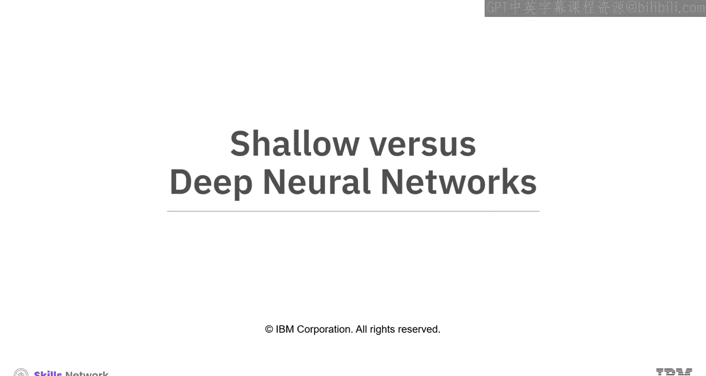
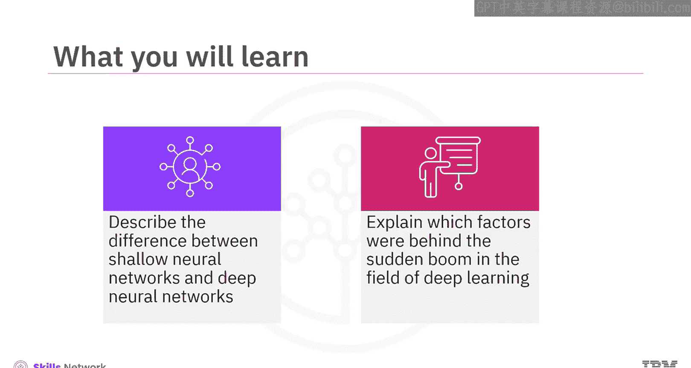
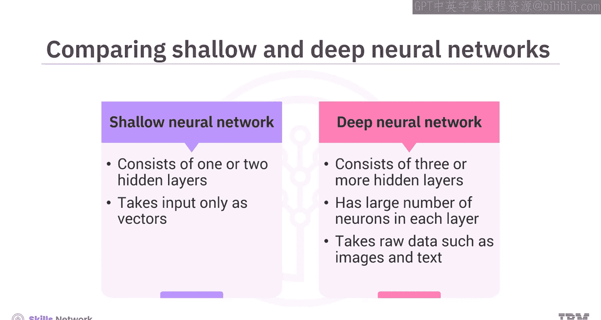
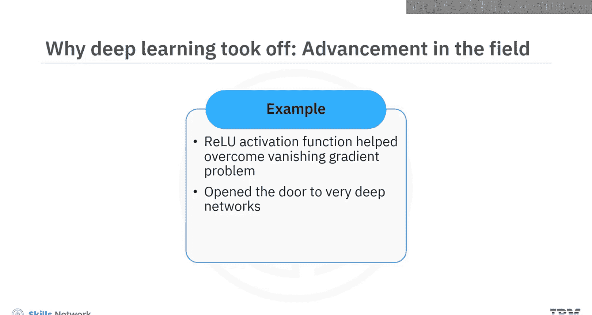
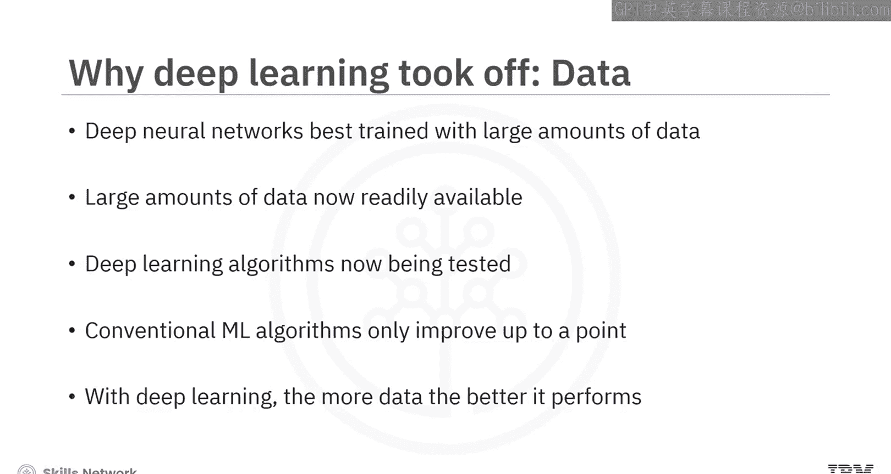
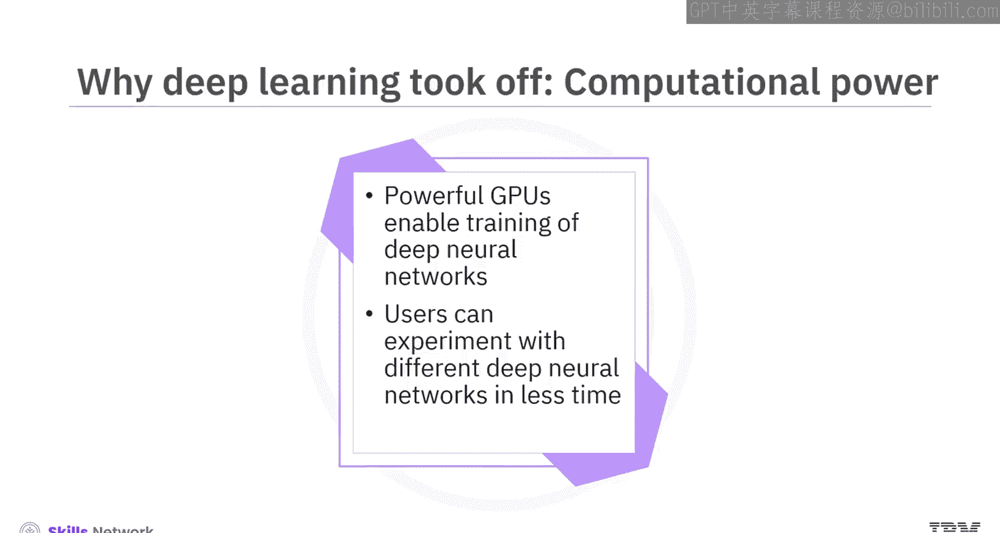
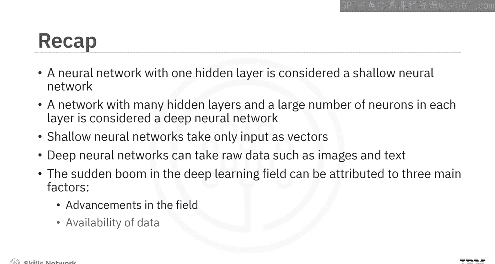

# 生成式人工智能工程：091：浅层与深层神经网络 🧠

在本节课中，我们将学习浅层神经网络与深层神经网络之间的区别，并探讨推动深度学习领域突然蓬勃发展的关键因素。

## 概述

神经网络已经存在了一段时间。然而，它们直到最近才变得“深”并开始广泛应用，催生出许多令人兴奋的应用。本节将解释浅层与深层网络的定义差异，并分析促成这一转变的三个核心驱动力。

## 浅层神经网络

到目前为止，我们主要讨论的神经网络既不算特别深，也不算特别浅。理解这些网络是理解深层神经网络的基础，因其结构简单而更易于理解。

业界对于浅层神经网络的定义尚未完全统一。但通常认为，**仅包含一个或两个隐藏层**的神经网络被视为浅层神经网络。

## 深层神经网络

上一节我们介绍了浅层网络，本节中我们来看看深层网络。

一个**包含三个或更多隐藏层，且每层拥有大量神经元**的网络，则被视为深层神经网络。

此外，与浅层神经网络通常只处理向量形式的输入不同，深层神经网络能够直接处理原始数据，例如图像和文本，并自动提取必要的特征以更好地学习数据。

## 深度学习蓬勃发展的原因

神经网络已经存在了一段时间。那么，为什么它们直到最近才变得“深”并开始蓬勃发展呢？以下是促成深度学习领域突然兴起的三个主要因素。

### 因素一：领域自身的进步

我们在关于激活函数的视频中简要提到过这一点。**ReLU激活函数**帮助克服了梯度消失问题的挑战，从而为创建非常深的网络打开了大门。

### 因素二：数据的可用性

深层神经网络在**使用大量数据进行训练时效果最佳**。由于神经网络能很好地学习训练数据，因此必须使用大量数据来避免对训练数据的过拟合。

如今，前所未有的大量数据变得易于获取，深度学习算法也因此得到了前所未有的尝试和测试。

其他传统的机器学习算法虽然也能从更多数据中获益，但效果提升存在上限。超过该点后，增加数据不会带来显著改善。深度学习则完全不同，**你提供的数据越多，它的性能就越好**。

### 因素三：计算能力

这一点与第二点相辅相成。借助**超级强大的GPU**，我们现在可以在数小时内，而非过去的数天或数周内，在大量数据上训练非常深的神经网络。

因此，用户可以在更短的时间内试验不同的深层神经网络并测试不同的原型。

## 总结

本节课中，我们一起学习了以下核心内容：
*   一个具有一个隐藏层的神经网络被认为是**浅层神经网络**。
*   一个具有许多隐藏层且每层有许多神经元的网络被认为是**深层神经网络**。
*   浅层神经网络通常只将输入作为**向量**处理。
*   深层神经网络可以直接处理**原始数据**，如图像和文本。
*   深度学习领域的突然兴起可归因于三个主要因素：**领域的进步、数据的可用性以及更强大的计算能力**。