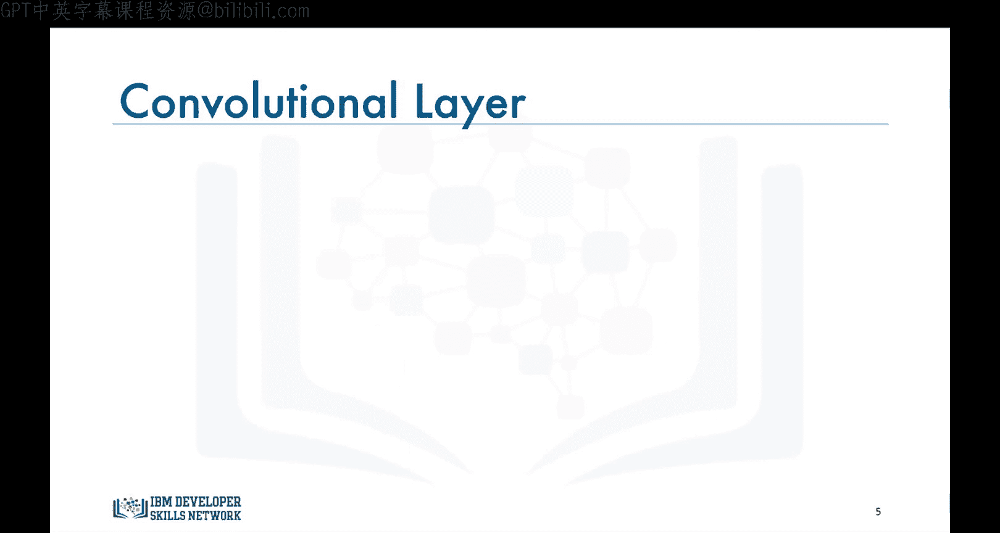
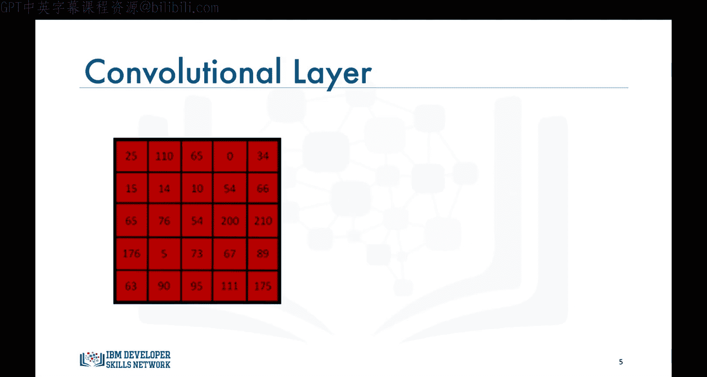
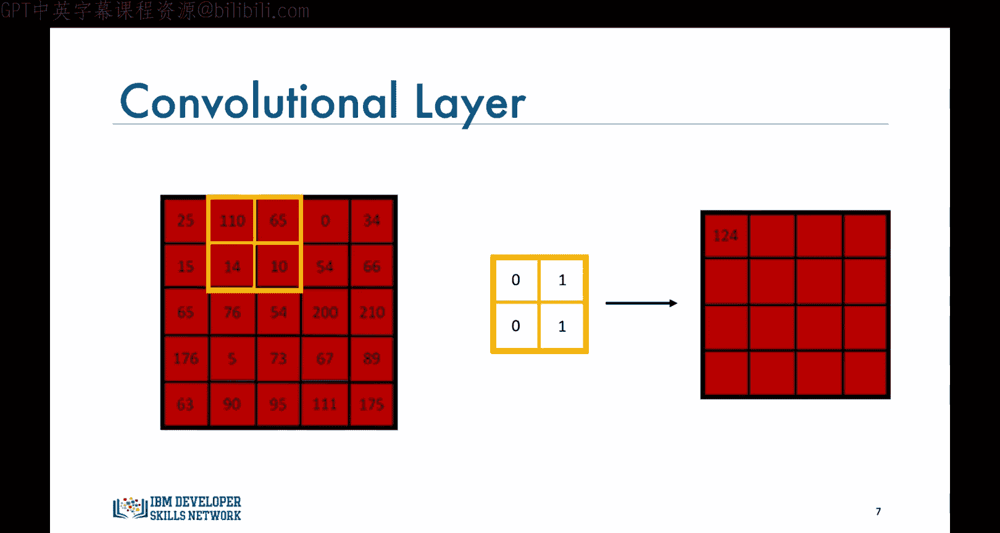
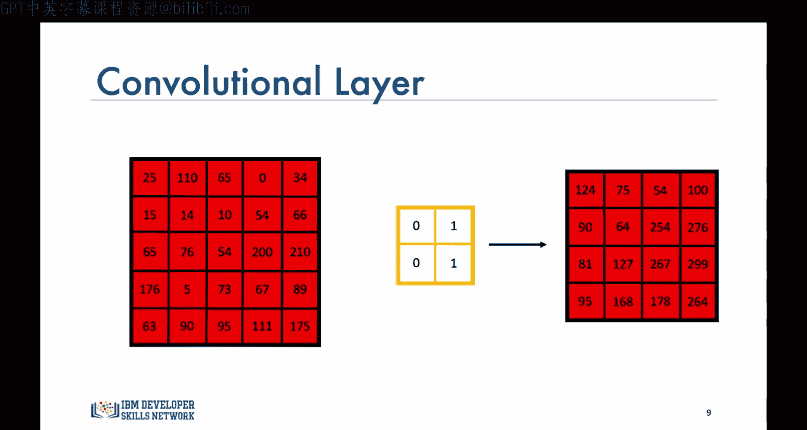
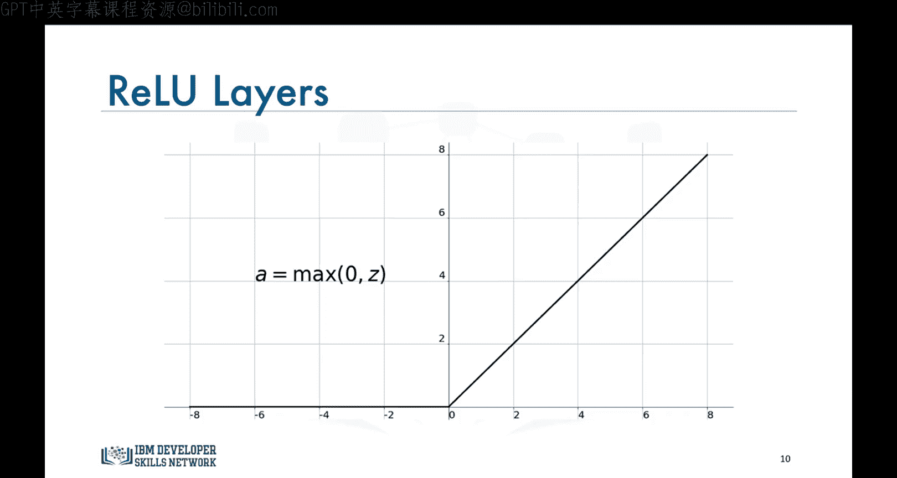
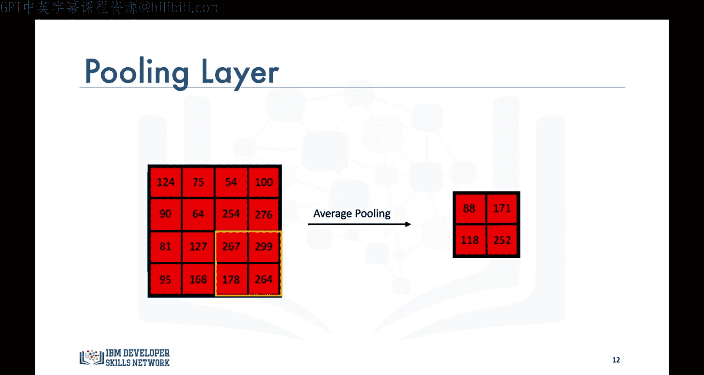
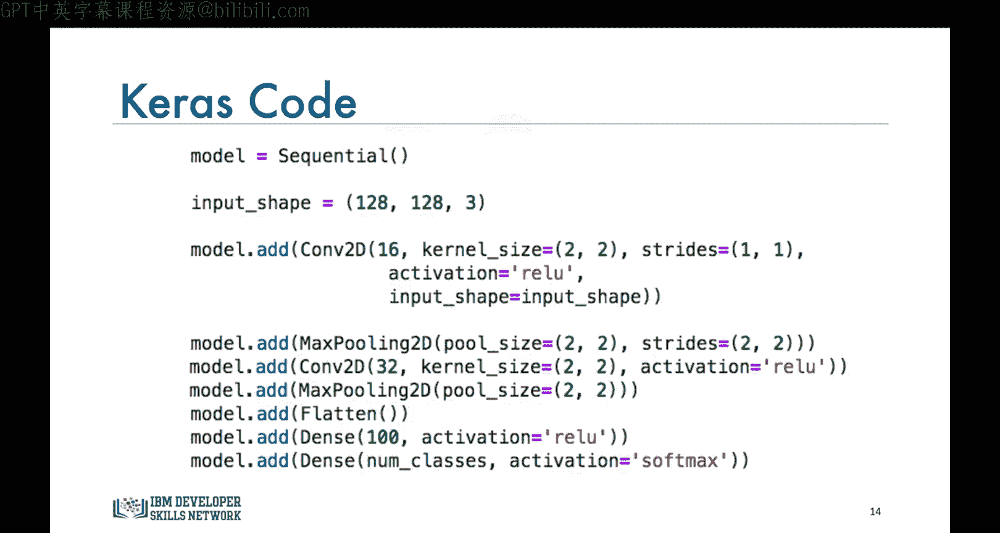
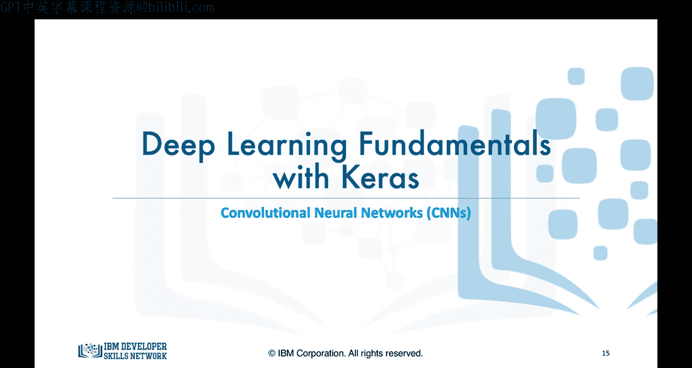

# 生成式人工智能工程：092：卷积神经网络 🧠

在本节课中，我们将学习深度学习算法。我们将从监督式深度学习算法开始，并重点介绍卷积神经网络。

## 概述

卷积神经网络与我们目前在本课程中见过的神经网络非常相似。它们由神经元组成，这些神经元的权重和偏置需要被优化。每个神经元通过计算每个输入与对应权重之间的点积来组合其接收到的输入，然后将得到的总输入馈入一个激活函数，最常用的是ReLU。

那么，这些网络有何不同，为何被称为卷积神经网络呢？

卷积神经网络，简称CNN，明确假设输入是图像。这一假设允许我们将某些特性融入其架构中。这些特性使得前向传播步骤更加高效，并大幅减少了网络中的参数数量。因此，CNN最适合解决与图像识别、物体检测和其他计算机视觉应用相关的问题。

## 典型架构

以下是卷积神经网络的典型架构。如图所示，网络由一系列卷积层、ReLU层和池化层组成，以及在生成输出之前必需的若干全连接层。




现在，让我们研究每一层中发生了什么。

## 输入层

到目前为止，我们只处理过以 `n x 1` 向量作为输入的传统神经网络。而卷积神经网络的输入，通常是灰度图像的 `n x m x 1` 矩阵，或彩色图像的 `n x m x 3` 矩阵，其中数字3代表图像中每个像素的红、绿、蓝分量。

## 卷积层

在卷积层中，我们主要定义滤波器，并计算定义的滤波器与三个图像分量（红、绿、蓝）中每一个的卷积。

以红色图像分量为例，假设这些是像素值。




现在，对于一个具有这些值的 `2 x 2` 滤波器，我们创建一个空矩阵来保存卷积过程的结果。




我们首先将滤波器滑过图像，计算滤波器与重叠像素值之间的点积，并将结果存储在空矩阵中。我们重复此步骤，每次将滤波器移动一个单元格（或使用术语“步幅”）。


我们重复此过程，直到覆盖整个图像并填满空矩阵。这里，我只展示了一个滤波器和三个图像分量中的一个。同样的操作将应用于绿色和蓝色图像分量。并且，你可以应用多个滤波器。我们使用的滤波器越多，就越能更好地保留空间维度。

但此时你可能会问，为什么我们需要使用卷积？为什么不将输入图像展平为 `n x m x 1` 向量并将其用作我们的输入？

如果我们那样做，最终将需要优化大量的参数，计算成本会非常高。此外，减少参数数量肯定有助于防止模型对训练数据过拟合。值得一提的是，卷积层也包含ReLU，它过滤卷积步骤的输出，只传递正值，并将任何负值变为0。

## 池化层

卷积神经网络中的下一层是池化层。池化层的主要目标是减少通过网络传播的数据的空间维度。卷积神经网络中广泛使用两种类型的池化：最大池化和平均池化。

以下是两种池化方法的说明：

在最大池化（两者中最常见的）中，对于我们扫描的图像的每个区域，我们保留最高值。如图所示，我们的滤波器每次移动两个步幅。







类似地，对于平均池化，我们计算所扫描的每个区域的平均值。

除了减少数据的维度外，特别是最大池化提供了空间不变性，这使得神经网络能够识别图像中的物体，即使该物体不完全像原始物体。





## 全连接层

最后，在全连接层中，我们将最后一个卷积层的输出展平，并将当前层的每个节点与下一层的每个其他节点连接起来。该层基本上将前一层（无论是卷积层、ReLU层还是池化层）的输出作为输入，并输出一个n维向量，其中n是与当前问题相关的类别数量。例如，如果你正在构建一个网络来对手写数字图像进行分类，维度n将是10，因为有10个数字。

你将在本专业的其他课程中更详细地学习卷积神经网络，但这些信息足以让你对卷积神经网络有一个大致的了解。

## 使用Keras构建CNN

现在让我们看看如何使用Keras库构建卷积神经网络。在这里，我将向你展示如何使用Keras库构建卷积神经网络。

卷积神经网络的训练和测试与我们目前所见相同。因此，首先，我们使用顺序构造函数来创建我们的模型。然后，我们将输入定义为输入图像的大小。

假设输入图像是 `128 x 128` 的彩色图像，我们将输入形状定义为元组 `(128, 128, 3)`。

接下来，我们开始向网络添加层。

我们从一个具有16个滤波器的卷积层开始，每个滤波器大小为 `2 x 2`，并以水平方向步幅为1、垂直方向步幅为1的方式滑过图像，并且该层使用ReLU激活函数。

然后我们添加一个池化层，这里我们使用最大池化，滤波器或池化大小为 `2`，并且滤波器以步幅为2滑过图像。

接下来，我们添加另一组卷积层和池化层。这里唯一的区别是我们在卷积层中使用了更多的滤波器，实际上是第一个卷积层滤波器数量的两倍。

最后，我们将这些层的输出展平，以便数据可以进入全连接层。

我们添加另一个具有100个节点的密集层，以及一个具有与当前问题类别数量相等的节点的输出层，并且我们使用softmax激活函数将输出转换为概率。

以下是使用Keras构建CNN的示例代码：

```python
from keras.models import Sequential
from keras.layers import Conv2D, MaxPooling2D, Flatten, Dense

model = Sequential()
model.add(Conv2D(filters=16, kernel_size=(2, 2), strides=(1, 1), activation='relu', input_shape=(128, 128, 3)))
model.add(MaxPooling2D(pool_size=(2, 2), strides=2))
model.add(Conv2D(filters=32, kernel_size=(2, 2), strides=(1, 1), activation='relu'))
model.add(MaxPooling2D(pool_size=(2, 2), strides=2))
model.add(Flatten())
model.add(Dense(100, activation='relu'))
model.add(Dense(num_classes, activation='softmax')) # num_classes 是类别数量
```

## 总结

在本节课中，我们一起学习了卷积神经网络。我们了解了CNN的基本概念、其典型架构（包括卷积层、池化层和全连接层），以及每层的功能。我们还探讨了使用卷积操作而非展平图像的原因，并简要介绍了如何使用Keras库构建一个简单的CNN模型。在配套的实验中，我们将实现一个完整的卷积神经网络，使用Keras库构建网络、训练它并进行验证，请务必完成关于卷积神经网络的实验部分。







