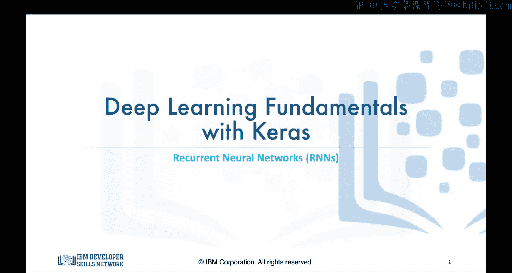
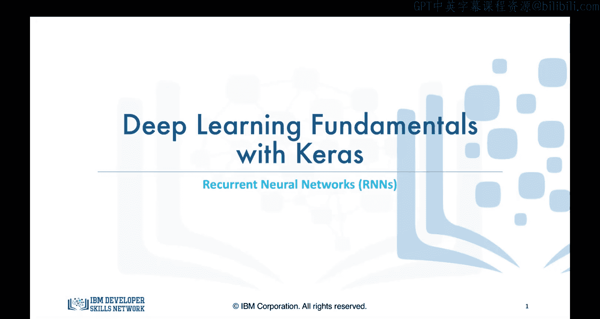
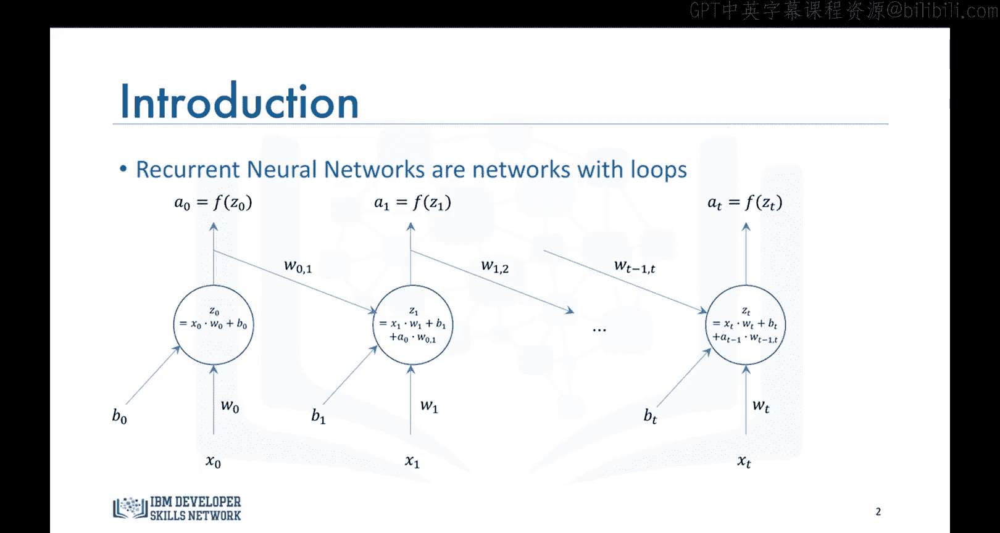
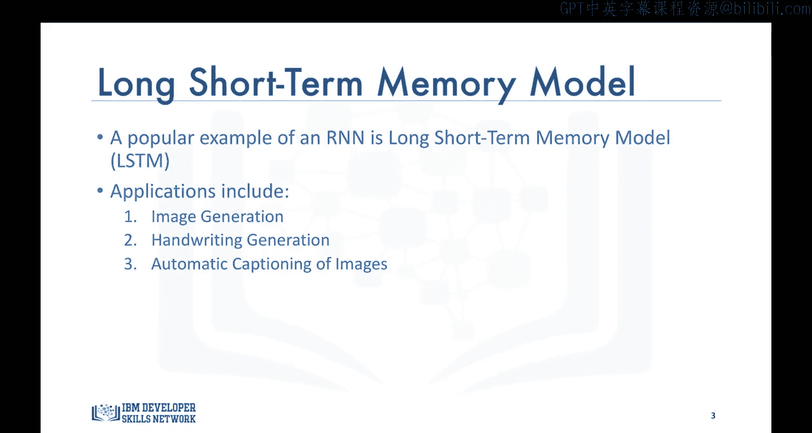
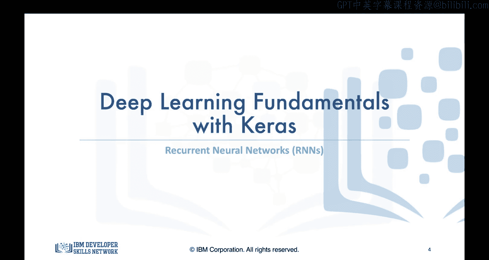

# 生成式人工智能工程：13：循环神经网络 🧠

在本节课中，我们将要学习循环神经网络（RNN），这是一种专门用于处理序列数据的监督式深度学习模型。我们将了解其工作原理、核心架构以及典型应用。

## 概述

上一节我们介绍了卷积神经网络（CNN），这是一种在计算机视觉领域，特别是图像目标检测方面取得革命性进展的监督式深度学习模型。本节中，我们来看看另一种监督式深度学习模型——循环神经网络。

## 循环神经网络简介

到目前为止，我们所见的神经网络和深度学习模型都将数据点视为独立的实例。然而，假设你想构建一个能够分析电影场景的模型。你不能假设电影中的场景是相互独立的，因此传统的深度学习模型并不适用于此类应用。

循环神经网络解决了这个问题。循环神经网络，简称RNN，是一种带有循环的网络。它不仅每次接收新的输入，还会将前一个输入数据点产生的输出也作为输入。

## 循环神经网络架构

因此，循环神经网络的架构看起来是这样的：本质上，我们可以从一个普通的神经网络开始。在时间 t=0 时，网络接收输入 x0 并输出 a0。然后在时间 t=1 时，除了输入 X1，网络还将 a0 作为输入，并赋予其权重 W01，依此类推。

其核心公式可以表示为：
`h_t = f(W * x_t + U * h_{t-1} + b)`
其中，`h_t` 是当前时刻的隐藏状态，`x_t` 是当前输入，`h_{t-1}` 是上一时刻的隐藏状态，`W` 和 `U` 是权重矩阵，`b` 是偏置项，`f` 是激活函数。

因此，循环神经网络非常擅长对数据序列中的模式进行建模，例如文本、基因组、手写体和股票市场。这些算法考虑了时间和序列，这意味着它们具有时间维度。

## 长短期记忆网络

一种非常流行的循环神经网络类型是长短期记忆模型，简称 LSTM 模型。它已成功应用于许多领域，包括图像生成（使用在大量图像上训练的模型来生成新的图像）和手写生成（我在本课程欢迎视频中描述过）。此外，LSTM 模型还成功用于构建能够自动描述图像以及视频流的算法。

## 总结

本节课中，我们一起学习了循环神经网络。鉴于这只是一门入门课程，我们就介绍到这里。关于循环神经网络的视频到此结束。我们将在下一个视频中见面，届时我们将转向无监督深度学习模型，讨论自编码器。