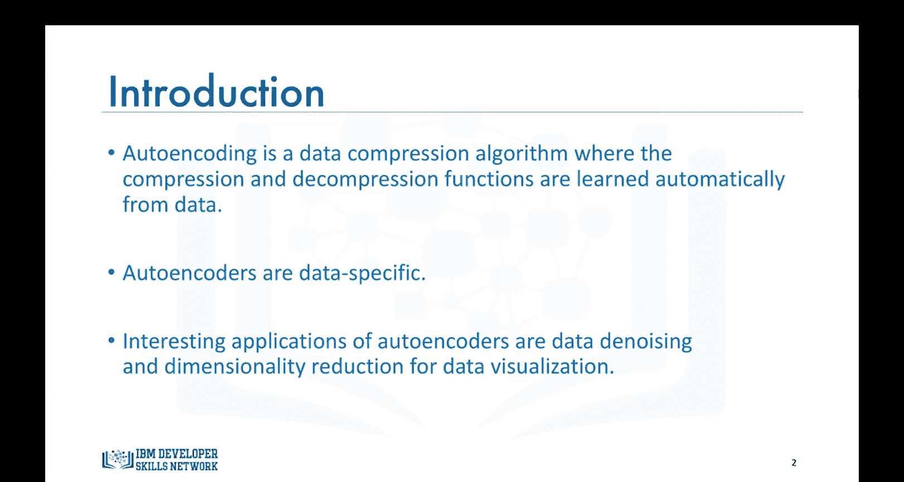
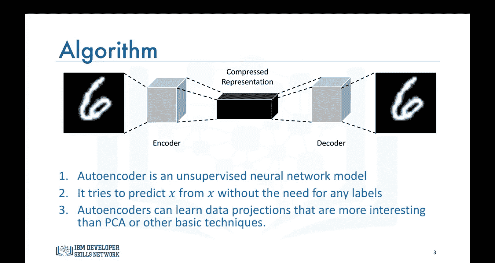
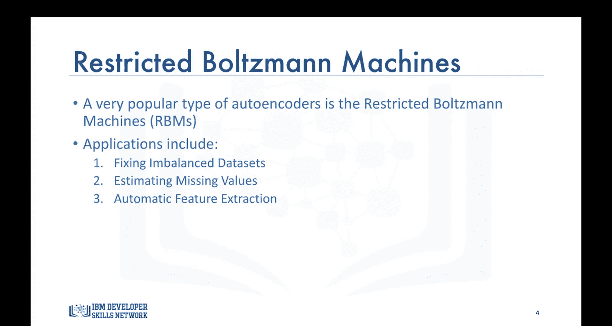
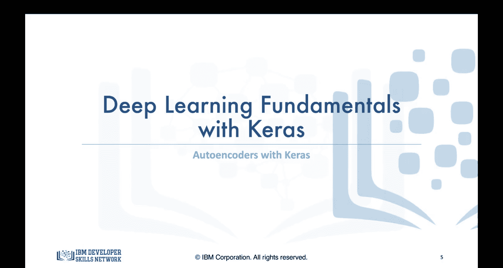

生成式人工智能工程：094：自编码器 🧠

在本节课中，我们将学习一种无监督深度学习模型——自编码器。我们将了解其工作原理、架构、特性以及一种重要的变体：受限玻尔兹曼机。

到目前为止，我们讨论过两种有监督深度学习模型，即卷积神经网络和循环神经网络。本节中，我们将转向一种无监督深度学习模型，即自编码器。

**什么是自编码器？**

自编码器是一种数据压缩算法。其压缩和解压缩函数是从数据中自动学习得到的，而非由人工设计。这类自编码器是使用神经网络构建的。

自编码器具有**数据特定性**。这意味着它们只能压缩与训练数据相似的数据。例如，一个在汽车图片上训练的自编码器，在压缩建筑物图片时会表现不佳，因为它学习到的特征是车辆或汽车特定的。

自编码器有一些有趣的应用，例如**数据去噪**和用于数据可视化的**降维**。

以下是自编码器的架构图。它以一张图片（例如）作为输入，并使用一个**编码器**来寻找输入图像的最优压缩表示。然后，使用一个**解码器**来重建原始图像。😡

因此，自编码器是一种无监督神经网络模型。它通过将目标变量设置为与输入相同来使用反向传播。换句话说，它试图学习一个**恒等函数**的近似。😡

由于神经网络中的非线性激活函数，自编码器可以学习比主成分分析或其他仅能处理线性变换的基础技术更有趣的数据投影。

**受限玻尔兹曼机**

一种非常流行的自编码器类型是**受限玻尔兹曼机**。

RBM已成功应用于多种场景，包括**修复不平衡数据集**。因为RBM学习输入是为了能够重建它，所以它们可以学习不平衡数据集中少数类的分布，然后生成更多该类别的数据点，从而将不平衡数据集转变为平衡数据集。😡

类似地，RBM也可用于**估计数据集中不同特征的缺失值**。

受限玻尔兹曼机的另一个流行应用是**自动特征提取**，特别是针对非结构化数据。

本节课中，我们一起学习了自编码器和受限玻尔兹曼机的高层次介绍。我们了解了自编码器作为一种无监督模型，如何通过编码-解码结构进行数据压缩与重建，以及RBM在数据平衡、补全和特征提取方面的应用。

