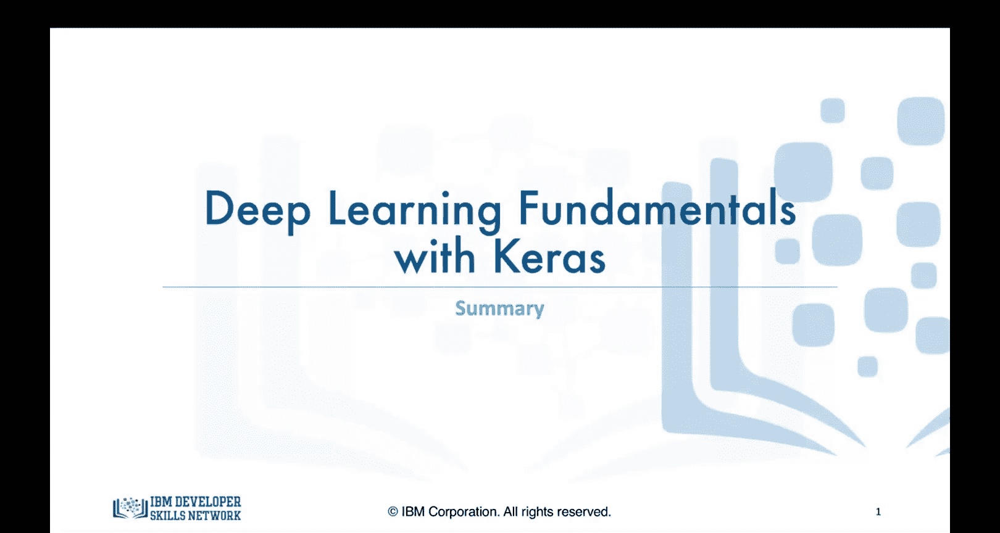
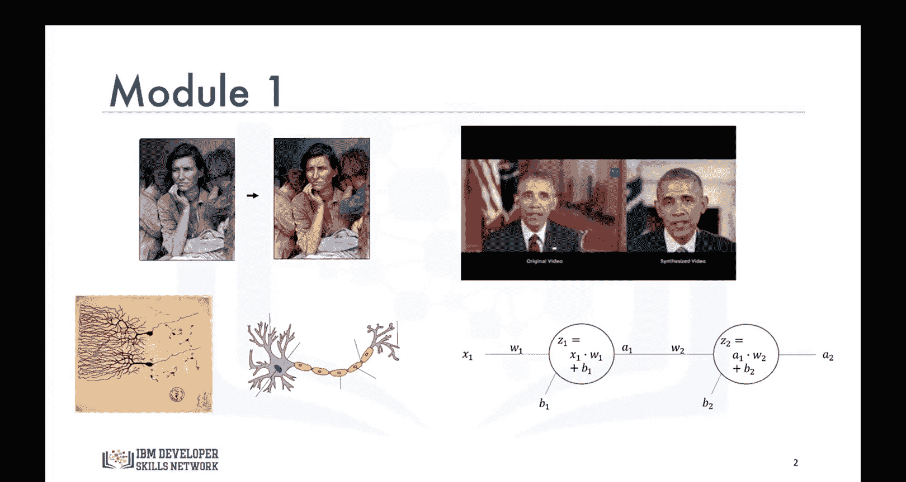
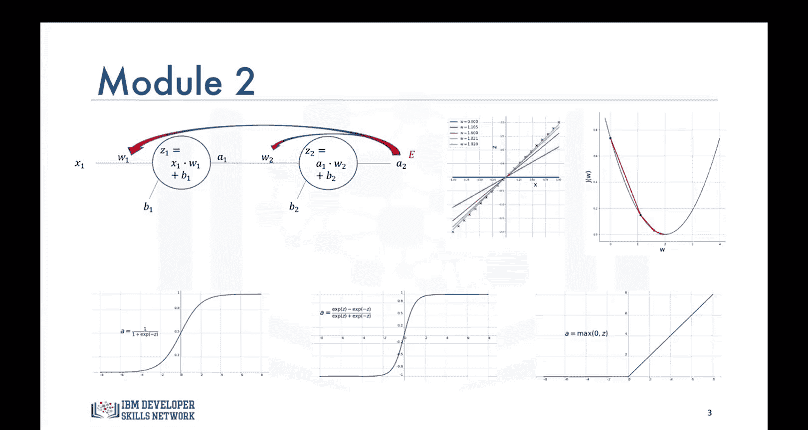
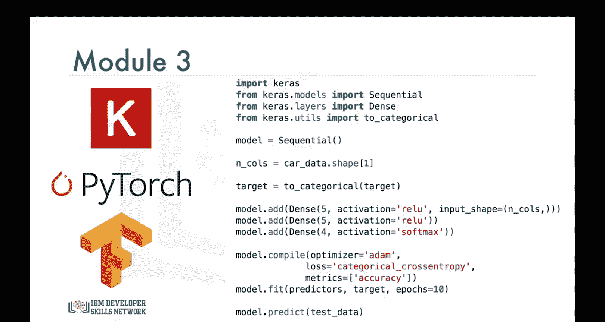
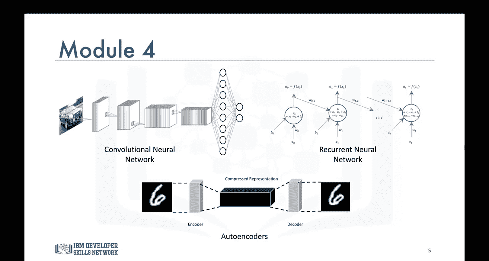

生成式人工智能工程：095：课程总结 🎉

在本课程中，我们系统性地学习了生成式人工智能工程的核心知识体系，涵盖了从基础概念到实际应用的多个关键模块。现在，让我们一起来回顾整个课程的核心内容。

**模块一：深度学习应用与神经网络基础**

在模块一中，我们探讨了一系列令人兴奋且具有启发性的深度学习应用案例。我们简要介绍了大脑中的神经元和神经网络，以理解它们如何启发人工神经网络的设计。随后，我们学习了神经网络如何通过**前向传播**过程进行预测。

**模块二：神经网络的学习机制**

在模块二中，我们深入探讨了人工神经网络如何通过**梯度下降**和**反向传播**进行学习。我们还学习了**梯度消失问题**，并了解了哪些激活函数最适合克服这一问题。

**模块三：Keras库与模型构建**

在模块三中，我们学习了Keras库，并掌握了如何使用它来构建解决回归和分类问题的模型。

**模块四：监督与非监督深度学习**

在模块四中，我们学习了监督式和非监督式深度神经网络。我们使用Keras库构建了一个**卷积神经网络**。

**结语与展望**

我非常享受准备这门课程的过程，衷心希望您也乐在其中并学到了很多知识。在某些时候，课程制作对我而言颇具挑战，因为我必须省略许多细节以保持内容的简洁性。本课程的目的并非教授全部知识，而是为您打下坚实的基础，使您能够准备好学习更高级的深度学习课程，甚至可以根据意愿开始自主学习。我相信您现在已具备这样的能力。感谢您选修本课程，并祝您未来一切顺利。

**课程总结**

在本节课中，我们一起回顾了生成式人工智能工程课程的全部核心内容。我们从深度学习的激动人心的应用开始，逐步深入到神经网络的基础原理、学习机制、Keras工具的使用，以及监督与非监督学习模型。本课程为您构建了坚实的知识框架，为您后续深入探索更高级的AI主题或进行独立学习做好了准备。恭喜您完成本课程的学习！