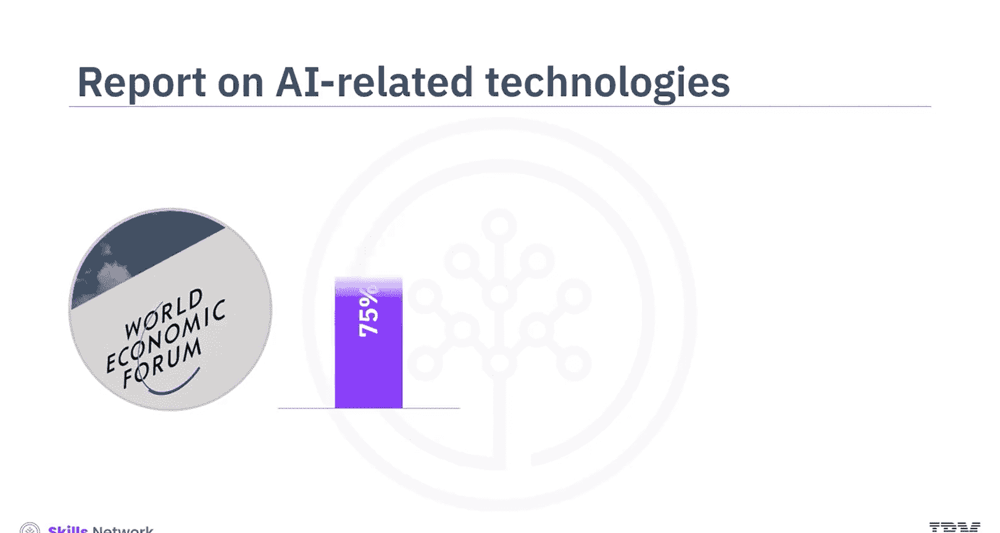
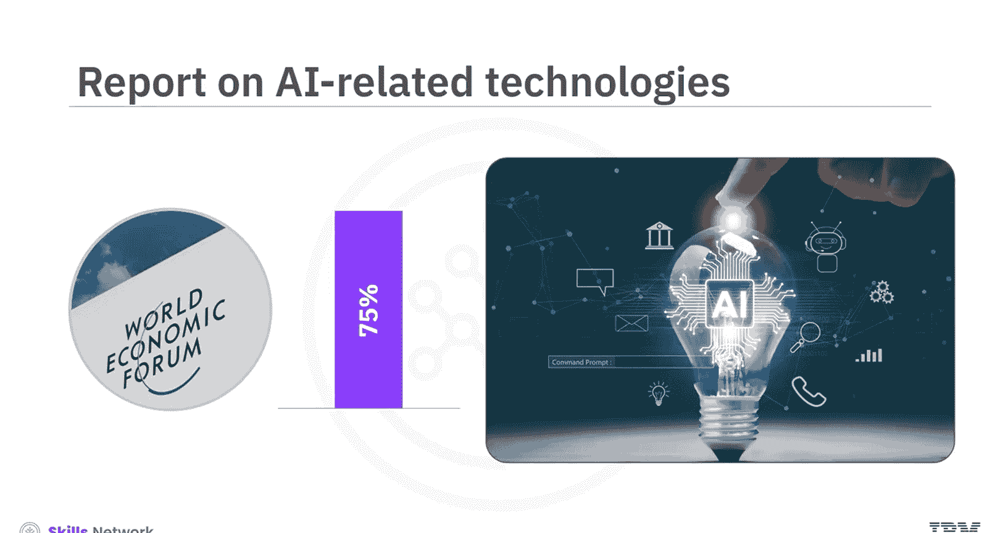
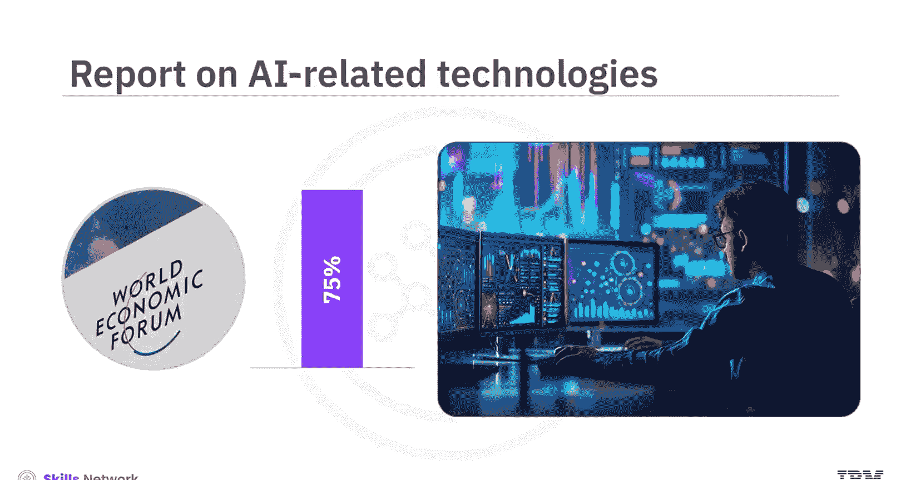
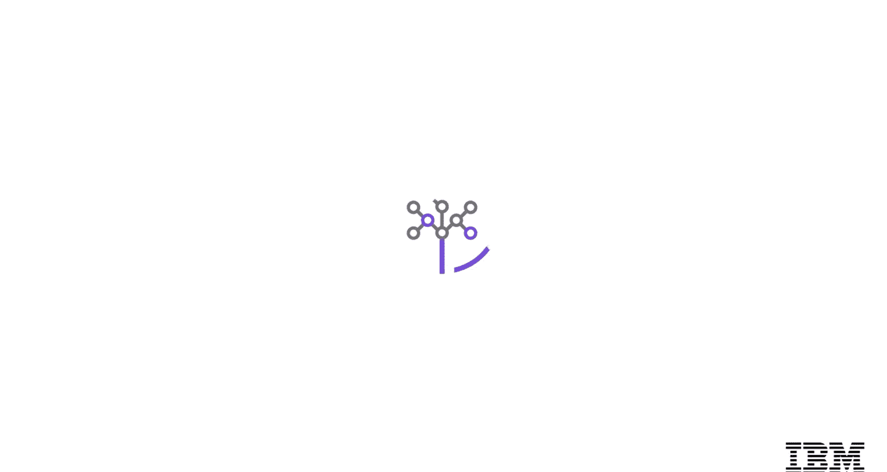

# 生成式人工智能工程：096：使用LLM的AI工程概述 🚀

在本节课中，我们将要学习IBM生成式人工智能工程专业证书项目的概述，特别是关于如何使用大型语言模型进行AI工程。我们将了解该项目的目标、适合人群、课程结构以及你将学到的核心技能。

世界经济论坛的一份关于未来工作的报告预测，未来近75%的组织可能会采用人工智能和机器学习相关技术。随着组织采用这项相对较新的技术，他们将需要专家来帮助他们理解如何在组织环境中应用新技术。

那么，作为AI领域的新手或有经验的从业者，你如何创造价值？生成式AI架构和模型的知识对于启动或推进在AI、机器学习和数据科学领域的职业生涯至关重要。

## 项目简介与目标 🎯

本项目专注于生成式人工智能和大型语言模型在自然语言处理领域的原理、技术和应用。它最适合渴望成为或目前正在担任AI工程师、机器学习工程师、深度学习工程师和数据科学家的专业人士。

学习本项目需要具备Python的基础知识。同时，了解PyTorch也将大有裨益。

## 课程结构与内容 📚

该项目由多个短期课程组成，涵盖了生成式AI和LLM的各个方面。课程内容包括：用于NLP的AI基础模型、使用Transformer进行语言建模、Transformer微调、LLM高级微调、使用RAG和LangChain的AI智能体，以及一个关于使用LangChain的AI应用的顶点项目。

每个主题对应一门你可以独立完成的在线课程。每门课程包含两到三个模块。完成涵盖不同主题的课程以及要求的项目后，你将获得IBM生成式人工智能工程专业证书。

以下是各门课程的核心内容：

### 1. 生成式AI与LLM应用入门
你将开启生成式AI工程之旅，学习生成式AI模型以及如何使用LLM构建基于NLP的应用程序。该课程还涵盖了开发这些应用程序时使用的库和工具。你还将学习通过实现**分词**和创建NLP数据加载器来准备训练LLM的数据。

### 2. NLP的语言理解与语言模型
这门中级课程将向你介绍各种模型，例如**N-gram**、**Word2Vec**和**序列到序列模型**。你将获得构建、训练和集成这些模型以完成各种NLP任务的实践经验。

### 3. 基于Transformer的NLP模型
在这里，你将学习LLM中如何使用**位置编码**、**词嵌入**、**注意力机制**和**多头注意力**。课程还将讨论基于解码器的模型（如生成式预训练Transformer，即**GPT**）和基于编码器的模型（如来自Transformer的双向编码器表示，即**BERT**），以及它们如何用于语言翻译。

### 4. Transformer微调
这门课程通过为你提供优化基于Transformer的LLM的通用框架和微调生成式AI模型的知识，将你的Transformer学习之旅向前推进一步。尽管从理论角度理解从头开始训练Transformer的基础知识很重要，但大多数实际应用都侧重于微调预训练模型和提示工程。

在这门课程中，你还将学习模型框架和平台，如**Hugging Face**和**PyTorch**。与微调相关的概念和技术，如**参数高效微调**、**低秩适应**和**量化低秩适应**也是本课程的一部分。你还将练习使用Hugging Face和PyTorch适配器加载模型、进行推理以及训练模型。

### 5. 高级微调技术
下一门课程将通过向你介绍允许模型从人类反馈中学习的技术，帮助你提升微调技能。你将首先了解**指令微调**和**奖励建模**等微调方法。然后，你将学习**近端策略优化**、作为策略的LLM以及**基于人类反馈的强化学习**。本课程将进一步深入探讨使用**配分函数**的**直接偏好优化**，并解释如何找到最优解。

### 6. RAG与LangChain框架
接下来，你将学习**RAG**和**LangChain**框架。你将了解RAG流程、上下文和问题编码器以及**Faiss**库。此外，你还将了解**上下文学习**、LangChain以及提示工程的高级方法。然后，你将深入探讨用于开发应用程序的LangChain工具、组件、聊天模型和智能体。课程中 strategically 安排了实践实验，以帮助你掌握这些工具和技术的就业技能。

### 7. 顶点项目
最后是**顶点项目**。在这里，你将应用在整个项目中学到的所有技能。通过对LLM原理的理解，结合PyTorch和Hugging Face的知识，你现在可以利用这些知识，使用LangChain构建真实世界的应用程序。LangChain能够无缝集成和部署复杂的语言模型，使得创建强大、可扩展的解决方案变得更加容易。无论你是开发聊天机器人、自动内容生成器还是高级分析工具，LangChain都提供了将你的AI项目高效落地的框架。这个项目将是你的作品集的一个很好补充，并让你更接近获得生成式人工智能工程专业证书。

## 学习评估与认证 📝

在学习过程中，你将遇到测验和项目来评估你的学习成果。计分测验的权重将计入课程完成度。大多数项目将由AI或同伴评分，并带有一定权重，计入课程和项目完成要求。

最后，在你成功完成所有学习内容后，你将获得IBM生成式人工智能工程专业证书。这是一项受到许多雇主重视的凭证。

## 总结

本节课中，我们一起学习了IBM生成式人工智能工程专业证书项目的整体概览。我们了解了该项目旨在培养能够应用LLM和生成式AI技术的专业人才，涵盖了从基础模型、Transformer架构、各种微调技术到RAG和LangChain应用开发的完整知识体系。通过系列课程和实践项目，学习者将获得构建真实AI应用所需的技能，并最终获得行业认可的证书。我们祝愿你在接下来的学习旅程中一切顺利。