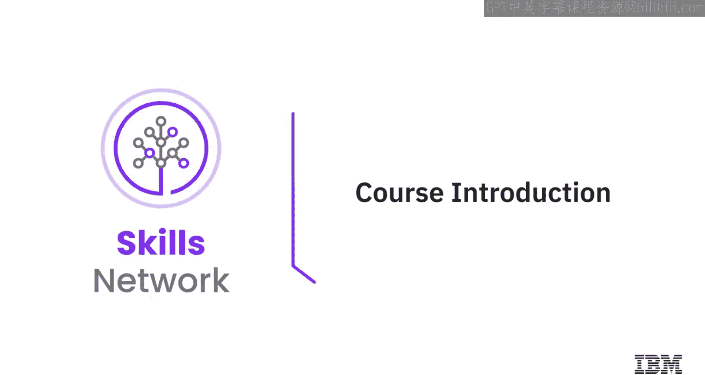
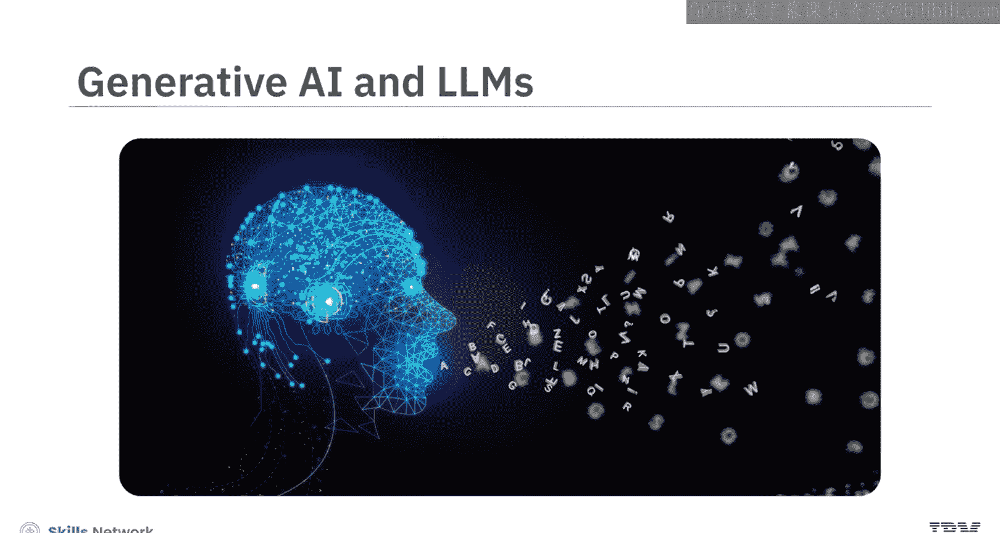
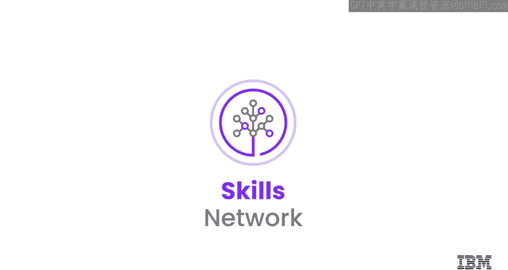

# 生成式人工智能工程：097：课程介绍 🚀

在本课程中，我们将学习生成式人工智能和大型语言模型的基础知识。本课程是一个包含六门课程的专项计划的第一部分，旨在为你提供使用LLMs构建自然语言处理应用的知识与技能。

## 概述

生成式人工智能以多种方式改变了我们的生活。它能自动补全代码、创作音乐、设计游戏并助力药物发现，这只是其无限可能性中的一小部分。生成式AI系统在理解自然语言方面的能力实现了巨大飞跃，这有助于生成上下文相关的对话、总结文档、进行语言翻译等。

在专注于语言建模的AI工程领域，存在着巨大的职业发展机遇。准备好开发创新的AI应用，让人与机器能够用自然语言轻松交互。在这个快速发展的领域建立专业知识，成为雇主青睐的人才。

## 目标学员

本课程适合现有和未来的数据科学家、机器学习工程师、深度学习工程师和AI工程师。学习本课程时，如果你具备Python和PyTorch的基础知识，并对机器学习和神经网络有所了解，将会更有优势，但这并非严格要求。

## 学习目标

完成本课程后，你将能够：
*   描述如何使用LLMs开发能够理解和生成人类语言的生成式AI应用。
*   解释文本如何被预处理和加载，以供LLMs进行有效的训练和分析。
*   使用生成式AI库和工具来实现基于LLMs的应用。

## 课程内容结构

上一节我们介绍了课程的整体目标，本节中我们来看看课程的具体模块安排。

本课程包含两个核心模块：

**模块一：生成式AI基础与工具**
你将学习生成式AI的重要性和演变历程。了解Transformer和生成对抗网络等生成式AI架构与模型在训练方法和微调上的差异。此外，你还将学习LLMs，以及PyTorch和Hugging Face等库和工具的关键特性与重要性。通过动手实验，你将在Jupyter环境中使用Hugging Face探索生成式AI库。

**模块二：数据准备**
你将学习将数据转换为LLMs可理解格式所必需的数据准备步骤。作为其中的一部分，你将学习分词技术和数据加载器。在本模块的实验练习中，你将实现分词并创建一个NLP数据加载器。你还将通过课程术语表和速查表来回顾所学内容。

## 学习资源与建议

为了帮助你高效学习，本课程提供了多种形式的内容：

以下是课程提供的学习资源类型：
*   **视频**：简短精炼，专注于核心主题。
*   **阅读材料**：以文本形式提供详细内容。
*   **实验**：提供技术环境、详细说明和代码片段，供你完成动手练习。
*   **练习测验**：用于自我评估学习成果。
*   **计分测验**：用于应用所学知识并评估掌握程度。
*   **术语表与速查表**：提供代码语法等快速参考内容。

为了从课程中获得最大收益，建议你观看所有视频、完成实验以练习新技能，并尝试所有测验。

## 总结

本节课中，我们一起学习了《生成式人工智能工程》系列课程第一门的介绍。我们了解了生成式AI的广泛应用和巨大潜力，明确了课程的目标学员和学习目标，并预览了课程的两个核心模块内容与丰富的学习资源。现在，让我们开始这段激动人心的学习旅程吧。