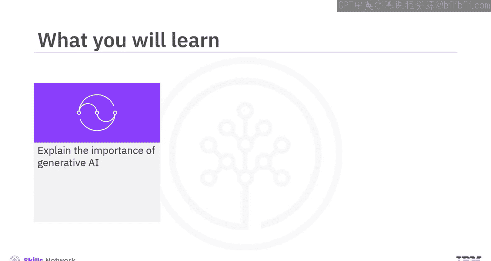
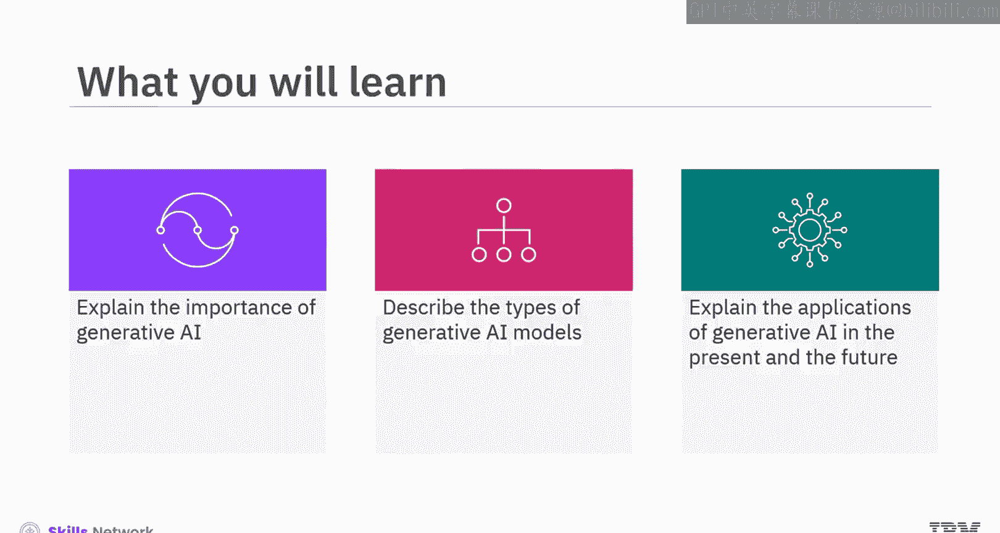
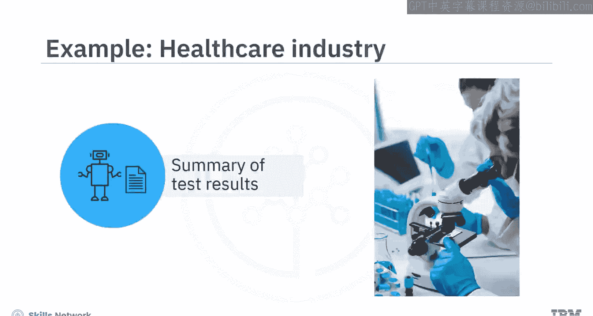
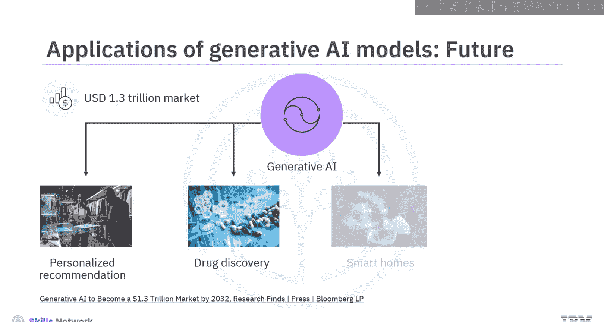
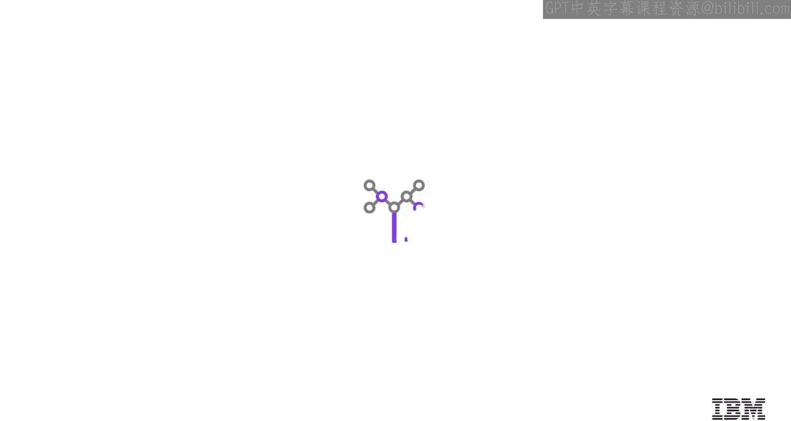

生成式人工智能工程：098：生成式AI的重要性 🚀

在本节课中，我们将学习生成式人工智能的重要性。你将能够解释生成式AI在多个领域的重要性，了解不同类型的生成式AI模型，并阐述其在当下及未来的应用。

想象你是一名在医疗健康行业工作的技术专家。你的团队希望你通过实施生成式AI来提升患者体验，例如，将患者各项复杂的检测结果总结成易于理解的语言。你认为使用生成式AI可以实现这个目标吗？让我们深入了解。

---

### 什么是生成式AI？

生成式AI指的是能够根据其训练数据生成高质量文本、图像及其他内容的深度学习模型。这些模型的开发和训练旨在理解现有数据中的模式和结构，并运用这种理解来产生新的、相关的数据。

可以将生成式AI比作一位艺术家：他审视各种画作，理解其中的模式，然后根据所学创作出原创的艺术作品。

---

### 生成式AI模型的类型

生成式AI包含多种类型的模型，广泛应用于不同领域。这些模型用于生成不同类型的内容，如文本、图像、音频、3D物体和音乐。

#### 文本生成模型

上一节我们介绍了生成式AI的基本概念，本节中我们来看看具体的模型类型。首先是文本生成模型。

这些模型理解文本数据中的上下文以及词语和短语之间的关系。它们识别模式，然后生成与上下文相关的文本。

例如，当我们开始撰写一个故事时，这些模型能够智能地预测并生成叙事的后续部分。或者，当我们输入一个英文句子时，模型可以生成另一种语言的翻译文本，同时保留原文的语气。

一个文本生成模型的例子是**生成式预训练转换器**，即 **GPT**。

#### 图像生成模型

接下来，我们探讨用于图像生成的模型。

这些模型主要通过两种方式工作：
1.  **根据文本输入生成图像**。例如，模型可以根据提示“一个正在弹钢琴的机器人”生成对应的图像。这类模型的一个例子是**DALL-E**。
2.  **根据种子图像或模型自身生成的随机输入生成图像**。例如，如果你提供一张天空的图片作为输入，模型可以生成各种艺术风格的天穹图像。这类模型可用于图像到图像的转换（如将草图转化为逼真图像）以及深度伪造创作（如在电影中让著名演员“复活”）。

图像生成模型的例子包括**生成对抗网络**和**扩散模型**。

#### 音频生成模型

另一种类型的生成式AI模型用于生成音频内容。

你可以使用这些模型生成听起来自然的语音，以及进行文本到语音的合成。例如，你可以生成一段听起来很真实的音频对话。

这类模型的一个例子是**WaveNet**。

---

### 生成式AI的应用

了解了不同类型的模型后，现在让我们看看生成式AI的具体应用。许多行业都在使用生成式AI模型和系统。

以下是其主要应用领域：

*   **内容创作**：你可以自动化创建文章、博客帖子、营销材料等具有上下文相关性和清晰度的书面内容。同时，也能为娱乐和广告创作视觉图像和视频。
*   **摘要总结**：你可以利用生成式AI来浓缩长篇文档和文章，帮助读者快速吸收信息。
*   **语言翻译**：生成式AI可以使语言翻译听起来更自然，从而提升你内容的可访问性。
*   **聊天机器人与虚拟助手**：你可以让聊天机器人和虚拟助手像人类一样对话，使它们在提供客户支持时更加高效。
*   **数据分析与问题解决**：基于一个或多个AI模型构建的生成式AI系统，可以帮助你分析大型数据集（尤其是在自然语言处理任务中），用以发现洞察并为复杂问题提出创造性的解决方案。

---

### 行业特定应用

生成式AI的应用正渗透到各个具体行业：

*   **医疗健康**：行业使用生成式AI分析医学影像，并利用医疗信息创建患者报告。
*   **金融**：行业利用生成式AI从海量金融数据集中进行预测和预报。
*   **游戏**：行业通过生成式AI引入互动元素和动态故事情节，使游戏更加刺激。
*   **信息技术**：生成式AI可以创建人工数据来训练模型，从而提高数据科学和机器学习模型的准确性。

根据彭博智库的预测，到2032年，生成式AI有望成为一个价值**1.3万亿美元**的市场。这将使其在更多领域拓展应用，例如增强个性化推荐、通过药物发现助力医学突破，以及将生成式AI集成到智能家居和自动驾驶车辆中。

---

### 总结

本节课中，我们一起学习了生成式AI的重要性。

*   生成式AI指的是能够根据训练数据生成文本、图像、音频、3D物体和音乐等多种类型内容的深度学习模型。
*   文本生成模型（如**GPT**）理解词语和短语之间的关系，并生成上下文相关的文本。
*   图像生成模型（如**DALL-E**、**GAN**）可以根据文本输入或种子图像生成图像。
*   音频生成模型（如**WaveNet**）可用于生成自然语音和进行语音合成。
*   生成式AI在医疗健康、金融、游戏和信息技术等行业有着具体的应用，其市场前景广阔，未来将在更多领域发挥重要作用。