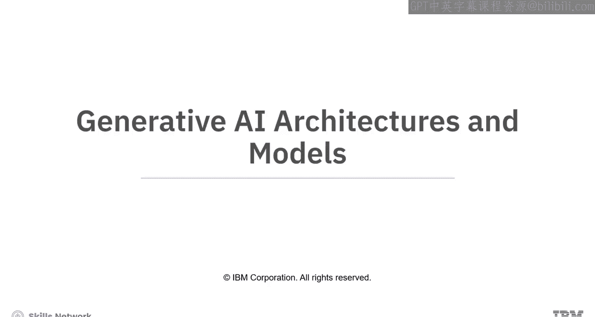
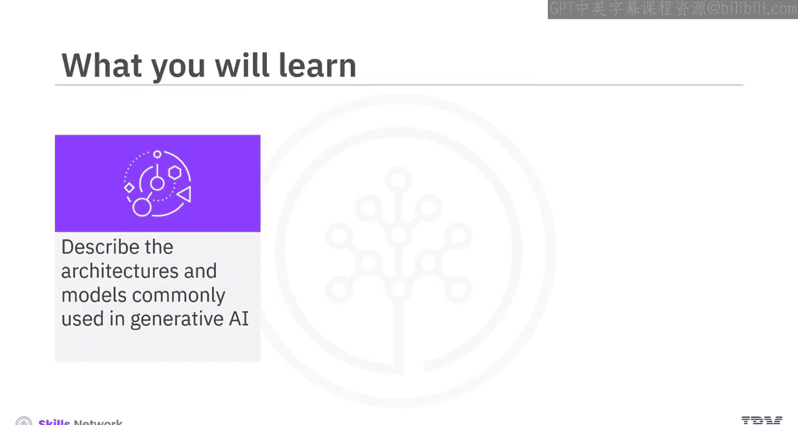
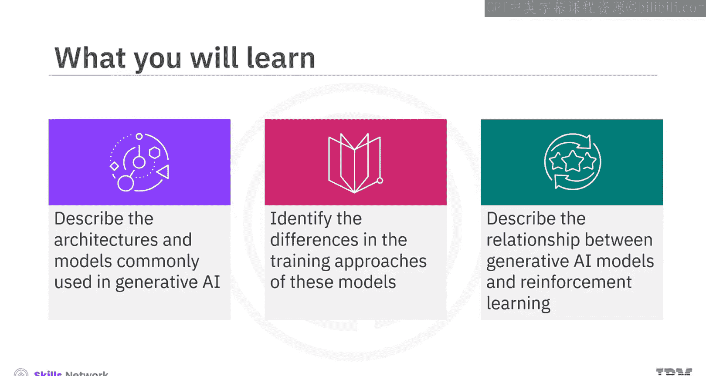
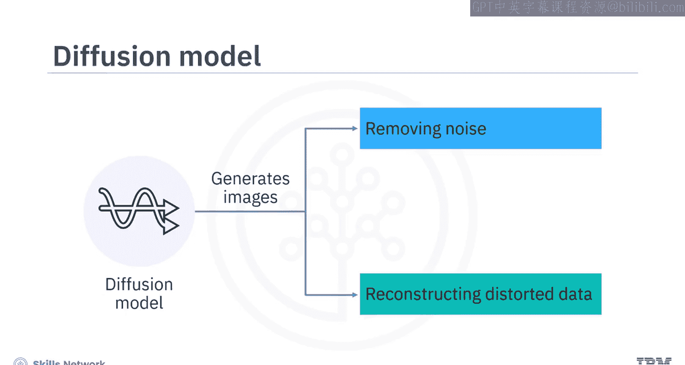
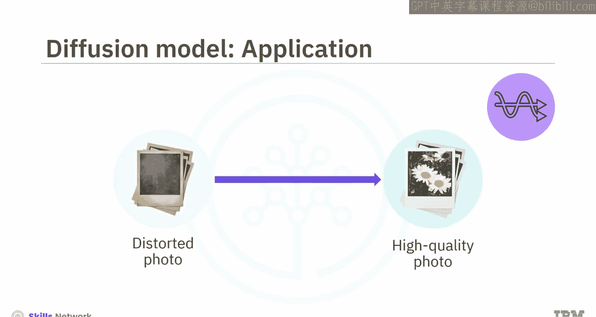
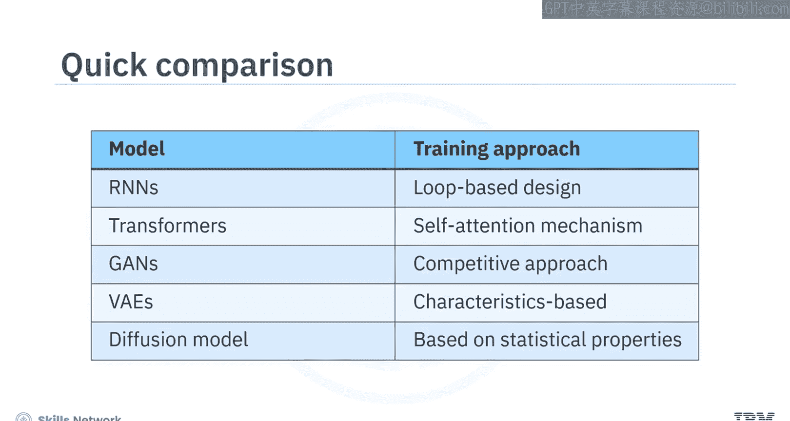
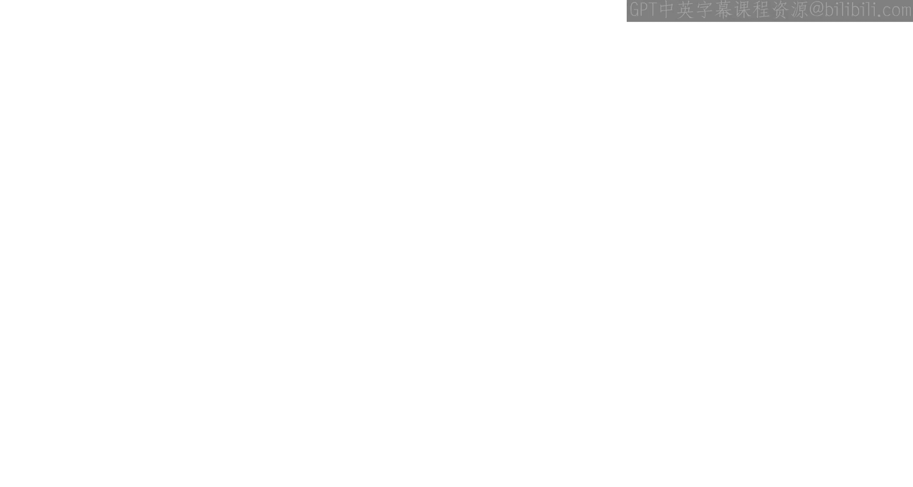

生成式人工智能工程：099：生成式AI架构与模型 🏗️

在本节课中，我们将学习生成式人工智能中常用的架构与模型。你将能够描述这些常见的架构，识别它们在训练方法上的差异，并理解生成式AI模型与强化学习之间的关系。

---

想象你是一名AI工程师，任务是为一个在线平台自动化创建个性化视频剪辑。用户提供他们希望在视频中看到的内容的文字描述，系统必须生成与描述准确匹配的视觉效果。哪种生成式AI架构或模型可以帮助你实现这个功能？

为了解答这个问题，让我们深入了解生成式AI中常用的架构和模型。

以下是生成式AI中几种核心的架构与模型：

*   **循环神经网络**：一种使用序列或时间序列数据的人工神经网络。
*   **Transformer**：一种能够近乎实时翻译文本和语音的深度学习模型。
*   **生成对抗网络**：一种由生成器和判别器两个子模型组成的生成式AI模型。
*   **变分自编码器**：一种基于编码器-解码器框架运行的模型。
*   **扩散模型**：一种概率生成模型。

---

上一节我们列出了主要的模型类型，本节中我们来详细看看**循环神经网络**。

RNN是一种人工神经网络，专门用于处理具有自然顺序或时间依赖关系的数据问题。RNN与常规神经网络的不同之处在于其结构中内置了循环。这种基于循环的设计使RNN能够记住先前的输入，并影响当前的输入和输出。这对于处理序列（如语言建模）的任务至关重要。

为了让生成式AI架构和模型生成更准确、上下文更相关的内容，你需要对它们进行**微调**。微调是指调整一个预训练模型，以提高其在特定任务或数据集上的性能。对于RNN，微调可能涉及调整循环神经网络的权重和结构，以使其与特定任务或数据集对齐。

RNN可以应用于自然语言处理、语言翻译、语音识别和图像描述生成等领域。

---

了解了RNN的序列处理能力后，我们来看看在自然语言处理中表现卓越的**Transformer**架构。

Transformer是一种深度学习模型。它接收数据（如单词或数字）并将其传递通过不同的层。信息单向流动，从输入层开始，经过隐藏层，最终到达输出层。Transformer采用反馈机制来提高准确性。

Transformer的设计包含一个**自注意力机制**，使模型能够专注于正在查看的信息中最重要的部分，从而提高其理解和决策的效率。这种对输入序列不同部分的选择性关注，允许模型同时专注于特定片段，从而实现高效的并行化训练。

在Transformer微调中，预训练的Transformer模型主体通常保持不变，微调通常只涉及针对特定任务训练最后的输出层。Transformer的自注意力机制和其他层通常保持固定。

**生成式预训练Transformer** 是Transformer架构中展示出卓越文本生成能力的一个生成模型示例。GPT是一个经过训练的生成模型，能够根据从训练数据中学到的模式来预测和生成文本序列。尽管它不像某些生成模型那样明确地对底层数据分布进行建模，但其生成反映训练数据分布文本的能力，以及在微调中的多功能性，确立了它作为生成模型的角色。

---

接下来，让我们学习**生成对抗网络**。

GAN是一种生成式AI模型，由两个子模型组成：一个**生成器**和一个**判别器**。生成器创建虚假样本并将其发送给判别器。判别器通过将这些样本与来自真实数据集的真实样本进行比较来检查其真实性，然后为每个样本分配一个概率分数，表明该样本是真实的可能性有多大。

这个对抗过程就像一场友好的竞争，生成器努力使生成的东西看起来真实，而判别器则学习区分真实与虚假。两者都在不断改进各自的输出。你会发现GAN在图像和视频生成方面特别有用。

---

在了解了GAN的对抗训练后，我们转向另一种生成模型——**变分自编码器**。

VAE基于编码器-解码器框架运行。编码器网络首先将输入数据压缩到一个简化的抽象空间，该空间捕获了数据的基本特征。然后，解码器网络使用这些压缩信息来重建原始数据。

VAE专注于学习输入数据中的底层模式，从而可以创建具有相似特征的新数据样本。VAE在潜在空间中使用概率分布来表示数据，它们可以为给定的输入产生一系列可能的输出，这反映了现实世界数据中固有的不确定性。

你会发现它们在艺术和创意设计相关的应用中非常有用。

---

最后要介绍的模型是**扩散模型**。

扩散模型是一种概率生成模型。它通过学习如何从训练数据中去除噪声或重建已被扭曲到无法识别的样本来进行训练，从而生成图像。根据提示，扩散模型可以基于其训练数据的统计特性生成极具创意的图像。

你可以使用扩散模型从嘈杂或低质量的输入中生成高质量图像，例如修复一张旧的、失真的照片。

---

总结来说，这些架构和模型的训练方法各不相同：

*   RNN使用基于循环的设计。
*   Transformer利用自注意力机制。
*   GAN采用竞争性训练方法。
*   VAE采用基于特征的方法。
*   扩散模型依赖于统计特性。

生成式AI模型与**强化学习**密切相关。传统的强化学习侧重于智能体（如AI系统或机器人）如何与环境交互以最大化奖励。生成式AI模型在训练期间采用强化学习技术来微调和优化其在特定任务上的性能。

---

本节课中我们一起学习了生成式AI的架构与模型。

生成式AI架构和模型包括RNN、Transformer、GAN、VAE和扩散模型。

*   RNN使用序列或时间序列数据以及基于循环的设计进行训练。
*   Transformer利用自注意力机制来关注信息中最重要的部分。
*   GAN由生成器和判别器组成，两者以竞争模式工作。
*   VAE基于编码器-解码器框架运行，并根据相似特征创建样本。
*   扩散模型通过学习去除噪声和重建扭曲的样本来生成创意图像，并依赖于统计特性。