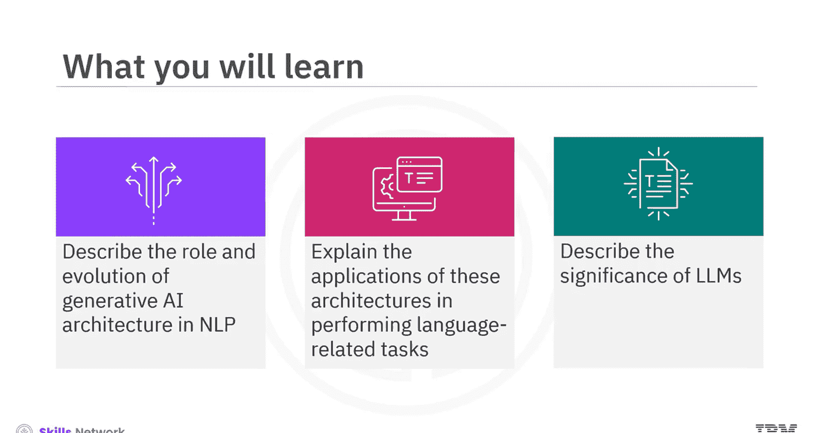
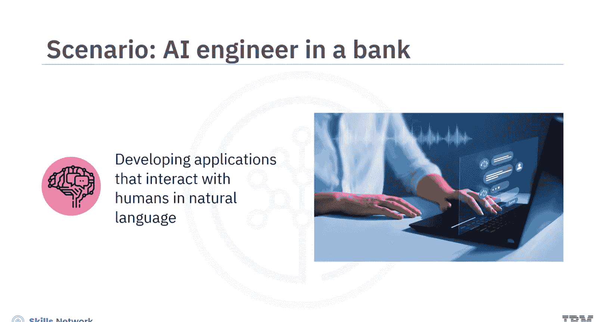
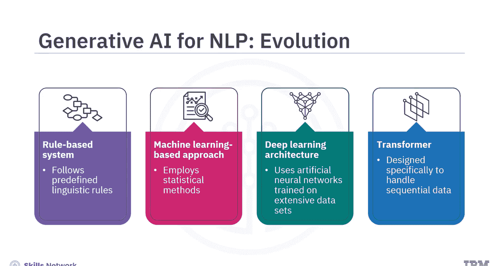
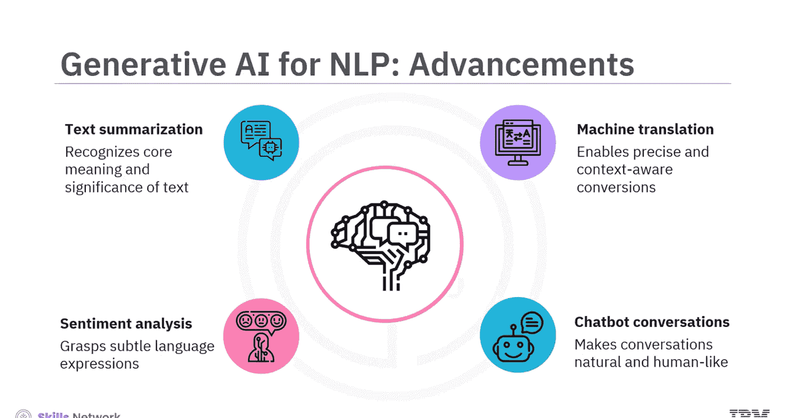
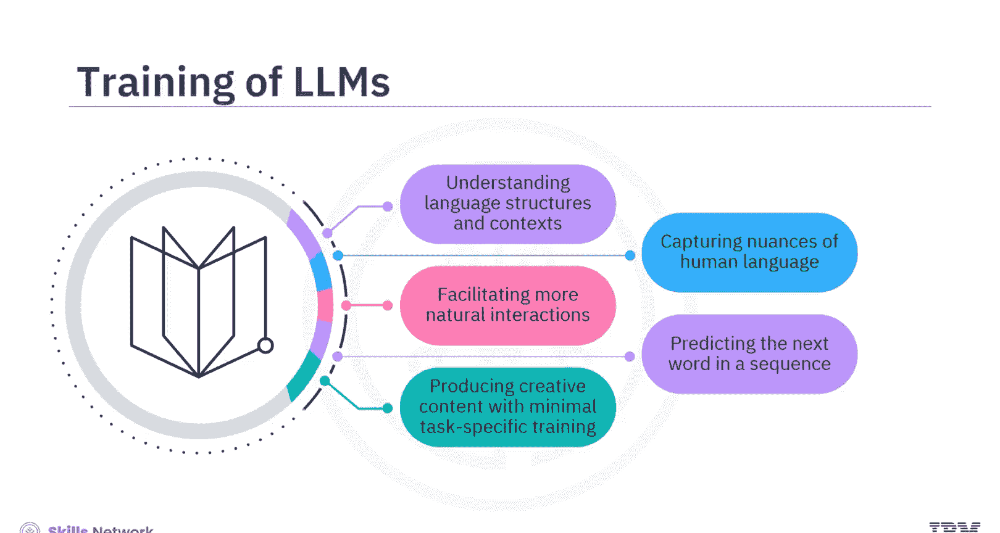
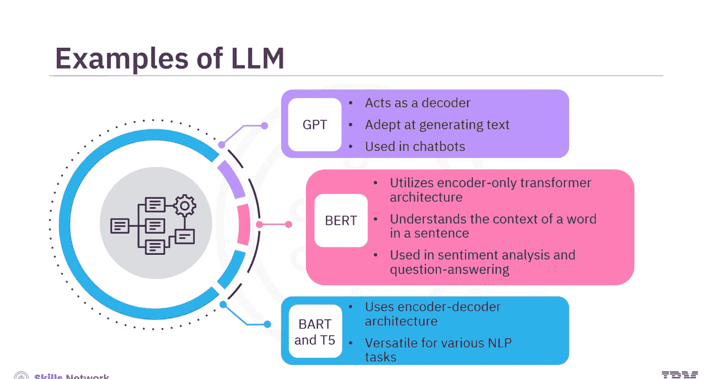
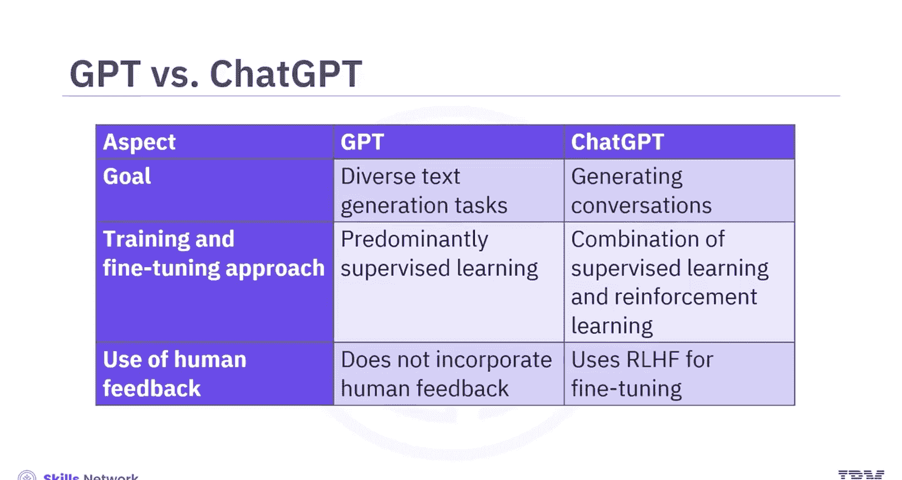
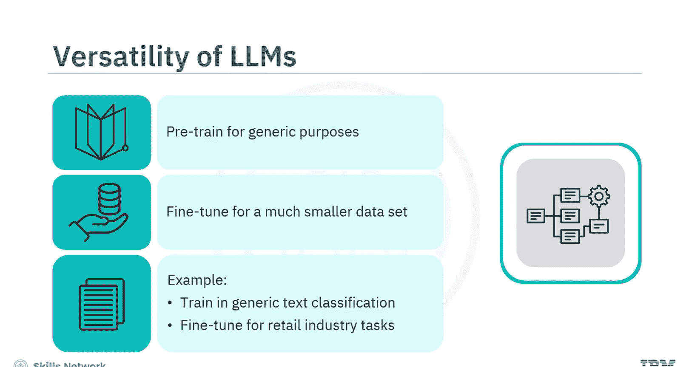
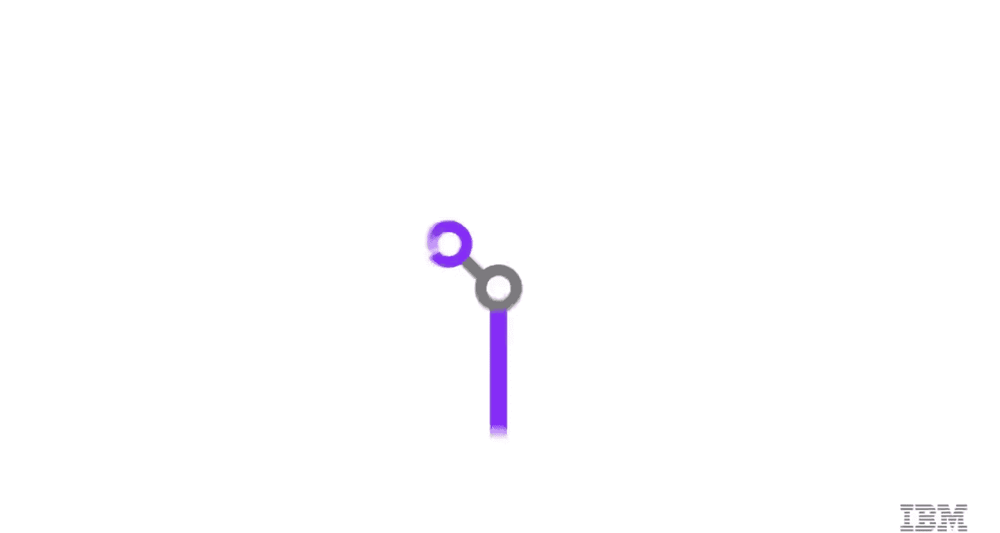

生成式人工智能工程：100：生成式AI在NLP中的应用 🧠

在本节课中，我们将要学习生成式人工智能在自然语言处理领域的角色、演变及其应用。我们将探讨生成式AI架构如何使机器理解并生成类人语言，并了解大型语言模型的重要性。

想象你在一家银行担任AI工程师。银行指派你创建一个虚拟助手，该助手能够用自然语言与客户对话，回答关于账户详情、投资选项等查询。你将探索如何利用生成式AI架构来开发能与人类进行自然语言交互的应用程序。

生成式AI架构使机器能够理解人类语言并生成与人类生成内容难以区分的响应。它们通过融入上下文感知和确保连贯的交互来改进语言处理，并通过预测分析和高级建模实现有意义的对话。

基于生成式AI架构的NLP系统能够感知情感并理解话语背后的意图，将理解范围扩展到单纯的词汇之外。

上一节我们介绍了生成式AI的基本概念，本节中我们来看看其在NLP领域的演变历程。

以下是生成式AI在NLP中的演变阶段：

*   **基于规则的系统**：严格遵循预定义的语言学规则（如语法）。这些系统虽然精确，但缺乏灵活性。
*   **基于机器学习的方法**：采用统计方法从大量语言数据集中学习并进行预测。这比基于规则的系统更具适应性，但在理解复杂的语言细微差别方面仍有局限。
*   **深度学习**：专注于使用大量数据集训练人工神经网络。网络中的众多计算单元协同工作，进行更细致的语言解读。
*   **Transformer架构**：这是最新的演变成果。Transformer架构专为处理序列数据而设计，在理解语言中的上下文和依赖关系方面能力更强。

由于持续改进机器理解和生成语言方式的努力，NLP领域的生成式AI在不断演进。

这种演进体现在机器翻译、聊天机器人对话、情感分析和文本摘要等领域的显著进步中。

以下是生成式AI架构在这些任务中的应用：

*   **机器翻译**：这些架构通过实现更精确和具有上下文感知的语言转换，显著提高了翻译准确性。
*   **聊天机器人/虚拟助手**：你可以利用生成式AI架构使对话更加自然、拟人化，并带有一定程度的同理心和个性化，从而提升用户体验。
*   **情感分析**：生成式AI架构理解微妙语言表达的能力，提高了情感分析的有效性，为用户情感提供了更深入的洞察。
*   **文本摘要**：你可以运用这些架构来识别文本或文档的核心含义和重点，从而生成更精确的摘要。

生成式AI架构包含专注于理解和生成人类语言的语言模型。

大型语言模型是使用人工智能和深度学习技术，基于海量数据集（如网站和书籍）来生成文本、翻译语言和创建各类内容的基础模型。

它们之所以被称为“大型”语言模型，是因为其训练数据集的规模可能达到PB级别。此外，这些模型包含数十亿个**参数**，这些参数是定义模型行为的变量，在训练过程中进行微调以优化模型在特定任务上的性能。例如，当模型学习情感时，一个参数可能代表分配给特定词（如“快乐”、“悲伤”）的权重。

LLM在庞大数据集上的广泛训练使其能够全面理解语言结构和上下文。它们能够捕捉人类语言的细微差别，促进更自然的交互。LLM擅长预测序列中的下一个词。凭借其庞大的资源，LLM只需极少量的任务特定训练即可生成创造性内容。

一些LLM的例子包括生成式预训练Transformer系列（GPT系列）、来自Transformer的双向编码器表示（BERT）、双向和自回归Transformer（BART）以及文本到文本传输Transformer（T5）。

以下是几种主要LLM架构的特点：

*   **GPT**：主要充当解码器，擅长生成文本。它在需要生成连贯且上下文相关内容的任务中表现出色，例如聊天机器人。
*   **BERT**：采用仅编码器的Transformer架构。它在理解句子中单词的上下文方面表现卓越，这对于情感分析和问答等需要细致处理的任务至关重要。
*   **BART和T5**：遵循编码器-解码器架构。它们利用编码器进行上下文理解，利用解码器生成文本。这种多功能性使其非常适合各种NLP任务。

术语“GPT”和“ChatGPT”听起来可以互换，但这些模型虽有相似之处，却各有侧重。

以下是GPT与ChatGPT的主要区别：

*   **GPT**：专注于多样化的文本生成任务。
*   **ChatGPT**：专注于生成对话。
*   **训练与微调**：GPT主要使用监督学习，可能使用强化学习，但较少关注对话方面。ChatGPT则结合使用监督学习和强化学习。
*   **人类反馈**：GPT的学习过程不包含来自人类交互的反馈。而ChatGPT使用一种称为“基于人类反馈的强化学习”的方法，该方法利用人类反馈来创建奖励模型。

大多数LLM都基于Transformer架构。LLM的多功能性使其成为推动自然语言理解和生成进步的关键因素。你可以为通用目的预训练LLM，然后用小得多的数据集对其进行微调。例如，LLM可能在通用文本分类上进行训练，你可以在零售行业背景下对其进行微调，以根据文本描述将产品分类到电子或服装等组别中。

需要注意的是，虽然这些模型能够跨领域生成权威性文本，但它们也可能生成听起来正确但不准确的信息。你可能还需要解决偏见问题，并考虑生成内容对社会的潜在影响。

本节课中我们一起学习了NLP领域的生成式AI架构。生成式AI架构使机器能够理解人类语言并生成与人类生成内容难以区分的响应。生成式AI始于遵循预定义语言学规则的基于规则的系统。随后出现了专注于统计方法的机器学习方法。深度学习的引入是一次重大飞跃，它使用在大量数据集上训练的神经网络。Transformer代表了这一演变的最新成果。生成式AI架构增强的能力带来了机器翻译、聊天机器人对话、情感分析和文本摘要领域的显著进步。LLM是使用人工智能和深度学习技术，基于海量数据集的基础模型。它们因训练数据集的规模可能达到PB级别而被称为大型语言模型。此外，它们拥有数十亿个参数。LLM的例子包括GPT、BERT、BART和T5。