# 生成式人工智能工程：101：分词 🧩

在本节课中，我们将要学习**分词**。分词是自然语言处理的基础步骤，它将文本分解成模型可以理解的更小单元。理解分词的过程和方法，对于构建任何文本相关的AI应用都至关重要。

## 概述

分词是将句子分解成更小片段（称为**令牌**或**词元**）的过程。这些令牌帮助模型更好地理解文本。例如，句子“IBM taught me tokenization”可以被分解为“IBM”、“taught”、“me”和“tokenization”等令牌。执行此分解的程序称为**分词器**。

## 分词方法

分词主要通过三种方法实现：基于词、基于字符和基于子词。以下是每种方法的详细介绍。

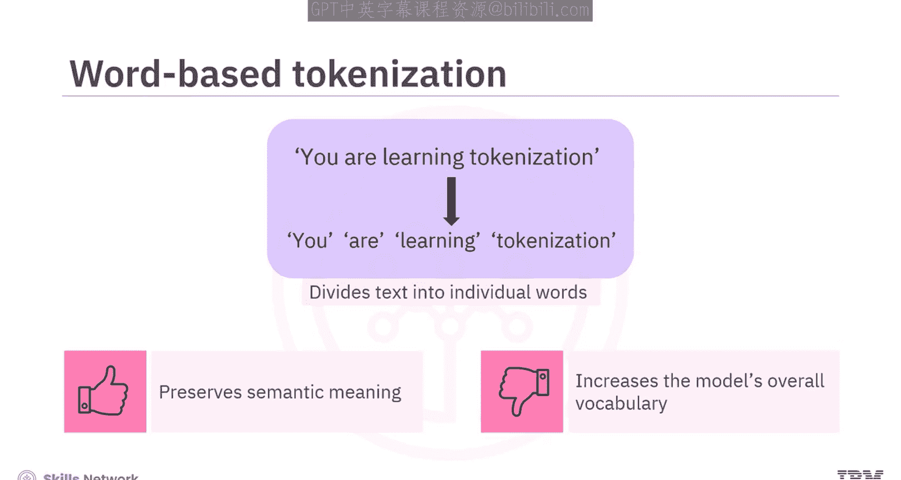

### 基于词的分词

在基于词的分词中，文本被划分为单个单词，每个单词被视为一个令牌。

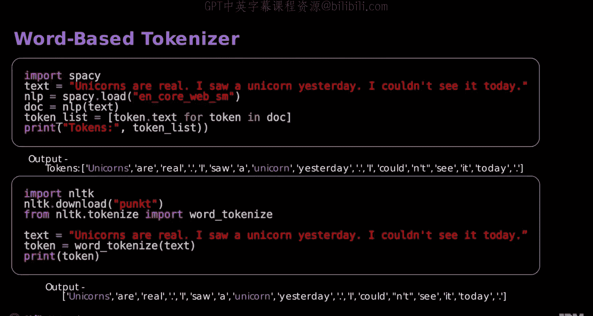

*   **优点**：保留了单词的语义含义。
*   **缺点**：将每个单词都视为独立令牌会显著增加模型的整体词汇表大小。

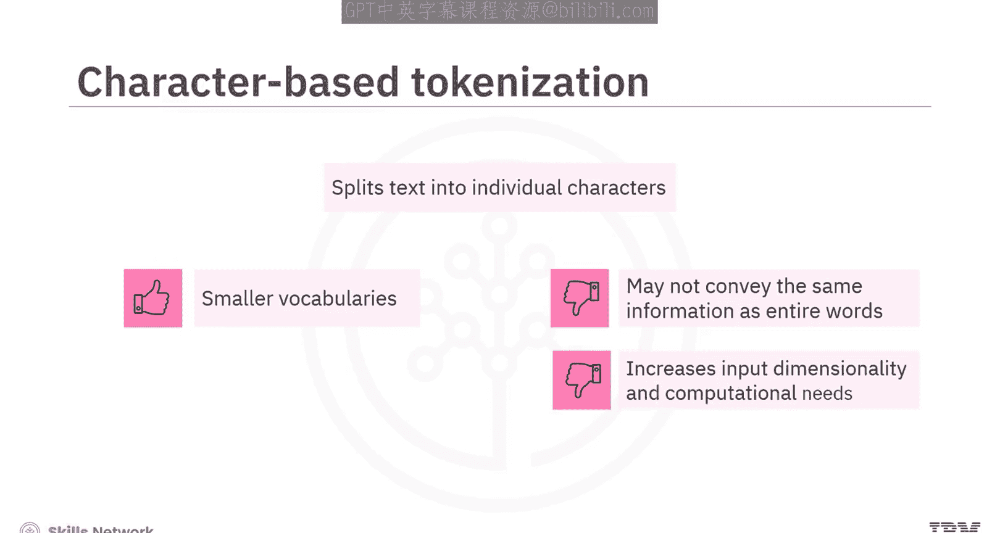

不同的分词器行为各异。例如，NLTK和SpaCy分词器能有效分割句子，但可能将“unicorn”和“unicorns”这类相似词视为不同令牌，这在进行自然语言处理任务时可能带来问题。

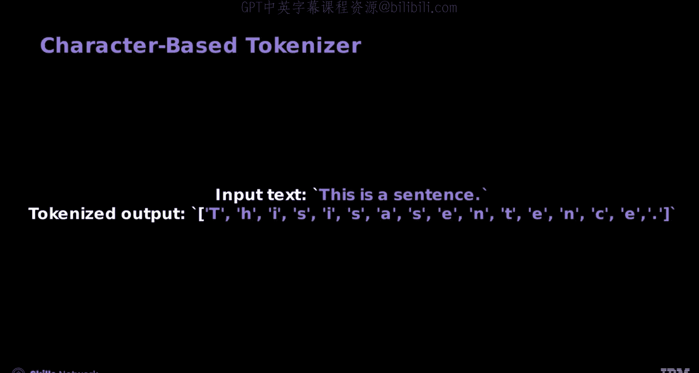

### 基于字符的分词

基于字符的分词将文本分割成单个字符。

*   **优点**：词汇表非常小。
*   **缺点**：单个字符可能无法传达与完整单词相同的信息。将每个字符作为唯一令牌会增加输入的维度和计算需求。

以下是一个基于字符的分词器示例。输入文本是“this is a sentence”。分词后，你得到字符序列：`[‘t’， ‘h’， ‘i’， ‘s’， ‘ ’， ‘i’， ‘s’， ‘ ’， ‘a’， ‘ ’， ‘s’， ‘e’， ‘n’， ‘t’， ‘e’， ‘n’， ‘c’， ‘e’]`。

### 基于子词的分词

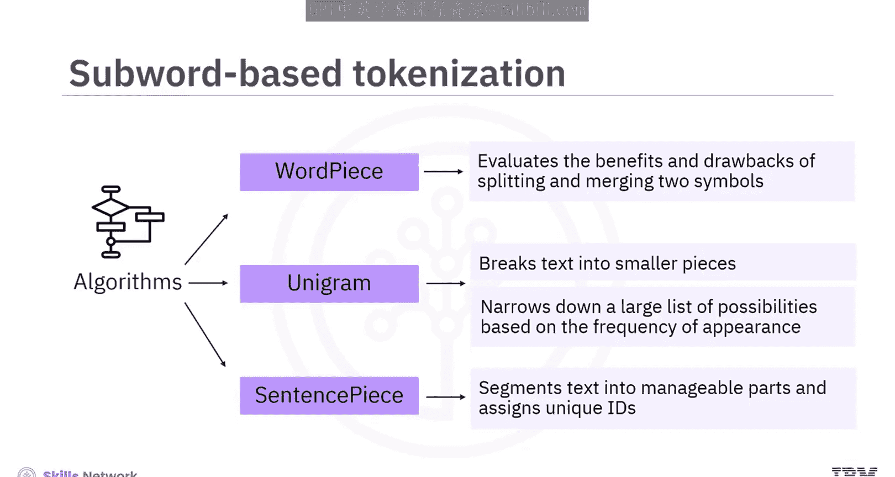

基于子词的分词结合了前两种方法的优点。它允许常用词保持不分割，同时将不常用词分解为有意义的子词。

有多种算法可以实现基于子词的分词，主要包括：

1.  **WordPiece算法**：该算法评估分割和合并两个符号的利弊，以确保其决策是有价值的。
2.  **Unigram算法**：该算法将文本分解成更小的片段。它从一个很大的可能性列表开始，然后根据它们在文本中出现的频率逐渐缩小范围，这是一个迭代的过程。
3.  **SentencePiece算法**：该算法将文本分割成可管理的部分，并为每个部分分配唯一的ID。

以下是使用不同算法的分词器代码示例：

**使用WordPiece算法的分词器示例（如BERT分词器）：**
```python
from transformers import BertTokenizer
tokenizer = BertTokenizer.from_pretrained(‘bert-base-uncased’)
tokens = tokenizer.tokenize(“playing”)
# 输出可能为：[‘play’， ‘##ing’]
# ‘##’符号表示该子词应附加到前一个词上，中间没有空格。
```

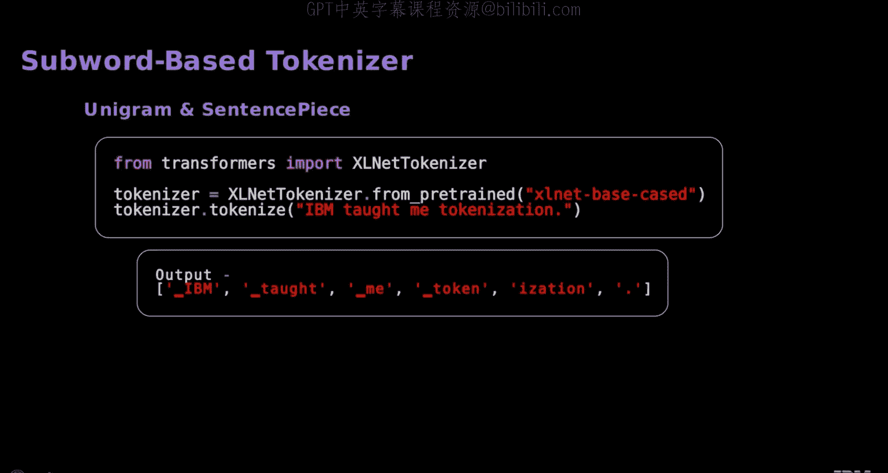

**使用Unigram和SentencePiece算法的分词器示例（如XLNet分词器）：**
```python
from transformers import XLNetTokenizer
tokenizer = XLNetTokenizer.from_pretrained(‘xlnet-base-cased’)
tokens = tokenizer.tokenize(“Hello world!”)
# 输出可能为：[‘Hello’， ‘▁world’， ‘!’]
# ‘▁’前缀表示该令牌是一个新词，在原始文本中前面有空格。
# ‘!’没有前缀，因为它直接跟在前面一个词令牌后面，原始文本中没有空格。
```

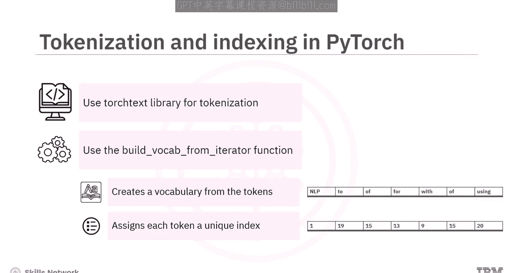

## 在PyTorch中进行分词与索引

上一节我们介绍了不同的分词算法，本节中我们来看看如何在PyTorch中具体实现分词并为令牌建立索引。在PyTorch中，你可以使用`torchtext`库将数据集中的文本分词成单词或子词。

使用`build_vocab_from_iterator`函数可以从这些令牌中创建一个模型能够理解的词汇表。该函数为词汇表中的每个令牌分配一个由整数表示的**唯一索引**。模型随后使用这些索引来映射词汇表中的单词。

以下是使用`torchtext`分词句子的示例步骤：

1.  创建一个用于演示的合成数据集。
2.  使用`get_tokenizer`函数获取分词器。
3.  将分词器应用于文本，得到令牌列表。
4.  定义一个`yield_tokens`函数，该函数接收数据迭代器，使用分词器处理每个文本，并逐个生成分词后的输出。
5.  创建一个迭代器`my_iterator`。
6.  使用`next(my_iterator)`语句从数据集中获取下一组令牌。
7.  最后，`build_vocab_from_iterator`函数将令牌转换为索引。

在构建词汇表时，有时会遇到未知词。你可以设置一个特殊令牌`<UNK>`，用于处理可能不在你词汇表中的单词。代码`vocab.set_default_index(vocab[‘<UNK>‘])`将`<UNK>`设为默认词。如果一个单词在词汇表中找不到，就会使用它。

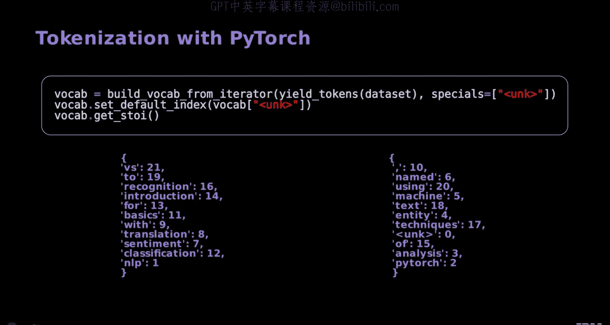

`vocab.get_stoi()`会给你一个字典，将单词映射到它们在词汇表中对应的数字索引。

你可以将`vocab`函数直接应用于令牌或令牌列表，结果是索引列表。考虑以下示例：

```python
def get_tokenized_sentence_and_indices(iterator， vocab):
    tokenized_sentence = next(iterator)
    token_indices = [vocab[token] for token in tokenized_sentence]
    return tokenized_sentence， token_indices

# 应用函数
sentence， indices = get_tokenized_sentence_and_indices(my_iterator， vocab)
print(“Tokens:”， sentence)
print(“Indices:”， indices)
```

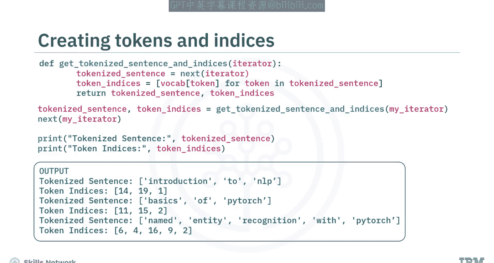

## 添加特殊令牌

在许多应用中，你需要添加特殊令牌。例如，使用SpaCy对每个句子进行分词后，你可以通过循环遍历输入数据中的句子，在分词后的句子开头附加`<BOS>`（序列开始），在结尾附加`<EOS>`（序列结束）。

随后，为了确保所有句子具有相同的长度（与输入句子中最长句子的长度匹配），你可以用`<PAD>`（填充）令牌来填充分词后的行。

## 总结

本节课中我们一起学习了**分词**的核心概念。

*   **分词**是将句子分解成更小片段（令牌）的过程。
*   **分词器**（如NLTK和SpaCy）用于生成这些令牌。
*   **基于词的分词**保留了语义，但会增加词汇表大小。
*   **基于字符的分词**词汇表小，但信息表达可能不完整。
*   **基于子词的分词**是一种折中方案，常用词保持完整，生僻词被分解。可以通过**WordPiece**、**Unigram**和**SentencePiece**等算法实现。
*   可以在分词后的句子中添加**特殊令牌**，如开头的`<BOS>`和结尾的`<EOS>`，以及用于统一长度的`<PAD>`令牌。

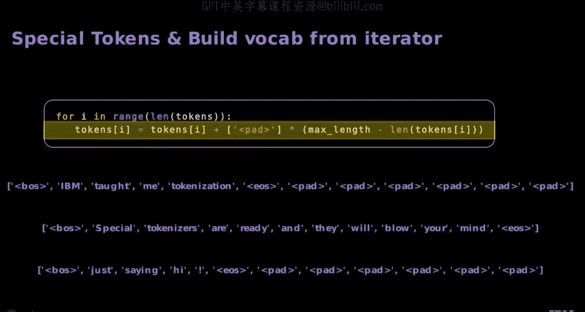

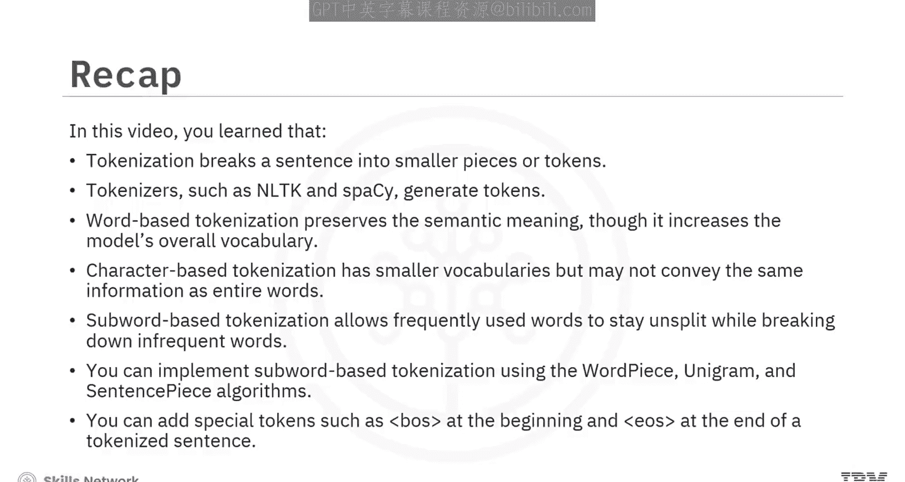

掌握这些基础知识，是后续构建更复杂自然语言处理模型的重要第一步。