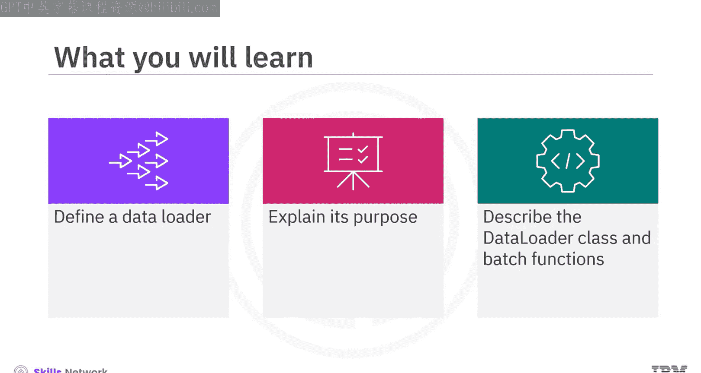
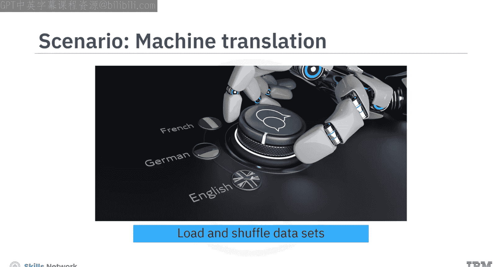
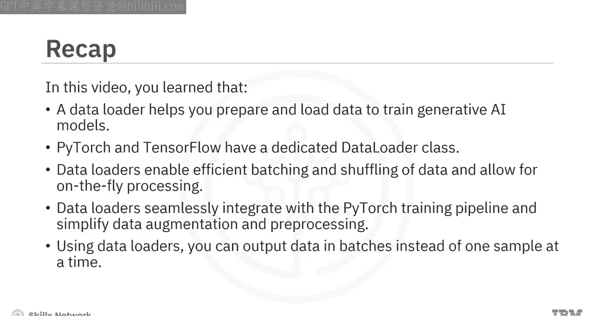

# 生成式人工智能工程：102：数据加载器概述 🧠

在本节课中，我们将要学习数据加载器的核心概念。你将了解数据加载器的定义、用途，以及如何在PyTorch框架中使用它来高效地管理和预处理数据，这对于训练生成式AI模型至关重要。

## 什么是数据加载器？

想象一下，你正在开发一个机器翻译应用，需要处理庞大的数据集。手动加载和打乱这些数据来训练底层的语言模型是一项挑战。如何才能高效地管理这个过程呢？

数据加载器可以帮助你准备和加载数据。像PyTorch这样的领先框架拥有一个专用的数据加载器类，你可以在训练生成式AI模型时使用它来处理和准备数据。

## 为什么需要数据加载器？

数据加载器在自然语言处理（NLP）任务中扮演着关键角色。以下是其主要优势：

以下是数据加载器的几个核心优势：

*   **高效的批处理和打乱**：这对于训练神经网络至关重要。
*   **动态预处理**：通过仅在训练时加载所需数据来优化内存使用。
*   **与训练流程无缝集成**：使模型的训练和评估更加容易。
*   **简化数据增强和预处理**：允许你对输入数据应用各种转换。

## PyTorch中的数据加载器

在PyTorch中，你将使用数据集（Dataset）和数据加载器（DataLoader）来进行高效的数据处理。数据集是数据样本及其标签的集合，是起点。

让我们考虑三个文本样本，任务是分类它们语法是否正确。你通常会将数据集划分为：
*   **训练集**：用于训练模型。
*   **验证集**：用于调整和验证模型参数。
*   **测试集**：用于评估模型在真实场景中的性能。

虽然“训练集”和“验证集”有时可以互换使用，但它们在模型训练和评估中具有不同的功能。

## 创建自定义数据集和数据加载器

这个例子展示了如何在PyTorch中创建自定义数据集并使用数据加载器类。数据集由一系列随机句子组成，目标是生成句子批次以供进一步处理（例如训练神经网络模型）。

以下是创建自定义数据集的关键步骤：

1.  **定义自定义数据集类**：它继承自 `torch.utils.data.Dataset` 类。
2.  **实现三个核心方法**：
    *   `__init__`：用句子列表初始化数据集。
    *   `__len__`：返回样本数量。
    *   `__getitem__`：根据索引 `idx` 检索一个项目（这里是一个句子）。

创建数据集对象后，你可以像访问列表一样访问样本。

使用数据加载器，你可以批量输出数据，而不是一次一个样本。数据加载器是PyTorch中的一个迭代器对象，用于从数据集中加载、打乱和批处理数据，便于对样本组进行训练。

迭代器是一个可以循环遍历的对象。它包含可迭代的元素，通常包括 `__iter__` 和 `__next__` 方法。你通常使用迭代器来遍历大型数据集。每次调用 `next` 函数，它都会返回新的样本批次。

接下来，你通过传入句子列表来创建自定义数据集的实例。此外，你指定一个**批大小**，它决定了在数据加载过程中每个批次将包含多少个句子。

然后，你可以通过将自定义数据集和批大小提供给 `torch.utils.data.DataLoader` 类来创建数据加载器。此外，你可以设置 `shuffle=True` 来在句子被分成批次之前随机打乱它们。这种打乱对于训练深度学习模型特别有用，因为它可以防止模型根据数据顺序学习模式。

最后，遍历数据加载器以查看数据是如何批量加载的。

## 批处理函数与数据转换

在大多数NLP应用中，大部分数据转换是在批处理函数中执行的。你可以使用数据加载器对输入文本数据进行各种转换。这些转换包括：
*   对文本进行**分词**。
*   将其**数字化**。
*   将其**调整**到一致的大小。
*   将其**转换**为张量。

这些预处理步骤确保数据被准备成适合深度学习模型处理和解释的格式。

代码使用 `get_tokenizer` 函数定义分词器，选项为“basic_english”。接着，它使用 `build_vocab_from_iterator` 函数从句子中构建词汇表。该函数从分词的句子中构建词汇表。

分词输入数据后，序列的长度可能不一致。数据加载器中的每个样本必须具有相同的长度。因此，你需要使用**填充**。你可以利用PyTorch中的 `pad_sequence` 函数，它将批次中的序列填充到与最长序列相同的长度。

*   `padding_value=0` 参数指定用于填充的值。
*   `batch_first` 参数确保批次维度是输出张量中的第一个维度。

当 `batch_first` 设置为 `True` 时，输出张量中的第一个维度将代表批大小。相反，如果 `batch_first` 使用默认值 `False`，则输出张量中的第一个维度将代表序列长度，批大小将成为第二个维度。

为了保持原始数据集不变，你可以在整理函数中处理数据转换。你也可以选择利用整理函数来执行诸如分词、将分词索引转换为数字以及将结果转换为张量等任务。

让我们看一个执行这些任务的自定义整理函数的例子。代码定义了一个名为 `collate_fn` 的自定义整理函数。在该函数内部：
1.  使用分词器函数对批次中的每个样本进行分词。
2.  使用词汇表将分词映射为数字。
3.  将 `pad_sequences` 函数应用于张量批次，以填充批次内的序列，使其具有相等的长度。

现在，你可以使用这个整理函数和自定义数据集来创建数据加载器。

## 总结

本节课中，我们一起学习了数据加载器的相关知识。数据加载器帮助你准备和加载数据以训练生成式AI模型。PyTorch和TensorFlow都有专用的数据加载器类。数据加载器支持高效的批处理和打乱，并允许动态处理。它们能与PyTorch训练流程无缝集成，并简化数据增强和预处理。使用数据加载器，你可以批量输出数据，而不是一次一个样本。