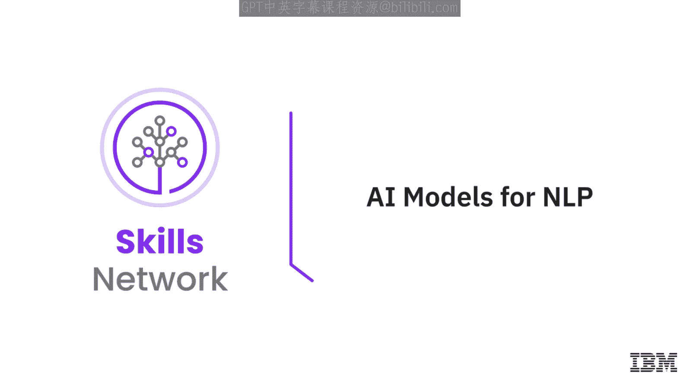
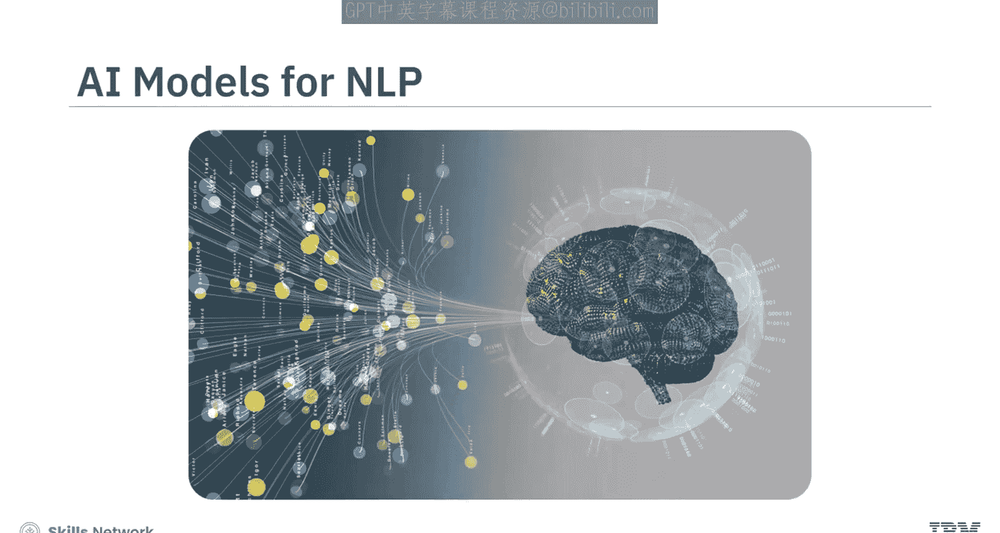
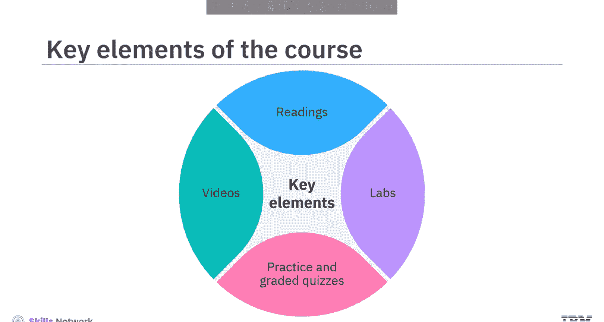
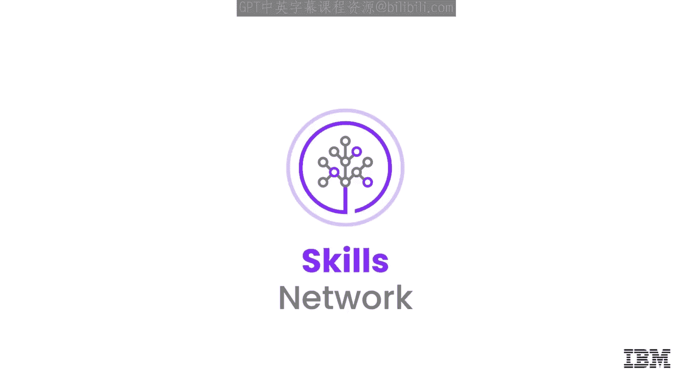

# 生成式人工智能工程：103：课程介绍 🚀

在本节课中，我们将要学习IBM《生成式人工智能工程》课程的第103节内容。本节是课程的介绍部分，将概述课程的整体结构、学习目标、适用人群以及学习方法，为你开启自然语言处理与AI模型开发的旅程做好准备。

欢迎来到这门关于自然语言处理（NLP）AI模型的课程。在这里，你将学习NLP和AI模型开发的各个方面。

本课程适合现有的和有抱负的数据科学家、机器学习工程师、深度学习工程师和AI工程师。具备Python和PyTorch的基础知识，以及对机器学习和神经网络的了解将是一个优势，但并非严格要求。

完成本课程后，你将能够描述语言理解的基础知识，包括将词语转换为特征以及文档分类预测。你还将能够解释NLP模型和技术，包括N-gram、Word2Vec和序列到序列模型。此外，你将使用PyTorch来构建、训练和实现NLP模型。

---

## 课程模块概览 📚

上一节我们介绍了课程的整体目标，本节中我们来看看课程的具体模块安排。

课程内容经过精心设计，以促进学习。视频简短且专注于主要主题。阅读材料主要以文本格式提供详细内容。实验提供了技术环境、详细说明和代码片段，供你完成动手练习。练习和分级测验将帮助你应用所学知识并评估你的掌握程度。

以下是课程的主要模块内容：

*   **模块1：从词语到特征与文档分类**
    *   你将学习如何使用**独热编码**、**词袋模型**、**词嵌入**和**嵌入包**将词语转换为特征。
    *   你还将学习神经网络如何用于文档分类的预测、训练和优化。
    *   该模块将使你深入了解**N-gram语言模型**的应用。
    *   在动手实验练习中，你将在Jupyter环境中使用PyTorch构建并训练一个简单的神经网络语言模型。

*   **模块2：词嵌入与序列模型**
    *   你将学习**Word2Vec词嵌入模型**的类型和特点。
    *   你还将了解在NLP和序列转换任务中使用**序列到序列模型**的目的。
    *   此外，本模块将引导你完成评估生成文本质量的过程。
    *   在动手实验练习中，你将开发并集成预训练的词嵌入模型。

---

## 学习方法与建议 💡

为了从课程中获得最大收益，请观看所有视频，完成实验以练习新技能，并尝试完成所有测验。

让我们开始这段激动人心的旅程。

---

本节课中我们一起学习了IBM《生成式人工智能工程》第103节课程的介绍。我们了解了课程的目标是掌握NLP基础与AI模型开发，明确了适合的学习者群体，预览了从词语特征提取到高级序列模型的两个核心模块，并获得了高效学习本课程的具体建议。准备好开始你的学习之旅吧！