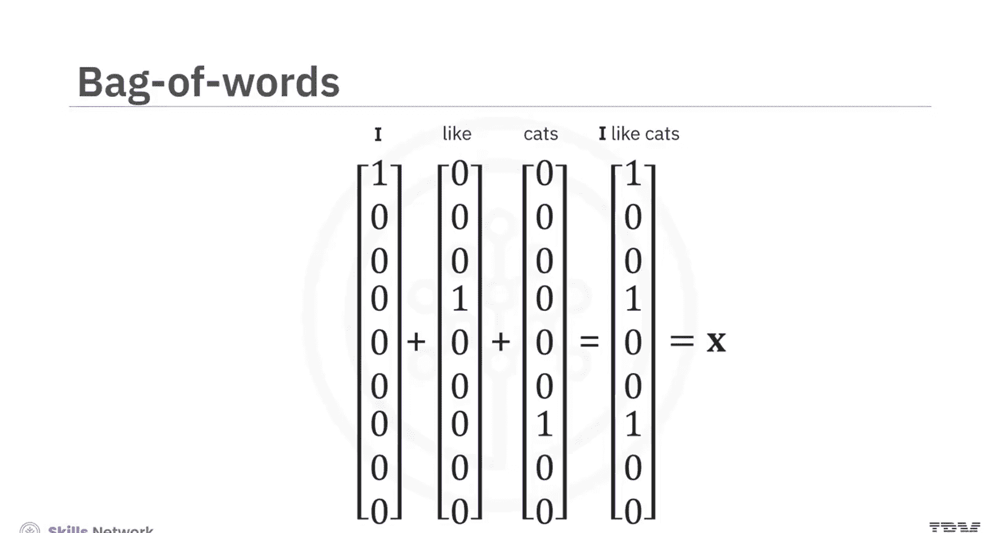
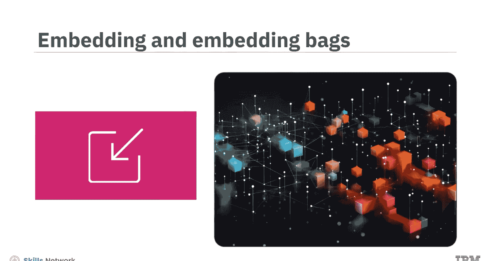
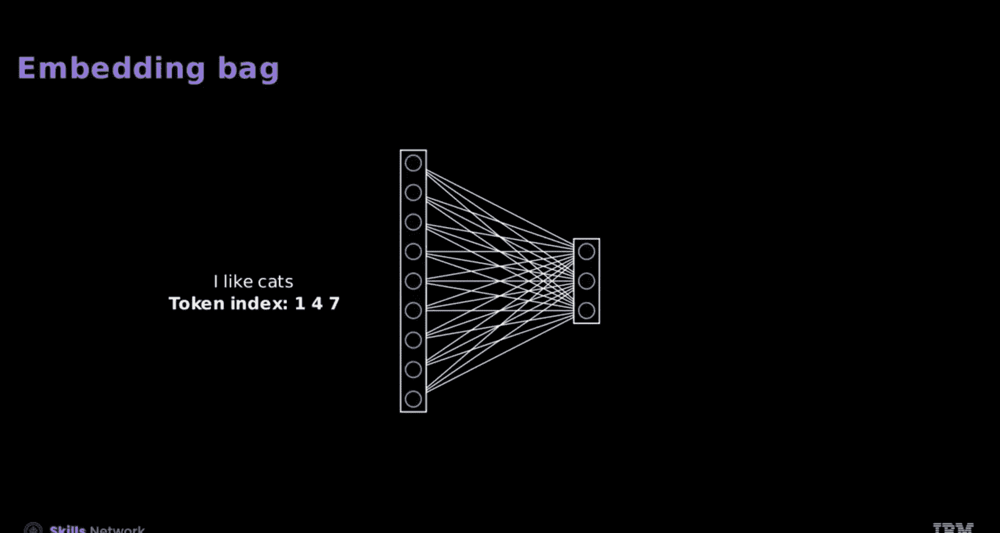

# 生成式人工智能工程：104：将单词转换为特征 🧠

在本节课中，我们将学习如何将文本中的单词转换为机器学习模型能够处理的数值特征。这是构建自然语言处理应用的基础步骤。

## 概述

假设你正在开发一个用于分类邮件的自然语言处理应用。你可以根据邮件中特定单词的出现、频率或上下文含义来对邮件进行分类。为了实现这个功能，必须将单词转换为数值特征。本节我们将探讨几种关键方法：独热编码、词袋模型、嵌入和嵌入袋。

## 从独热编码到词袋模型

上一节我们提到了将文本转换为数值的必要性。本节中，我们来看看最基础的转换方法。

考虑以下示例句子：
*   I like cats.
*   I hate dogs.
*   I'm impartial to hippos.

在机器学习中，这样的句子集合、文档或序列通常被称为**语料库**或**数据集**。为了使用神经网络识别句子主题（猫、狗或河马），输入必须被翻译成神经网络能理解的数字。

**独热编码**是一种将分类数据转换为神经网络可以理解的特征向量的方法。

以下是独热编码的表示方式：

| 标记索引 | 标记 | 独热编码向量 |
| :--- | :--- | :--- |
| 0 | I | `[1, 0, 0, 0, 0, 0, 0, 0, 0]` |
| 1 | like | `[0, 1, 0, 0, 0, 0, 0, 0, 0]` |
| 2 | cats | `[0, 0, 1, 0, 0, 0, 0, 0, 0]` |
| ... | ... | ... |
| 7 | cat | `[0, 0, 0, 0, 0, 0, 0, 1, 0]` |

向量的维度与词汇表中的单词数量相对应，而标记索引决定了向量中哪个元素被设置为1。

*   标记 “I” 的向量中，所有元素都为0，除了对应“I”的那个元素。这就是单词“I”的特征 `X`。
*   标记 “like” 以类似方式表示。你可以观察到一个模式。
*   标记 “cats” 也以类似方式表示，依此类推。

你可以将文档中的每个标记表示为一个向量。那么，如何使用这些向量来描述整个文档或序列呢？

**词袋模型**表示法将一个文档描绘为其所有独热编码向量的聚合或平均值。

对于句子 “I like cats”，你需要组合“I”、“like”和“cats”的独热向量。具体做法是将这些向量相加。

`X` 向量就是 “I like cats” 的词袋向量。

## 理解嵌入与嵌入袋

了解了基础的向量表示后，我们来看看更高效、更强大的方法：嵌入。

考虑一个用于对之前关于猫、狗或河马的句子进行分类的神经网络。你输入词袋向量，并选择与“猫”关联度最高的输出值。接下来，你将了解嵌入层和嵌入袋层如何有效地替代这个初始的线性层。

让我们看看隐藏层。当我们输入单词“cat”的独热向量（一个除了第七个位置为1其余全为0的向量）时，隐藏层中的激活值对应于第七个神经元的参数。

与其使用独热编码向量，你可以用一个标记索引（在这个例子中是7）来替代它。输出结果与独热向量相同。接受这个索引的层被称为**嵌入层**，其输出就是**嵌入向量**。

此处的嵌入权重组合起来形成一个**嵌入矩阵**。

矩阵的列数就是**嵌入维度**。每一行代表一个单词。

与独热编码向量相比，嵌入向量通常具有更低的维度。降低维度可以简化模型的计算需求。

当你将一个词袋向量输入到神经网络的隐藏层时，输出结果就是所有嵌入向量的总和。也可以将嵌入视为嵌入矩阵中的一行，并标记它们所代表的单词。

这个过程包括将所有来自词袋的向量相加，然后将结果与嵌入矩阵相乘。

与其手动进行这些操作，你可以使用一个**嵌入袋层**。输入仅仅是每个标记的索引，输出就是所有单词嵌入的总和（或平均值）。

## 在 PyTorch 中使用嵌入与嵌入袋

理解了概念之后，我们来看看如何在 PyTorch 中具体实现它们。

首先，你需要获取标记。从数据集和词汇表中初始化分词器和迭代器。`input_ids` 函数对每个数据样本进行分词并生成索引。这些索引存储在列表 `index` 中，列表中的每个元素对应不同文档的索引。

以下是初始化嵌入层的步骤：

1.  你可以初始化嵌入层，并指定嵌入的维度大小。
2.  接下来，确定词汇表中唯一标记的数量。
3.  现在，使用 `nn.Embedding` 创建嵌入层 `embeds`。

你应用这个嵌入对象。输入是短语 “I like cats” 的索引，以检索其嵌入。你将看到一个 PyTorch 张量表示，这个张量中的每一行分别对应单词 “I”、“like” 和 “cats” 的嵌入。

你可以使用索引检索最后一个数据样本 “I‘m impartial to hippos” 的嵌入。结果是一个 PyTorch 张量，每一行对应每个单词的嵌入。

初始化嵌入袋层与初始化嵌入层几乎相同。

让我们使用索引输出第一个文档的嵌入袋。你可以访问 “I like cats” 的嵌入。结果是一个 PyTorch 张量，代表所有嵌入的总和（或平均值）。对于单个样本，`offset` 参数始终为零。

## 处理偏移参数

在自然语言处理中，数据集通常被表示为一维张量。然而，在使用嵌入袋和其他应用时，识别每个文档的起始位置至关重要。

让我们用我们的样本数据集深入探讨这一点。

1.  你使用 `cat` 函数将各个文档的张量组合起来，并设置 `index`。
2.  **偏移参数** 记录了每个文档的起始位置。
3.  你可以计算每个样本中的标记数量。这一步有助于精确定位初始位置。
4.  使用累积求和方法，你可以累加长度，从而确定每个序列的起始位置。

你使用 `embedding bag` 函数以及 `offset` 参数，就像使用索引张量一样。结果就是每个独立文档的嵌入袋，即其单词嵌入的平均值。

## 总结

本节课中，我们一起学习了独热编码、词袋模型、嵌入和嵌入袋。

*   **独热编码**将分类数据转换为特征向量。
*   **词袋模型**表示法将一个文档描绘为其所有独热编码向量的聚合或平均值。
*   当你将一个词袋向量输入到神经网络的隐藏层时，输出就是所有嵌入向量的总和。
*   在 PyTorch 中，`Embedding` 和 `EmbeddingBag` 类用于实现嵌入和嵌入袋功能。

