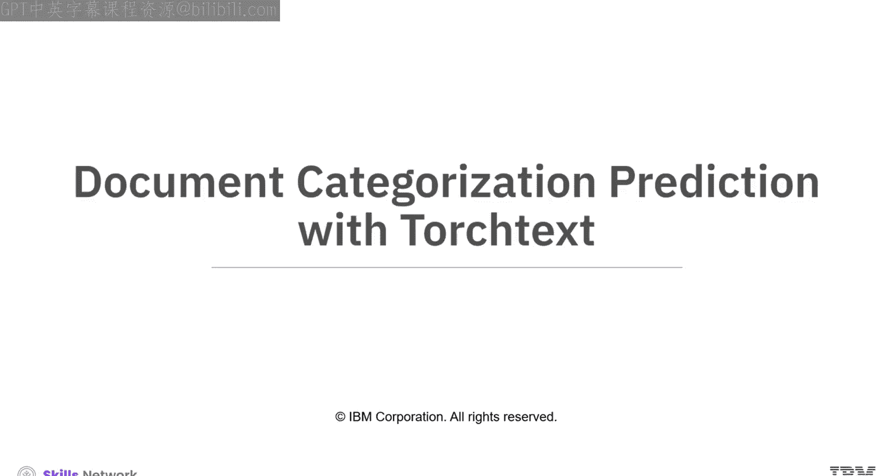
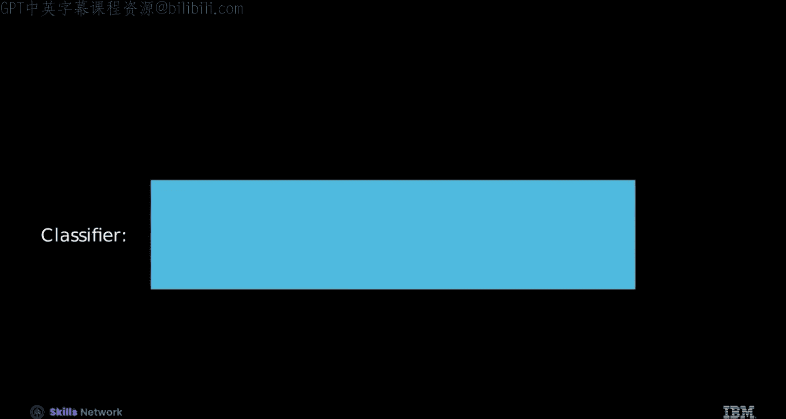
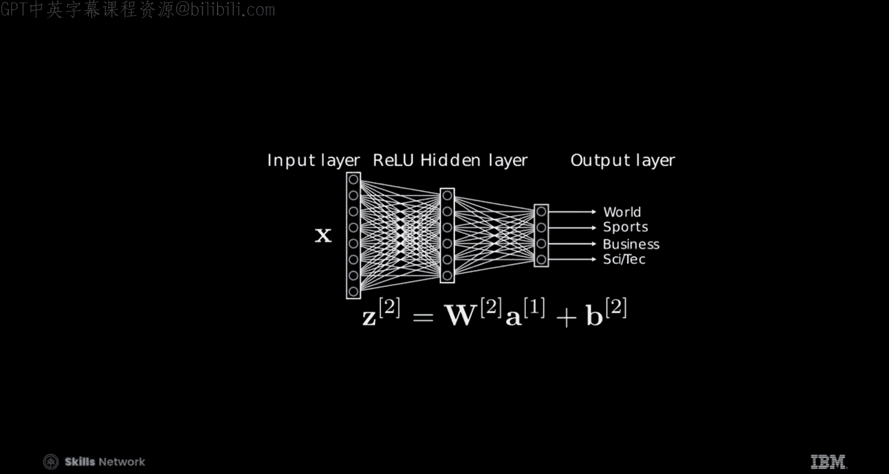
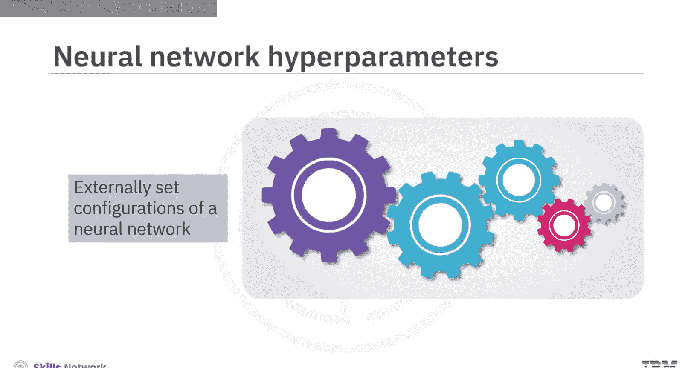
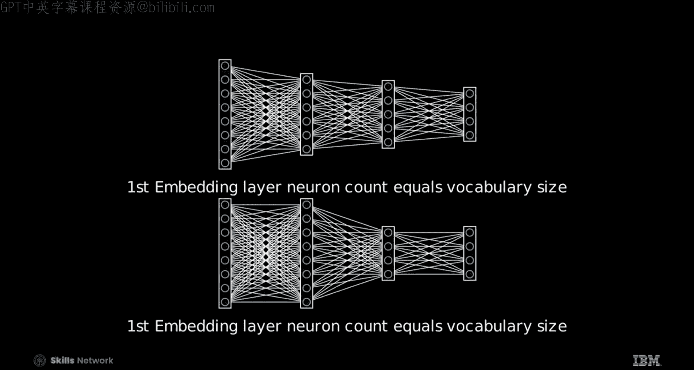

# 生成式人工智能工程：105：使用TorchText进行文档分类预测 📄



在本节课中，我们将学习如何使用PyTorch和TorchText库来构建一个文档分类器。我们将从理解神经网络的基本概念开始，逐步深入到如何设置模型架构、处理数据并进行预测。

## 概述



文档分类器通过分析文本内容，能够自动将文章归类到预定义的类别中，例如科技、体育或商业。本节课将介绍神经网络的核心原理，并指导你使用PyTorch创建一个简单的分类模型。

## 神经网络回顾 🧠

上一节我们介绍了文档分类的概念，本节中我们来看看实现分类的核心工具——神经网络。

神经网络是一个数学函数，由一系列矩阵乘法和其他函数组合而成。它从输入层开始，例如一个词袋向量。在该层中，会进行矩阵乘法，有时还会加上一个偏置项，这构成了隐藏层。


如果输入使用词袋模型，该层被称为嵌入层，其输出被称为逻辑值。随后，对每个逻辑值应用一个激活函数，这个过程称为激活，其中每个元素被称为神经元。有时，嵌入层不会应用激活函数或添加偏置。

该操作会重复进行，执行另一次矩阵乘法，每个结果元素再次被称为神经元。通过这个迭代过程，输入数据被逐步转换，使网络能够学习分类。网络在训练期间调整的参数被称为可学习参数。

**核心公式**：神经网络的前向传播可以抽象表示为一系列变换：`输出 = 激活函数(权重 * 输入 + 偏置)`。

## 分类过程与Argmax函数 🎯

在文章分类中，我们将一个嵌入向量输入网络。对于每个类别，神经网络输出一个逻辑值向量，其中每个逻辑值是一个分数，反映文章属于特定新闻类别的可能性。

为了确定文章的类别，需要将输出层的逻辑值输入到Argmax函数中。Argmax函数会找出最高逻辑值对应的索引，该索引对应于最可能的类别。

**核心代码**：在PyTorch中，可以使用 `torch.argmax(output, dim=1)` 来获取每个样本的预测类别索引。

## 神经网络架构图解 🏗️

下图展示了一个神经网络的架构。每个圆圈代表一个神经元。从左开始，第一个框中的每个神经元对应输入向量或输入层中的一个元素，连接线代表权重矩阵。每个后续层级的神经元表示隐藏层和输出层的组成部分。经过激活函数处理后，得到隐藏层值，记为Z。最后一层的连接体现了通向输出的权重，每个神经元反映四个输出类别（例如：世界、体育、商业、科技）中的一个。之后使用Argmax函数找到得分最高的类别。

## 神经网络超参数 ⚙️

上一节我们介绍了网络的基本结构，本节中我们来看看如何配置它。超参数是神经网络外部设置的配置。

以下是主要的超参数类型：





*   **隐藏层数量**：架构中隐藏层的数量可以变化。例如，一个网络可能有一个隐藏层，而另一个可能有两个，每个都馈入下一个。请注意，输入层就是输入向量本身，因此我们通常关注具有一个隐藏层的架构。
*   **每层神经元数量**：可以调整每层中的神经元数量。例如，一个网络的第二个隐藏层可能由五个神经元组成，而另一个网络可能包含四个。如果第一个隐藏层是嵌入层，那么神经元数量对应于词汇表大小。输出层的神经元数量始终等于类别数量。

层数和神经元数量都可以通过经验或验证数据来选择。

## 使用PyTorch构建神经网络 🛠️

现在，让我们动手在PyTorch中创建一个神经网络。我们将使用TorchText中的AG News数据集。

首先，设置标准文本处理流程。需要调整函数，使标签编号从0开始。

接下来，为嵌入袋设置一个批处理函数，并添加代码将每个样本的标签附加到批次中。然后，创建一个批量大小为3的数据加载器。

以下是数据处理的关键步骤：



1.  **加载数据**：使用TorchText加载AG News数据集，输出包含代表新闻文章的文本及其对应的类别标签。
2.  **查看样本**：每个样本有三个标签，旁边是词元索引，这些索引构成了词袋模型的基础。观察这些索引的相对位置对于构建词袋模型至关重要。
3.  **定义模型**：模型的架构在构造函数中定义了两个主要层。第一层是嵌入袋层，接着是全连接层。权重的初始化也在此完成。
4.  **前向传播**：在前向传播过程中，将输入文本和偏移量送入嵌入袋层（不应用激活函数），然后馈入全连接层以产生最终输出。

**核心代码**：模型定义示例
```python
import torch.nn as nn

class TextClassificationModel(nn.Module):
    def __init__(self, vocab_size, embed_dim, num_class):
        super().__init__()
        self.embedding = nn.EmbeddingBag(vocab_size, embed_dim, sparse=False)
        self.fc = nn.Linear(embed_dim, num_class)

    def forward(self, text, offsets):
        embedded = self.embedding(text, offsets)
        return self.fc(embedded)
```

现在，使用指定的词汇表大小、嵌入维度和输出类别数量来创建文本分类模型的实例。

## 进行预测 🔮

使用文本索引和偏移量进行预测，并分配预测标签。

首先，查看PyTorch中的逻辑值。每一行代表一个不同的样本，列对应于每个类别的逻辑值。与之前行向量的例子不同，这里按列组织。

然后，对每一行应用Argmax函数。这可以识别出每行中的最大值。这个最大值的位置表明了样本0、1和2的预测类别。

预测函数处理真实文本的流程如下：它首先接收分词后的文本，通过处理流程处理文本，模型预测类别，然后输出值最高的标签作为预测类别。

当你应用该函数时，文章被归类到体育类别。在实验环境中尝试可能会产生不同的结果，因为模型尚未经过训练。

## 总结

本节课中我们一起学习了以下内容：

*   文档分类器通过分析文本内容，能够无缝地对文章进行分类。
*   神经网络是一个由一系列矩阵乘法和其他函数组成的数学函数。
*   Argmax函数用于识别最高逻辑值对应的索引，该索引对应于最可能的类别。
*   超参数是神经网络外部设置的配置。
*   预测函数处理真实文本的流程是：接收分词文本，通过流程处理，模型预测类别。


通过理解这些概念和步骤，你已经掌握了使用PyTorch和TorchText构建基础文档分类器的方法。