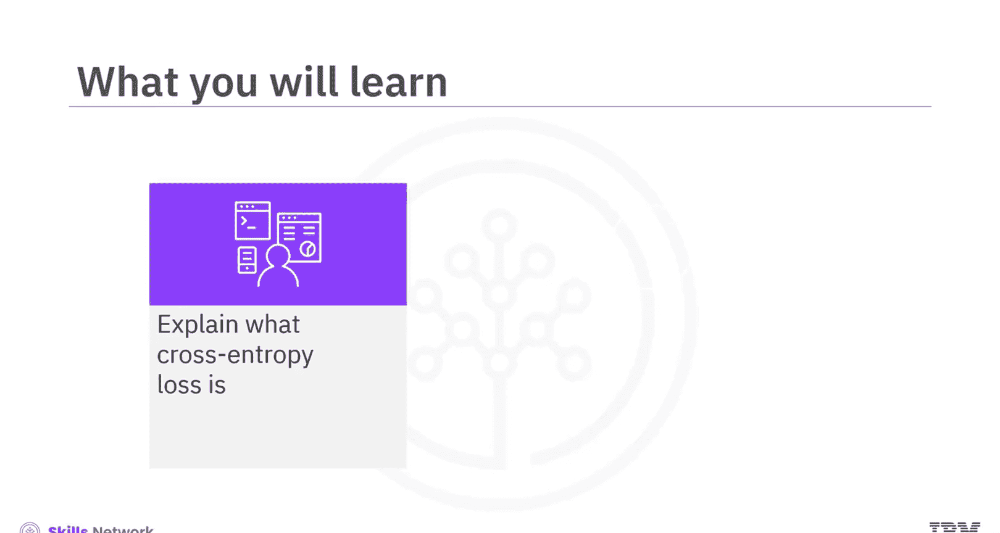
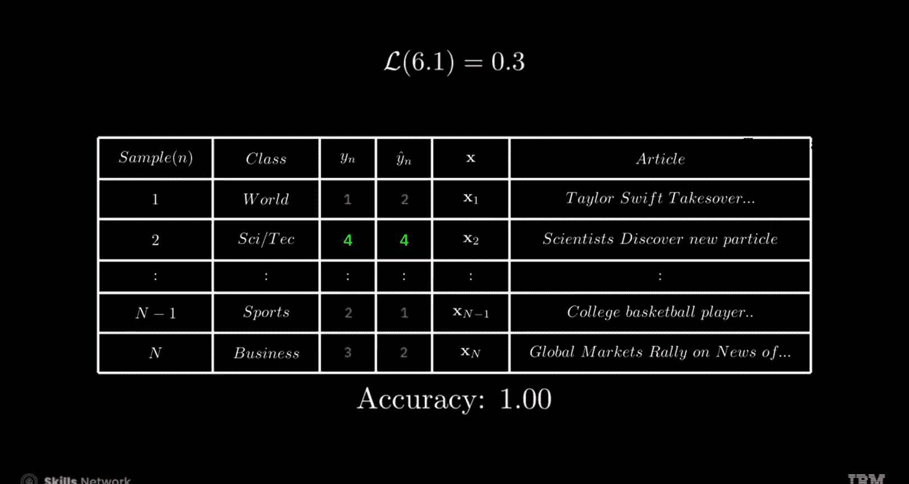
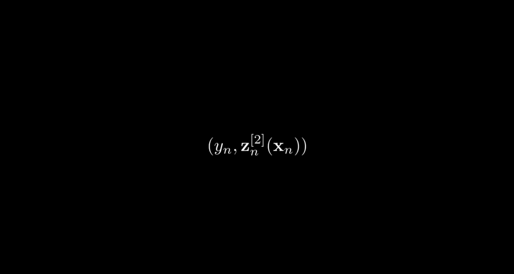
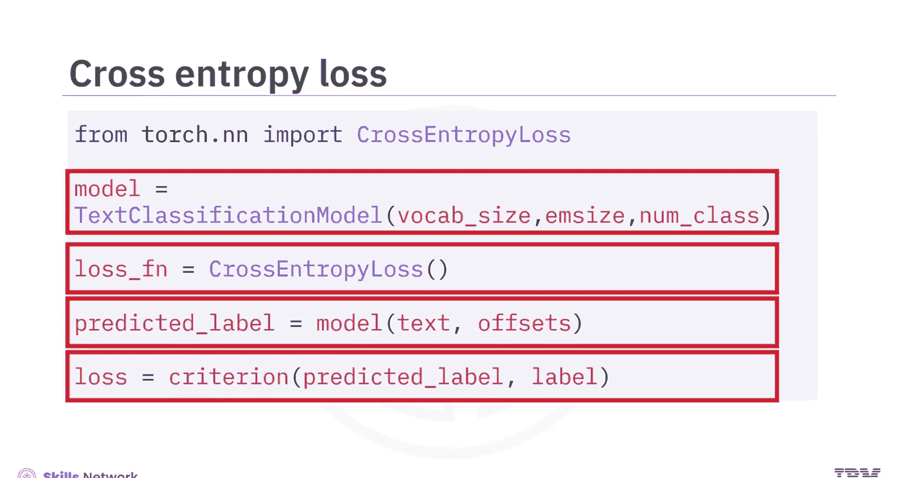
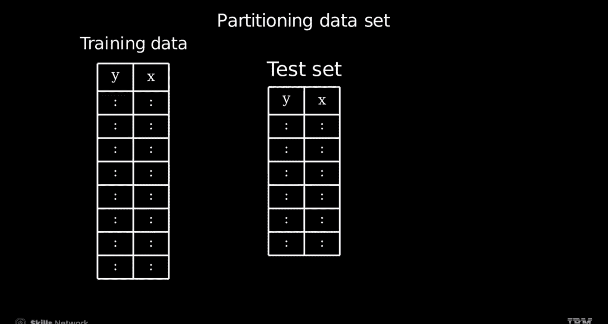

# 生成式人工智能工程：106：使用TorchText进行文档分类训练

在本节课中，我们将学习如何使用TorchText进行文档分类模型的训练。我们将重点理解交叉熵损失函数的概念，并掌握如何通过优化过程来降低模型损失，从而提升分类性能。

## 🧠 神经网络与可学习参数

神经网络通过一系列矩阵和向量运算进行工作，这些运算中的权重和偏置被称为**可学习参数**。一个网络可能拥有数百万到数万亿个这样的参数。在数学表示中，我们通常用符号 **θ** 来统称这些参数。

在神经网络训练中，我们的目标就是通过调整这些可学习参数来提升模型性能。这个过程由一个称为**损失函数**的指标来引导，它用于衡量模型预测的准确性。我们的核心目标是找到一组最优的参数值 **θ***，使得模型预测输出 **ŷ** 与实际标签 **y** 之间的差异最小化。

由于我们只关心参数，因此损失函数可以明确地表示为 **L(θ)**。虽然“损失”和“成本”这两个术语经常互换使用，但为了与PyTorch框架保持一致，我们将统一使用“损失”。

## 📊 理解损失与准确率

为了直观理解，我们来看一个例子。下图比较了神经网络预测的标签 **ŷ** 与实际标签 **y**。




图中，正确的预测用绿色表示，错误的预测用红色表示。初始模型的准确率仅为20%。我们的目标是通过调整参数 **θ** 来降低损失，从而提高准确率。随着参数的调整，损失会减少，真实标签 **y** 与预测标签 **ŷ** 会逐渐对齐（绿色部分增加），模型的准确率也会随之提升，这是性能改善的积极信号。

## 🔍 交叉熵损失：寻找最佳参数

上一节我们介绍了损失函数的目标，本节中我们来看看如何具体计算损失，特别是使用交叉熵损失来寻找最佳参数。




首先，回忆一下模型的工作流程：我们将一个嵌入向量输入网络，对于每个新闻类别，神经网络会输出一个**逻辑值向量**。每个逻辑值都是一个分数，反映了文章属于某个特定新闻类别的可能性，如下所示。


相关的表格将向量元素与类别关联起来：第一个是世界新闻，接着是体育、商业以及科学与技术。


这些逻辑值通过 **softmax函数** 转换为概率。这个过程在给定输入 **X** 的情况下，计算预测类别 **ŷ** 属于某个特定类别的概率。具体公式如下：

**公式：softmax(z_i) = exp(z_i) / Σ_j exp(z_j)**

每个逻辑值被指数化以确保为正数，然后对所有逻辑值的和进行归一化。这就为每个预测类别创建了一个条件概率分布。给定一个样本 **X**，它属于“世界”、“体育”、“商业”、“科技”类别的概率如下图所示。softmax变换在增强不同类别分数之间的区分度方面起着关键作用。

真正的概率分布 **Y** 如下图所示，每个条形代表 **y** 等于0、1、2、3的概率。

我们首先评估真实分布（即 **P(y)**）与条件分布（即 **P(y|X, θ)**）之间的期望值差异。我们不是简单地计算差值并平方，而是在求差之前对两个分布应用对数，这种方法称为 **KL散度**。在KL散度的表达式中，只有第二项依赖于参数 **θ**，这一项就被称为**交叉熵损失**。

现在的问题是如何计算 **y** 的分布。这里我们可以应用一个有用的技巧：我们可以使用分布 **P(z)** 来计算一个函数的期望值。然而，如果分布未知，我们可以通过对一组样本应用该函数并求平均值来估计它，这种技术被称为**蒙特卡洛采样**。

蒙特卡洛采样可用于近似真实的交叉熵损失，通过对样本 **X** 和 **y** 的函数输出求平均值，如下所示。我们可以使用softmax函数计算条件分布。需要注意的是，在实际操作中通常使用数据批次，而不是所有样本。

在PyTorch中，损失函数利用网络的输出逻辑值 **Z**（作为 **ŷ** 的代理）以及真实标签 **y** 进行计算。

## ⚙️ 在PyTorch中实现交叉熵损失

理解了交叉熵的原理后，接下来我们看看如何在PyTorch中具体实现它。

在PyTorch中，首先导入交叉熵损失模块，然后定义一个文本分类模型，接着创建一个交叉熵损失对象。

**代码示例：**
```python
import torch.nn as nn



# 定义模型（此处为示例，需根据实际架构定义）
model = TextClassificationModel(...)
# 定义损失函数
criterion = nn.CrossEntropyLoss()

# 在训练循环中
logits = model(input_batch) # 模型计算逻辑值
loss = criterion(logits, true_labels) # 计算损失
```

模型为给定输入计算逻辑值，然后通过PyTorch的交叉熵损失函数，将这些预测值与真实标签进行比较来计算损失。

## 🎯 优化：最小化损失的方法



我们已经定义了损失函数来衡量模型的好坏，本节中我们将学习如何通过优化来最小化这个损失。

**梯度下降方程**是减少模型损失的关键。以下是其分解步骤：

**公式：θ_{k+1} = θ_k - η * ∇L(θ_k)**

为了将参数从当前的 **θ_k** 更新到下一个 **θ_{k+1}**，我们使用当前参数值，向最小损失点“挪动”一小步。
*   **学习率 η** 设定了我们的步长大小。
*   **损失函数的梯度 ∇L(θ)** 指向损失变化最剧烈的方向。

通过沿着这个梯度的反方向移动，我们可以微调参数，从而在每一步中减少损失。

现在，让我们观察这个过程是如何展开的。梯度下降从一个初始的随机参数猜测开始，记为 **k=0**。在第一次迭代（即 **k=1**）中，我们使用损失函数的梯度（乘以学习率0.1）来调整参数，并将其加到 **k=0** 时的参数上，然后计算损失。对 **k=2** 重复此过程，更新参数并重新计算损失，损失会逐步减少。这种迭代优化持续进行，每一步都降低损失并提高模型准确率。

下图描绘了一个二维损失函数曲面，以及一个选定的起点。算法通过迭代微调参数，朝着最小损失点前进，可视化效果为红点沿着白色轨迹线向下移动，最终收敛到损失最低点。


在实际应用中，神经网络拥有数百万参数，会导致如这里所示的复杂损失曲面。损失可能急剧上升或快速下降。存在许多减少损失的策略，统称为**优化方法**。这些策略的细节在此不赘述，我们将其统称为改进优化或训练的方法。

## 📈 数据划分与PyTorch优化流程

通常，我们需要将数据集划分为三个子集：
*   **训练数据**：用于模型学习。
*   **验证数据**：用于调整超参数。
*   **测试数据**：用于评估模型在真实场景下的性能。

在本案例中，我们已经预先确定了超参数，因此当前的重点必须放在测试数据上。




以下是PyTorch中典型的优化流程步骤：

1.  **初始化优化器**：首先为模型参数初始化一个随机梯度下降（SGD）优化器，并设置学习率（LR）为0.1。
2.  **学习率调度器**：可以定义一个调度器，在每个训练周期（epoch）后按因子（gamma）降低学习率，这有助于优化过程。
3.  **清零梯度**：在每次迭代前，将待更新变量（即可学习权重）的梯度重置为0。
4.  **前向传播与计算损失**：模型进行预测并计算损失。
5.  **反向传播**：调用 `.backward()` 函数计算损失的导数（梯度）。
6.  **梯度裁剪**：应用梯度裁剪以防止梯度爆炸，从而改善优化稳定性。

**代码示例：**
```python
import torch.optim as optim

optimizer = optim.SGD(model.parameters(), lr=0.1)
scheduler = optim.lr_scheduler.StepLR(optimizer, step_size=1, gamma=0.9)

# 训练循环内
optimizer.zero_grad() # 清零梯度
loss = criterion(model_output, labels) # 计算损失
loss.backward() # 反向传播，计算梯度
torch.nn.utils.clip_grad_norm_(model.parameters(), max_norm=1.0) # 梯度裁剪
optimizer.step() # 更新参数
scheduler.step() # 更新学习率
```

## 🎓 总结

在本节课中，我们一起学习了使用TorchText进行文档分类训练的核心概念：

1.  **神经网络基础**：神经网络通过可学习参数（θ）进行矩阵和向量运算。训练的目标是调整这些参数以提升性能。
2.  **损失函数**：损失函数 **L(θ)** 是衡量模型预测 **ŷ** 与真实标签 **y** 之间差异的准确性指标，指导优化方向。
3.  **交叉熵损失**：我们使用交叉熵损失来寻找最佳参数。对于未知的真实分布，我们使用**蒙特卡洛采样**技术，通过对一组样本的函数应用求平均值来估计损失。
4.  **优化过程**：使用**优化方法**（如梯度下降）来最小化损失。关键公式为 **θ_{k+1} = θ_k - η * ∇L(θ_k)**。
5.  **工作流程**：预测函数处理真实文本的流程是：接收分词后的文本，通过处理管道，最终模型预测出类别。
6.  **数据划分**：通常应将数据集划分为**训练集**（用于学习）、**验证集**（用于调参）和**测试集**（用于最终性能评估）三个子集。

通过掌握这些概念和步骤，你已经为使用TorchText构建和训练自己的文档分类模型奠定了坚实的基础。


