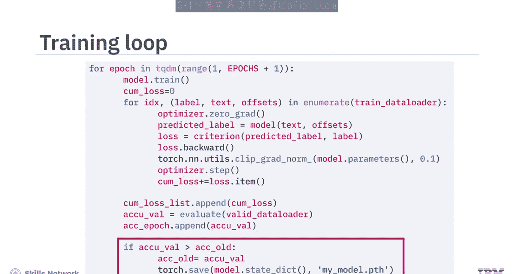
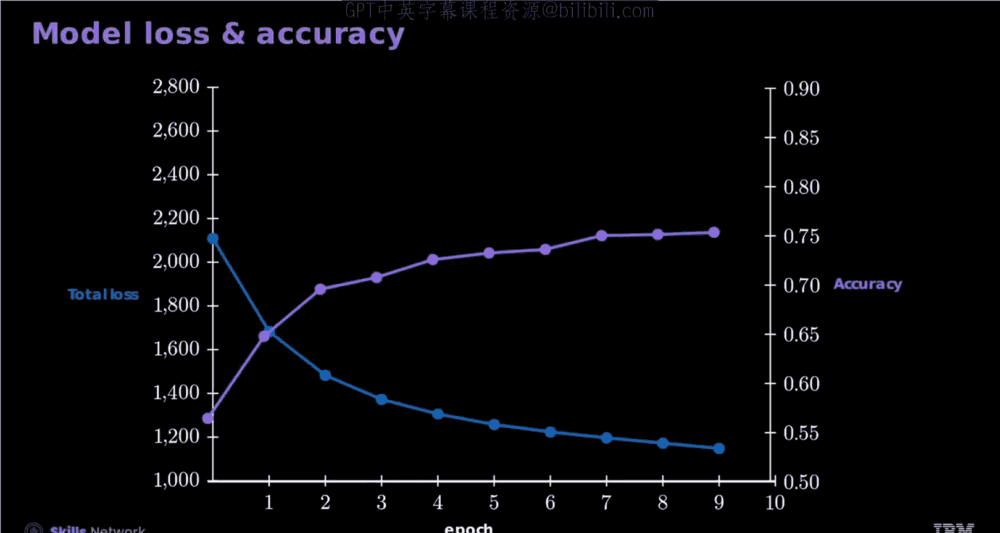
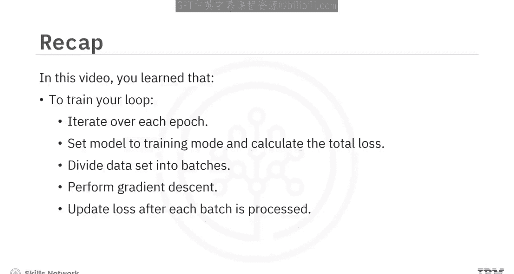

# 生成式人工智能工程：107：在PyTorch中训练模型 🧠

在本节课中，我们将学习如何在PyTorch框架中训练一个神经网络模型。我们将涵盖数据准备、模型定义、损失函数与优化器的设置，以及完整的训练循环过程。

---

上一节我们介绍了数据处理的基础，本节中我们来看看如何构建并训练一个文本分类模型。

## 数据准备与加载

首先，你需要一个已经完成分词和索引处理的新闻数据集。以下是数据准备的关键步骤：

以下是数据分割与加载器的创建代码：

```python
# 假设 `dataset` 是已经处理好的AG新闻数据集
train_size = int(0.8 * len(dataset))
val_size = len(dataset) - train_size
train_dataset, val_dataset = random_split(dataset, [train_size, val_size])

# 创建数据加载器
batch_size = 32
train_loader = DataLoader(train_dataset, batch_size=batch_size, shuffle=True)
val_loader = DataLoader(val_dataset, batch_size=batch_size, shuffle=False)
test_loader = DataLoader(test_dataset, batch_size=batch_size, shuffle=False)
```

**`batch_size`** 定义了每次用于近似计算梯度的样本数量。**`shuffle=True`** 会在每个训练周期打乱数据顺序，这有助于模型获得更好的优化效果。

---

## 定义模型与初始化

接下来，你需要定义你的神经网络模型。在定义模型时，正确初始化权重有助于优化过程。

以下是定义一个简单文本分类模型的示例代码：

```python
import torch.nn as nn

class TextClassifier(nn.Module):
    def __init__(self, vocab_size, embed_dim, num_classes):
        super(TextClassifier, self).__init__()
        self.embedding = nn.Embedding(vocab_size, embed_dim)
        self.fc = nn.Linear(embed_dim, num_classes)

    def forward(self, text):
        embedded = self.embedding(text)
        pooled = embedded.mean(dim=1)
        output = self.fc(pooled)
        return output

# 创建模型实例
vocab_size = 10000
embed_dim = 100
num_classes = 4
model = TextClassifier(vocab_size, embed_dim, num_classes)
```

---

## 设置训练组件

模型定义好后，需要初始化优化器、损失函数，并设定训练周期数。

以下是相关设置的代码：

```python
import torch.optim as optim

# 初始化优化器和损失函数
optimizer = optim.Adam(model.parameters(), lr=0.001)
criterion = nn.CrossEntropyLoss()

# 设置训练周期数
num_epochs = 10
```

在每个训练周期中，你都需要记录损失值和准确率。

---

## 构建训练循环

现在，我们进入核心的训练循环部分。你将遍历每一个训练周期，即完整遍历一次整个数据集。

以下是训练循环的步骤概述：

1.  将模型设置为训练模式：`model.train()`。
2.  遍历数据加载器，将数据集分成多个批次，这能提升训练性能。
3.  对每个批次执行前向传播，计算损失。
4.  执行反向传播和梯度下降来调整模型参数：`loss.backward()` 和 `optimizer.step()`。
5.  在每个批次处理完后更新损失记录。

以下是训练循环的核心代码框架：

```python
for epoch in range(num_epochs):
    model.train()
    total_loss = 0

    for batch in train_loader:
        # 1. 清零梯度
        optimizer.zero_grad()
        # 2. 前向传播
        text, labels = batch
        predictions = model(text)
        # 3. 计算损失
        loss = criterion(predictions, labels)
        # 4. 反向传播
        loss.backward()
        # 5. 更新参数
        optimizer.step()

        total_loss += loss.item()

    # 记录每个周期的平均损失和验证集准确率
    avg_loss = total_loss / len(train_loader)
    print(f'Epoch [{epoch+1}/{num_epochs}], Loss: {avg_loss:.4f}')
```

在训练过程中，如果模型在验证数据集上达到了更高的准确率，你可以选择保存其参数。





---

## 评估训练结果

随着训练的进行，损失和准确率会呈现一定的趋势。通常，随着损失值的下降，准确率会相应上升。

你可以绘制损失和准确率随时间变化的图表来直观观察这一趋势。

---



本节课中我们一起学习了在PyTorch中训练模型的完整流程。我们了解到需要将数据分割为训练集和验证集，并设置相应的数据加载器。通过定义模型、初始化权重、设置优化器和损失函数，我们构建了一个训练循环。在这个循环中，我们遍历周期、设置训练模式、分批次处理数据、执行梯度下降，并在每个批次后更新损失。最终，通过观察损失和准确率的变化趋势，我们可以评估模型的训练效果。