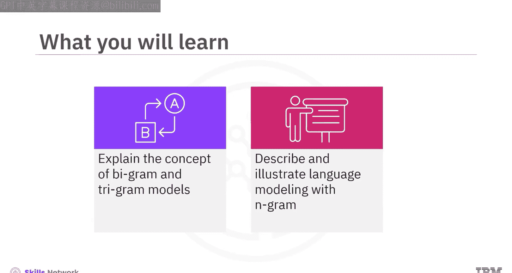
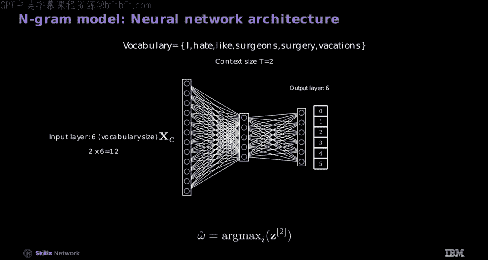

# 生成式人工智能工程：5：使用N-gram进行语言建模 🧠

在本节课中，我们将要学习N-gram语言建模的基本概念。我们将从理解N-gram的定义开始，逐步探讨二元模型和三元模型的工作原理，并了解如何将其扩展到更通用的N-gram模型。最后，我们会简要介绍神经网络如何应用于语言建模。

## 概述

语言建模的核心是预测给定上下文后下一个词出现的概率。N-gram模型是实现这一目标的经典方法。本节我们将学习如何利用前一个或前几个词来预测后续的词汇。

## 理解N-gram

让我们从理解N-gram开始。考虑短语“I like”和“I hate”。

你如何完成这些句子？例如，如果给你“I like”和一个空白，你会选择“surgery”还是“vacation”？大多数人看到“like”这个词后，很可能会用“vacation”来完成它。

同样，对于短语“I hate”和一个空白，预期的完成词是“surgery”。这反映了与这些词常见的关联。

这些例子展示了你的词汇选择如何经常受到前面词汇所提供的上下文影响。

考虑短语“I like vacations”，它可以表示为一个序列。你可以使用一个表格来描述它，每一列标记为单词1到单词3。

这表示一个词及其在句子中的位置下标，即单词1、单词2和单词3。对于“I hate surgery”也是如此。

## 二元模型

这就是二元模型发挥作用的地方。它是一个条件概率模型。

**公式：** `P(单词3 | 单词2)`

单词2代表你的上下文。第二个词对于指导预测至关重要。在二元模型中，你的上下文大小是1，这意味着你只考虑紧邻的前一个词来预测下一个词。

给定第二个词是“like”，即单词2等于“like”。第三个词可能是什么？使用表格，在第三列中统计每个可能跟在“like”后面的词的出现次数。通过检查表格观察到，“surgery”从未跟在“like”后面。因此，单词3是“surgery”的概率是0。然而，“vacation”出现在“like”之后，所以单词3是“vacation”的概率是1。

## 三元模型

考虑短语“surgeons like surgery”和“I hate surgery”。添加“surgeons”改变了句子的上下文，使得“surgeons like surgery”至少是合理的。

让我们创建相同的表格。三元模型也是一个条件概率函数，并且可以通过将上下文大小增加到2来改进二元模型的局限性。

**公式：** `P(单词3 | 单词1, 单词2)`

现在，除了单词2，你还使用单词1来预测单词3。

让我们检查单词3等于“surgery”的概率。给定单词1是“I”且单词2是“like”，你会发现概率是0。然而，如果你将单词1改为“surgeons”，那么单词3是“surgery”的概率现在是1。

## 使用三元模型进行预测

考虑短语“surgeons like surgery”、“I hate surgery”和“I like vacations”。你如何完成短语“surgeons like”？

你可以利用三元模型，通过利用表格生成的概率来预测下一个词。对于上下文，将第一个词设为“surgeons”，第二个词设为“like”，以预测第三个词（表示为ω）。识别哪个词最有可能成为第三个词。

这种优化是通过使用Arg max函数实现的，该函数从给定第一个词是“surgeons”且第二个词是“like”的不同可能第三个词中，选择概率最高的词。

如图所示，所有可能的第三个词结果的概率都是0，除了“surgery”。因此，预测的第三个词是“surgery”。

## 扩展到任意位置和时间

让我们考虑预测下一个词，单词3。给定第一个词是“I”，第二个词是“like”。

如果你旨在预测某个任意点T的词，使用前面的点T-1和T-2。并且如果你假设这些关系随时间保持不变（即意味着平稳性），那么你可以在任何时间点应用三元或二元模型。

对于三元情况，你可以使用位置T-2和T-1的词来预测位置T的词，遵循相同的预测过程。

## 广义N-gram模型

你可以将三元的概念推广到N-gram模型，它允许任意的上下文大小。

**公式：** `P(单词T | 单词T-N+1, ..., 单词T-1)`

在这个扩展的框架中，N表示所选的上下文大小。然而，计算更大上下文大小的概率会变得越来越复杂。

幸运的是，神经网络提供了一种解决方案，可以近似这些概率。具体来说，应用softmax函数来估计概率，然后训练一个神经网络基于前面的词来预测下一个词。上下文词被用作特征，即上下文向量，来定义前面的词。

## 神经网络与N-gram

让我们回顾前面的例子，其中你的词汇表中的每个词（即I, hate, like, surgeons, surgery, vacation）由一个六维的独热编码向量表示。

考虑用上下文大小为2来编码短语“I like”。如果你采用词袋模型，“I like”的向量表示将与“like I”的向量表示相同。为了建立连接向量，将对应于每个词的各个向量连接起来，如图所示。

在神经网络领域，上下文向量通常定义为你的上下文大小和词汇表大小的乘积。通常，这个向量不是直接计算的。相反，你应该通过连接嵌入向量来构建它。

## 神经网络架构

让我们检查一下N-gram模型的神经网络架构。假设你正在处理一个小问题：一个六词词汇表和一个两词上下文。

回想一下为四篇文章分类而设计的神经分类器，它有四个输出。然而，该网络必须预测六个可能输出中的一个，词汇表中的每个词对应一个。因此，输出层有六个神经元。

给定上下文大小为2，相应地调整输入。输入维度是词汇表大小和上下文大小的乘积。对于六个词和上下文大小2，你的输入维度是12。直接使用最终层的输出，无需将其转换为概率。

这个前馈神经网络忽略了与T的依赖关系，因为它没有内置机制来捕获句子中单词的顺序或位置，这与更擅长生成文本的现代神经网络不同。

## 总结

本节课中我们一起学习了语言建模的基础知识。

你学习了二元模型是一个上下文大小为1的条件概率模型，即你只考虑紧邻的前一个词来预测下一个词。

三元模型也是一个条件概率函数，并且可以通过将上下文大小增加到2来改进二元模型的局限性。

三元的概念可以推广到N-gram模型，它允许任意的上下文大小。

在神经网络领域，上下文向量通常定义为你的上下文大小和词汇表大小的乘积。通常，这个向量不是直接计算的，而是通过连接嵌入向量来构建的。

