# 生成式人工智能工程：109：将N-gram作为神经网络与PyTorch 🧠

在本节课中，我们将学习如何使用PyTorch构建和训练一个N-gram语言模型。我们将了解如何将N-gram模型视为一个神经网络分类问题，并掌握从数据准备到模型预测的完整流程。

## 概述：N-gram模型与神经网络

N-gram语言模型本质上是一个分类模型。它通过一个固定大小的上下文窗口（例如，前两个词）来预测下一个词。在PyTorch中，我们可以用神经网络来实现这个模型，利用嵌入层和全连接层来捕捉词与词之间的关系。

上一节我们介绍了N-gram的基本概念，本节中我们来看看如何用PyTorch具体实现它。

## 构建模型架构

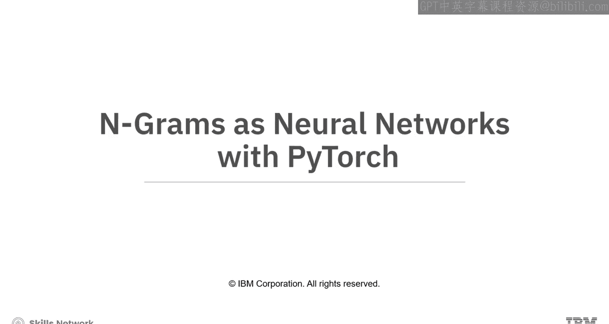

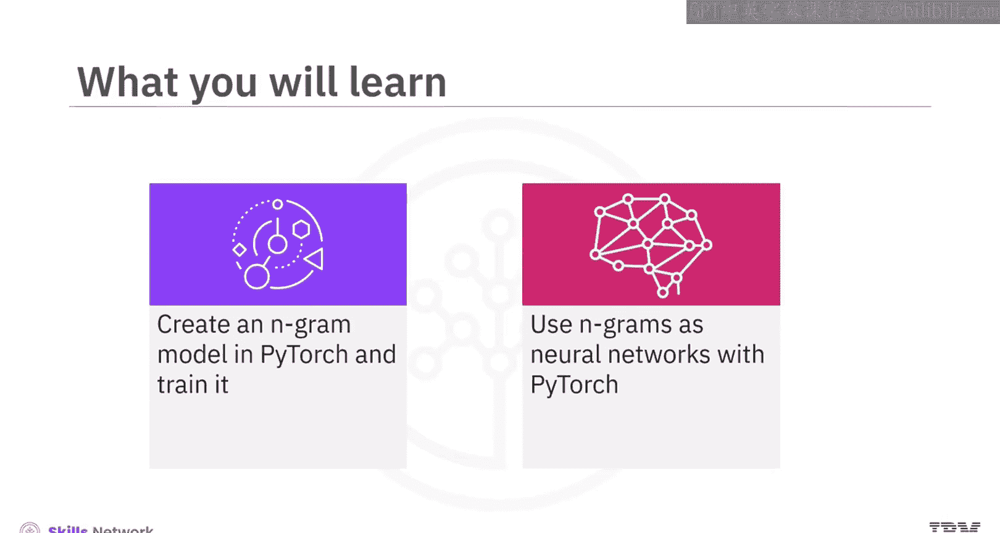

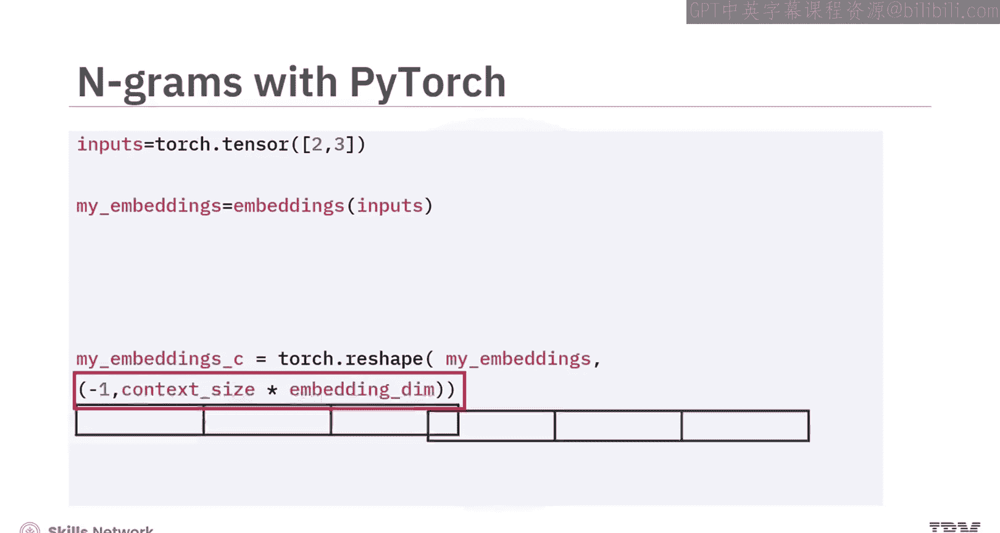

在PyTorch中，你可以创建一个嵌入层，其词汇表大小可以任意指定，同时设置嵌入维度和上下文大小（例如2）。

下一层的输入维度必须是**上下文向量维度**与**上下文大小**的乘积。

**公式**：`下一层输入维度 = 嵌入维度 * 上下文大小`

我们从两个索引开始，代表输入上下文大小为2。这两个样本被用作嵌入层的输入。输出是两个维度为3的嵌入向量。

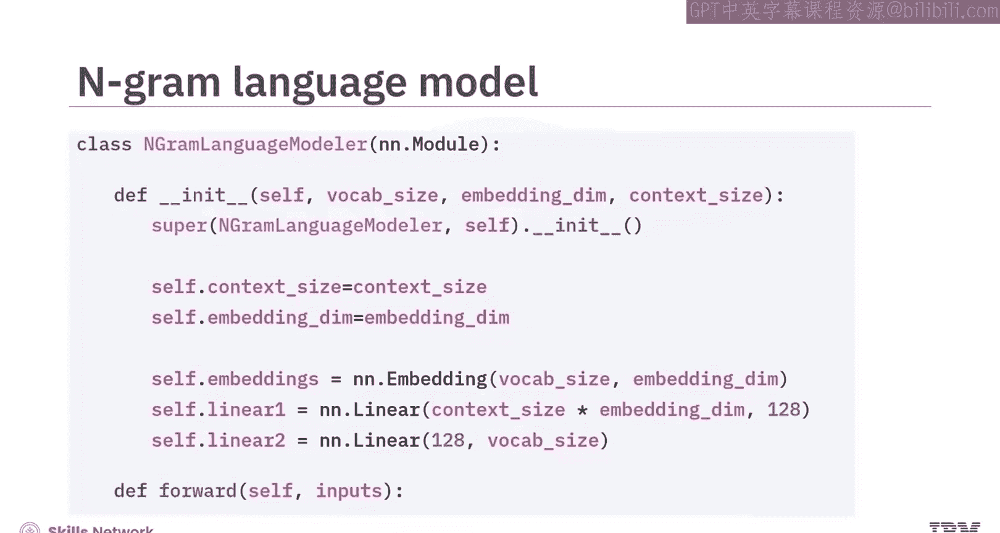

使用`reshape`方法将嵌入向量重塑为上下文向量，其维度是**上下文大小**乘以**嵌入维度**。这实际上是将所有样本连接在一起。这个结果被用作下一层的输入。

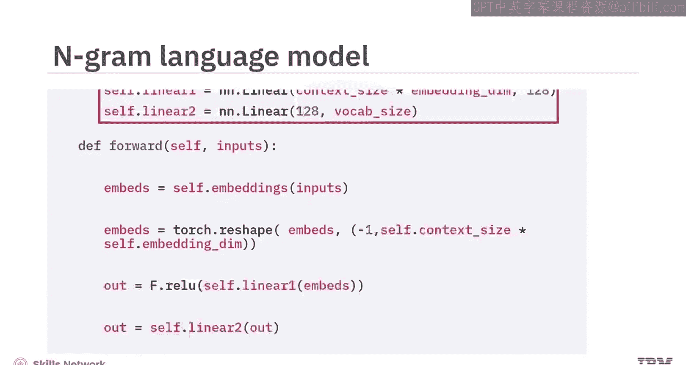

## 理解滑动窗口机制

N-gram模型通过逐步移动一个称为“滑动窗口”的机制，来预测目标词周围的词。在一个二元语法（Bigram）模型中，位置`T`的词的预测基于位置`T-1`和`T-2`的词。通常从`T=3`开始，以避免负索引。

每一行代表一个不同的`t`值，对应词的位置。第二列显示上下文，第三列显示预测的目标词，两者都依赖于该行的`t`值。

考虑短语“I like vacations”，每个词的下方有其索引。对于`T=3`，上下文是“I like”（蓝色部分），预测的目标词是“vacations”（红色部分）。移动到`T=4`（第二行），上下文更新为“like vacations”，下一个预测词是“with”。此方法应用于整个序列。

## 实现数据批处理

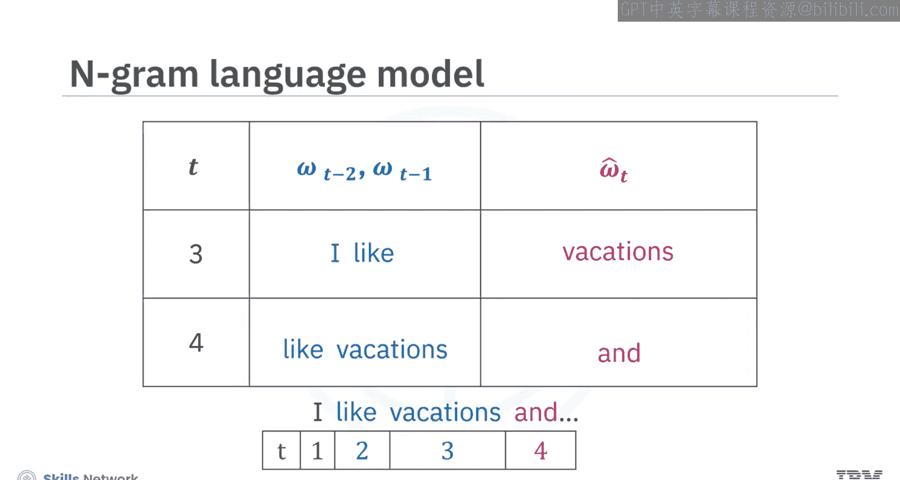

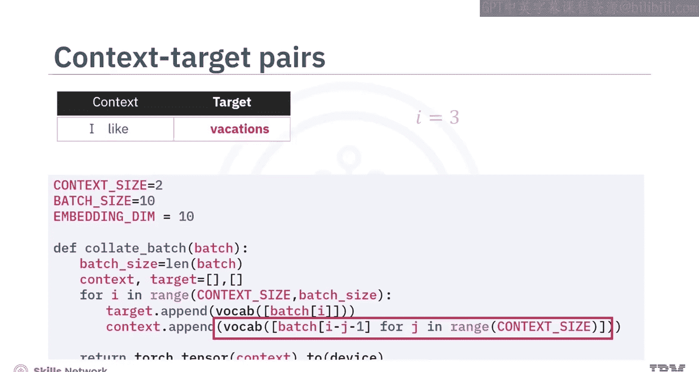

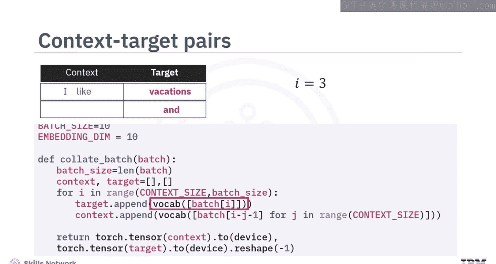

在PyTorch中实现N-gram建模时，需要实现窗口化以创建上下文词和目标词的批次。

以下是创建批次的过程：
*   初始化过程，使用一个批处理函数生成目标和上下文。
*   一个`for`循环从上下文大小的起点开始迭代（本例中从2开始，标志着“vacation”成为窗口内的第一个目标）。
*   上下文通过从`i`中减去`j`来收集。
*   然后向前滑动窗口，递增`i`以捕获整个序列中连续的目标和上下文。

现在，你将创建一个玩具数据。接下来，创建一个将文本转换为索引的流程管道。不使用数据集对象，你将使用一个列表对象。

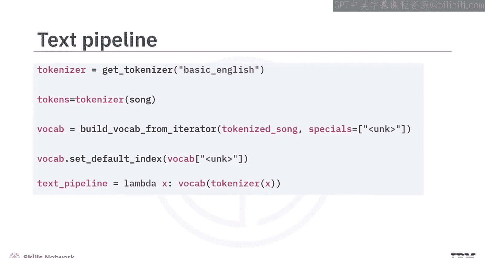

## 训练模型与评估指标

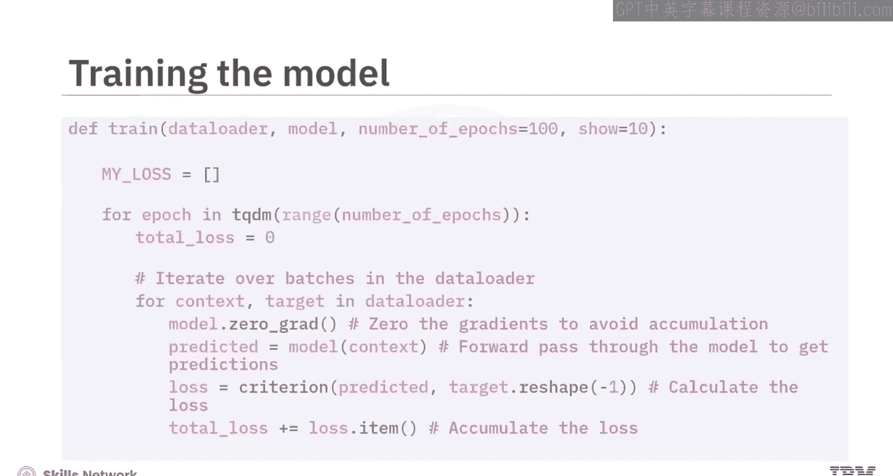

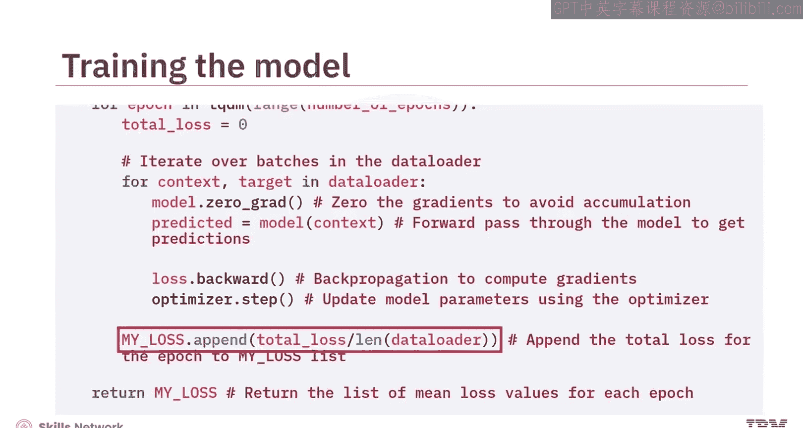

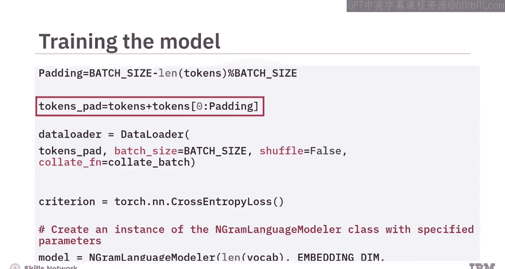

在训练模型时，应优先将**损失**而非准确率作为你的关键性能指标。

训练模型的方式与分类模型类似。为了确保形状一致，需要对令牌进行填充。这里，你将使用前面的值进行填充以实现对齐。

从词汇表通过`vocab.get_itos()`方法获得的`index_to_token`属性是一个列表，其中每个元素对应一个词，而列表中的索引对应该词的令牌索引。

这个列表充当一个映射，将神经网络的数值输出（可能代表类别或令牌索引）转换回人类可读的格式，本质上充当了一个解码器。因此，当神经网络预测出一个索引时，可以使用此列表来检索相关的词。

## 进行预测

让我们进行一次预测。对一个字符串“never gonna”应用文本处理流程。结果是列表`[3, 1]`，代表令牌索引。

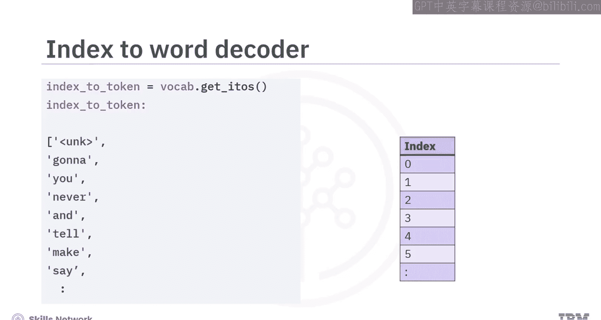

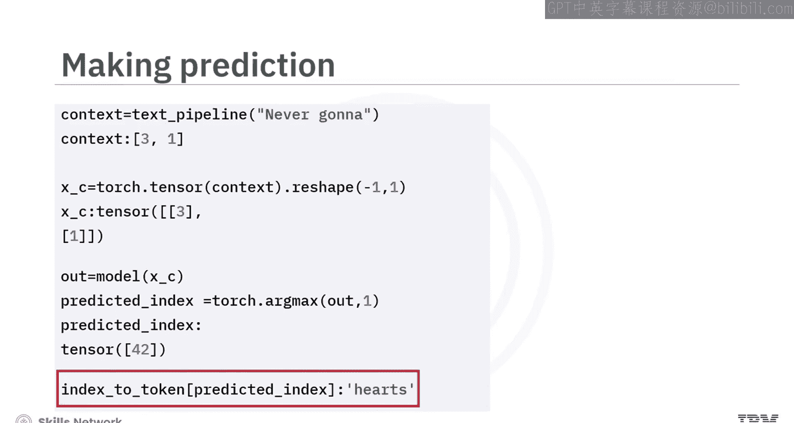

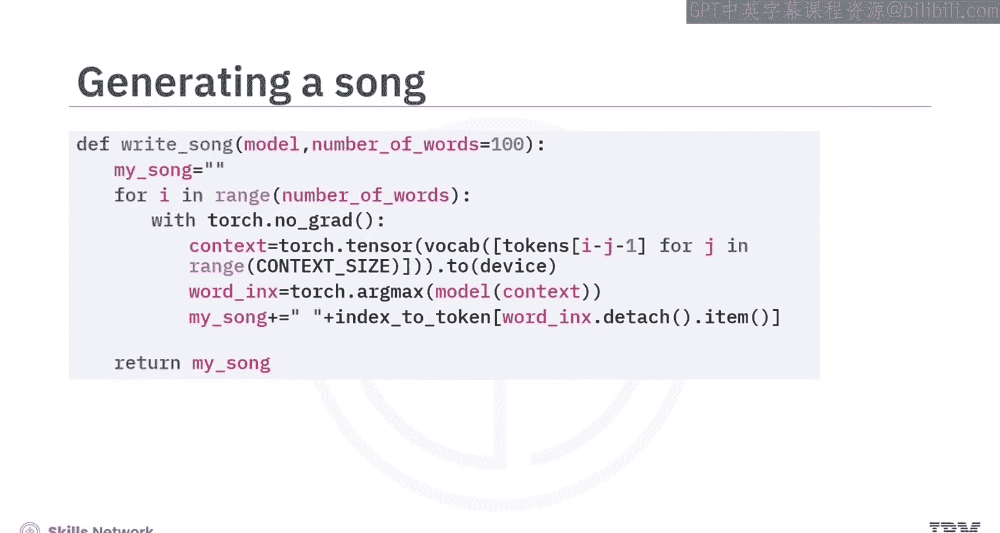

将令牌索引列表转换为PyTorch张量，用模型进行预测，并选择具有最大值的索引。最后，使用索引到令牌的映射将索引转换为词。

你可以使用此函数通过模型生成一个词序列。

## 总结

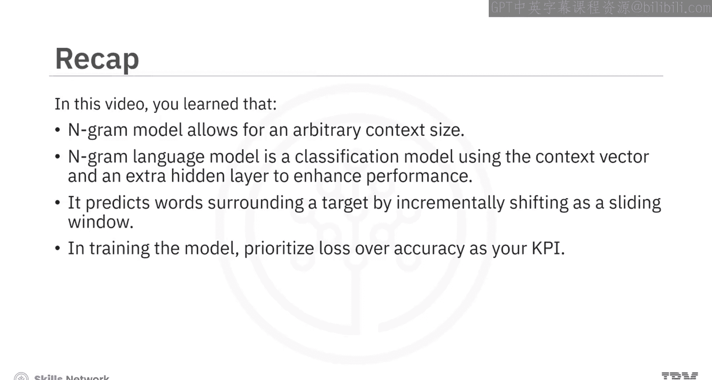

本节课中我们一起学习了以下核心内容：
*   在PyTorch中，N-gram模型允许使用任意的上下文大小。
*   N-gram语言模型本质上是一个使用上下文向量和额外隐藏层来提升性能的分类模型。
*   N-gram模型通过逐步移动滑动窗口来预测目标词周围的词。
*   在训练模型时，应优先将损失作为关键性能指标。