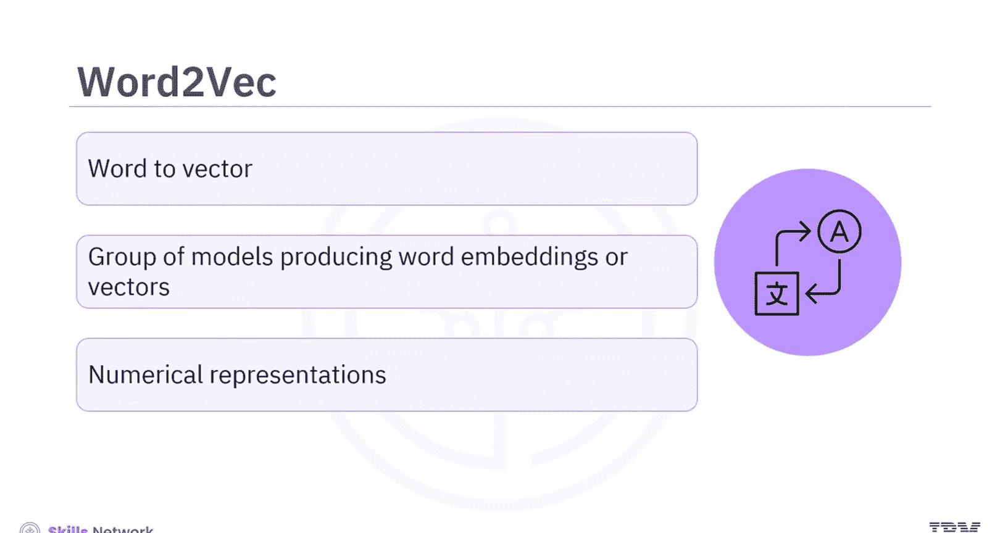
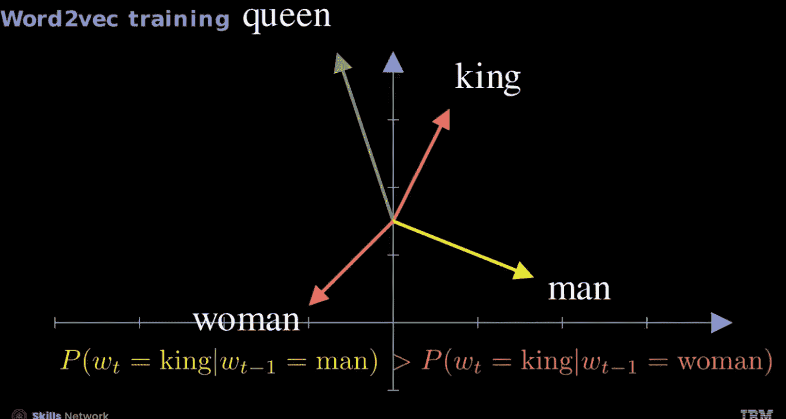
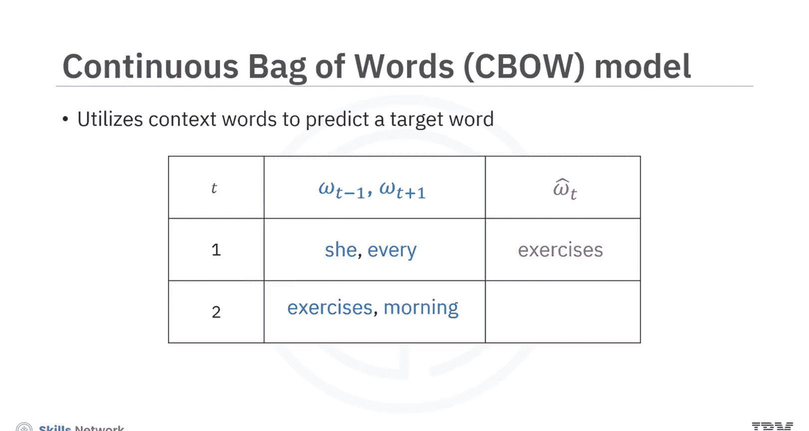
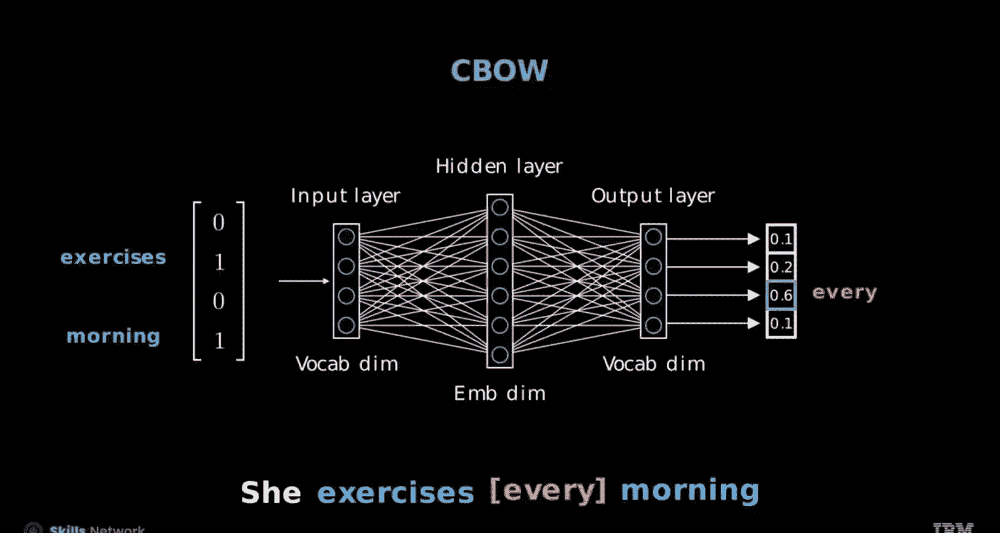
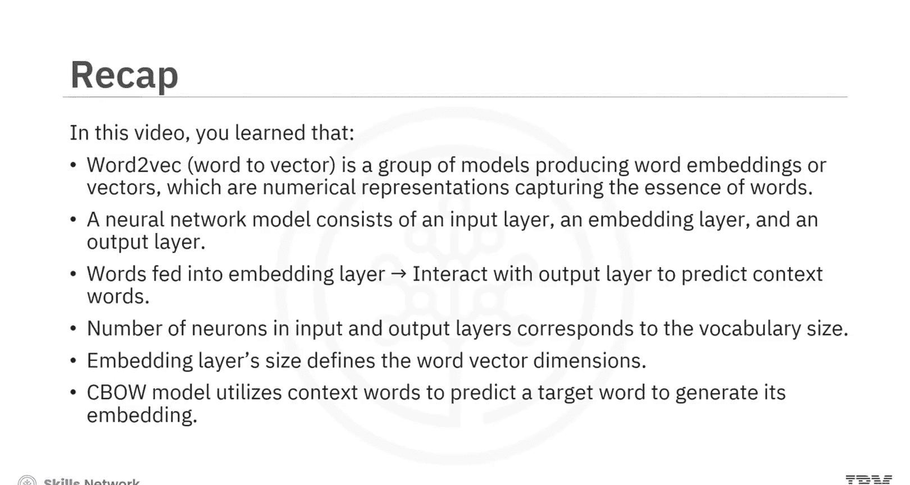

生成式人工智能工程：110：Word2Vec与CBOW模型简介

在本节课中，我们将学习Word2Vec的基本概念及其核心模型之一——连续词袋模型。我们将了解如何将词语转化为向量表示，以及如何使用神经网络模型来预测目标词。

---

### **什么是Word2Vec？**

Word2Vec是“Word to Vector”的简称。它是一组用于生成词嵌入或词向量的模型。词向量是捕捉词语本质的数值表示。

例如，由于含义相似，“king”的向量与“man”更接近，“queen”的向量与“woman”更接近。有趣的是，从“king”的向量中减去“man”的向量，会得到一个与“queen”向量相似的向量，这展示了词嵌入在捕捉词语关系方面的有效性。

这些向量可以应用于自然语言处理任务中，通过替换随机生成的嵌入向量来提升模型性能。

为了获得这些向量，可以从随机生成的嵌入向量开始。

你可以使用一个包含输入层、嵌入层和输出层的神经网络模型。词语被输入到嵌入层，该层与Softmax输出层交互，以预测上下文词语。

训练过程涉及调整隐藏层权重 **W** 和输出层权重 **W‘**，以优化词向量表示。输入层和输出层的神经元数量与词汇表大小相对应。而嵌入层的大小由用户选择，它定义了词向量的维度。

训练完神经网络后，如果网络预测“queen”跟随“woman”的概率高于跟随“man”的概率，那么“queen”的嵌入向量将更接近“woman”而非“man”。同样，如果“king”在概率上更与“man”相关联，那么“king”的结果向量将更接近“man”而非“woman”。

---

### **上下文窗口与目标词预测**

现在，让我们尝试使用网络，通过给定窗口内的其他词语来预测词语。将窗口宽度设置为1。

在时间步 t=1，“exercises”是目标词，“she”和“every”是上下文词。在时间步 t=2，“every”成为目标词，被“exercises”和“morning”环绕作为上下文。

对于窗口宽度为1的情况，上下文包括 t-1 和 t+1 位置的词。目标词位于时间步 t。

*   在 t=1，上下文由“she”和“every”组成，目标词是“exercises”。
*   移动到 t=2，上下文包括“exercises”和“morning”，目标词是“every”。

---

### **连续词袋模型**

接下来，你将学习连续词袋模型。该模型利用上下文词语来预测目标词，并生成其嵌入向量。

在下表所示的例子中，第二列列出了网络的预测词。当输入“she”和“every”时，模型预测“exercises”。当输入“exercises”和“morning”时，模型预测“every”。

在CBOW模型中，对于句子“she exercises every morning”，输入维度为4，与语料库中唯一词的数量匹配。目标是预测词语的可能性，因此输出维度也是4。

目标词是“exercises”，上下文词“she”和“every”被组合成一个词袋向量。该向量通过包含词嵌入的隐藏层，在输出层中，“exercises”对应的逻辑值最高，表明模型对此上下文的预测。

现在，让我们移动上下文窗口来考虑新的输入。词语“exercises”和“morning”被编码为独热向量，并作为输入提供给模型。

在训练过程中，你的目标应该是微调模型的权重，使其能有效预测目标词“every”，该词应对应于输出层中最高的逻辑值。

---

### **创建CBOW模型**

以下是创建CBOW模型的步骤：

首先，初始化模型。然后，使用 `nn.EmbeddingBag` 定义嵌入层，它会计算上下文词嵌入向量的平均值。你还需要使用 `self.fc` 配置全连接层，其输入大小为嵌入维度，输出大小为词汇表大小。

在 `forward` 方法中，你将通过嵌入层传递输入文本和偏移量，该层会检索上下文词嵌入并计算其平均值。接下来，应用ReLU激活函数。之后，ReLU激活的输出会通过全连接层。最后，创建CBOW模型的一个实例。

接下来，使用步骤1和2初始化分词器。使用步骤3，从分词后的数据创建词汇表。在步骤4中，将上下文大小设置为2。然后，在文本上滑动以形成上下文-目标词对。

接下来，使用步骤5，为网络设置文本处理管道、数据加载器和批处理函数。它将拥有一个批大小为64的词袋，为下一个词预测任务的训练准备批次。

---

### **总结**

本节课中，我们一起学习了以下内容：

*   Word2Vec是“Word to Vector”的简称，是一组用于生成词嵌入或词向量的模型。词向量是捕捉词语本质的数值表示。
*   一个神经网络模型由输入层、嵌入层和输出层组成。词语被输入到嵌入层，该层与输出层交互以预测上下文词语。
*   输入层和输出层的神经元数量与词汇表大小相对应。而嵌入层的大小由用户选择，它定义了词向量的维度。
*   连续词袋模型利用上下文词语来预测目标词，并生成其嵌入向量。

