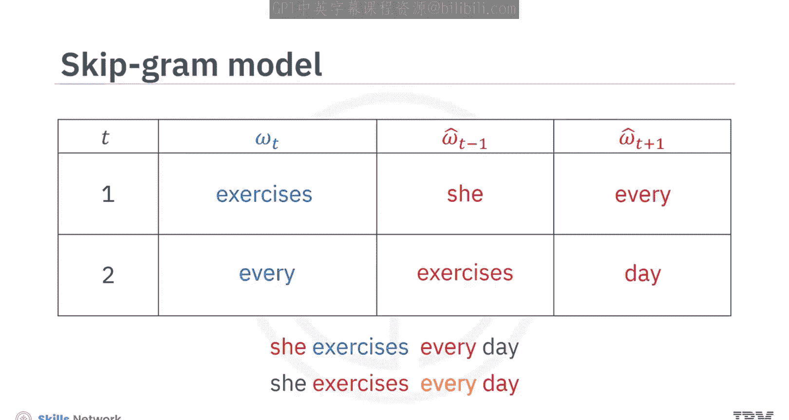
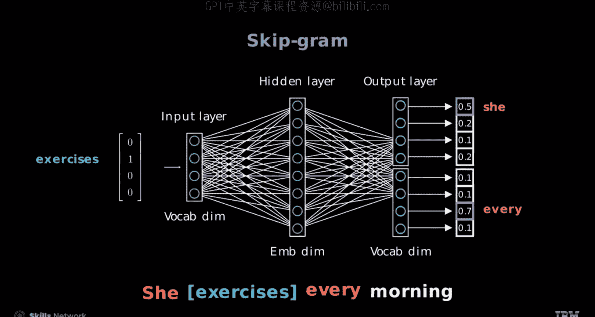
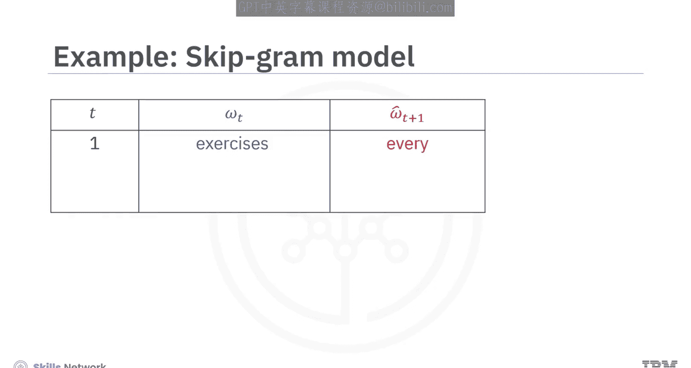
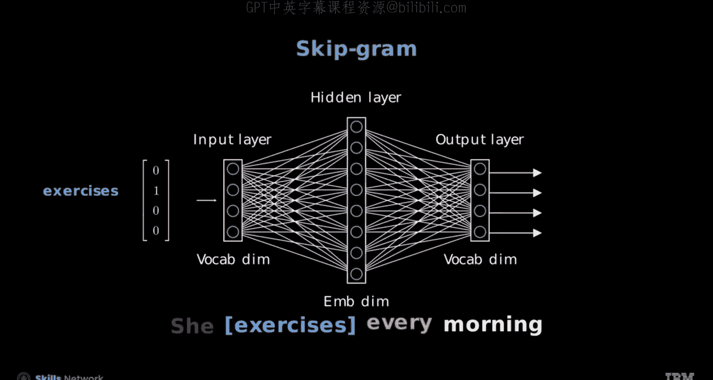
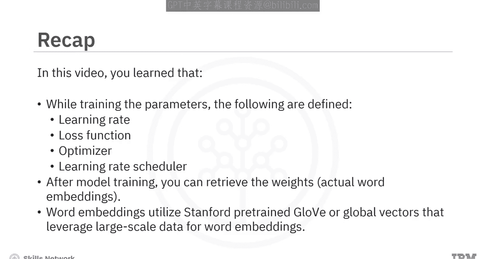

# 生成式人工智能工程：111：Word2Vec跳元模型与预训练模型 🧠

在本节课中，我们将学习Word2Vec的跳元模型（Skip-gram），了解其工作原理，并学习如何在PyTorch中构建和训练它。我们还将探讨如何使用大规模预训练的词嵌入模型，如GloVe，来提升自然语言处理任务的效果。

---

## 概述

跳元模型是连续词袋模型（CBOW）的逆向模型。它旨在根据给定的目标词，预测其周围的上下文词。例如，对于目标词“exercises”，模型需要预测其前后的词“she”和“every”。我们将学习如何用PyTorch实现这个模型，并了解如何利用预训练的GloVe词向量。

---

## 跳元模型（Skip-gram）原理

上一节我们介绍了Word2Vec的基本概念，本节中我们来看看跳元模型的具体机制。

跳元模型的核心任务是：给定一个目标词，预测其周围的上下文词。这与CBOW模型（根据上下文预测目标词）正好相反。

例如，在句子“She exercises every day”中：
*   当目标词 `T=1` 是“exercises”时，模型需要预测其周围的上下文词“she”和“every”。
*   当目标词 `T=2` 是“every”时，模型需要预测其周围的上下文词“exercises”和“day”。

需要澄清的是，这里的“目标词”是模型的输入（自变量），而需要预测的“上下文词”才是模型的输出（因变量）。





在模型架构中，目标词（如“exercises”）被编码为一个在词汇表空间中的**独热向量**（one-hot vector），即该词对应位置为1，其余位置为0。输出层则负责预测周围的上下文词。


训练完成后，模型在每个上下文位置上的输出逻辑值（logits），应对真实的上下文词具有最高的预测分数。


---



## 模型的简化策略



为了简化复杂的上下文预测任务，跳元模型将其分解为多个更小的、可管理的子任务。具体做法是：**一次只预测一个上下文词**。

例如，对于目标词“exercises”：
*   模型会独立地预测其前一个词“she”。
*   模型也会独立地预测其后一个词“every”。

这样，原本需要同时预测多个词的任务，就被分解成了多个独立的二分类（或多分类）问题。

现在，让我们看看对应的神经网络结构。输入是目标词“exercises”的独热编码向量，而预测输出是“she”。


另一个训练样本对是：输入“exercises”，预测输出“every”。


---

## 在PyTorch中构建跳元模型

了解了原理后，我们动手在PyTorch中实现一个跳元模型。

以下是构建模型的关键步骤：

1.  **初始化模型**：定义模型类并初始化其层。
2.  **定义嵌入层**：使用 `nn.Embedding` 创建词嵌入层，参数为词汇表大小和嵌入维度。
    ```python
    self.embeddings = nn.Embedding(vocab_size, embed_dim)
    ```
3.  **定义全连接层**：一个线性层，输入维度为嵌入维度，输出维度为词汇表大小，用于生成最终的预测分数。
    ```python
    self.fc = nn.Linear(embed_dim, vocab_size)
    ```
4.  **前向传播**：在 `forward` 方法中，输入文本通过嵌入层得到词向量，然后通过全连接层得到预测结果。
5.  **创建模型实例**：使用定义好的词汇表大小和嵌入维度实例化模型。

---

## 数据准备与序列生成

跳元模型的数据生成函数与CBOW模型类似，但目标和上下文词的顺序是相反的。

以下是如何为跳元模型准备训练数据的步骤：

1.  **生成样本对**：每个样本包含一个目标词和其对应的一个上下文词。
2.  **拆分完整上下文**：通过嵌套循环遍历目标词的所有上下文词，为每个上下文词创建一个（目标词，单个上下文词）的样本对。这样就将完整的上下文拆分成了多个离散的部分。
3.  **扁平化数据**：将生成的所有样本对整理成列表。
4.  **创建数据加载器**：使用PyTorch的 `DataLoader` 来批量加载数据。

查看数据加载器中的一个批次，可以看到返回的张量包括目标词和上下文词，以及它们的索引。同时显示对应的词元（tokens）可以让训练过程更直观。

---

## 训练模型

准备好数据和模型后，我们开始训练。以下是训练参数设置：

*   **学习率**：定义优化器的步长。
*   **损失函数**：使用交叉熵损失 `nn.CrossEntropyLoss()` 来衡量预测误差。
*   **优化器**：使用Adam等优化器来更新模型参数。对于跳元模型，只需将优化器的输入对象改为跳元模型实例的参数。
    ```python
    optimizer = optim.Adam(skipgram_model.parameters(), lr=learning_rate)
    ```
*   **学习率调度器**：可选，用于在训练过程中动态调整学习率。

定义训练函数，循环指定的轮数（epochs）进行训练。函数内部需要包含一个条件判断，以区分输入是用于跳元模型还是CBOW模型。该函数最终返回训练好的模型和每轮的平均损失列表。

调用训练函数，传入为跳元模型准备的数据加载器，即可开始训练。

---

## 获取词嵌入向量

模型训练完成后，我们如何得到想要的词向量呢？

训练好的嵌入层（`nn.Embedding`）的权重矩阵就是我们要的词嵌入。每一行对应一个词的向量表示。

你可以通过词的索引来获取其对应的嵌入向量：
```python
# 假设 `model` 是训练好的跳元模型，`word_to_ix` 是词到索引的映射
word_index = word_to_ix[‘specific_word’]
word_vector = model.embeddings.weight[word_index]
```

---

## 使用预训练词嵌入（GloVe）

从头训练词嵌入需要大量数据和计算资源。在实践中，我们常直接使用在大规模语料上预训练好的词向量，如斯坦福大学的GloVe。

以下是利用预训练GloVe词向量进行文本分类的步骤：

1.  **加载预训练向量**：使用 `torchtext.vocab` 加载GloVe向量（例如‘glove.6B’）。
    ```python
    import torchtext.vocab as vocab
    glove = vocab.GloVe(name=‘6B’)
    ```
2.  **构建词汇表**：根据你的数据集创建一个自定义词汇表对象，并将预训练向量与之匹配。
3.  **集成到模型层**：将匹配好的GloVe向量作为权重初始化一个PyTorch嵌入层。
    ```python
    embedding_layer = nn.Embedding.from_pretrained(glove.vectors)
    ```
4.  **词嵌入袋操作**：对于分类任务，常对句子中所有词的向量进行聚合（如求和、平均），得到一个句子的固定长度表示。
5.  **微调选项**：如果你的数据集较大，可以尝试将嵌入层的 `freeze` 参数设为 `False`，允许在任务训练过程中微调这些词向量。


---

## 总结

本节课中我们一起学习了：
1.  **跳元模型原理**：它与CBOW模型相反，根据目标词预测其周围的上下文词。
2.  **简化策略**：通过一次预测一个上下文词，将复杂任务分解。
3.  **PyTorch实现**：学习了如何构建嵌入层、定义模型、准备数据以及训练跳元模型。
4.  **获取词向量**：训练后，嵌入层的权重即为学到的词嵌入。
5.  **预训练模型应用**：介绍了如何使用GloVe等大规模预训练词向量来提升NLP任务（如文本分类）的起点和性能。



通过结合理论理解和动手实践，你现在应该能够描述、构建并应用跳元模型，并理解预训练词嵌入的价值。