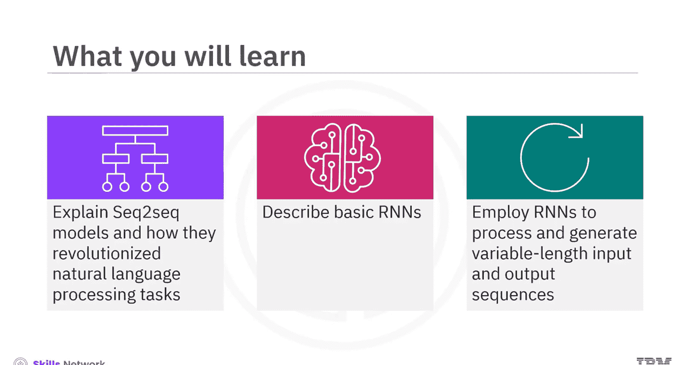
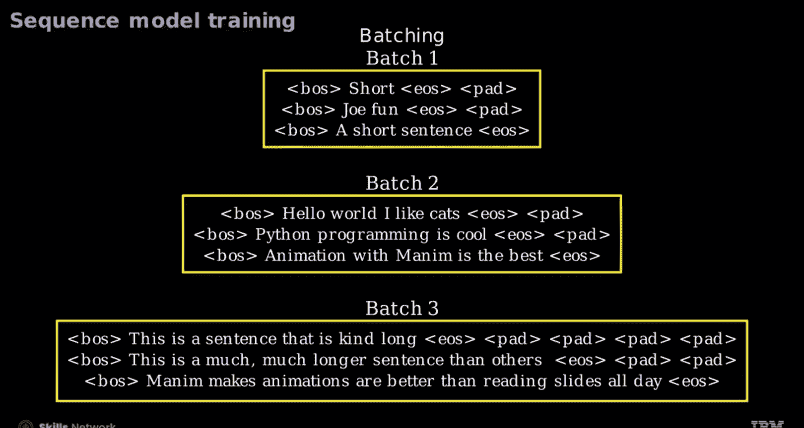
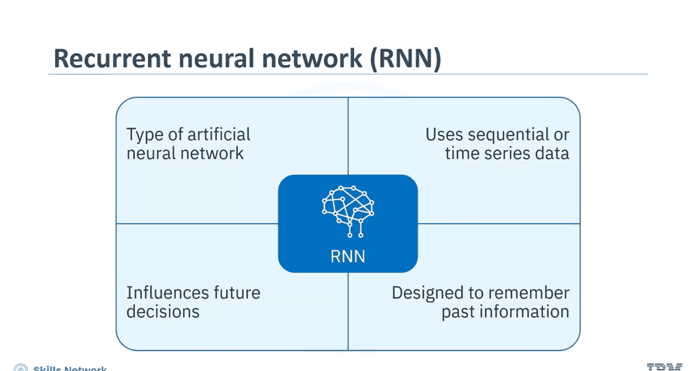
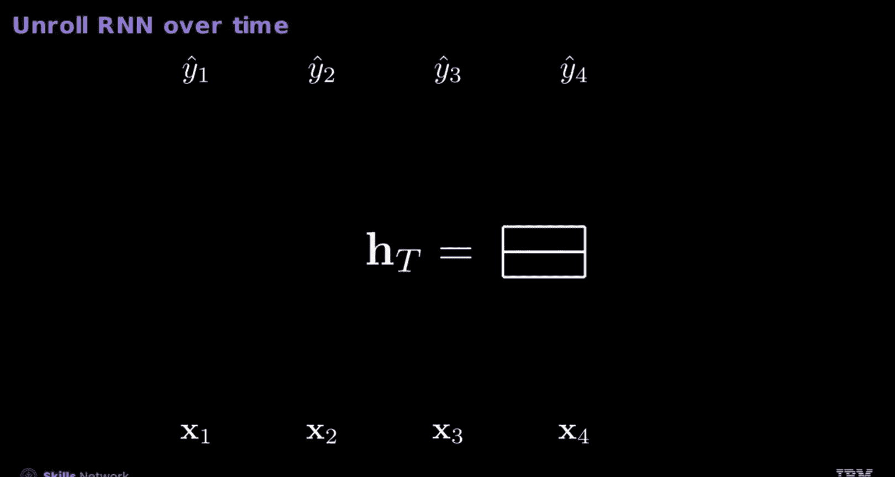
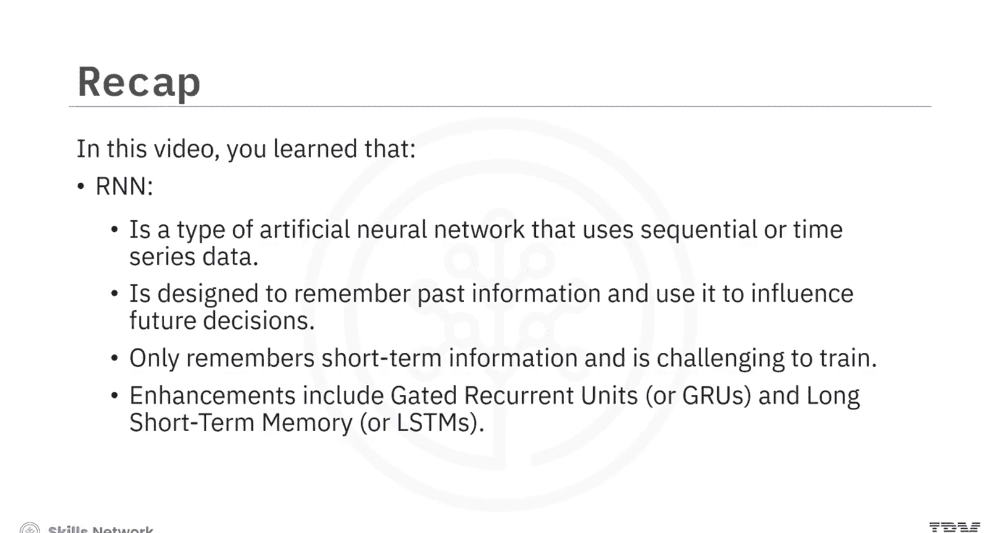

# 生成式人工智能工程：112：序列到序列模型与循环神经网络简介 🧠

在本节课中，我们将学习序列到序列模型和循环神经网络的基本概念。这些模型是自然语言处理任务，如机器翻译、文本摘要和聊天机器人的核心。

## 概述

序列到序列模型是生成式人工智能的重要组成部分。它们能够处理可变长度的输入序列，并生成可变长度的输出序列。循环神经网络则为处理序列数据提供了记忆能力，是构建这些模型的基础。

## 序列到序列模型的应用

以下是序列到序列模型在生成式人工智能中的几个关键应用：

*   **机器翻译**：例如，将英语短语转换为法语。
*   **聊天机器人**：将用户的查询转换为对话式的响应。
*   **文本摘要**：将冗长的文本压缩为简洁的摘要。
*   **代码生成**：根据任务描述，由AI生成相应的代码。

## 序列模型的工作原理

序列到序列模型处理多个输入，如上图所示的5个嵌入向量（x1 到 x5）。输出（y1 到 y5）通常代表标记，但应用广泛。值得注意的是，输入和输出序列的长度不必相等。

*   **序列到标签任务**：接收多个输入，产生单个标签。例如，用于文档分类。
*   **标签到序列任务**：从单个输入生成完整序列。例如，用于图像生成的生成模型。

上下文对于准确理解语言至关重要。以句子“The man bites the dog”和“The dog bites the man”为例，词袋模型无法区分它们，因为词频相同。而通过独热编码词或嵌入的序列表示，则能捕捉它们的不同含义。这种差异在图中以红色高亮显示，说明了此类表示如何实现对上下文的更精确理解。

## 从独立同分布到序列依赖

神经网络通常假设每个样本是独立同分布的。想象从一个装有标有变量 `Y_t` 的球的瓮中多次抽取。如果每次抽取独立且瓮的内容不变，则 `t` 是冗余的，概率分布保持不变，满足IID假设。

然而，考虑每次抽取后不将球放回的情况。此时，`Y` 在 `t=1` 时的概率是 `1/11`，但在 `t=2` 时的概率取决于 `t=1` 时的抽取结果。这需要在每次抽取后调整概率分布，从而引出了条件分布的概念。模型需要记忆能力。

因此，你需要一个能够利用记忆来处理这种依赖关系的模型。

## 序列模型的数据准备

在序列模型训练中，你需要对数据进行精炼处理。

以下是数据准备的关键步骤：

1.  **添加起止标记**：从一组句子开始，用 `BOS` 和 `EOS` 标记表示句子的开始和结束。这种清晰的划分有助于模型识别序列内的起点和终点。
2.  **按长度排序**：将句子按长度排序，以便将长度相似的句子批处理在一起，从而简化学习过程。
3.  **填充短句**：像PyTorch这样的框架要求批次大小一致。因此，你需要在较短的句子后附加填充符号，使其长度与批次中的其他句子相等。

## 循环神经网络简介

现在，我们来学习循环神经网络。RNN是一种使用序列或时间序列数据的人工神经网络。顾名思义，RNN旨在记住过去的信息，并用它来影响未来的决策。

让我们探索一个简单的RNN是如何运作的。

*   **输入层**：标记为 `X_t`。这是RNN在每个特定时间步接收数据的地方。这就像在每个时刻接收一个新的拼图块。
*   **隐藏状态**：标记为 `H_t`。可以将其视为网络的记忆，在这里你将应用一个激活函数（通常是 `tanh`）。它捕获并保留所有先前输入的信息。这至关重要，因为它允许网络在处理当前输入时记住并考虑过去的数据。
*   **连接层**：观察隐藏状态和当前输入如何结合。在一些RNN中，它们被连接起来，形成一个更大的数据集以供处理。这对于理解网络连接过去和现在信息的能力至关重要。
*   **输出**：表示为 `Z_t`。这是RNN在每个时间步基于当前输入及其在隐藏状态中记住的内容计算出的结果。上下文就存储在这里。

这个过程类似于常规神经网络。对于分类问题，你可以简单地获取最大值。在语言建模中，你可以使用RNN来预测单词 `ω_hat`。这种方法称为**贪婪解码**，即模型选择得分最高的标记并将其作为预测返回。请注意，**Top-K采样**策略似乎比传统的贪婪方法能产生更流畅的文本。

## 随时间展开的RNN

让我们将RNN随时间展开。

1.  从初始隐藏状态（一个零向量）开始。
2.  对于每个输入 `X_t`，RNN更新其隐藏状态 `H_t` 并产生输出 `Ŷ_t`。
3.  对于下一个迭代中的新输入 `X_t`，网络利用第一个时间步的隐藏状态，从过去学习以告知未来。
4.  为了输出一个序列 `Ŷ_T`，有时你只需要使用隐藏状态，或者你甚至可以将最后一个隐藏状态 `H` 作为另一个RNN的输入。

## RNN的增强版本

RNN只能记住短期信息，并且训练具有挑战性。两种流行的RNN增强版本是门控循环单元和长短期记忆网络。

*   **GRU**：在GRU中有两个门：重置门 `r` 和更新门 `z`。更新门决定保留多少先前的隐藏状态，而重置门决定丢弃多少先前的隐藏状态。它们共同工作以更新隐藏状态并控制信息随时间流动。最后，在模型进行预测之前应用另一个激活函数。
*   **LSTM**：LSTM单元包括输入门、遗忘门和输出门。它扩展了网络的记忆，用长期记忆补充短期记忆。它们选择性地保留和传输关键数据。

上图显示，`H` 作为短期记忆，辨别什么是重要的。它选择性地从 `C` 中过滤出与当前时间步相关的特定信息。相反，`C` 保留了要传递给后续时间步的全部记忆范围。

## 总结

本节课中我们一起学习了以下核心内容：

*   序列到序列模型在生成式AI中用于机器翻译（如英译法）等任务。
*   序列到标签任务接收多个输入以产生单个标签，可用于文档分类。
*   标签到序列任务从单个输入生成完整序列，见于图像生成的生成模型。
*   RNN是一种使用序列或时间序列数据的人工神经网络，旨在记住过去的信息并用它来影响未来的决策。
*   RNN只能记住短期信息且训练困难。
*   两种流行的RNN增强版本是门控循环单元和长短期记忆网络。

