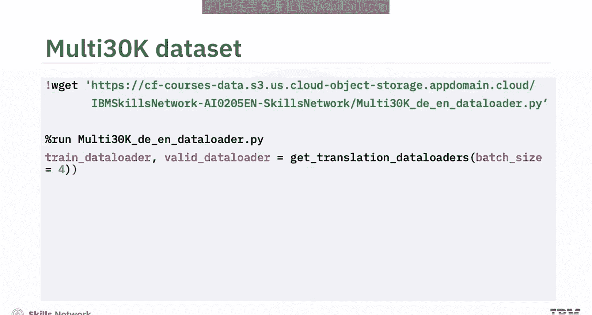
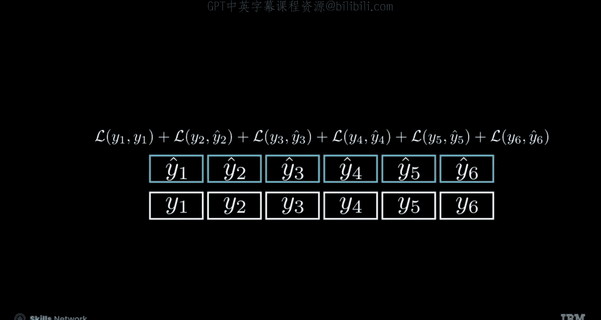
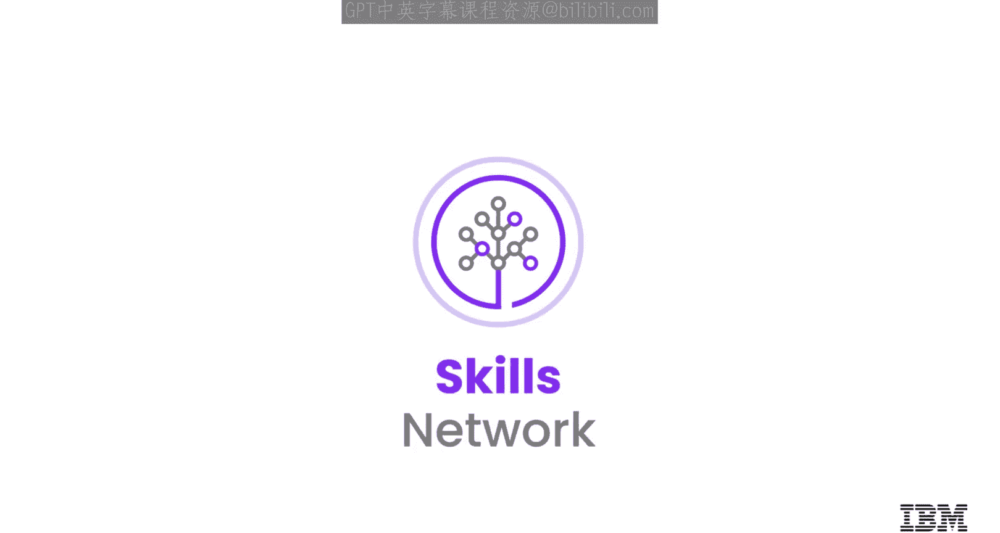

# 生成式人工智能工程：113：编码器-解码器RNN模型的训练与推理 🧠➡️🗣️

在本节课中，我们将学习如何使用PyTorch加载翻译数据集，并基于编码器-解码器循环神经网络（RNN）模型进行训练与推理。

上一节我们介绍了编码器-解码器模型的基本架构，本节中我们来看看如何具体实现其训练和推理流程。

## 数据准备

首先，我们需要准备用于训练的数据。我们将使用Multi30K数据集，它包含了英语到德语的训练集、验证集和测试集。

以下是数据加载与预处理的步骤：

1.  运行一个已创建的 `.py` 文件来获取Multi30K数据集。
2.  该文件会完成数据整理工作，包括**分词**、**数字化**，以及添加序列开始（BOS）和序列结束（EOS）标记，并进行**填充**操作。
3.  你将看到创建好的、可迭代的源语言（SRC）和目标语言（TRG）张量批次。

具体操作是，首先下载并运行该Python文件。然后，调用 `get_translation_data_loaders` 函数并指定一个任意的批次大小，以创建用于训练和验证的数据加载器。你也可以检查一个数据样本。





## 模型训练 🏋️

通常，序列到序列模型比标准的RNN更难训练，涉及多个因素。然而，训练的核心目标通常是通过**最小化交叉熵损失**来优化模型，即将预测输出的概率分布与实际标签进行比较。

我们用蓝色表示一个正确的预测。序列到序列模型的训练步骤与其他神经网络相似，但让我们强调一些关键的不同点。

以下是训练过程的核心步骤：

1.  **初始化模型**：将模型设置为训练模式，以激活如Dropout等关键层，确保训练期间的最佳性能。
    ```python
    model.train()
    ```
2.  **迭代训练批次**：遍历训练数据批次，将输入序列（SRC）和目标序列（TRG）分配到正确的计算设备上。
3.  **生成预测**：通过模型前向传播获得输出预测。
4.  **重塑输出张量**：对于RNN这类序列模型，其输入输出形状常与其他模型不同。需要将输出张量重塑为 `(target_length, batch_size, output_dim)` 的形式。这里，`target_length` 代表行数（不包括起始的BOS标记，以确保不将其计入损失计算），`batch_size` 是列数（代表批次中的每个独立序列），`output_dim` 对应列数，代表序列中每个令牌的预测输出维度。这种重塑操作能正确对齐行和列，以便进行损失计算，使输出预测与目标维度匹配。
    ```python
    output = output[1:].reshape(-1, output.shape[-1])
    target = target[1:].reshape(-1)
    ```
5.  **计算损失**：计算预测输出与实际目标之间的交叉熵损失。
    ```python
    loss = criterion(output, target)
    ```
6.  **反向传播与优化**：执行反向传播并更新模型参数。
7.  **计算平均损失**：在处理完所有批次后，计算每个批次的平均损失。

你还需要创建一个评估函数，其逻辑与训练函数几乎相同，但需使用验证数据集，并将模型设置为评估模式以加速推理。

## 模型推理与翻译 🔮

在序列模型中进行逐令牌翻译预测更为复杂。以下是一个预测函数的工作流程：

该函数接收一个模型、一个源语句、一个目标语言词汇表以及一个最大翻译长度作为输入。

1.  **格式化输入**：首先，将源语句转换为模型所需的正确格式。
2.  **编码器处理**：将其输入模型的编码器，以获得隐藏状态和细胞状态。
3.  **初始化翻译**：用BOS令牌初始化目标张量，以启动翻译过程，并对其进行重塑。
4.  **循环生成**：迭代循环，直到达到最大长度 `max_len`。在每一步中，利用上一个目标令牌和之前的状态输入解码器，以获得新的输出和状态。
5.  **选择令牌**：从输出中选择概率最高的下一个令牌。
6.  **更新序列**：将该令牌添加到翻译序列中并存储。
7.  **终止判断**：如果出现EOS令牌，则结束生成过程；否则，将当前输出作为下一步的输入。
8.  **后处理**：最后，将令牌索引转换回单词，移除特殊令牌，并将所有令牌连接起来形成最终的翻译句子。

现在，你已准备好运行实验中的所有功能。

## 总结 📚

本节课中我们一起学习了编码器-解码器RNN模型的训练与推理全过程。

*   我们了解到，由于涉及多个因素，序列到序列模型通常比标准RNN更难训练。
*   训练的核心目标是通过**最小化交叉熵损失**来优化模型。
*   训练步骤包括：初始化模型为训练模式、迭代数据批次、将数据分配到设备、生成预测、重塑输出张量以正确计算损失，以及最终计算批次平均损失。
*   在序列模型中进行翻译预测需要一个更复杂的函数，它需要逐步生成令牌，处理编码器-解码器状态，并在遇到EOS令牌时终止。



通过掌握这些步骤，你已能够使用PyTorch构建和运行一个基础的神经机器翻译模型。