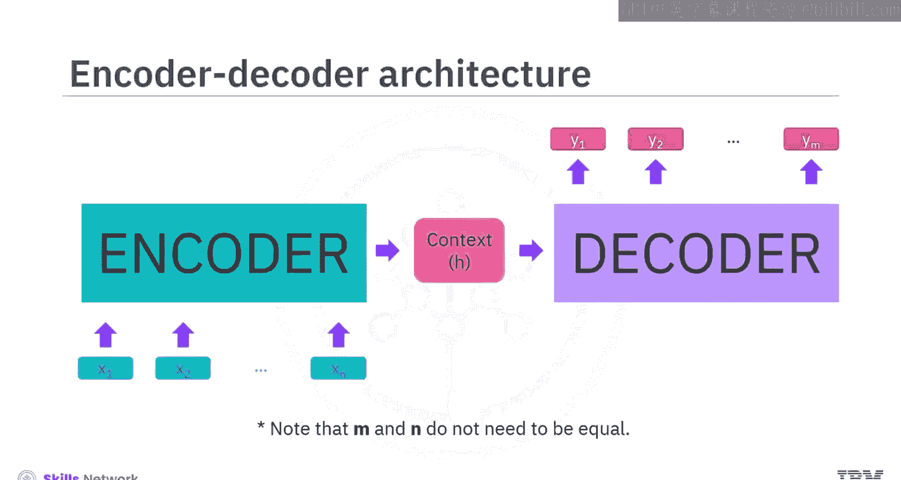
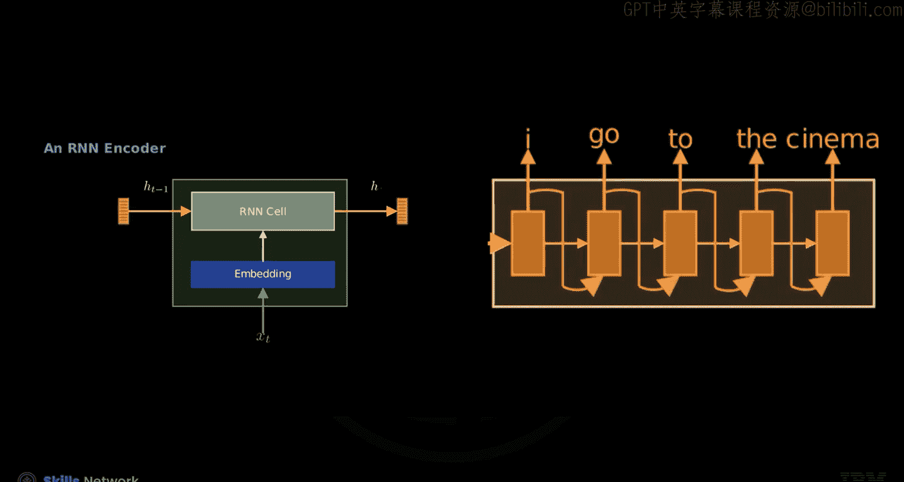
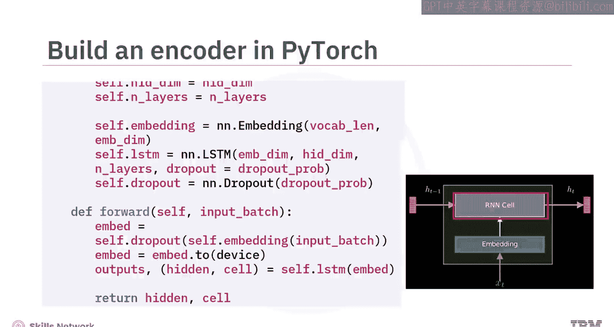
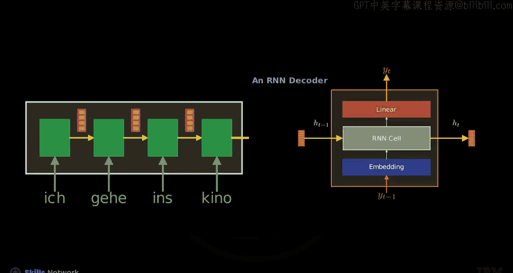

# 生成式人工智能工程：114：编码器-解码器RNN模型的翻译 🧠➡️🗣️

在本节课中，我们将学习如何实现一个编码器-解码器循环神经网络模型。我们将了解其架构、内部工作原理，并使用PyTorch框架来构建它。

---



## 概述

编码器-解码器架构是序列到序列模型的核心，常用于机器翻译等任务。它能够接收一个序列作为输入，并生成另一个长度可能不同的序列作为输出。

上一节我们介绍了序列到序列模型的基本概念，本节中我们来看看编码器-解码器架构的具体实现。

## 编码器-解码器架构

循环神经网络可用于创建序列到序列模型。该模型接收序列 **X** 作为输入，并生成序列 **Y** 作为输出。注意，**X** 和 **Y** 的长度不一定相同。为此，编码器-解码器架构被引入。

一个流行的序列到序列模型例子是翻译模型。


编码器和解码器协同工作，将输入序列转换为输出序列。编码器由一系列RNN单元组成，它们逐个处理输入序列，并将隐藏状态传递给下一个RNN单元。最后一个隐藏状态（上下文）被传递给解码器模块。

解码器模块同样由一系列RNN单元组成，它以自回归的方式一次生成一个词元来构成翻译结果。每个生成的词元会与隐藏状态一起，作为下一个RNN单元的输入，用于生成输出序列的下一个词元，直到生成结束符。

随着RNN变得更复杂，我们可以抽象掉一些细节。在这里，一个RNN单元代表一个RNN。关键区别在于，前一个状态的输出会被回收，作为下一个状态的输入。对于编码器，我们只关注隐藏状态，而不使用其输出。这是因为只有解码器负责生成输出文本，编码器仅负责对输入序列进行编码。

## 编码器内部结构



现在您对整体架构有了了解，让我们深入编码器单元的内部。

编码器由多个编码器单元组成，每个单元负责处理输入词元。每个单元的核心是一个嵌入层，它将输入词元转换为嵌入向量。这些向量随后通过RNN单元以产生隐藏状态，该状态随后被传递给下一个编码器单元的RNN单元。

以下是构建编码器的关键步骤：

1.  **定义编码器类**：在PyTorch中，定义一个继承自 `torch.nn.Module` 的类。
2.  **初始化参数**：
    *   `input_dim`: 输入词汇表大小。
    *   `emb_dim`: 嵌入向量的维度。
    *   `hid_dim`: LSTM隐藏状态和细胞状态的维度。
    *   `n_layers`: LSTM的层数。
    *   `dropout`: Dropout概率，用于防止过拟合。
3.  **构建层**：
    *   一个嵌入层 (`nn.Embedding`)。
    *   一个LSTM层 (`nn.LSTM`)，其输入维度为 `emb_dim`，隐藏状态维度为 `hid_dim`，层数为 `n_layers`，并应用 `dropout`。
4.  **前向传播**：在 `forward` 方法中，嵌入层处理输入，LSTM层输出隐藏状态和细胞状态。编码器只保留这些状态，丢弃输出向量。

**代码示例：编码器初始化**
```python
import torch.nn as nn

class Encoder(nn.Module):
    def __init__(self, input_dim, emb_dim, hid_dim, n_layers, dropout):
        super().__init__()
        self.embedding = nn.Embedding(input_dim, emb_dim)
        self.rnn = nn.LSTM(emb_dim, hid_dim, n_layers, dropout=dropout)
        self.dropout = nn.Dropout(dropout)
```



请注意，与门控循环单元仅具有隐藏状态不同，LSTM为每一层都维护一个额外的细胞状态。


## 解码器内部结构



解码器同样由许多解码器单元组成，每个单元内部生成预测的词元。每个单元都有一个嵌入层，用于创建嵌入向量。这些向量通过RNN单元，输出更新后的隐藏状态，该状态将被传递给后续解码器单元的RNN单元。

接下来，一个线性层将RNN的输出映射到输出维度，以生成下一个词元。

如您所见，解码器的工作方式与编码器略有不同，它以自回归的方式接收其先前生成的词元并生成下一个词元。

以下是构建解码器的步骤：

1.  **定义解码器类**：同样是 `nn.Module` 的子类。
2.  **初始化参数**：
    *   `output_dim`: 输出词汇表大小。
    *   `emb_dim`: 嵌入维度。
    *   `hid_dim`: LSTM隐藏状态维度。
    *   `n_layers`: LSTM层数。
    *   `dropout`: Dropout概率。
3.  **构建层**：
    *   一个嵌入层，将输出值映射到 `emb_dim` 大小的密集向量。
    *   一个LSTM层，接收嵌入输入并产生 `hid_dim` 大小的隐藏状态。
    *   一个线性层 (`nn.Linear`)，将LSTM输出映射到输出维度 `output_dim`。
    *   最后，对输出应用Softmax激活函数，生成在输出值上的概率分布。

**代码示例：解码器初始化**
```python
class Decoder(nn.Module):
    def __init__(self, output_dim, emb_dim, hid_dim, n_layers, dropout):
        super().__init__()
        self.output_dim = output_dim
        self.embedding = nn.Embedding(output_dim, emb_dim)
        self.rnn = nn.LSTM(emb_dim, hid_dim, n_layers, dropout=dropout)
        self.fc_out = nn.Linear(hid_dim, output_dim)
        self.dropout = nn.Dropout(dropout)
```


## 构建序列到序列模型

现在，我们将编码器和解码器组合成完整的序列到序列模型。

1.  **定义Seq2Seq类**：继承自 `nn.Module`，接收编码器、解码器、设备信息和目标词汇表作为输入。
2.  **实现前向传播**：`forward` 方法接受源序列和目标序列。它使用一个称为 **教师强制** 的技术来管理训练过程。
    *   **教师强制**：一种训练技巧，在每一步解码时，以一定概率 (`teacher_forcing_ratio`) 使用真实目标序列中的词元作为解码器的下一个输入，而不是使用模型自己上一步的预测输出。这有助于加速和稳定模型训练。
3.  **流程**：
    *   初始化批量大小、目标序列长度和词汇表大小。
    *   创建输出张量来保存解码器在每个时间步的预测。
    *   使用编码器处理源序列，提取其最终的隐藏状态和细胞状态，并将其设置为解码器的初始状态。
    *   解码器从目标序列的第一个词元（通常是 `<sos>` 起始符）开始。
    *   对于目标序列的每个时间步，将当前输入和先前的状态传递给解码器，保存输出。
    *   根据教师强制比率，决定下一步是使用真实目标词元还是上一步的预测词元作为输入。
    *   返回包含每个时间步预测的输出张量。

**代码示例：Seq2Seq模型前向传播核心逻辑**
```python
class Seq2Seq(nn.Module):
    def __init__(self, encoder, decoder, device):
        super().__init__()
        self.encoder = encoder
        self.decoder = decoder
        self.device = device
        # ... 其他初始化

    def forward(self, src, trg, teacher_forcing_ratio=0.5):
        batch_size = trg.shape[1]
        trg_len = trg.shape[0]
        trg_vocab_size = self.decoder.output_dim

        outputs = torch.zeros(trg_len, batch_size, trg_vocab_size).to(self.device)

        # 编码
        hidden, cell = self.encoder(src)

        # 解码器的第一个输入是 <sos> 词元
        input = trg[0, :]

        for t in range(1, trg_len):
            output, hidden, cell = self.decoder(input, hidden, cell)
            outputs[t] = output
            teacher_force = random.random() < teacher_forcing_ratio
            top1 = output.argmax(1)
            input = trg[t] if teacher_force else top1

        return outputs
```


## 总结

本节课中我们一起学习了编码器-解码器RNN模型在翻译任务中的应用。

*   RNN可用于创建序列到序列模型，接收一个序列输入并生成另一个序列输出。
*   编码器-解码器架构的引入使得输入和输出序列不必长度相同。
*   编码器由一系列RNN组成，逐个处理输入并传递隐藏状态，其最后的上下文状态传递给解码器。
*   解码器由一系列RNN组成，以自回归方式一次生成一个词元。
*   嵌入层将词元转换为向量，该向量通过RNN单元产生隐藏状态。
*   我们使用PyTorch框架，分别构建了编码器、解码器，并将它们组合成一个完整的序列到序列模型，其中采用了教师强制技术来优化训练过程。

通过理解这些核心组件和流程，您已经掌握了实现一个基础机器翻译模型的关键知识。


