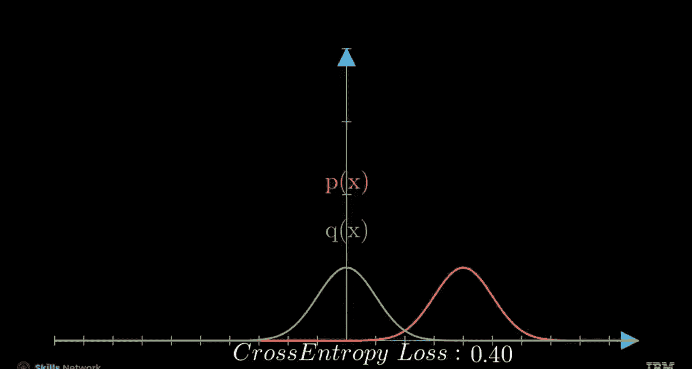
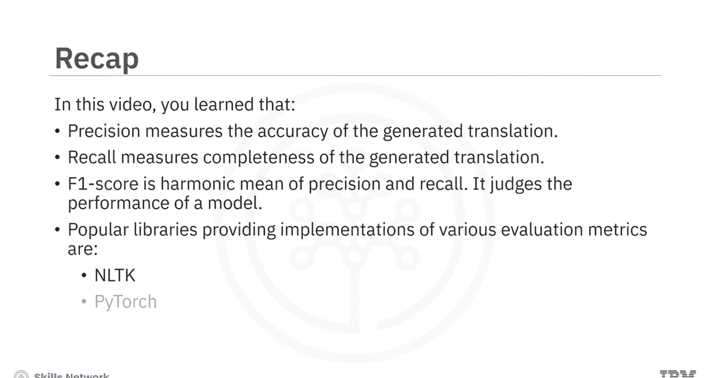

生成式人工智能工程：115：评估生成文本质量的指标 📊

在本节课中，我们将学习如何评估生成式人工智能模型（特别是大语言模型）所生成文本的质量。我们将重点介绍困惑度这一核心指标，并探讨在机器翻译等任务中常用的精确率、召回率等评估方法。

---

### 概述

生成式人工智能和大语言模型被广泛用于生成文本、图像等内容。衡量其成功与否的关键，在于其生成内容的一致性和上下文相关性。为了准确评估这些模型的性能，我们需要借助一系列评估指标。


上一节我们介绍了模型生成文本的基本原理，本节中我们来看看如何量化评估生成文本的质量。

---

### 困惑度：模型的不确定性度量

困惑度是评估语言模型效率的一个关键指标。它可以理解为模型在预测序列中下一个词时的“惊讶”或不确定程度。

**核心概念**：给定一个文本语料库，我们可以为整个词序列分配概率，从而衡量特定序列在数据中出现的可能性。在语言模型中，我们通过比较模型输出的预测概率分布与真实的概率分布（通常来自验证数据）来评估性能。

模型计算出的序列概率称为**似然**，记作 **Q**。这与用于衡量预测分布与真实分布之间差异的**交叉熵损失**函数密切相关。

**公式**：
在简化场景中，交叉熵损失 **H(P, Q)** 用于度量真实分布 **P** 与预测分布 **Q** 之间的差异。
```
H(P, Q) = - Σ P(x) log Q(x)
```
当预测分布与真实分布完全一致时，交叉熵损失为0。

困惑度正是通过对此损失值进行指数运算得到的：
```
困惑度 = exp(交叉熵损失)
```
更具体地，对于整个序列，困惑度计算为所有词元平均交叉熵损失的指数：
```
困惑度 = exp( (1/N) * Σ -log Q(word_i | context) )
```
其中 **N** 是序列长度。

**作用**：指数运算抵消了对数，将损失值转换回更易解释的空间。较低的困惑度值表示模型性能更好，预测更准确。

**示例**：
假设一个模型的平均交叉熵损失为 0.5，则其困惑度为 exp(0.5) ≈ 1.65。
假设另一个模型预测准确性较低，损失值为 4.96，则其困惑度为 exp(4.96) ≈ 142.6。指数函数使得性能差异更加明显。

**局限性**：困惑度提供了模型性能的整体度量，但无法捕捉生成文本质量的细微差别（如流畅性、创造性）。它通常仅用于衡量模型对训练集的学习程度。

---

### 基于N-Gram匹配的评估指标

为了在测试集上衡量生成文本的质量，特别是像机器翻译这样的任务，我们使用基于N-Gram匹配的指标，将生成文本与一组参考文本进行比较。

以下是计算匹配N-Gram数量的一个示例过程，通过比较假设序列（模型生成）和参考序列：



1.  `The`：匹配，一元计数增至1。
2.  `big`：不匹配，一元计数保持为1。
3.  `cat`：匹配，一元计数增至2。
4.  `sat`：不匹配，一元计数保持为2。
5.  `on`：匹配，一元计数增至3。
6.  `the`：匹配，一元计数增至4。
7.  `on the`：这是第一个匹配的二元组，二元计数增至1。
8.  `rug`：不匹配，一元计数保持为4，二元计数保持为1。

基于此，我们可以计算精确率和召回率。

---

### 机器翻译中的精确率、召回率与F1分数

在机器翻译中，精确率和召回率用于评估生成译文相对于参考译文的质量。

**精确率**：衡量生成译文的准确性。它计算的是生成译文中与参考译文匹配的N-Gram所占的比例。

**公式**：
```
精确率 = (匹配的N-Gram数量) / (生成译文中的N-Gram总数)
```

**召回率**：衡量生成译文的完整性。它计算的是参考译文中的N-Gram有多少在生成译文中被覆盖。

**公式**：
```
召回率 = (匹配的N-Gram数量) / (参考译文中的N-Gram总数)
```

**F1分数**：是精确率和召回率的调和平均数，用于基于两者综合判断模型性能。

**公式**：
```
F1分数 = 2 * (精确率 * 召回率) / (精确率 + 召回率)
```

---

### 自然语言处理评估库

在自然语言处理领域，有多个流行的库提供了各种评估指标的实现。

以下是常用的一些库及其包含的指标：

*   **NLTK库**：包含BLEU和METEOR等指标。
    ```python
    # 示例：初始化BLEU评分计算器
    from nltk.translate.bleu_score import sentence_bleu
    ```
*   **PyTorch库**：提供困惑度和交叉熵损失的计算。
    ```python
    # 示例：使用PyTorch计算交叉熵损失
    import torch.nn as nn
    loss_fn = nn.CrossEntropyLoss()
    ```
*   还有其他库也包含BLEU和ROUGE等指标。

**使用案例**：以下是一个使用NLTK库计算生成译文BLEU分数的示例代码。

```python
import nltk.translate.bleu_score as bleu

def calculate_bleu(references, hypothesis):
    """
    计算假设句子相对于参考句子的BLEU分数。
    references: 列表的列表，每个子列表包含一个参考句子的词元。
    hypothesis: 列表，包含假设句子的词元。
    """
    # 计算BLEU-4分数，使用均匀权重(0.25, 0.25, 0.25, 0.25)
    score = bleu.sentence_bleu(references, hypothesis)
    return score

# 创建参考译文列表（每个参考译文是词元列表）
references = [
    [‘the’, ‘cat’, ‘is’, ‘on’, ‘the’, ‘mat’],
    [‘a’, ‘cat’, ‘sits’, ‘on’, ‘the’, ‘rug’]
]
# 创建假设译文（模型生成）
hypothesis = [‘the’, ‘cat’, ‘sat’, ‘on’, ‘the’, ‘rug’]

# 计算并打印BLEU分数
bleu_score = calculate_bleu(references, hypothesis)
print(f”BLEU score: {bleu_score:.4f}”)
```

---

### 总结

本节课中我们一起学习了评估生成文本质量的核心指标。

1.  **困惑度**：是一个关键的评估指标，用于衡量语言模型和生成式AI模型的效率。它通过计算模型损失的指数得到，值越低表示模型性能越好。
2.  **交叉熵损失**：在困惑度计算中，用于度量模型预测分布与实际分布之间的差异。
3.  **指标局限性**：困惑度提供了模型性能的整体度量，但无法完全反映生成文本的细微质量。
4.  **机器翻译评估**：在机器翻译等任务中，我们使用**精确率**来衡量生成译文的准确性，使用**召回率**来衡量其完整性。
5.  **F1分数**：是精确率和召回率的调和平均数，用于综合评估模型性能。
6.  **评估工具**：在自然语言处理领域，有诸如NLTK、PyTorch等流行库，它们提供了这些评估指标的现成实现，方便我们使用。



通过掌握这些指标，你可以更科学地评估和比较不同生成式AI模型的文本输出质量。