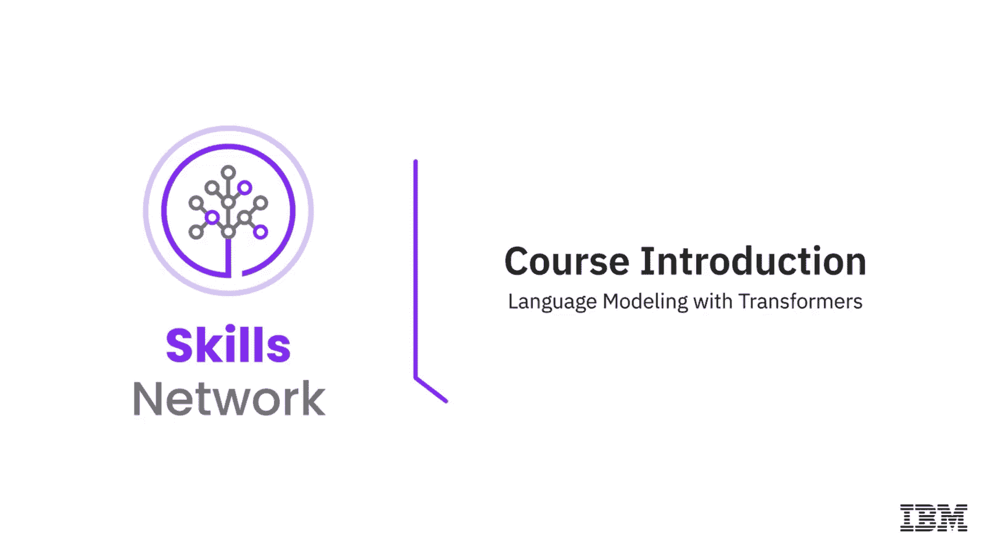
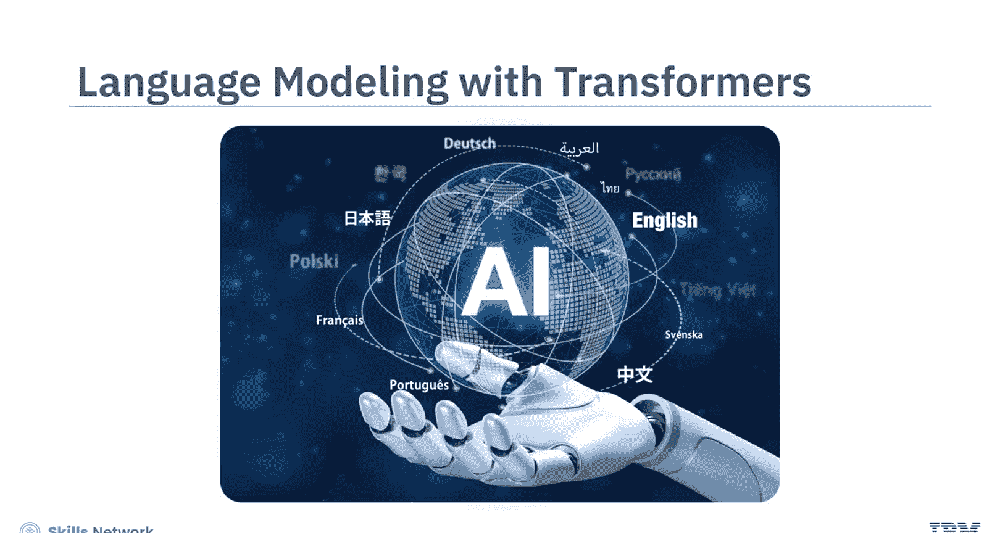
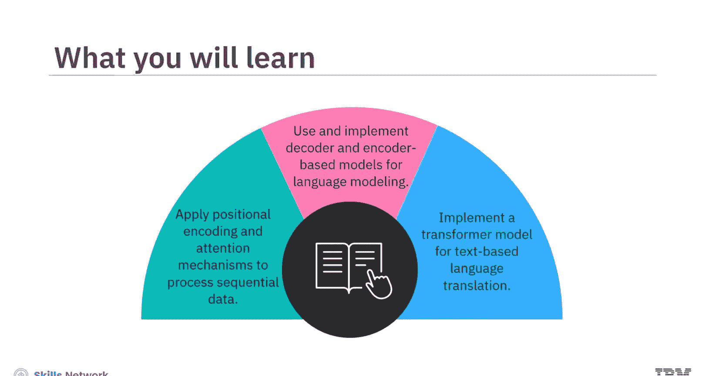
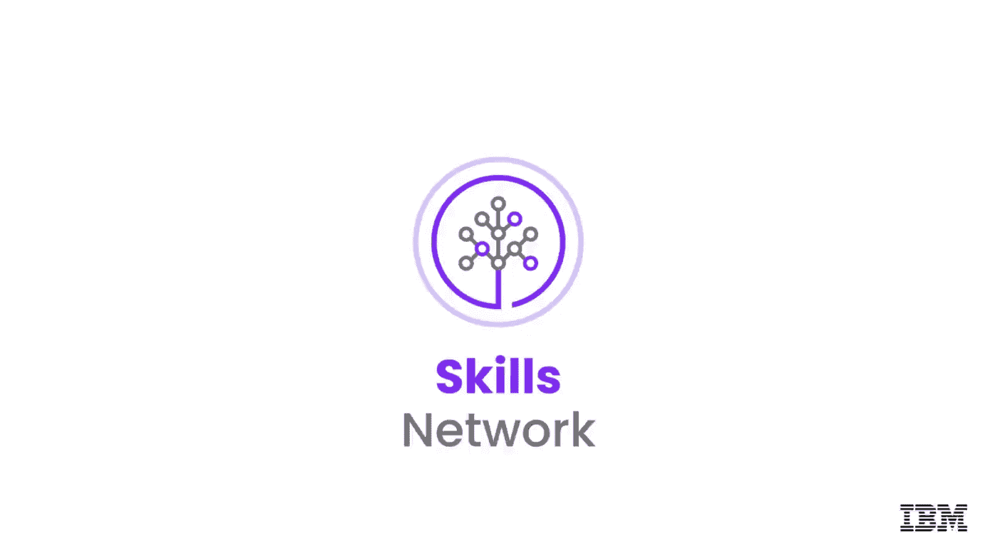

# 生成式人工智能工程：116：课程介绍 🎯

在本节课中，我们将要学习一门关于“基于Transformer的语言建模”的课程。这门课程将涵盖用于自然语言处理（NLP）的Transformer模型的基础与高级概念。

## 课程概述

本课程适合现有的和有抱负的数据科学家、机器学习工程师、深度学习工程师以及人工智能工程师。学习本课程，具备Python和PyTorch的基础知识，并对机器学习和神经网络有所了解将是一个优势，但并非严格要求。

完成本课程后，你将能够：
*   在基于Transformer的架构中应用**位置编码**和**注意力机制**来处理序列数据。
*   为语言建模任务使用并实现基于**解码器**的模型（如GPT）和基于**编码器**的模型（如BERT）。
*   实现一个Transformer模型，用于将文本从一种语言翻译成另一种语言。

## 课程模块详解

上一节我们介绍了课程的整体目标和适用人群，本节中我们来看看课程的具体内容安排。

### 模块一：Transformer基础

在模块一中，你将学习位置编码及其在PyTorch中的实现。你还会了解注意力机制在语言翻译中如何工作，自注意力机制如何助力语言建模，以及基于Transformer的模型如何用于文本分类。此外，你将理解缩放点积注意力机制的功能与实现，并学习如何提升注意力机制的效率。

以下是模块一包含的实践练习：
*   在Jupyter环境中使用PyTorch实现一个基础的自注意力机制和位置编码。
*   应用Transformer，通过数据加载器执行文本分类任务。

### 模块二：编码器与解码器模型

在模块二中，你将学习像GPT这样的解码器模型和像BERT这样的编码器模型，以及它们的训练过程和PyTorch实现。你还会学习如何使用掩码语言建模（MLM）和下一句预测（NSP）来预训练BERT模型，并为BERT进行数据准备。最后，你将通过理解Transformer架构及其实现，学习Transformer在翻译任务中的应用。

以下是模块二包含的实践练习：
*   构建并训练一个类似GPT的解码器模型和一个类似BERT的编码器模型。
*   使用PyTorch从零开始构建一个用于语言翻译的Transformer模型。

## 课程学习资源与方法

本课程提供了恰当的内容组合以促进学习。视频简短并聚焦于核心主题。阅读材料主要以文本形式提供详细内容。实验环节提供了技术环境、详细说明和可用于完成动手练习的代码片段。练习和分级测验将帮助你应用所学知识并评估你的掌握程度。

为了从课程中获得最大收益，请观看所有视频，完成实验以练习新技能，并尝试所有测验。

## 总结

本节课中，我们一起学习了这门“基于Transformer的语言建模”课程的整体介绍。我们了解了课程的目标受众、学习前提、你将掌握的核心技能，以及课程两个主要模块（Transformer基础、编码器与解码器模型）的详细内容和实践安排。现在，让我们开始这段激动人心的学习旅程，祝你好运！