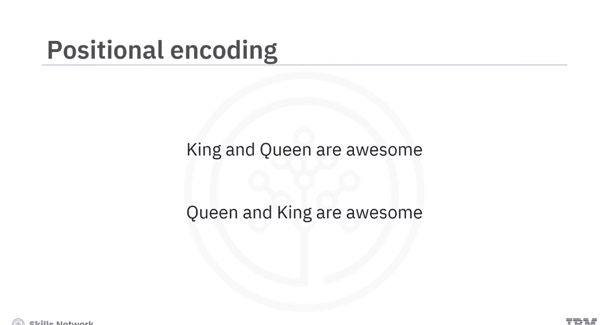
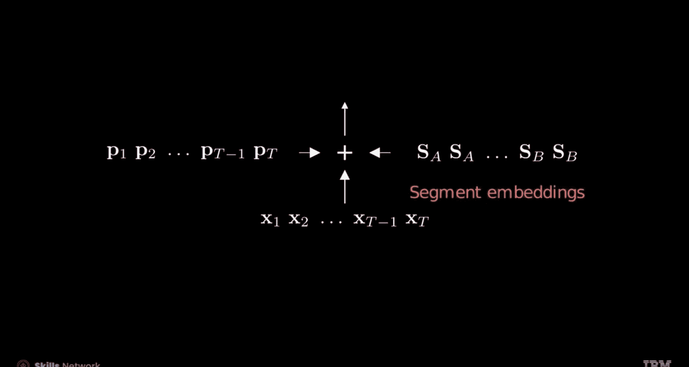

# 生成式人工智能工程：117：位置编码 📍

在本节课中，我们将要学习位置编码。位置编码是Transformer架构中的关键组成部分，它帮助模型理解序列中元素的顺序信息。

## 概述

Transformer模型在处理输入序列时，会同时处理所有标记（token）。然而，与人类理解语言类似，单词的顺序对于传达正确的语义至关重要。例如，“国王和王后很伟大”与“王后和国王很伟大”的含义略有不同。如果没有位置信息，模型可能会将这两个句子视为相同。位置编码正是为了解决这个问题而设计的。

上一节我们介绍了Transformer模型并行处理的特点，本节中我们来看看如何为模型注入位置信息。

## 位置编码的重要性

你是否尝试过打乱字母来组成单词？单词中字母的位置顺序对于传达正确的含义至关重要。同样，在基于Transformer的模型中，捕获每个标记的位置信息对于保持语义至关重要，因为标记是独立且同时被处理的。

考虑以下两个短语：
*   “king and queen are awesome.”
*   “queen and king are awesome.”

这两个句子略有不同。让我们看看它们的词嵌入向量表示。你会发现，如果不包含位置信息，这两个句子中“king”和“queen”的嵌入向量表示是相同的。为了解决这个问题，我们引入了位置编码。



位置编码将每个嵌入向量在序列中的位置信息整合进去。通常，位置编码被添加到输入嵌入中，使模型能够区分输入序列中不同元素的位置。

如下图所示，在添加位置编码后，第二个句子（绿色）中“king”和“queen”的向量表示与第一个句子（蓝色）中的表示不同了。


## 位置编码的技术原理

位置编码由一系列正弦波和余弦波组成，涉及两个参数。

以下是这两个参数的解释：
*   **`pos`参数**：代表正弦波随时间变化的位置，类似于标准绘图中的时间变量`t`或`x`坐标。它对应序列中每个词的位置索引。
*   **`i`参数**：即维度索引，它有效地为每个嵌入维度生成一个独特的正弦波或余弦波，控制每个波的振荡次数。

这些波中的每一个都被添加到词嵌入的不同维度中。让我们通过一个例子进一步探索。

## 位置编码计算示例

我们以序列“transformers are awesome”为例。其中每个词有一个嵌入向量，每个嵌入向量的维度为4。

*   `pos`是每个词嵌入在序列中的特定位置。在这个例子中，序列长度为3。
*   每个词嵌入的维度为4，其位置编码将根据其索引`i`是奇数还是偶数来区分。

以下是计算过程：
1.  为“transformers”这个词的嵌入添加位置编码。对于位置编码中的每个维度`i`，引入相应的正弦波或余弦波。因此，对于`i=0`，添加一个正弦波；对于`i=1`，添加一个余弦波，依此类推，确保每个维度都由其独特的波表示。
2.  同样地，计算单词“are”的位置编码值。
3.  最后，计算单词“awesome”的位置编码值。

你可以查看一个表格，其中描绘了对应输入句子的位置编码值。

四张图说明了位置编码，每张图对应词嵌入的一个维度，序列长度为3，因此每个正弦函数只看到三个值。

## 实际场景中的位置编码

让我们生成一个嵌入维度为8的位置编码来描绘一个更现实的场景。有时为了实用性，你可以将最大序列大小与词汇表大小对齐，通过旋转位置编码的行来指示不同的编码函数，而列代表序列中的时间位置。

位置编码为序列位置提供独特且周期性的值。余弦波永远不会在同一点与基线相交，这确保了模型能够有效地区分和处理可变长度的序列。其值范围在-1和1之间，防止了位置编码掩盖原始嵌入的信息。这些编码还支持可微性和相对位置关系，使模型更容易训练。

## 位置编码的向量表示

你也可以将每个词嵌入表示为一个列向量`X`。位置编码可以被概念化为一系列向量，其中每个向量`P`捕获序列中的一个特定位置。当这个位置向量被添加到其对应的嵌入向量时，组合后的向量保留了位置信息，确保元素序列的顺序在结果向量中得到维持。

## 可学习的位置编码与段嵌入

在诸如GPT之类的模型中，位置编码不是静态的，而是可学习的参数`W`。这些由张量表示的可学习参数被添加到嵌入向量中，并在训练期间进行优化。



某些模型（如BERT）中使用的**段嵌入**与位置编码相关，提供额外的位置信息。你可以将段嵌入与位置编码一起整合到现有的嵌入中。


## 在PyTorch中实现位置编码

现在让我们看看如何使用PyTorch实现位置编码。

考虑嵌入`my_embeddings`。你可以构建一个模块来将位置编码集成到嵌入中。

以下是实现步骤：
1.  初始化一个`nn.Parameter`张量，其形状为`(max_seq_len, embed_dim)`，其中`max_seq_len`设置为超过训练数据集中最长序列的长度，`embed_dim`定义其深度（即嵌入维度）。
2.  接下来，将标记的位置编码整合到嵌入中。
3.  应用Dropout作为正则化技术以减轻过拟合。
4.  应用位置编码以获得编码后的标记。

核心代码结构如下：
```python
import torch.nn as nn

class PositionalEncoding(nn.Module):
    def __init__(self, max_seq_len, embed_dim, dropout=0.1):
        super().__init__()
        self.dropout = nn.Dropout(p=dropout)
        # 创建可学习的位置编码参数
        self.pe = nn.Parameter(torch.zeros(1, max_seq_len, embed_dim))
        # 或者，使用固定的正弦/余弦编码进行初始化
        # ... 初始化代码 ...

    def forward(self, x):
        # x 形状: (batch_size, seq_len, embed_dim)
        x = x + self.pe[:, :x.size(1), :] # 添加位置编码
        return self.dropout(x)
```
你定义一个具有可学习参数的位置编码模块。实例化一个具有所需形状的`nn.Parameter`张量。然后将此位置编码与嵌入集成。你也可以应用Dropout作为正则化策略以降低过拟合风险。最后，该模块应用这些位置编码以获得最终的编码标记。

## 总结

本节课中我们一起学习了位置编码。

*   你了解到位置编码将每个嵌入在序列中的位置信息整合进去。
*   位置编码由一系列正弦波和余弦波组成，涉及两个参数：`pos`（位置）和`i`（维度索引）。
*   `pos`参数代表正弦波随时间变化的位置。
*   `i`参数，即维度索引，有效地为每个嵌入生成一个独特的正弦波或余弦波，控制每个波的振荡次数。
*   位置编码也可以是可学习的参数。这些由张量表示的可学习参数被添加到嵌入向量中，并在训练期间进行优化。
*   某些模型（如BERT）中使用的段嵌入与位置编码相关，提供额外的位置信息。


