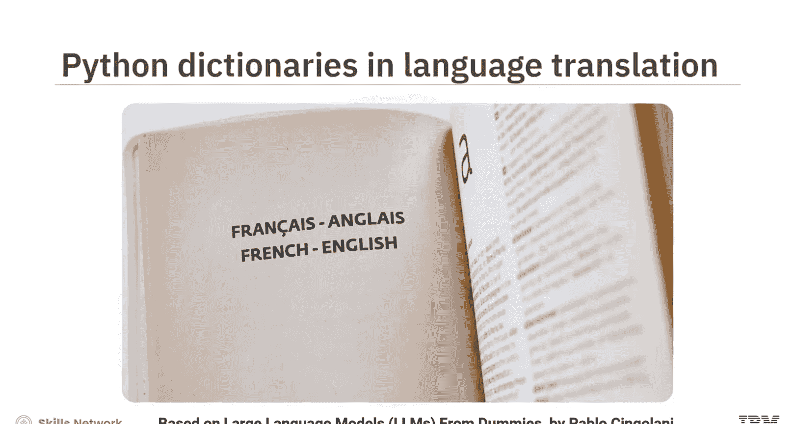
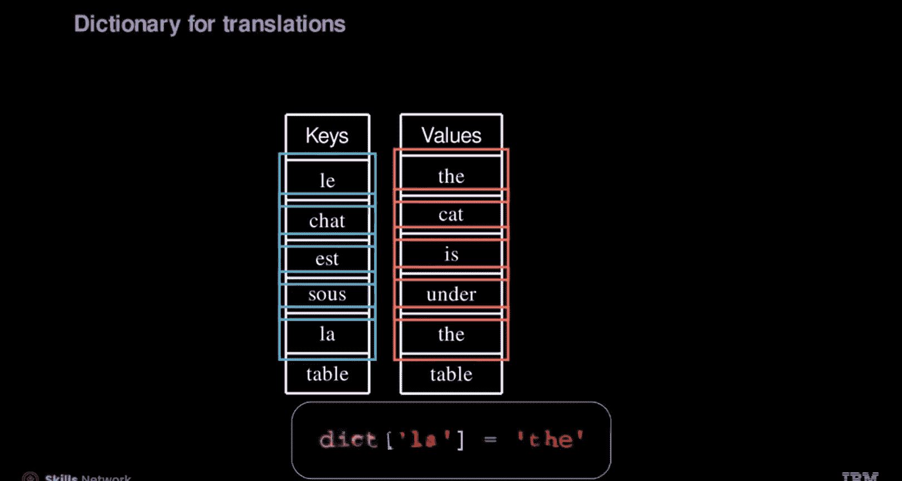
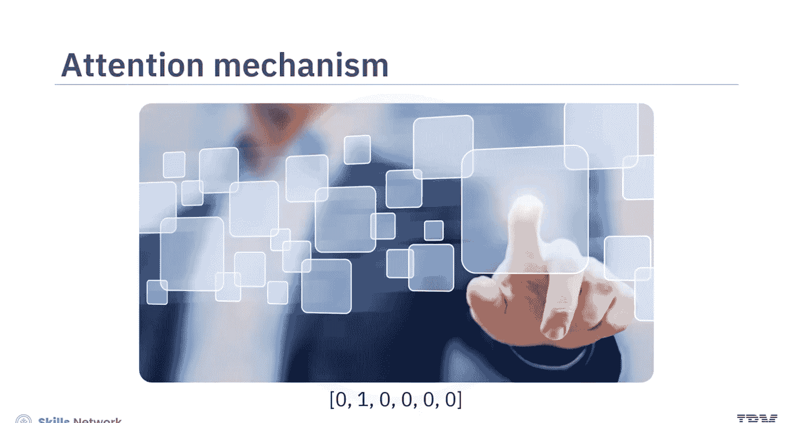
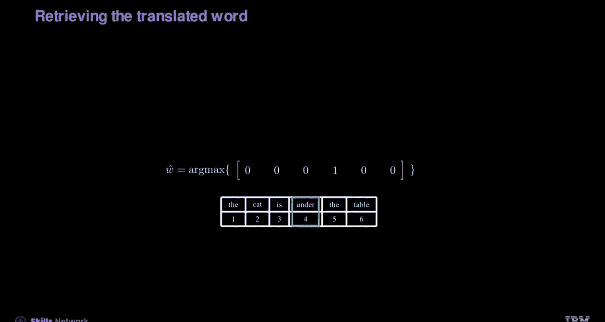
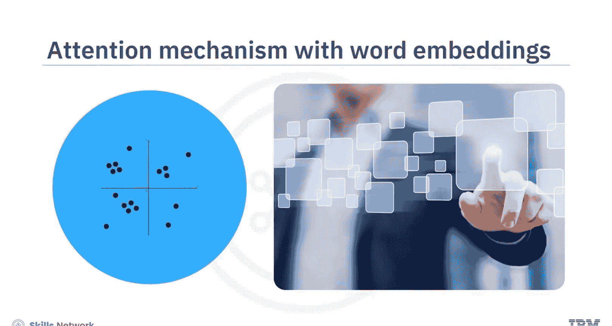
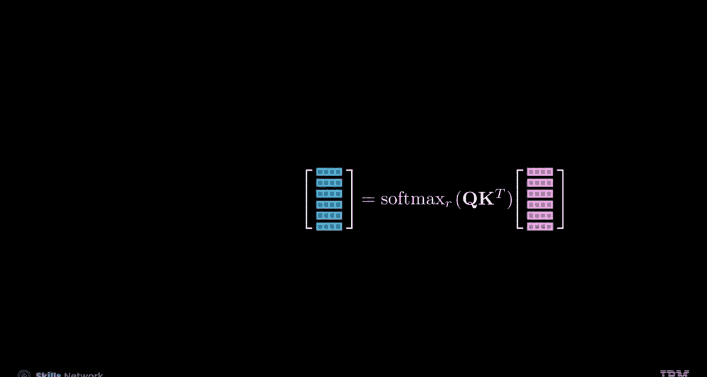
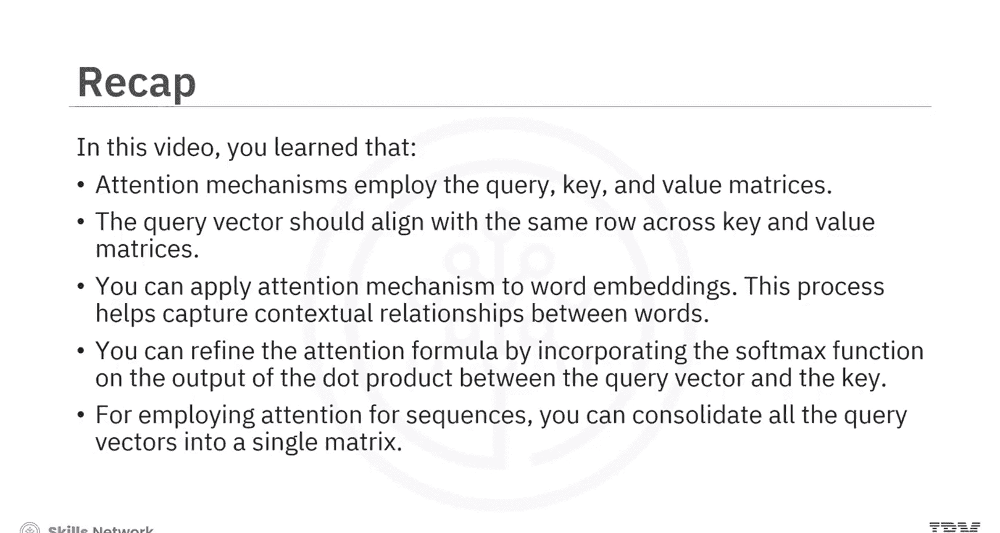

# 生成式人工智能工程：118：注意力机制 🧠

在本节课中，我们将要学习注意力机制的工作原理。我们将从类比Python字典的翻译任务开始，逐步理解注意力机制如何应用于词向量和序列处理，并最终掌握其核心公式。

## 概述

注意力机制是生成式AI模型中的关键技术。它使模型能够像人在嘈杂环境中专注于对话一样，聚焦于输入数据中最相关的部分及其关系。本节我们将通过语言翻译的例子，详细拆解注意力机制的工作流程。

## 从Python字典到注意力机制

上一节我们介绍了注意力机制的核心思想是“聚焦”。本节中，我们来看看如何用一个简单的类比——Python字典——来理解其基础结构。

Python字典通过键值对完成翻译任务。查询时输入键（如法语单词），字典返回对应的值（英语翻译）。





```python
# 类比：一个简单的翻译字典
translation_dict = {
    "chat": "cat",
    "est": "is",
    "sous": "under",
    "la": "the",
    "le": "the"
}
```

在注意力机制中，我们使用向量而非字符串。以下是其结构与字典的对应关系：



*   **键**： 输入序列（如法语单词）的向量表示，构成键矩阵 **K**。
*   **查询**： 我们想要翻译的单词的向量表示，构成查询矩阵 **Q**。初始时，查询向量与键向量相同。
*   **值**： 输出序列（如英语单词）的向量表示，构成值矩阵 **V**。

键矩阵 **K** 和值矩阵 **V** 的行必须对齐，使得同一个单词的键和值位于相同行。

## 注意力机制公式 🔢

理解了基本结构后，我们来看看注意力机制的核心计算过程。其基础公式用于翻译单个单词：

**H = Q · Kᵀ · V**

其中：
*   **Q** 是查询向量。
*   **Kᵀ** 是键矩阵的转置。
*   **V** 是值矩阵。
*   **H** 是输出的向量，代表翻译结果。

计算步骤如下：
1.  **计算相似度**： `Q · Kᵀ` 进行点积运算。由于我们使用独热编码向量，只有当查询向量与某个键向量完全匹配时，结果向量中对应位置才为1，其余为0。
2.  **提取值**： 将上一步得到的向量（本质是一个选择器）与值矩阵 **V** 相乘，从而“提取”出对应的值向量（即翻译后的单词向量）。

要从输出向量 **H** 中得到最终的单词，可以使用以下公式：

**ω̂ = argmaxᵢ(H · Vᵀ)**

这个公式通过 **H** 与所有值向量进行点积，找到最匹配的那个值，其索引即为目标单词。

## 将注意力机制应用于词向量 🧩





前面的例子使用了独热编码，但现实中我们使用词向量。现在，我们来看看注意力机制如何与词向量结合，这使其能够翻译从未见过的单词。

我们将键和值替换为词向量，并保持行对齐。此时，查询向量与键向量的点积不再是非0即1，而是计算它们之间的**相似度**。

为了从相似度分数中得到一个清晰的选择，我们引入 **Softmax** 函数来改进公式：

**Z = Q · Kᵀ**
**α = softmax(Z)**
**H = α · V**

Softmax 函数的作用是：
*   将点积结果 **Z** 归一化为一个概率分布 **α**。
*   放大最大值的权重（使其接近1），同时抑制较小值的权重（使其接近0）。
*   使得 **α** 近似一个“软”的独热编码向量，从而更平滑地选择值向量。

这个过程实现了一种搜索方法：为查询词向量找到最相似的键词向量，并据此获取对应的值词向量。

## 将注意力机制应用于序列 📜

在实际应用中，我们需要同时处理整个序列（如一个句子），而非单个单词。幸运的是，矩阵运算使其变得高效。

我们可以将所有查询向量堆叠成查询矩阵 **Q**，一次性计算整个序列的注意力输出：

**H = softmax(Q · Kᵀ) · V**

这个公式能够：
*   **输入**： 一个序列的词向量（粉色部分）。
*   **输出**： 一组经过上下文信息精炼的词向量（蓝色部分），更适用于翻译等下游任务。

需要注意的是，在Transformer等先进模型中，实际翻译方法会更复杂，例如会加入**位置编码**来记录单词在序列中的顺序信息。但对于简单的数据问题，位置编码可能并非必需。



## 总结

本节课中我们一起学习了注意力机制的核心概念。我们了解到：



1.  注意力机制使用**查询（Q）、键（K）、值（V）** 三个矩阵。
2.  查询向量应与键、值矩阵中的对应行对齐。
3.  注意力机制可以应用于**词向量**，通过计算相似度来捕获单词间的上下文关系，从而处理未知词汇。
4.  通过引入 **Softmax** 函数，可以改进注意力公式，使模型能够更清晰地从相似度中做出选择。
5.  对于序列处理，可以将所有查询向量整合成矩阵 **Q**，进行高效的批量计算。