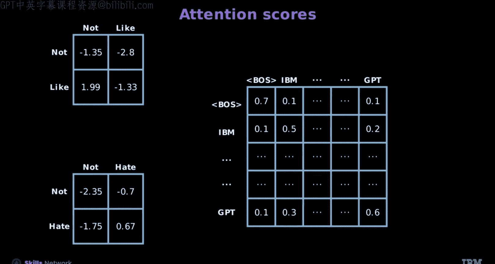
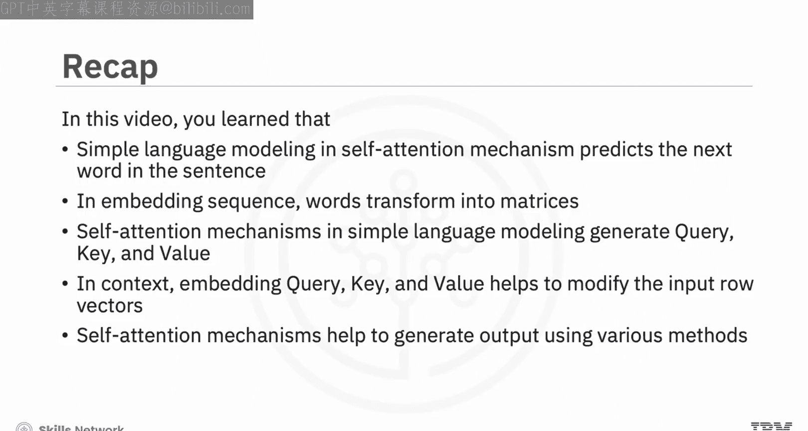

# 生成式人工智能工程：119：自注意力机制 🧠

在本节课中，我们将要学习自注意力机制的核心概念。自注意力机制是Transformer架构的核心，它使模型能够同时关注输入序列中的所有单词，从而生成包含上下文信息的词嵌入。我们将从简单的语言建模任务开始，逐步解析自注意力机制如何工作。

## 简单语言建模与自注意力

上一节我们介绍了自注意力机制的重要性，本节中我们来看看它在简单语言建模中的应用。简单语言建模在自注意力机制中用于预测句子中的下一个词，这是理解自然语言的一个重要方面。

例如，在下表中，左侧呈现了单词序列，右侧则是简单语言建模预测的单词。

现在，当输入单词“not like”时，简单语言建模将预测单词“hate”。同样，输入单词“do like”将预测单词“like”。这意味着当单词的上下文发生变化时，前面单词的含义也会随之改变。

## 词嵌入与序列矩阵

单词被转换为嵌入序列的矩阵，其中每个嵌入的单词代表序列矩阵中的一个列向量。

例如，`X` 代表矩阵，下标 `not like` 表示单词序列，其中每一列对应一个词嵌入。这意味着矩阵 `X_not_like` 包含了“not”和“like”的嵌入。因此，每个序列都被转换为一个矩阵 `Re`，并表示为数据集中的一个样本序列。

考虑 `n` 个样本序列，记为 `Xn`。这意味着每个序列可以有不同的长度。需要注意的是，像PyTorch这样的库可能会以不同的方式排列这些向量。

## 自注意力机制的核心组件

自注意力机制在简单语言建模中涉及生成三个关键组件：查询（Query, **Q**）、键（Key, **K**）和值（Value, **V**）。这个过程始于输入词嵌入与可学习参数的结合。

以下是生成这些矩阵的步骤：
1.  你可以通过将输入序列矩阵乘以称为查询投影权重和偏置的可学习参数来推导查询矩阵。这里也会使用一个长度为令牌数量的行向量 `1`。
2.  类似地，你可以通过将输入序列矩阵与另一组可学习参数（键投影权重和偏置）相乘来推导键矩阵。
3.  你可以应用相同的过程来获得值矩阵，其中输入再次乘以其对应的一组可学习参数，称为值投影权重和偏置。然而，偏置项并不总是被包含在内，并且序列嵌入通常在这些操作之前添加。为了清晰起见，在这个简化的解释中省略了它们。

自注意力机制利用查询、键和值结构来优化输入词嵌入。在此上下文中，`sqrt(D)` 代表嵌入的维度。得到的矩阵记为 `H‘`，其列体现了增强的嵌入，称为上下文嵌入。此外，这些嵌入的数量与输入序列的长度一致，确保了原始表示和增强表示之间的一一对应。

你可以对上下文嵌入应用一个额外的线性层，其中你将得到输出 `H`，这是使用额外的可学习参数对 `H‘` 的细化版本。因此，`H` 是初始嵌入的更细致入微的表示。

## 自注意力机制的应用与输出

自注意力机制有助于生成序列输出。例如，将上下文嵌入机制简化为平均操作有助于简化过程。在这个简化框架中，上下文嵌入作为神经网络的输入，其中初始层的输出记为 `Z^1`。

让我们考虑一个之前用于翻译的自注意力机制示例，其中自注意力机制的输出是你希望翻译的嵌入单词。在这个过程中，通过矩阵乘法计算嵌入与嵌入列表之间的点积。`argmax` 函数有助于获取翻译单词的令牌索引。

当使用自注意力时，点积被神经网络取代，其中 `Z1` 代表平均嵌入，作为神经网络的输入参数。该网络生成一系列逻辑值，记为 `Z2`。此外，神经网络的输入维度与嵌入空间对齐，其输出维度与词汇表大小匹配。

然而，在训练期间，神经网络使用 `softmax` 函数来计算所有潜在单词的概率分布。这个过程有助于训练网络和注意力机制的可学习参数。在PyTorch中，逻辑值在训练期间直接使用，而 `argmax` 函数用于确定序列的下一个令牌或单词索引。

## 预测示例与机制优势

现在让我们使用自注意力机制来预测“not like”的令牌，预期结果是“hate”。自注意力机制通过与可学习参数和偏置的乘法生成查询、键和值矩阵。

在这个例子中，输入 `X` 乘以投影以获得 `Q`、`K` 和 `V`。这个过程由一系列矩阵乘法组成。这些操作可以并行化并通过图形处理单元（GPU）处理，从而允许更高效地处理更多数据。这是自注意力机制优于循环神经网络（RNN）等其他序列模型的原因之一。

此外，你可以通过将查询矩阵与键矩阵相乘来获得注意力分数，然后对这些分数应用 `softmax` 函数进行归一化。接下来，将归一化的分数与值矩阵 `V` 相乘以推导出 `H‘`，它通过乘以输出投影参数来增强上下文嵌入。进一步，取这些嵌入的平均值，并通过最终映射到词汇表的层。激活对应于每个单词。最后，对这些激活应用 `argmax` 函数，获得的索引揭示了与“hate”相关的逻辑值。

## 注意力分数的深入分析

进一步深入注意力机制，你可以观察到每个序列的排列方式是输入令牌位于上方，下方是归一化的注意力和相应的值。这些值充当修改后的词嵌入。

例如，查看左侧的前两个样本，你可以发现第一列始终代表令牌“not”的值，这个模式对每个令牌都成立。同时，归一化的注意力强调了配对之间独特的关系动态，突出了序列内复杂的相互作用。

在这个例子中，从点积（键和查询）导出的注意力分数在自注意力机制中起着关键作用，揭示了模型的关注点。注意力分数针对三个短语进行了说明：“not like”、“not hate”和一个任意序列，阐明了序列内令牌之间的关系。

## 总结

本节课中我们一起学习了自注意力机制。你了解到，自注意力机制中的简单语言建模用于预测句子中的下一个词，这是理解自然语言的一个重要方面。单词被转换为嵌入序列的矩阵，其中每个嵌入的单词代表序列矩阵中的一个列向量。

你还学习到，自注意力机制在语言建模中利用输入词嵌入和可学习参数生成查询、键和值。自注意力机制使用查询、键、值和上下文嵌入来修改输入行向量。最后，你了解到自注意力机制通过各种方法帮助生成输出。