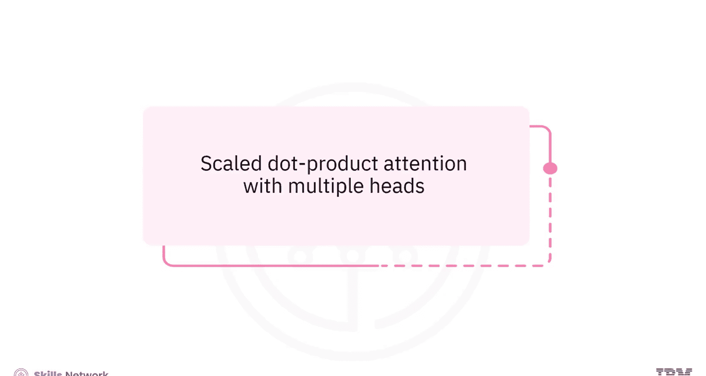
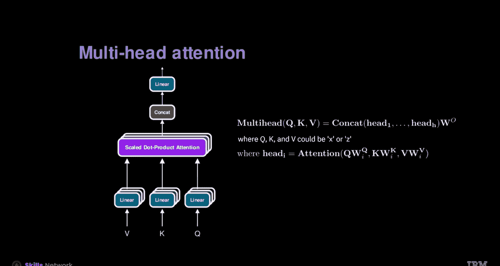
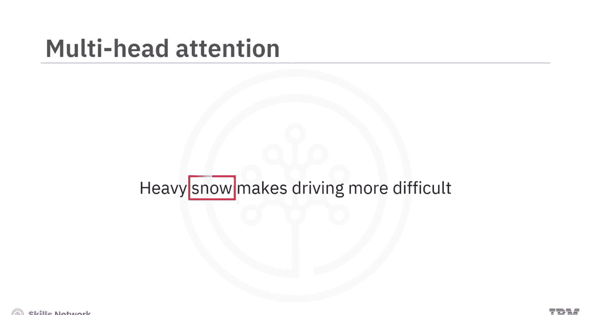
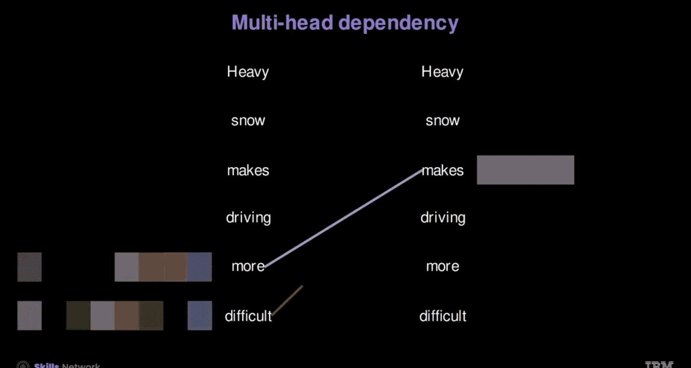
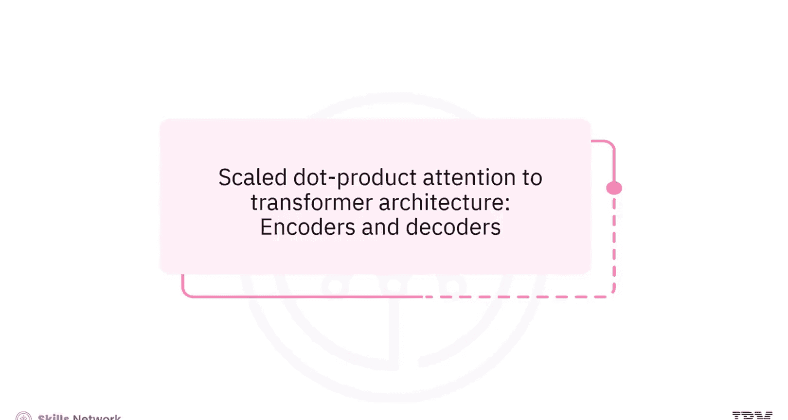
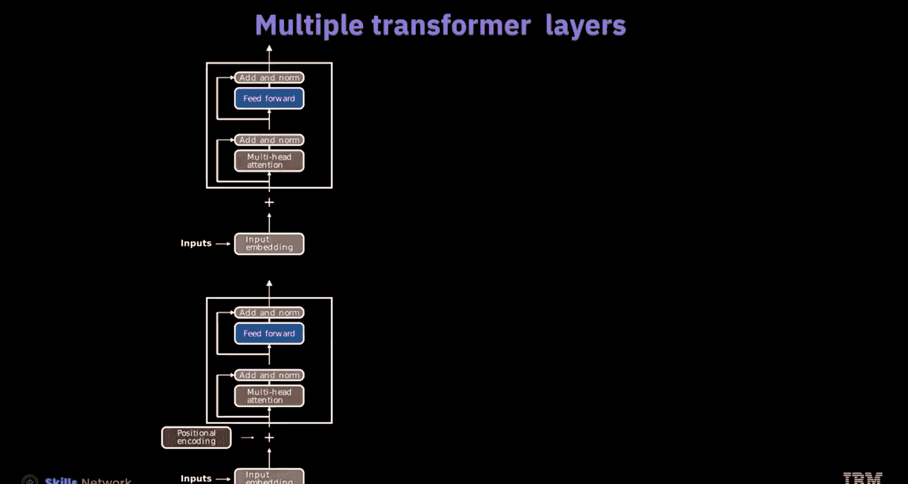

# 生成式人工智能工程：120：从注意力机制到Transformer架构 🧠

在本节课中，我们将学习注意力机制的核心概念及其在Transformer架构中的演进。我们将从缩放点积注意力开始，逐步深入到多头注意力机制，并最终理解完整的Transformer编码器层是如何构建和工作的。

---



## 从缩放点积注意力到多头注意力

上一节我们介绍了注意力机制的基本思想，本节中我们来看看其具体实现——缩放点积注意力。

缩放点积注意力机制是Transformer模型的基础，其核心是一系列矩阵乘法运算。该机制整合了查询（Q）、键（K）和一个缩放因子。缩放因子用于防止点积结果过大。根据任务类型，可能会使用掩码操作。最后，将结果与值（V）相乘以产生输出。

**公式表示如下：**
`注意力输出 = softmax( (Q * K^T) / sqrt(d_k) ) * V`

在自注意力架构中，查询Q、键K和值V都源自同一个输入列向量X。它们分别与各自的可学习参数矩阵相乘。对于语言翻译等任务，会使用交叉注意力机制，其中的值和键来自不同的输入源（例如需要翻译的语言，表示为Z）。

---

## 多头注意力机制

理解了基础的注意力计算后，我们来看看如何通过并行处理来增强其能力，即多头注意力。

多头注意力的运作方式是并行执行多个缩放点积注意力过程，每个过程的输出称为一个“头”。这种策略允许每个头关注输入序列的不同部分。





以下是多头注意力的处理步骤：
1.  将输入嵌入向量分割成多个部分。
2.  每个部分通过独立的注意力机制（一个“头”）进行处理。
3.  将所有头的输出拼接起来。
4.  将拼接后的结果通过一个最终的线性层。

**代码示例：初始化多头注意力**
```python
import torch.nn as nn
# 假设嵌入维度为4，使用2个注意力头
embed_dim = 4
num_heads = 2
# 确保嵌入维度能被头数整除
assert embed_dim % num_heads == 0
multihead_attn = nn.MultiheadAttention(embed_dim, num_heads, batch_first=False)
```

你可以通过拼接每个头的输出，然后乘以一个最终的线性层来扩展此过程，以处理任意数量的头。头的数量是一个超参数，唯一的约束是输入维度必须能被头的数量整除。



---

## Transformer架构：编码器

多头注意力本身只是更大架构的一部分。Transformer架构通过引入额外的层来增强注意力机制的效率。

Transformer主要分为编码器和解码器两种类型。在编码器阶段，过程始于处理已与位置编码结合的词嵌入。只有输入X被传递给多头注意力。编码器模型通常不会直接对注意力机制应用掩码。



下一步是“相加与归一化”过程。这一步至关重要，因为它将注意力输出与其原始输入嵌入相加并进行归一化。这个过程增强了模型的深度，同时缓解了潜在的梯度问题。

随后，一个前馈网络对每个位置应用一个全连接层，然后根据特定用例的需求，再进行一次“相加与归一化”。根据需求，可以将更多层集成到架构中。

---

## 在PyTorch中构建编码器层

了解了理论架构后，我们来看看如何在代码中实际构建一系列编码器层实例。

首先，指定注意力头的数量和嵌入的维度。然后确定所需的层数。下一步是通过指定头的数量和嵌入的维度来创建一个Transformer编码器层对象。接着，将层数提供给Transformer编码器构造函数，以组装一系列编码器层。在此之前会添加位置编码。

**代码示例：堆叠编码器层**
```python
import torch
import torch.nn as nn
# 定义参数
num_heads = 2
embed_dim = 4
num_layers = 2
# 创建编码器层
encoder_layer = nn.TransformerEncoderLayer(d_model=embed_dim, nhead=num_heads)
# 堆叠多层以创建编码器
transformer_encoder = nn.TransformerEncoder(encoder_layer, num_layers=num_layers)
# 随机初始化输入 (序列长度, 批次大小, 嵌入维度)
x = torch.rand(10, 5, embed_dim)
# 前向传播
output = transformer_encoder(x)
print(output.size()) # 应保持与输入相同的维度
```



当输入张量X通过Transformer编码器时，它会依次经过所有编码器层。每一层都应用多头自注意力，然后是前馈神经网络，并在每一步都包含残差连接和层归一化。可以看到，输出嵌入保持了与输入相同的大小。

---

## 总结

本节课中我们一起学习了注意力机制到Transformer架构的关键演进。

我们学习了缩放点积注意力机制涉及一系列整合了查询、键和缩放因子的矩阵乘法。可能会使用掩码操作，最终与值相乘产生输出。

多头注意力通过并行执行多个缩放点积注意力过程来运作。通过引入额外的层，可以增强注意力机制的效率，正如在Transformer中那样。


最后，在PyTorch中串联堆叠多个Transformer层，允许模型在不同层次上对数据中的复杂关系和表征进行建模。层的深度是一个可以调整以提升性能的重要超参数。