# 生成式人工智能工程：5：用于分类的Transformer编码器 🧠

在本节课中，我们将学习如何将基于Transformer的模型应用于文本分类任务。你将能够解释其工作原理，并了解创建文本处理流程、构建模型以及训练模型的完整步骤。

---

## 概述

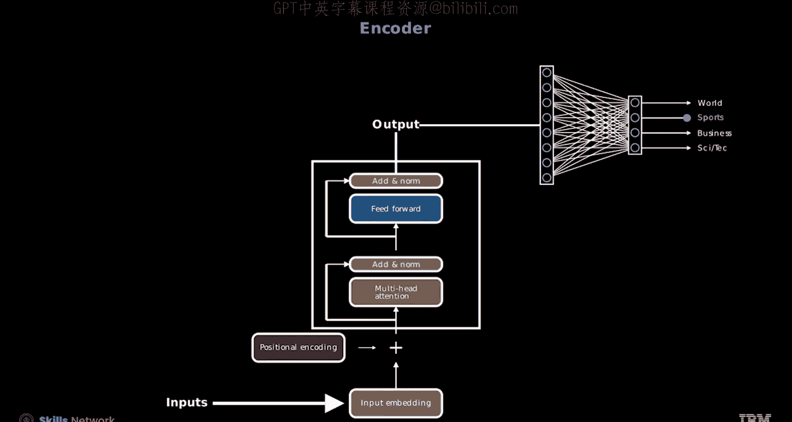

传统的神经网络在处理文档分析时，可能导致词语间上下文关系的丢失。通过集成Transformer注意力层，可以同时处理整个词序列。这种方法使得网络在保留上下文信息的同时，能够对文档进行分类。

上一节我们介绍了Transformer的基础架构，本节中我们来看看如何将其具体应用于文本分类任务。

---

## 创建文本处理流程

以下是创建文本分类数据管道的步骤。

首先，使用Torch text从AG News数据集的训练分割中创建迭代器。输出包含代表新闻文章的文本及其对应的类别标签。

你可以为非数字的类别标题分配适当的标签：前两个句子为“商业”，最后一个句子为“科学和技术”。

对于AG News数据集，你需要为训练和测试分割都创建迭代器，使用PyTorch的DataLoader，并将95%的训练集用于训练，5%留作验证。

接着，设置一个英语文本的分词器，从数据集中生成词元，并构建词汇表。

然后，设计一个自定义的整理函数来处理序列分类数据集的特殊需求。与之前分类任务的主要区别在于，现在的输出是一个序列索引。此外，为了处理不同长度的序列，你需要应用零填充来标准化结果。

最后，为训练集、验证集和测试集创建数据加载器。检查样本时，你会看到标签是整数，其数量与批次大小匹配。变量`sequence`是一个张量，保存着索引化的序列。与传统的神经网络不同，在基于Transformer的模型中，张量的第一维代表序列，第二维代表批次。

---

## 创建模型

现在，让我们学习在PyTorch中创建模型的步骤。我们将深入探讨用于分类任务的编码器构造函数，并解析相关参数。重点将放在与Transformer架构和输入层顺序处理相关的方面。

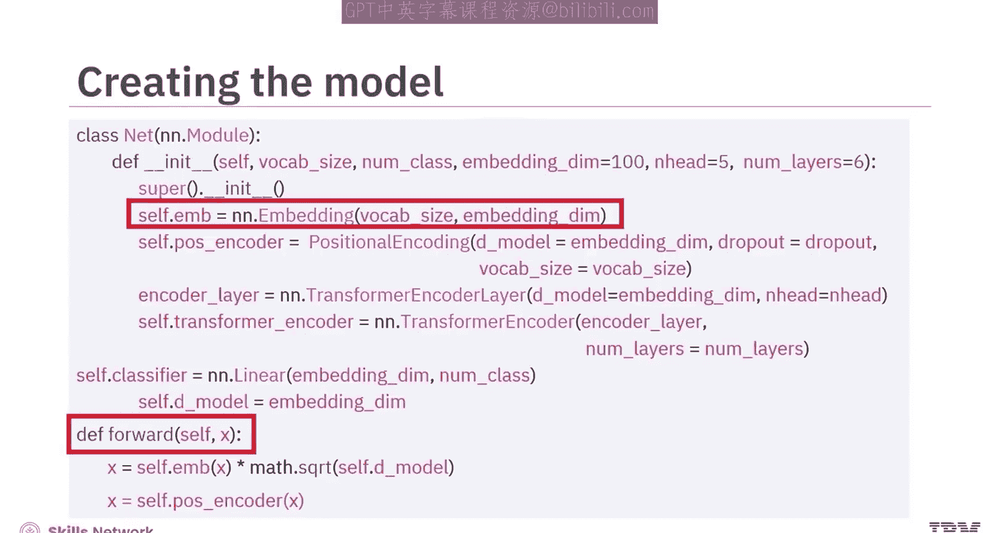

### 嵌入层

嵌入层通过`nn.Embedding`实例化。该层将词汇表中大小为`vocab_size`的词元映射到指定维度`embedding_dim`的密集向量中。

为了观察编码器的运作，你可以调用前向传播函数。让我们探索该函数如何通过变量`X`处理输入层的每一层。

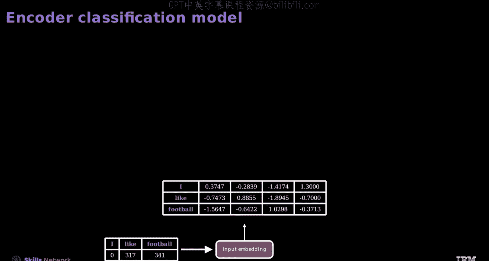

例如，文本“I like football”被分词并索引为`[0, 3, 173, 41]`。这些索引被输入到嵌入层，该层将每个词元转换为其对应的高维表示。

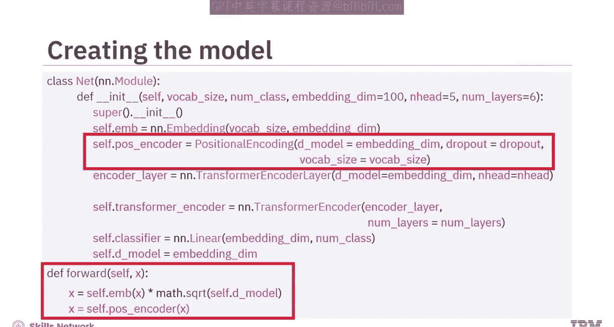

具体来说，嵌入层将每个索引映射到嵌入空间中的一个唯一向量，其中第一维对应序列长度（即词元数量），第二维代表嵌入大小。

### 位置编码

位置编码模块`PosEncoder`将序列顺序信息嵌入到词向量中。它被应用于嵌入`X`，以添加上下文的时间信息。

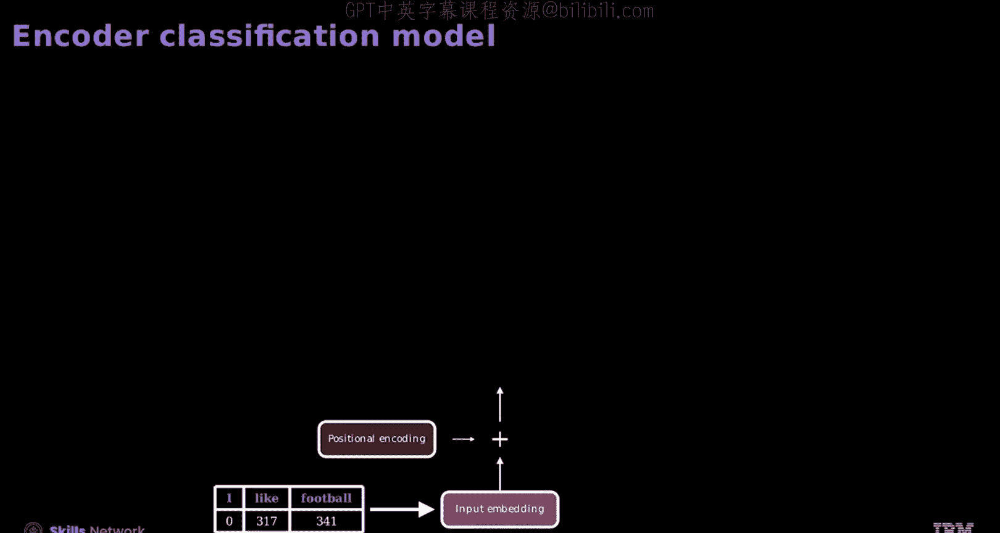

这些张量值与输入嵌入具有相同的维度，因为它们最终会被相加在一起。通过结合这两者，模型能够理解语义及其在序列中的位置。

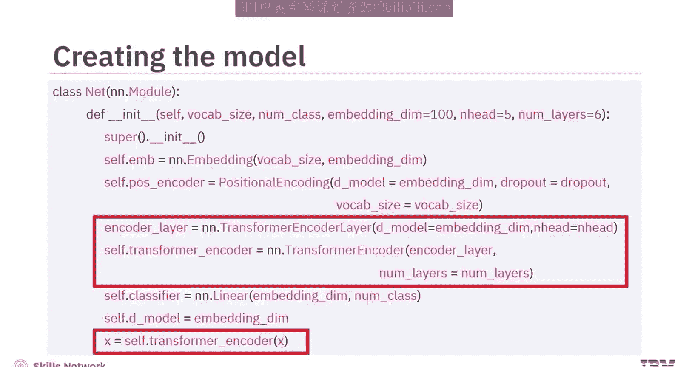

### Transformer编码器层

编码器由多个`nn.TransformerEncoderLayer`组成，每个层都配置了参数。然后使用`nn.TransformerEncoder`将这些层堆叠在一起，指定层数`num_layers`和注意力头数`num_heads`。

在添加位置编码后，你将Transformer编码器层应用于增强后的嵌入，使模型能够捕获序列的上下文。

编码器生成相同数量的嵌入，且维度相同。这些词元现在包含了上下文信息。然后，你可以沿维度0计算均值并减小维度大小。然而，对于分类任务，你可以使用这个均值。

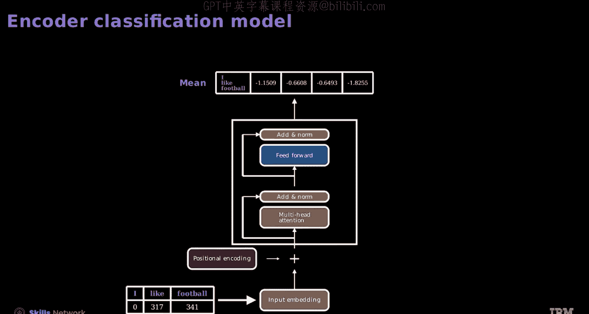

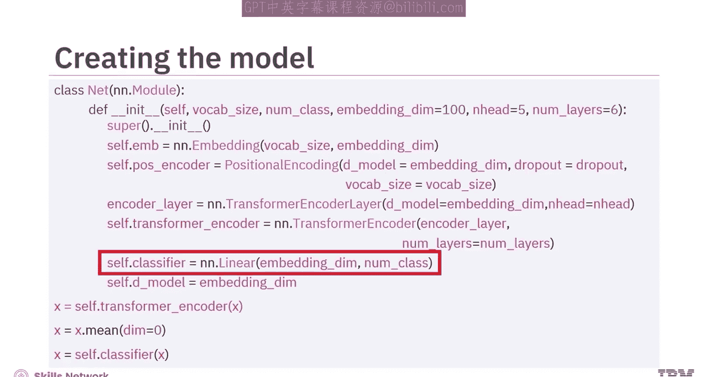

### 分类器层

模型包含一个线性层`nn.Linear`，它充当分类器。其输入大小设置为嵌入维度，输出大小与类别数量匹配。在应用这个线性层之前，你通常会对编码器输出的嵌入进行聚合，例如取平均值。

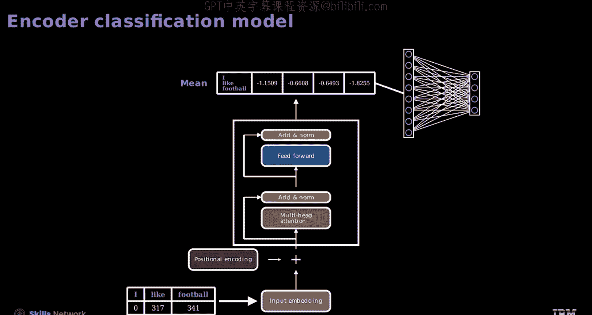

分类器层预测输入文本所属的标签，确定给定序列的类别分类。

---

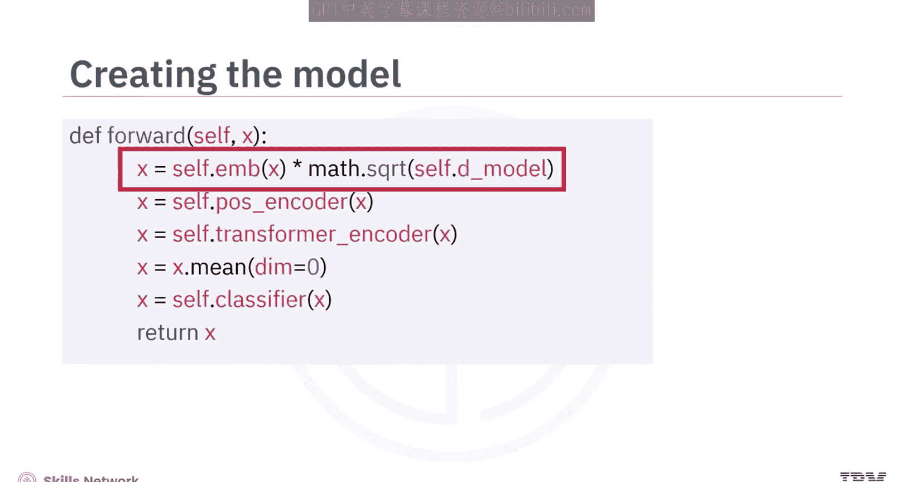

## 模型前向传播

现在，让我们看看前向传播方法。在模型的前向传播方法中，输入`X`被用作嵌入层的输入，并乘以模型维度的平方根以稳定梯度，为后续层做准备。其维度与神经网络略有不同，让我们仔细看看。

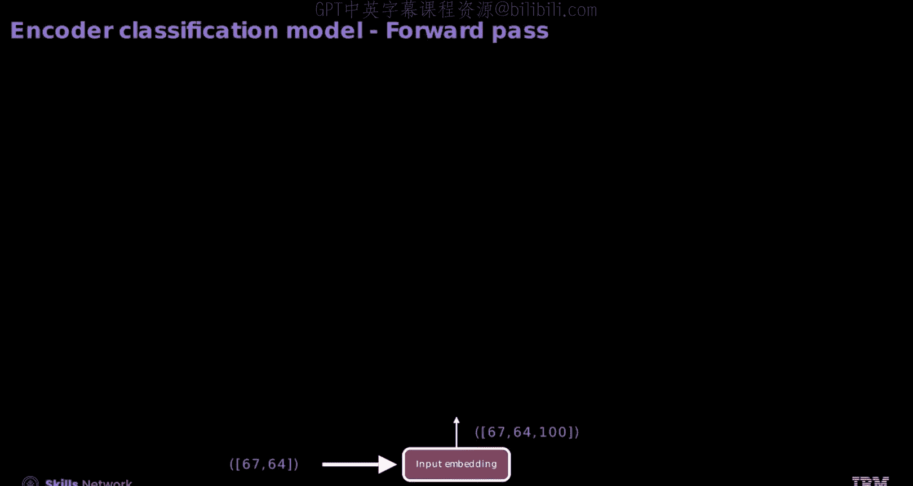

输入张量`X`代表一个长度为67的词元序列，按64个样本的批次组织。这被用作嵌入层的输入。嵌入层的输出维度是`67 x 64`，最后一个维度是嵌入维度100。

输入张量`X`通过`self.pos_encoder(x)`操作进行位置编码。位置编码不改变维度。

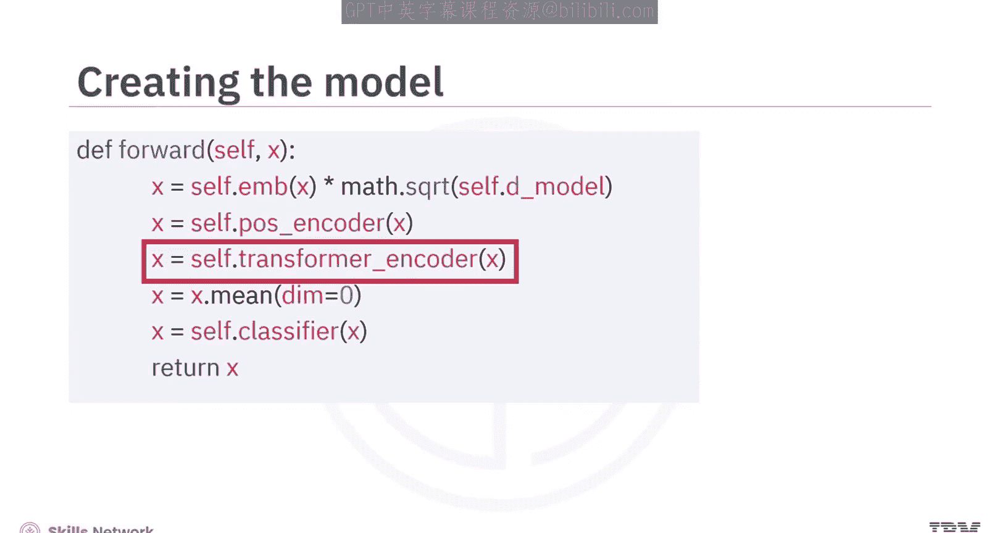

输入张量`X`通过`self.transformer_encoder(x)`操作进行Transformer编码器转换。

Transformer编码器产生的张量输出维度与其接收的输入相同。嵌入的数量等于序列词元的数量。这些被称为上下文嵌入，它们包含了更多关于上下文的信息。

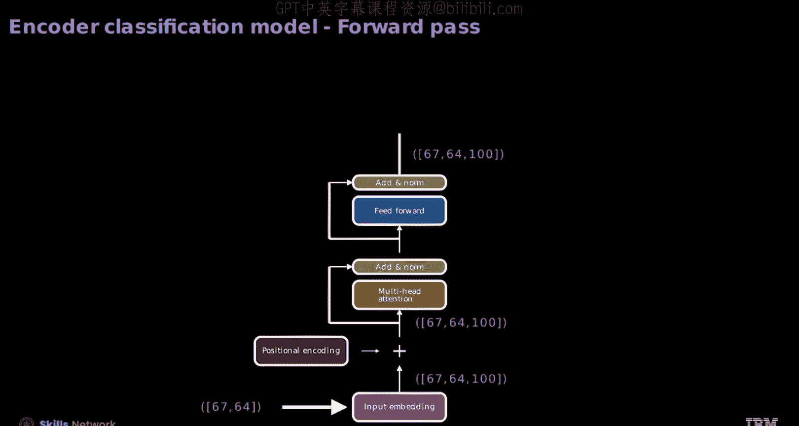

张量`x`沿维度0取平均值，使用`x.mean(dim=0)`将序列信息编译成单个嵌入。

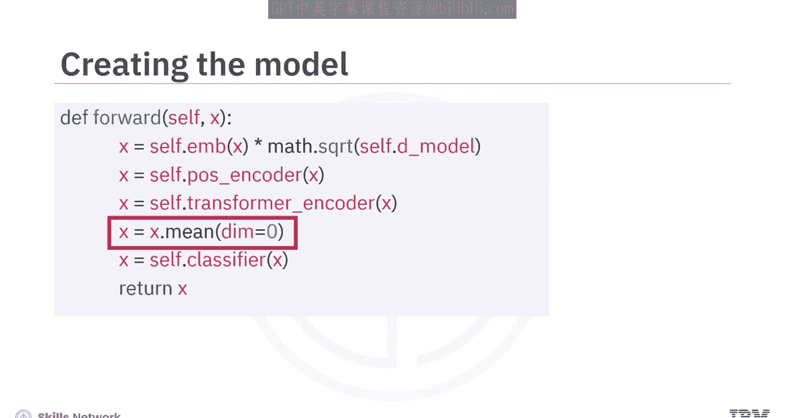

对于批次大小为64的情况，你可以将其压缩成一个单一的100维向量，类似于一个拥有64个实例、每个实例有100个特征的数据集。

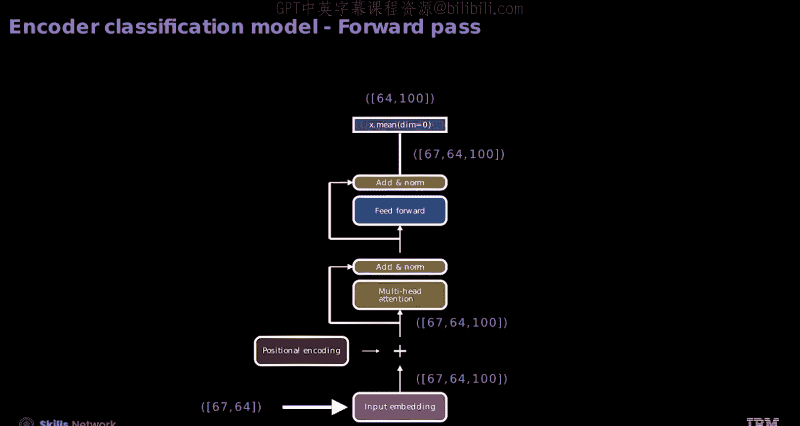

张量`X`在前向传播方法中被线性分类器处理，代表模型对给定输入序列的预测。

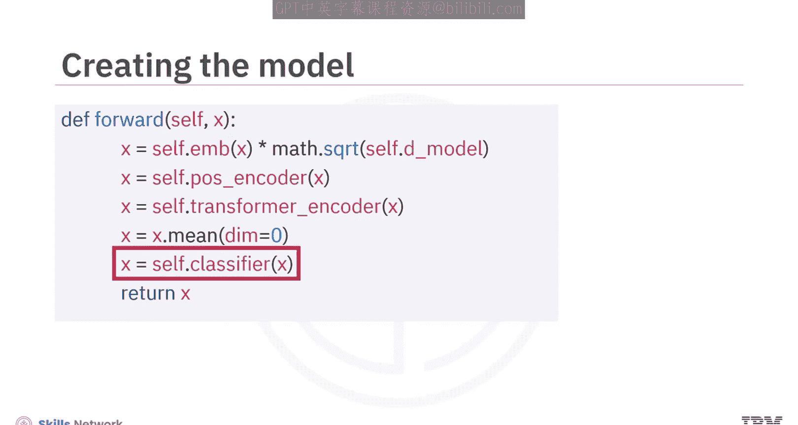

分类器模型为批次中的每个样本输出64个标签预测。

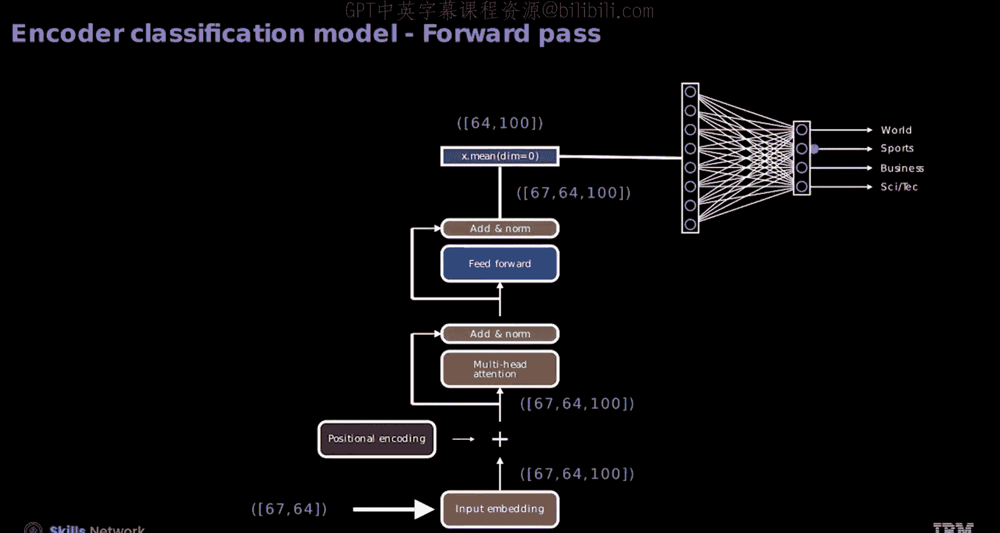

---

## 训练模型

现在让我们看看如何训练模型。模型的学习配置包括：用于随机梯度下降的学习率0.1，以及用于多类分类的交叉熵损失。

选择SGD作为优化器，并配有一个步长调度器，该调度器在每个训练周期后将学习率乘以因子0.1。

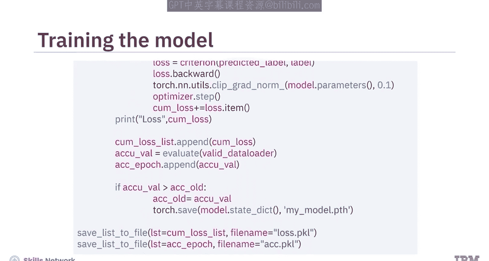

为了跟踪进度，初始化了累积损失列表和周期精度列表，分别用于记录累积损失和每个周期的精度。此外，使用`accuracy_old`来保留上一次迭代的精度。

尽管Transformer通常用于序列到序列任务，但该模型的训练过程与标准分类问题相同。

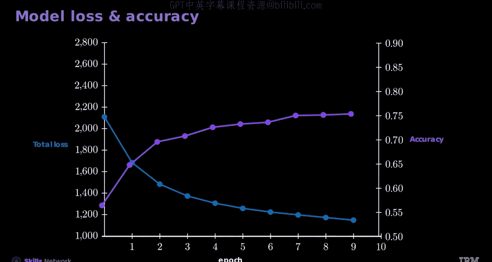

图表显示了模型在10个训练周期内的损失和精度。你会看到，当训练损失下降时，验证精度会上升。对于更大的数据集，Transformer的表现通常优于神经网络。

---

## 总结

本节课中我们一起学习了以下内容：

*   你了解到，通过集成Transformer注意力层，可以在对文本进行分类时保留上下文。
*   **创建文本流程**：创建迭代器、分配训练集、生成词元、构建词汇表、设计自定义整理函数、应用填充以及创建数据加载器。
*   **创建模型**：实例化嵌入层、添加位置编码、应用Transformer编码器层、使用分类器层预测输入文本所属的标签。
*   **训练模型**：使用与标准分类问题相同的过程。