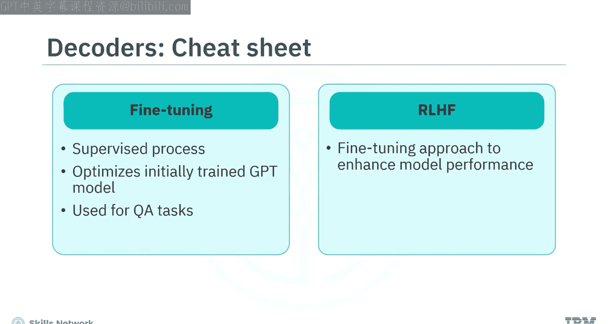
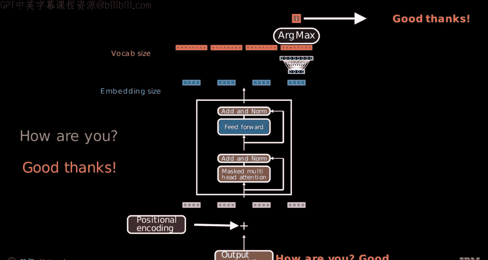

# 生成式人工智能工程：122：使用解码器和GPT类模型进行语言建模 🧠

在本节课中，我们将要学习解码器（Decoder）在Transformer架构中的核心作用，以及以GPT为代表的解码器模型如何进行自回归式的文本生成。我们将从解码器的基本原理讲起，逐步深入到其具体的工作流程。

## 概述

Transformer最初为机器翻译任务而设计，包含编码器（Encoder）和解码器（Decoder）两个主要组件。随着发展，解码器在文本生成任务中扮演了关键角色，成为GPT、LLaMA等先进大语言模型的基础。本节将解释解码器是什么，并描述其用于文本生成的工作原理。

## 解码器与文本生成

上一节我们介绍了Transformer的整体架构，本节中我们来看看其中的解码器组件。解码器是自回归文本生成模型的核心。

*   **生成式预训练（GPT）**：这是一种**自监督**学习过程。模型训练一个解码器，根据给定的前序词序列来预测序列中的下一个词（Token）。
*   **自回归模型**：这类模型通过预测每个新词来生成序列，每个新词的预测都严格依赖于前面已生成的所有词。
*   **微调**：这是一个**监督**学习过程，用于将预训练好的GPT模型优化到特定任务上，例如问答或分类。
*   **基于人类反馈的强化学习（RLHF）**：这是一种特殊的微调方法，通过人类反馈来提升模型在特定任务上的表现，在开发聊天机器人时尤其有效。

一个关键区别在于，在纯文本生成任务中，解码器**独立工作，无需编码器的输入**。这与翻译任务不同，翻译时解码器需要通过交叉注意力机制关注编码器的输出。在文本生成中，解码器仅根据前面已生成的词序列来预测下一个词。

## 解码器的工作原理

理解了解码器的基本定位后，我们来深入其内部工作机制。解码器以自回归方式运行，即根据已出现的词来预测未来的词。

例如，模型从句子起始标记（BOS）开始，预测出第一个词“IBM”。随后，将“IBM”添加到输入序列中，模型基于新的序列“BOS IBM”来预测下一个词“taught”。这个过程持续进行，模拟了人类逐词生成文本的方式。

解码器与编码器在Transformer架构中的主要区别在于**解码器使用了掩码自注意力机制**。

*   **注意力机制核心**：其核心是训练过程中的矩阵乘法运算。
*   **掩码（Masking）**：这是一个关键技术，它确保模型在预测某个位置时，**只能关注该位置之前的所有词**，而不能“偷看”未来的词。这强制实现了自回归属性。需要注意的是，在推理（预测）阶段同样会使用掩码来维持这一特性。
*   **编码器用作解码器**：理论上，通过添加掩码，一个编码器也可以用于自回归文本生成。我们将在学习训练解码器时重点探讨掩码技术。

## GPT的文本生成流程

现在，让我们过渡到使用解码器模型（如GPT）生成文本的自回归过程。我们以一个问答场景为例，模型对提示“How are you?”生成回应“Good, thanks.”

以下是生成过程的概述：

1.  **输入处理**：过程始于提示“How are you?”（某些模型会添加BOS标记）。提示被分词并转换为词嵌入向量（图中灰色部分）。
2.  **添加位置信息**：将位置编码应用到这些词嵌入上（图中粉色部分）。
3.  **生成上下文嵌入**：解码器处理输入，产出一系列转换后的嵌入或标记，称为**上下文嵌入**（图中蓝色部分）。与静态词嵌入不同，上下文嵌入会根据单词在序列中的具体上下文而变化。
4.  **预测逻辑值**：这些上下文嵌入类似于隐藏层的逻辑值，随后会通过一个最终的线性层，预测出一系列逻辑值（图中红色部分）。为便于理解，这里按顺序展示，但实际上这些计算是同时进行的。
5.  **选择下一个词**：对最后一个位置的逻辑值应用**argmax**函数，选择得分最高的索引对应的词。在本例中，“good”被选为下一个词。
6.  **循环生成**：被选中的词“good”被追加到先前的输入序列后，形成新的输入序列“How are you? Good”。计算“good”的词嵌入，将更新后的整个序列再次输入模型，重复步骤3-5，生成下一个词（本例中为“thanks”）。
7.  **终止条件**：模型基于不断更新的输入序列持续生成词，直到满足特定条件，例如生成了序列结束标记（EOS），或达到了预设的最大输出长度。

## 总结

本节课中我们一起学习了：

*   解码器在文本生成中扮演着关键角色，是GPT、LLaMA等复杂模型的基础。
*   解码器以**自回归**方式工作，根据已出现的词预测未来的词。
*   解码器与编码器的主要区别在于解码器使用了**掩码自注意力机制**。掩码确保模型在预测时只关注前面的词，从而实现了自回归生成。
*   使用解码器模型生成文本的流程可概括为：
    1.  对输入词应用**词嵌入和位置编码**。
    2.  解码器生成**上下文嵌入**。
    3.  通过线性层预测**逻辑值**序列。
    4.  对最后一个词的逻辑值应用**argmax**函数，选择得分最高的词作为输出。
    5.  将输出词追加到输入序列，并重复上述过程，直至生成完成。