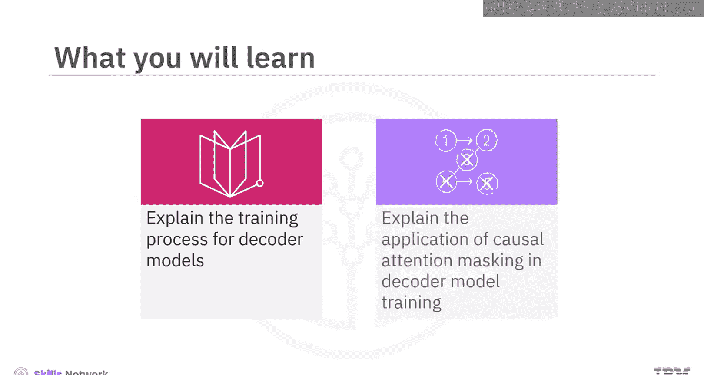
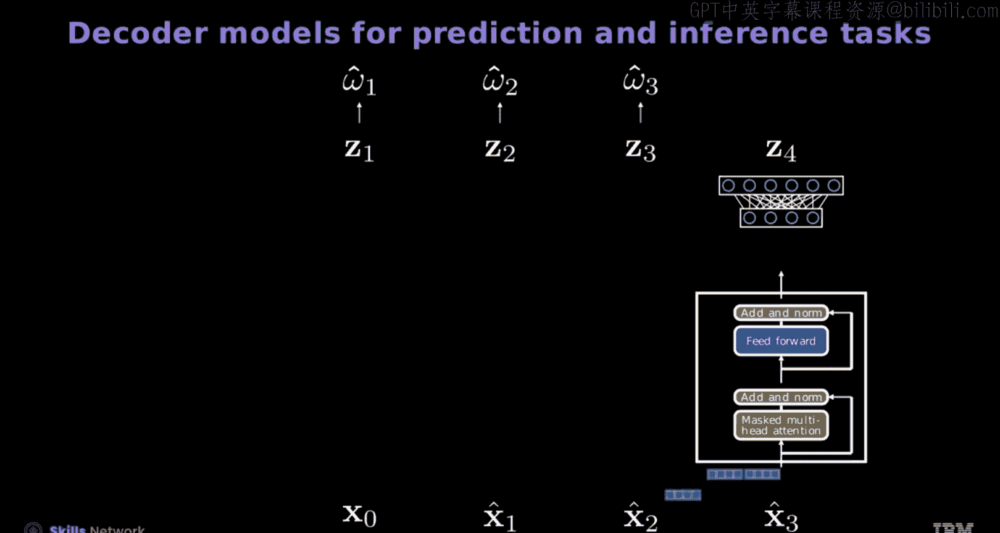
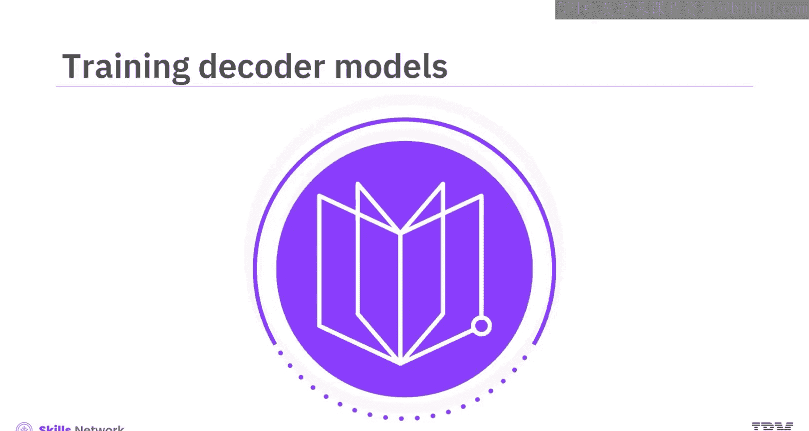
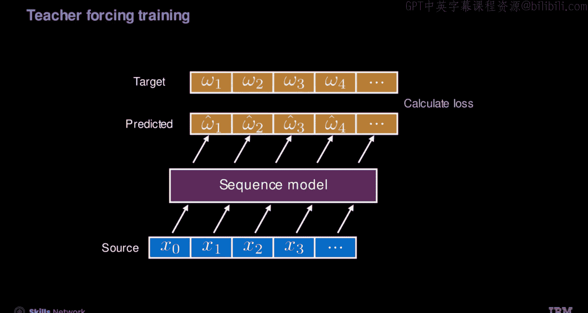
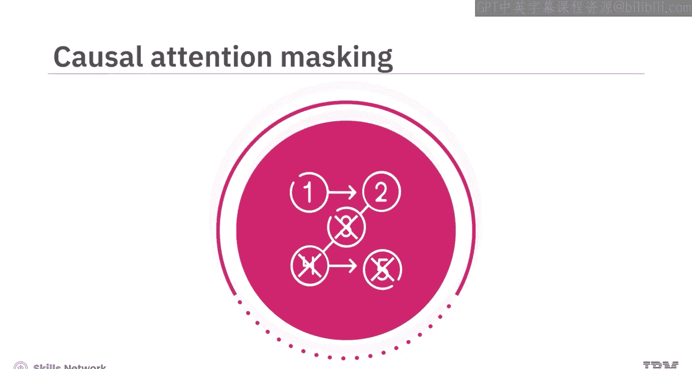
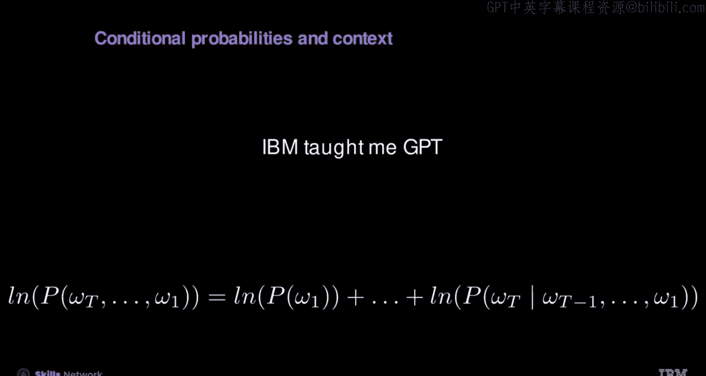

# 生成式人工智能工程：7：训练解码器模型 🧠

在本节课中，我们将要学习解码器模型的训练过程。我们将解释训练与推理阶段的区别，并深入探讨因果注意力掩码在训练中的应用。

## 概述

上一节我们介绍了解码器模型的基本概念，本节中我们来看看如何训练一个解码器模型。我们将从模型的输入输出表示开始，逐步理解其训练机制。

## 序列模型与符号表示

首先，让我们回顾并明确一些用于语言建模序列模型的新符号和概念。

*   你将使用 **m̂ₜ** 来表示在时间步 **t** 的标记（token）或单词索引。在适当的时候，它也可用于表示标记的值。
*   这个表示源于神经网络最后一层的最大输出值，该网络与解码器相关联。
*   在预测时，你使用这种方法生成一个词嵌入向量，记为 **x̂ₜ**，它代表你的预测。
*   你使用 **^** 符号来表示这是一个估计值。虽然词嵌入本身不是一个真正的估计值，而是基于解码器输出的一个假设向量。

## 自回归解码器的预测任务

让我们深入探讨与自回归Transformer解码器模型相关的预测任务。

从初始时间步 **t=0** 的第一个词嵌入 **x₀** 开始，解码器会生成一个上下文嵌入（通常用灰色表示）。这个上下文嵌入随后被送入神经网络，该网络有助于塑造下一个编码的嵌入。

预测出的词嵌入 **x̂₁** 与原始词嵌入结合，并重新输入到模型中。结果，你得到两个上下文嵌入（均以灰色描绘）。最后一个上下文嵌入被用来预测下一个标记。

这个新预测的标记和之前的嵌入被反馈给解码器。这一系列事件产生了三个上下文嵌入。再次地，最后一个嵌入被用于预测后续标记。

这个循环过程在模型的整个操作中不断重复。需要注意的是，在每个步骤中都会添加位置编码。

## 解码器模型的训练过程

现在，让我们看看解码器模型的训练过程。

这个训练集示例在第一列展示了输入标记，在第二列展示了它们的目标（向前移动一个时间步）。根据模型的不同，会附加特殊的标记。起始标记可能使用也可能不使用，结束标记通常会被包含，并且会应用零填充以确保序列长度一致。

你使用变量 **ω** 来表示标记，上标表示样本编号。每个序列都是一个独立的样本。这些输入标记被转换为词嵌入，记为 **X**，并输入到模型中。

本视频重点分析单个序列，类似于在神经网络中检查一个样本。

### 训练与推理的区别

在训练阶段，解码器的操作与推理阶段有所不同。

*   在整个训练过程中，解码器使用**实际的词嵌入**，而不是它们的近似值。
*   它处理从索引 **0** 到 **3** 的整个输入序列，并采用**因果掩码**来确保输出预测仅依赖于先前的序列元素。
*   输出记为 **H** 和 **Z**，是基于索引 **0** 到 **3** 的输入，对索引 **1** 到 **4** 的序列的估计值。
*   与推理任务中只使用最后一个标记不同，在训练中，模型使用**每个序列位置的所有预测标记**。
*   为了实现这一点，所有输出的上下文嵌入（以灰色标识）和输出的逻辑值（以红色标记）都被用来计算损失。
*   预测由 **ω̂‘** 表示，即最可能的标记。然后使用真实标记 **ω** 和逻辑值计算损失。这里的损失是实际标记与预测标记之间的比较，是损失函数的简写。

计算损失后，你可以一次在一个序列或一批序列上训练模型。为简化起见，此后我们将去掉上标 **‘** 以简化符号。

### 自回归与教师强制

在训练过程中，模型可以使用自己在前一步的预测作为下一步的输入。

例如，初始输入 **x₀** 产生输出 **ω̂₁**，这反过来又生成标记 **x̂₁**。这个预测出的标记然后被用来生成下一个标记 **ω̂₂**，过程以此类推。模型的输出被用来确定损失。

**教师强制** 是一种在训练序列模型（如Transformer）时采用的技术。

在这种方法中，不是将模型自身的预测反馈回来作为后续时间步的输入，而是使用序列中**实际的前一个标记**。

在这个例子中，**x₀** 作为初始输入来产生模型的输出 **ω̂₁**。对于下一个时间步，使用**实际的标记 x₁** 来生成后续输出，而不管模型之前的预测是什么。这个过程在整个序列中持续进行。

这种方法确保即使模型在任何步骤做出了错误的预测，它仍然会收到正确的标记作为下一个输入，使其能够与实际序列保持一致。因此，这有助于模型学习从输入到输出的准确映射以确定损失。

## 因果注意力掩码

因果注意力掩码是你在解码器训练中可以使用的一种技术，用于确定在生成过程中序列中的每个标记可以关注哪些其他标记。

在这个自注意力过程中，一个**上三角为负无穷大值**的因果注意力掩码被应用于注意力矩阵。这个掩码确保每个标记只能关注**前面的标记或它自身**，禁止未来的标记影响注意力分数。

例如，在预测下一个标记时，后续的标记不应影响标记“me”。掩码之后，分数经过 softmax 操作，这消除了未来标记的影响。因此，后续嵌入的计算完全集中在先前和当前的标记上，忽略了未来的标记。

动画展示了在解码器训练期间的掩码注意力机制。它使用完整的输入序列（记为 **x₀** 到 **x₃**）计算注意力分数。**x₀** 的分数专门用于预测 **ω₁**。为了预测第二个标记，注意力仅限于 **x₀** 和 **x₁**，屏蔽掉后续的标记。这种选择性注意力扩展到所有未来的预测。

虽然这个过程看起来是顺序的，但它发生在解码器的注意力机制内部，是**并行**的。值得注意的是，这种掩码技术对于在推理过程中准确预测中间标记至关重要。

这个过程对于计算概率至关重要。与条件固定的神经网络语言模型不同，注意力模块将后续的概率纳入其估计中。这通过“G”的概率依赖于“me”及其前面的标记，以及“me”依赖于它自己的前驱来说明。一个关键限制是**上下文大小**，即模型可以视为输入的标记数量。

在训练期间确定似然度后，计算对数并与其他序列结合以训练模型。

## 总结

本节课中我们一起学习了以下核心内容：

*   在训练阶段，解码器的操作与推理阶段有所不同。
*   在整个训练过程中，解码器使用**实际的词嵌入**，而不是它们的近似值。
*   在训练中，模型在**每个序列位置**预测下一个标记。
*   在训练中，模型可以使用自己在前一步的**预测**作为下一步的输入。
*   在**教师强制**技术中，不是将模型自身的预测反馈回来作为后续时间步的输入，而是使用序列中**实际的前一个标记**。
*   **因果注意力掩码**确保每个标记只能关注**前面的标记或它自身**，禁止未来的标记影响注意力分数。