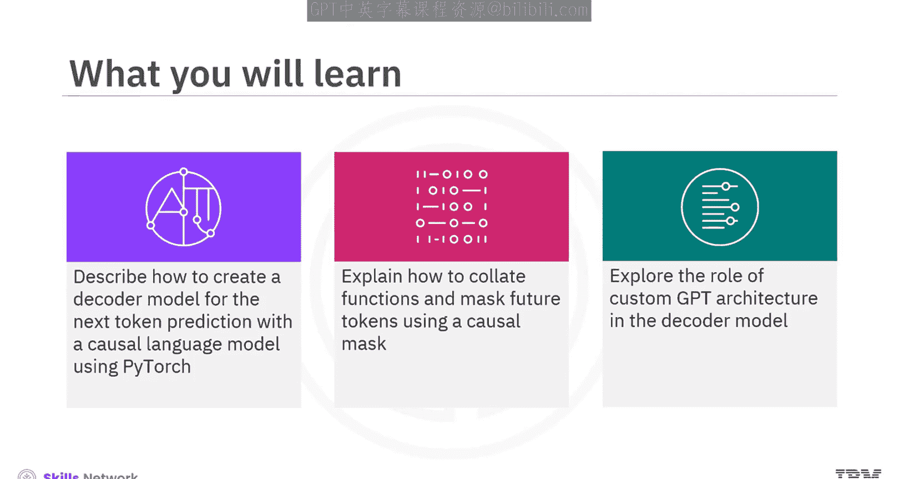
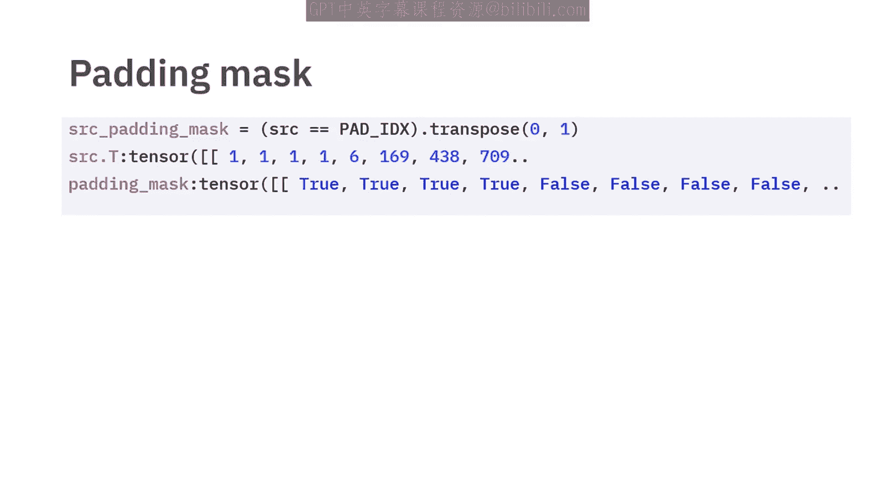
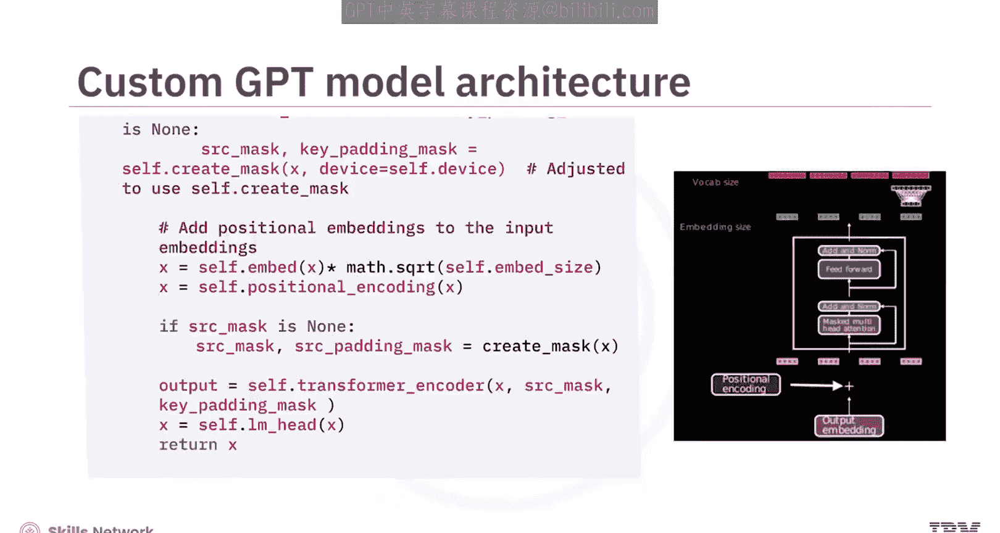
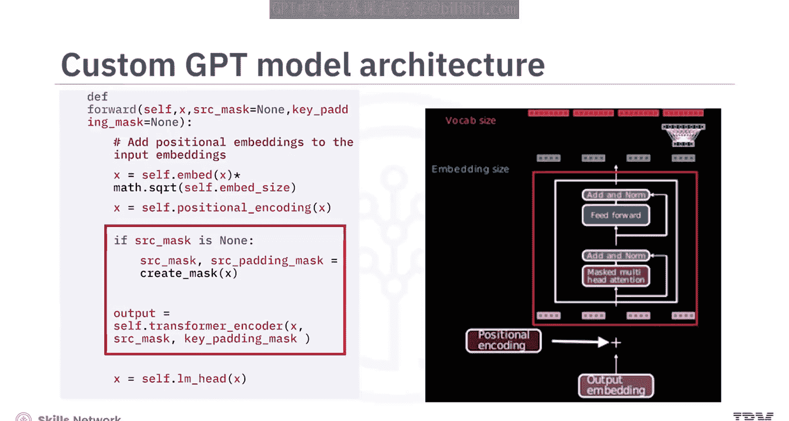
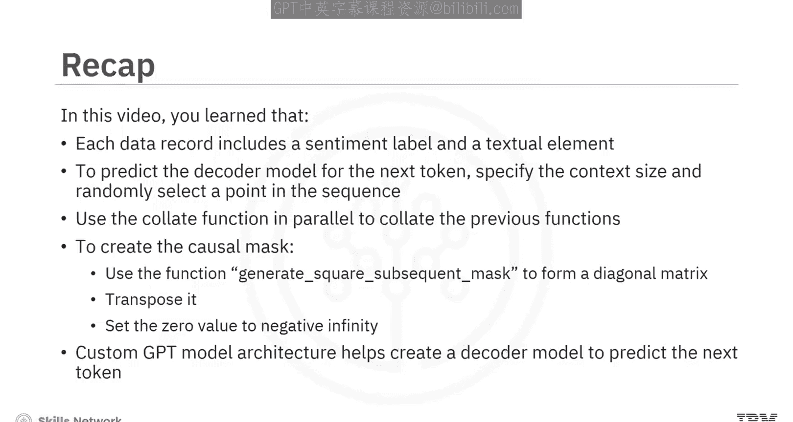

因果语言模型：124：使用PyTorch实现因果语言模型解码器 🧠

在本节课中，我们将学习如何使用PyTorch创建一个用于下一个词元预测的解码器模型，即因果语言模型。我们将涵盖数据准备、因果掩码的创建以及自定义GPT模型架构的实现。

---

### 数据准备与采样

首先，我们需要准备用于训练的数据。IMDb数据集常用于训练和评估解码器模型。每个数据记录包含一个情感标签和一个文本元素。在训练中，我们通常忽略情感标签，而专注于文本内容。



为了处理文本数据，我们需要创建一个自定义词汇表，用于将文本词元化并映射为索引。在自然语言处理中，通常会使用一些特殊词元：
*   **`<unk>`**：表示词汇表中未找到的词。
*   **`<pad>`**：用于将批次中不同长度的序列填充至相同长度。
*   **`<eos>`**：表示句子或序列的结束。

语言模型通过分析前文来预测下一个词，其中上下文长度是一个重要的超参数。以下是创建训练样本的步骤：
1.  指定上下文大小（即块大小）和输入文本。
2.  从文本中随机选择一个起始点，截取长度为块大小的序列作为源序列。
3.  将源序列向后移动一个词元，得到目标序列。

以下是一个示例函数，用于生成源序列和目标序列：

```python
def get_sample(text, block_size):
    # 随机选择起始点
    start_idx = random.randint(0, len(text) - block_size - 1)
    # 获取源序列
    source = text[start_idx:start_idx + block_size]
    # 获取目标序列（源序列向后移动一位）
    target = text[start_idx + 1:start_idx + block_size + 1]
    return source, target
```

调用此函数，设置块大小为10，可以观察到源序列和目标序列长度均为10，且目标序列是源序列向后移动一个词元的结果。

---

### 整理函数与因果掩码

上一节我们介绍了如何生成训练样本，本节中我们来看看如何将这些样本整理成批次，并创建因果掩码以防止模型看到未来信息。

整理函数 `collate_fn` 用于将多个 `get_sample` 函数生成的样本批次化。它确保批次内的所有序列通过填充达到相同长度，并生成对应的源序列和目标序列张量。比较源序列和目标序列的索引，可以确认目标序列是源序列的逐词元移位。

因果掩码的核心作用是：在预测某个位置的词元时，模型只能关注该位置之前的信息，而不能看到之后的信息。在PyTorch中，可以使用 `torch.nn.Transformer.generate_square_subsequent_mask` 函数来创建这种掩码。

```python
import torch.nn as nn

def create_causal_mask(seq_len):
    mask = nn.Transformer.generate_square_subsequent_mask(seq_len)
    return mask
```

此函数生成一个上三角矩阵，对角线及以下元素为0（允许关注），以上元素为负无穷（屏蔽未来信息）。这个掩码的维度与序列长度相同。此外，我们还需要一个填充掩码来忽略填充词元`<pad>`的影响，通常将填充位置标记为`True`。

---

### 自定义GPT模型架构

理解了数据流和掩码机制后，现在我们来构建模型本身。我们将实现一个简化的自定义GPT模型架构，用于下一个词元的预测。

该模型主要由以下部分组成：
1.  **词嵌入层**：将输入词元索引映射为密集向量。
2.  **位置编码层**：为嵌入向量添加序列位置信息。
3.  **Transformer解码器层**：由多层多头自注意力机制和前馈网络组成。这里的关键是使用**因果掩码**，使自注意力层只能关注当前位置之前的词元，从而让整个编码器堆叠表现出解码器的行为。
4.  **线性输出层（LM Head）**：将解码器的输出转换为整个词汇表上的逻辑值（logits）。

以下是模型前向传播的简要流程：
*   输入：词元序列 `x`。
*   步骤：`x` 经过词嵌入和位置编码后，输入到Transformer解码器中，同时传入因果掩码和填充掩码。
*   输出：解码器输出上下文感知的嵌入表示，最后通过线性层得到每个位置的下一个词元预测逻辑值。





```python
import torch.nn as nn
import torch

class CustomGPT(nn.Module):
    def __init__(self, vocab_size, embed_size, num_layers, num_heads):
        super().__init__()
        self.embedding = nn.Embedding(vocab_size, embed_size)
        self.pos_encoder = ... # 位置编码实现
        decoder_layer = nn.TransformerDecoderLayer(d_model=embed_size, nhead=num_heads)
        self.transformer_decoder = nn.TransformerDecoder(decoder_layer, num_layers=num_layers)
        self.lm_head = nn.Linear(embed_size, vocab_size)

    def forward(self, x, src_mask=None, src_key_padding_mask=None):
        x = self.embedding(x)
        x = self.pos_encoder(x)
        output = self.transformer_decoder(x, x, tgt_mask=src_mask, tgt_key_padding_mask=src_key_padding_mask)
        logits = self.lm_head(output)
        return logits
```

---



### 总结

本节课中我们一起学习了使用PyTorch实现因果语言模型解码器的完整流程。

1.  **数据准备**：我们使用IMDb数据集，通过自定义词汇表进行词元化，并利用采样函数生成用于“下一个词元预测”的源序列和目标序列对。
2.  **掩码机制**：我们学习了**因果掩码**的作用和创建方法，它确保了模型在预测时无法窥见未来的信息，这是自回归生成模型的核心。同时，**填充掩码**用于忽略填充词元。
3.  **模型架构**：我们构建了一个自定义的GPT式模型，它包含词嵌入、位置编码、多层Transformer解码器（使用因果掩码）以及一个线性输出层。该模型能够接收一个词元序列，并输出序列中每个位置的下一个词元的预测分布。



通过掌握这些核心概念和步骤，你已经具备了实现一个基本因果语言模型解码器的基础知识。