# 解码器模型：125：使用PyTorch进行训练与推理 🧠

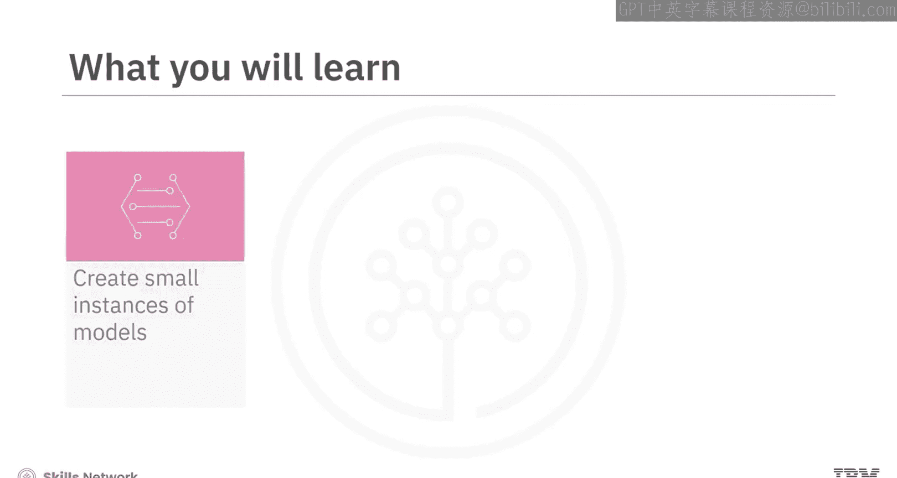

在本节课中，我们将学习如何使用PyTorch实现解码器模型的训练与推理。我们将从创建模型实例开始，逐步讲解损失计算、训练过程，并最终实现自回归文本生成。通过本教程，你将能够理解并实践解码器模型的核心概念。

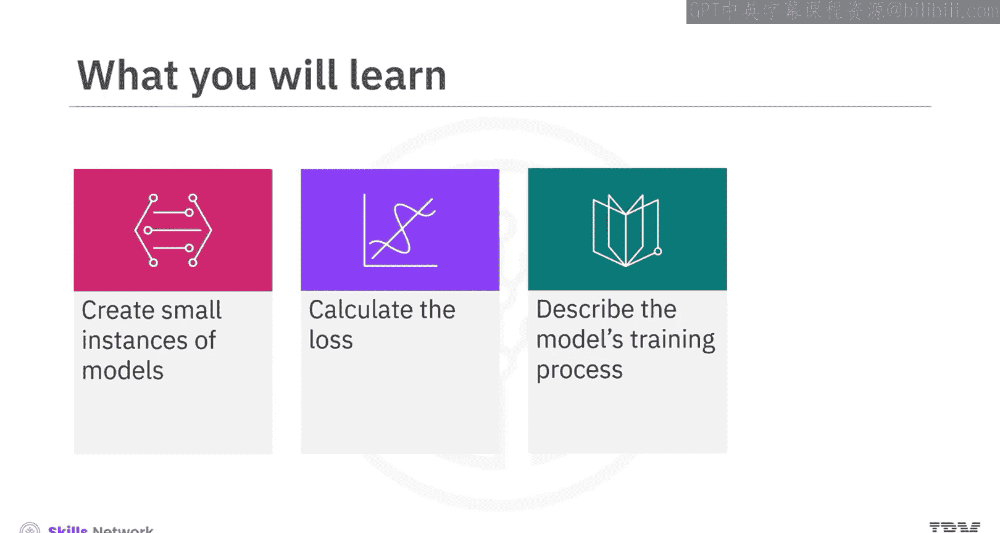

---

## 创建模型实例

上一节我们介绍了解码器模型的基本概念，本节中我们来看看如何创建一个模型实例。

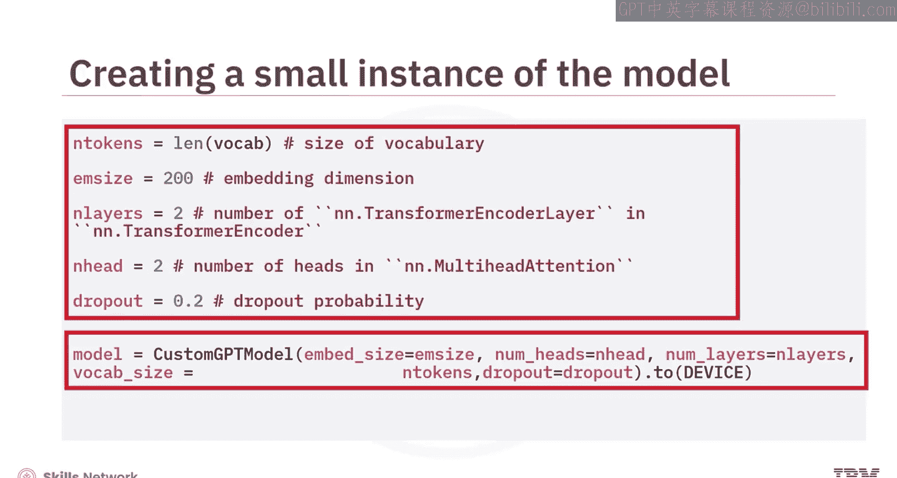

解码器模型是一种神经网络架构，它利用编码后的信息生成输出序列。这类模型在序列到序列的文本生成任务中非常有用，例如机器翻译和图像描述生成。值得注意的是，解码器模型与生成式预训练变换器（GPT）类似。

以下是创建模型实例的步骤：

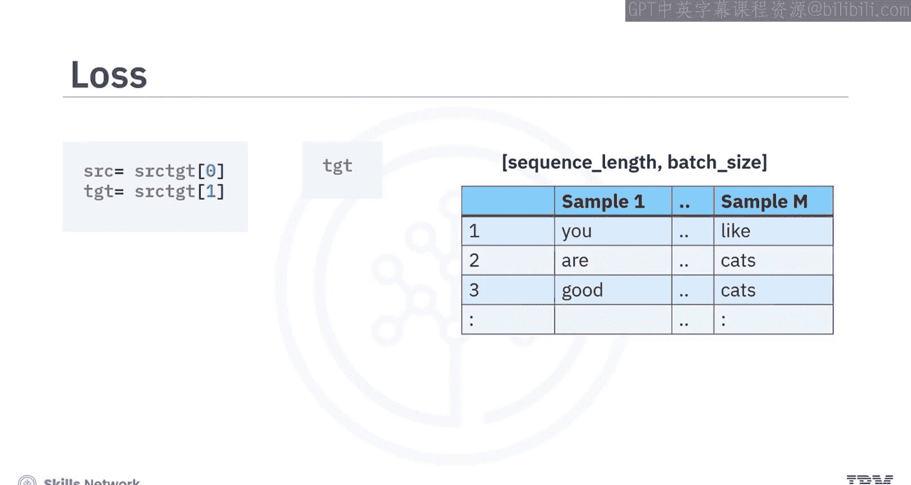

1.  首先指定模型超参数，包括编码器层数为2，注意力头数为2。
2.  然后定义自定义GPT模型的实例。

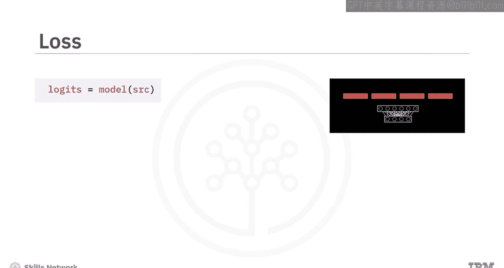

```python
# 示例代码：定义模型超参数和实例
num_layers = 2
num_heads = 2
model = CustomGPTModel(num_layers, num_heads)
```

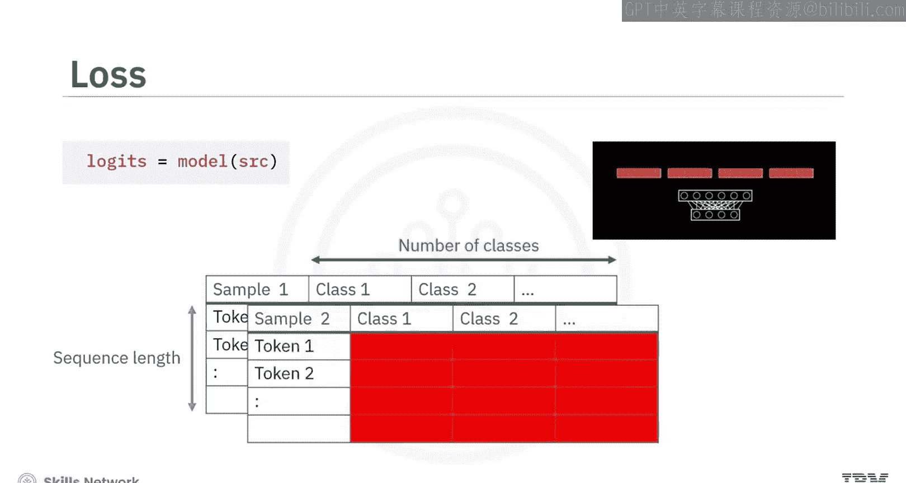

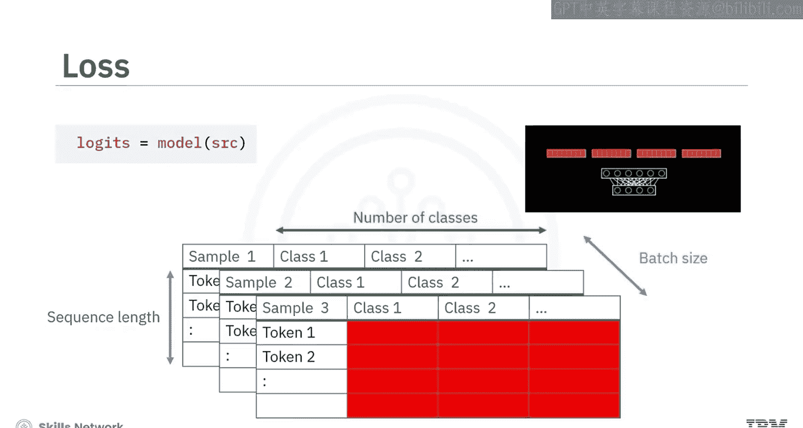

---

## 计算损失

在创建模型实例后，我们需要了解如何计算损失。损失计算是模型训练的关键步骤。

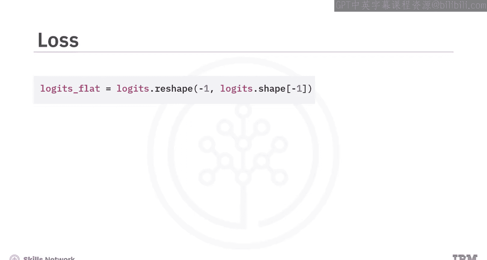

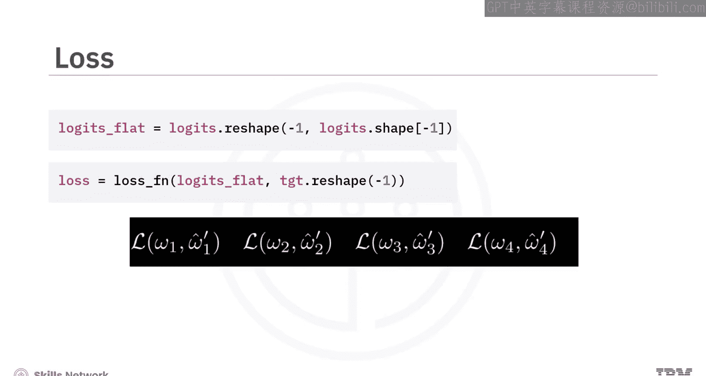

在损失计算过程中，编码器模型会生成源序列和目标序列。然而，检查目标批次时，你会发现其维度是`序列长度 × 批次大小`。

在预测阶段，解码器模型会生成逻辑值（logits），例如类别1和类别2。逻辑值的维度是`序列长度 × 批次大小 × 类别数量`。此外，每个表格代表批次中的一个样本。

为准备损失计算，你可以看到逻辑值被重塑，其中每一行对应一个令牌的预测，跨越序列和批次维度。接下来，为了计算损失，你需要重塑目标张量，使其元素与逻辑值正确对应。这个过程确保逻辑值的每一行都与适当的目标结果对齐，以实现准确的损失估计。

---

## 模型训练过程

理解了损失计算后，我们来看看模型的训练过程。

训练过程与其他模型类似，例如卷积神经网络（CNN）、循环神经网络（RNN）、变换器（Transformers）和生成模型。它使用修改后的损失形状以及其他有助于优化的函数，如验证和检查点保存。

评估函数通过计算模型在验证数据集上的平均损失来衡量其性能。训练好的模型可用于生成推理结果。

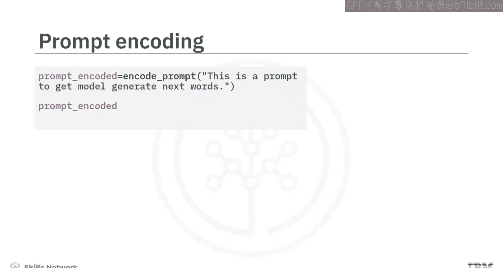

---

## 自回归文本生成（推理）

上一节我们介绍了模型的训练，本节中我们来看看如何进行自回归文本生成，也称为推理。

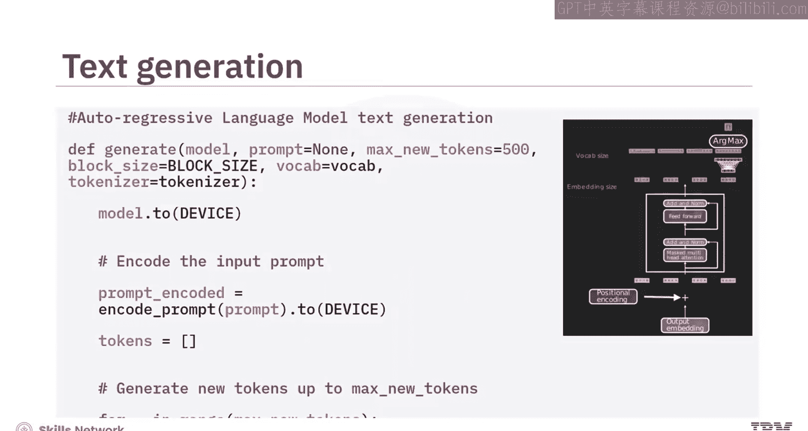

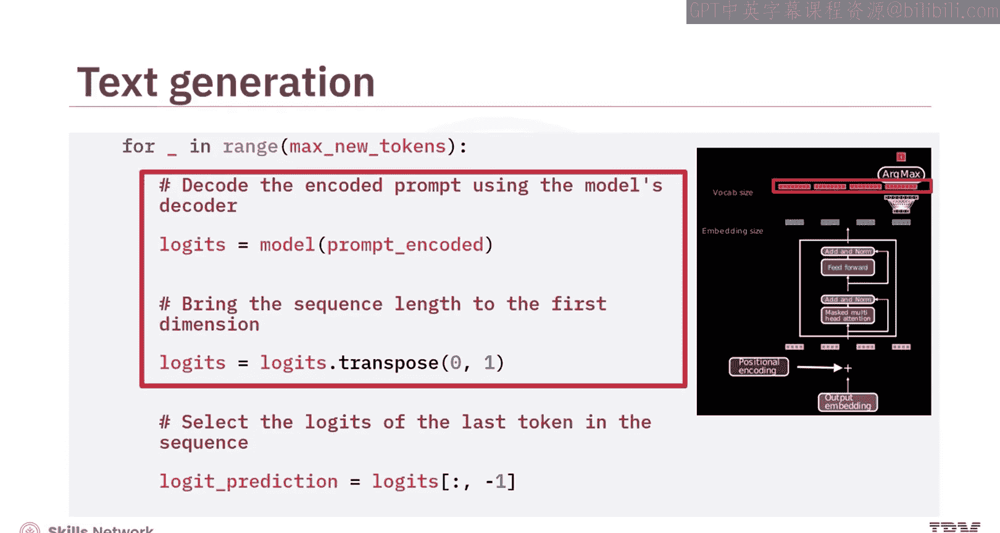

自回归文本生成是一种文本生成方法，模型根据先前的令牌预测序列中的下一个令牌。这是一个迭代过程，解码器模型一次生成一个令牌，并使用生成的令牌作为下一次预测的输入。

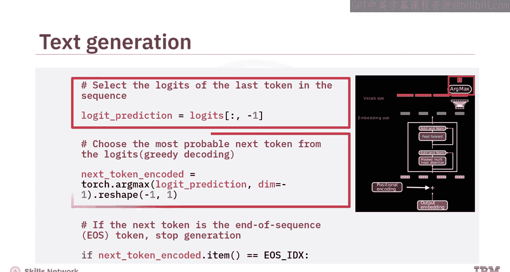

准备一个编码提示有助于创建文本生成过程。这个过程作为模型生成后续令牌的起点。一旦提示被令牌化，解码器模型就可以根据输入进行处理并生成下一个令牌。在这里，填充令牌用于处理多个批次，但对于单个预测来说并非必需。

以下是生成自回归文本的步骤：

1.  首先，从输入句子创建编码提示张量，完成句子。
2.  然后将提示输入模型。你会看到模型中生成了掩码，并且模型将在过程中输出逻辑值。
3.  接下来，选择最终的逻辑值向量。
4.  现在，识别并生成具有最高逻辑值得分的令牌。
5.  最后，将该令牌附加到提示中，用于后续的自回归文本生成。

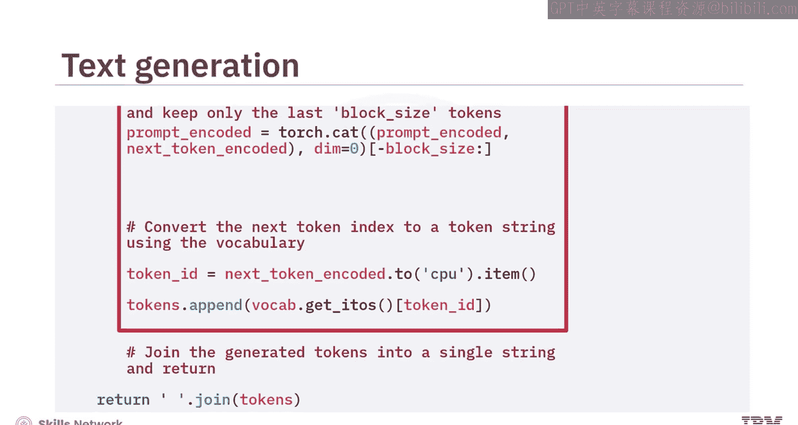

你可以看到解码器模型接收更新后的提示，并生成具有最高逻辑值的令牌。然后，将该令牌附加到提示中以生成下一轮自回归文本。这个循环持续进行，直到令牌达到句子末尾，或者达到传递给解码器模型的最大新令牌数。

---

## 总结

本节课中我们一起学习了使用PyTorch进行解码器模型的训练与推理。

你学会了通过指定模型超参数来创建模型的小型实例。在计算损失时，编码器模型会生成源序列和目标序列。训练过程与其他模型类似，并使用修改后的损失形状和其他有助于优化的函数。

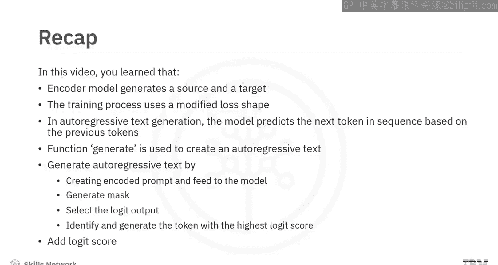

自回归文本生成是一种文本生成方法，模型根据先前的令牌预测序列中的下一个令牌。你学会了使用`generate`函数在解码器模型中创建自回归文本。最后，你学会了生成自回归文本：创建编码提示并将其输入模型，然后生成掩码并查看逻辑值输出并选择它。接下来，识别并生成具有最高逻辑值得分的令牌，并将其附加到提示中以生成后续的自回归文本。