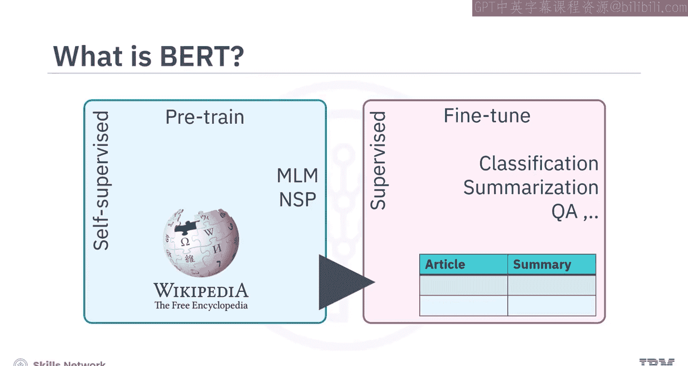
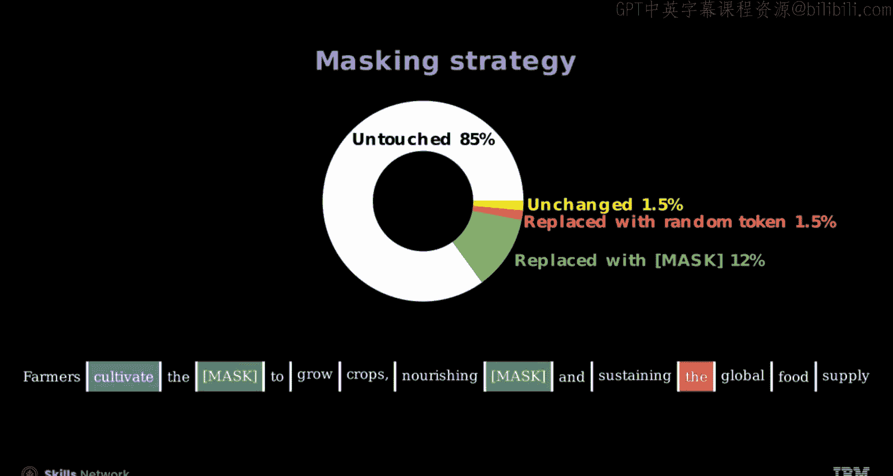
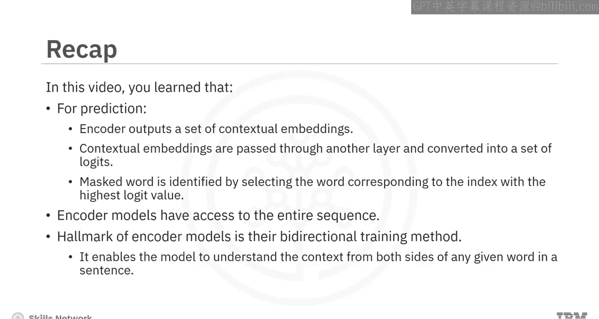

# 生成式人工智能工程：126：使用MLM进行BERT预训练的编码器模型 🧠

在本节课中，我们将学习BERT模型及其仅编码器架构，并了解如何使用掩码语言建模（MLM）来训练BERT模型。

## 模型概述

由Google开发的**双向编码器表示法（BERT）**，通过其对词语上下文和语义的深度理解，彻底改变了自然语言处理领域。它通过自监督学习在海量文本语料库上进行预训练，主要使用**掩码语言建模（MLM）**和**下一句预测（NSP）**任务。BERT的架构允许针对特定任务（如文本摘要、问答和情感分析）进行微调，从而将其广泛的知识适应到专业应用中。




## BERT的仅编码器架构

BERT采用了**仅编码器架构**，即只使用Transformer模型中的编码器部分。这种设计允许BERT同时处理整个文本序列，理论上增强了对文本内部上下文和细微差别的理解。与自回归模型不同，BERT通常不用于文本生成任务，而是在广泛的语言理解任务中表现出色。

考虑预测输入中由`[MASK]`标记表示的已知单词的任务。例如，输入序列为“CS IBM [MASK] me”。一个自回归模型只能访问“CS”和“IBM”这两个标记来预测被掩码的单词。然而，BERT可以利用`[MASK]`标记两侧的完整上下文，从而做出更明智的预测。另一个区别是，BERT模型包含了训练中使用的**段嵌入**。

## 掩码语言建模（MLM）原理

上一节我们介绍了BERT的架构，本节中我们来看看其核心预训练任务——掩码语言建模。

MLM涉及随机掩码部分输入标记，并训练BERT预测原始的掩码标记。这个任务帮助BERT学习上下文表示并理解词语之间的关系。

以下是MLM的预测流程：
1.  编码器输出一组**上下文嵌入向量**（图中灰色部分）。
2.  这些嵌入向量通过另一个层，转换为一组**逻辑值**（图中红色部分）。
3.  通过选择逻辑值最高的索引所对应的单词，来识别被掩码的单词。

```python
# 概念性伪代码，展示MLM预测核心逻辑
contextual_embeddings = encoder(input_sequence_with_masks)
logits = linear_layer(contextual_embeddings)
predicted_token_id = argmax(logits[mask_position])
```

编码器模型与解码器模型的主要区别在于，**编码器模型可以访问整个输入序列**。

## BERT的双向性优势

像BERT这样的编码器模型的一个标志是其**双向训练方法**，这使得模型能够理解句子中任何给定单词两侧的上下文。

例如，预测句子“农民耕种 [MASK] 来种植庄稼”中缺失的单词。与GPT等模型相比，由于其因果注意力机制，GPT只考虑前面的文本“农民耕种”。而BERT的架构允许它从两个方向分析文本。

在解码器模型（如GPT）中，因果注意力在视觉上表示为对未来的`X`（掩码）和对过去的`O`（激活）。然而，BERT采用双向机制，没有这种掩码，充分利用每个单词周围的上下文（仅由`O`表示）。这种双向方法使BERT对语言的细微差别和复杂的词语相互依赖关系有更复杂的把握。

## MLM的具体实施策略

根据原始的BERT论文，在实施MLM时需遵循特定策略。

以下是具体的掩码替换规则：
*   随机选择15%的单词位置进行掩码。
*   如果某个单词被选中，则在80%的情况下用`[MASK]`标记替换它。
*   在10%的情况下用一个随机标记（如“the”）替换它。
*   在10%的情况下保持原词不变，但仍需预测它。

这样做的目的是减少预训练（存在`[MASK]`）和微调（不存在`[MASK]`）之间的不匹配。数据随后用于通过交叉熵损失来预测原始单词。

让我们通过一个例子来说明：85%的单词保持不变。在剩余的15%中，80%被替换为`[MASK]`，10%被替换为随机标记（如“the”），10%保持不变用于预测（如“cultivate”）。




## 课程总结

本节课中我们一起学习了BERT模型的核心知识。

我们了解到，**双向编码器表示法（BERT）**的架构允许对文本摘要、问答和情感分析等特定任务进行微调。BERT采用**仅编码器架构**，使其能够同时处理整个文本序列，从而增强对上下文和文本细微差别的理解。

**掩码语言建模（MLM）**涉及随机掩码部分输入标记并训练BERT预测原始掩码标记。其预测方法是：编码器输出上下文嵌入向量，这些向量通过另一层转换为逻辑值，然后通过选择逻辑值最高的索引对应的单词来识别被掩码的单词。编码器模型与解码器模型的主要区别在于编码器可以访问整个序列。

像BERT这样的编码器模型的标志是其**双向性**，这使得模型能够理解句子中任何给定单词两侧的上下文。



