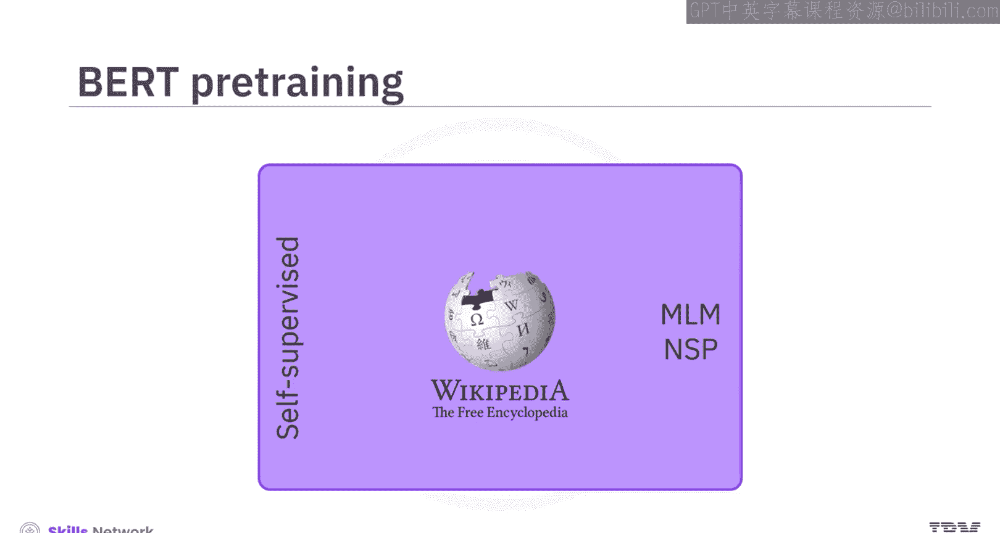
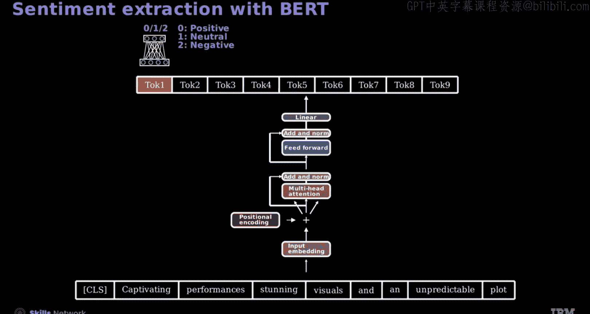

# 生成式人工智能工程：127：使用NSP进行BERT预训练的编码器模型 🧠

在本节课中，我们将学习如何使用下一句预测任务对BERT模型进行预训练，并了解如何将预训练好的BERT模型微调用于下游任务。

## 概述

BERT模型通过自监督学习在海量文本语料上进行预训练，主要使用两种任务：掩码语言建模和下一句预测。本节重点介绍下一句预测任务，该任务旨在训练模型判断一个句子是否是另一个句子的合理后续。

## NSP任务原理

上一节我们介绍了BERT的掩码语言建模任务，本节中我们来看看下一句预测任务。NSP任务的目标是训练模型判断一个给定的句子序列是否逻辑上紧随前一个句子。

例如，给定句子“我的狗很可爱”，我们期望的合理后续句子可能是“它喜欢玩耍”。在BERT的训练过程中，模型也可能遇到一个随机句子，如“他喜欢学医”，作为潜在的后续句。模型的任务就是预测哪个句子是合适的延续。

## 输入表示与嵌入

为了执行NSP任务，必须对输入文本的嵌入表示进行特殊处理。在BERT中，可以使用标准分词器进行分词以简化流程。请注意，实际的BERT使用的是WordPiece分词。

以下是构建输入的关键步骤：

*   **添加特殊标记**：在序列开头添加 `[CLS]` 标记。这个特殊标记用于后续的分类任务。在句子结尾插入 `[SEP]` 标记，用以表示句子的结束。
*   **生成词嵌入**：每个分词后的令牌都会关联其对应的词嵌入。
*   **引入段嵌入**：段嵌入用于区分一个令牌属于第一个句子还是第二个句子。在句子对任务中，为第一个句子（直到第一个 `[SEP]` 标记）的所有令牌分配段嵌入值1，为第二个句子的所有令牌分配段嵌入值2。
*   **加入位置编码**：最后，加入位置编码，为模型提供令牌在序列中顺序的信息。

## 数据与标签构建

让我们通过一个例子来看如何构建训练数据。对于句子对“我的狗很可爱”和“它喜欢玩耍”，我们按上述步骤处理嵌入，并设置一个二元变量 `Y` 来指示句子间的连续性。

*   当 `Y = 1` 时，表示第二个句子是第一个句子的逻辑后续。
*   当 `Y = 0` 时，表示第二个句子不是第一个句子的逻辑后续。例如，句子对“我的狗很可爱”和“他喜欢学医”就属于这种情况。

考虑一个数据集示例：
*   “我的名字是戴夫”后接“我住在多伦多”，标签 `Y` 设为1，表示句子是连续的。
*   “我的名字是乔伊斯”后接“多伦多是安大略省的首府”，标签 `Y` 设为0，表示句子不相关。

此外，除了 `[CLS]` 和 `[SEP]` 标记，还需要引入 `[PAD]` 填充标记，以确保所有句子长度统一，便于批量处理。数据中也会包含用于掩码语言建模任务的标签。

## 模型架构与训练

在NSP任务中，输入由词嵌入组成，经过编码器处理后生成上下文嵌入。这些嵌入被用来判断给定的句子对中，第二句是否逻辑上紧随第一句，这就像一个标准的分类任务。

其中，高亮显示的 `[CLS]` 标记对应NSP分类令牌，它聚合了整个序列的信息。该令牌的输出会被送入一个专门为NSP任务设计的神经网络，以评估句子对之间的关系。

我们可以将其视为一个二分类问题，使用逻辑回归的输出值来确定类别。

为了训练BERT模型的编码器部分，可以利用经过NSP和MLM任务训练的神经网络的输出。训练过程涉及最小化组合损失，即两个任务损失的总和：

**总损失 = MLM损失 + NSP损失**

在PyTorch中，这些损失被用作损失函数的输入以驱动优化过程。

## 下游任务微调

预训练完成后，可以对BERT进行微调，以用于特定的下游任务。

微调涉及在特定任务的数据集上训练BERT。例如，在情感分析任务中，模型需要预测输入序列的情感是积极、中性还是消极的。在微调过程中，BERT学习任务特定的模式，并调整其表示以在目标任务上表现良好。

`[CLS]` 令牌的表示将通过一个神经网络进行转换，以生成模型预测。这些上下文嵌入也可用于许多其他任务，例如构建向量数据库。

## 总结

本节课中我们一起学习了以下内容：
*   为了执行下一句预测任务，模型被训练来判断一个给定的序列是否逻辑上紧随前一个序列。
*   BERT模型的任务是预测哪个句子是合适的延续。
*   在序列开头添加 `[CLS]` 标记，并添加 `[SEP]` 标记来表示句子的结束。
*   段嵌入用于区分令牌属于第一个句子还是第二个句子。
*   位置编码为模型提供了令牌在序列中顺序的概念。
*   在NSP任务中，输入由词嵌入组成，经编码器处理生成上下文嵌入，这些嵌入用于判断句子对中第二句是否逻辑上紧随第一句。
*   训练BERT模型的编码器组件涉及最小化组合损失，即掩码词预测损失和判断预测词是否适合上下文的NSP损失之和。
*   微调涉及在特定任务的数据集上训练BERT，例如情感分析，模型在该任务中预测输入序列的情感是积极、消极还是中性。