# 生成式人工智能工程：12：为BERT准备数据 📚

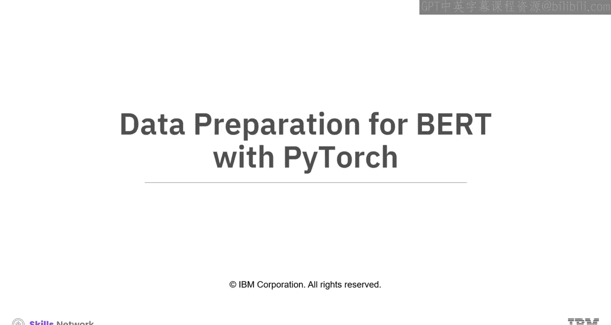

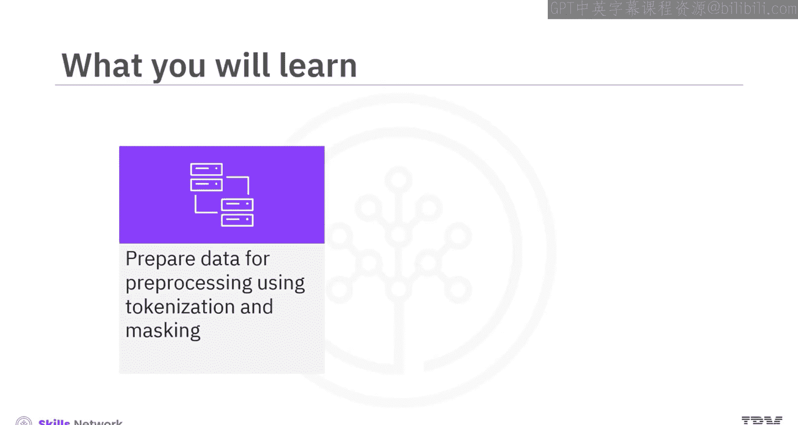

在本节课中，我们将学习如何使用PyTorch为BERT模型准备数据。我们将重点介绍数据预处理的关键步骤，包括**分词**、**掩码**，以及为BERT的特定训练任务（如**掩码语言建模**和**下一句预测**）创建训练就绪的输入。

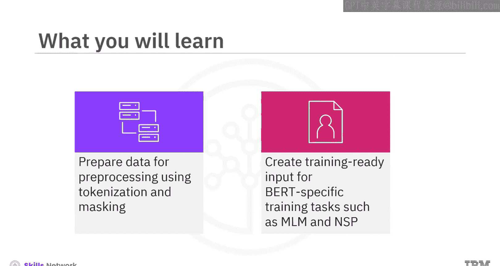

## 概述

为BERT准备数据主要涉及几个核心步骤：首先进行分词并构建词汇表，然后应用特定的掩码策略，最后将数据格式化为BERT模型可以接受的张量形式。我们将逐一解析这些步骤。

## 分词与特殊符号定义 🧩

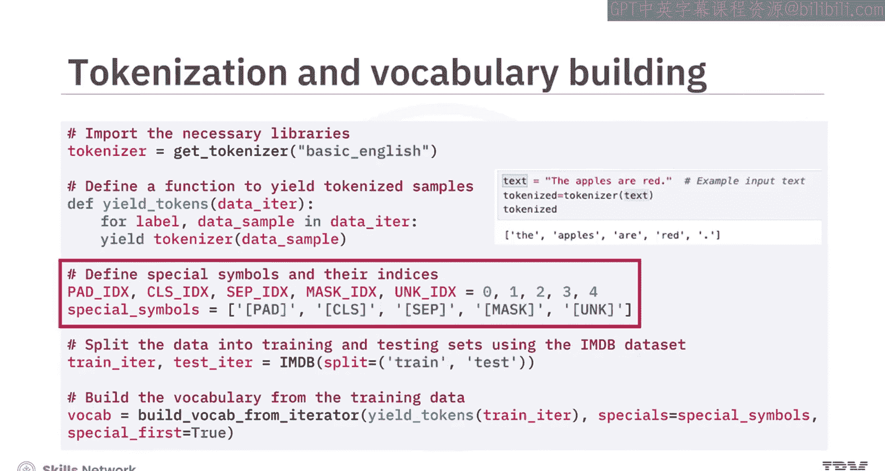

数据准备的第一步是分词和构建词汇表。你可以遵循标准的PyTorch流程，但需要注意两点。

首先，使用 `get_tokenizer` 函数初始化分词器。在本例中，分词器被设置为使用基础英语模型进行分词；请注意，实际的BERT使用的是WordPiece分词法。

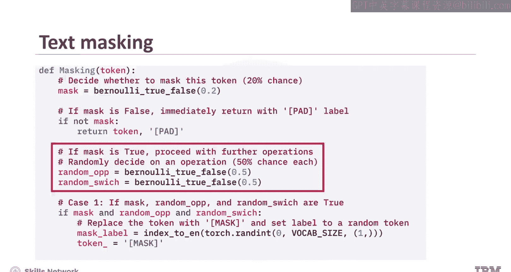

```python
from torchtext.data import get_tokenizer
tokenizer = get_tokenizer('basic_english')
```

随后，你需要定义特殊符号及其对应的索引：`PAD_IDX`, `CLS_IDX`, `SEP_IDX`, `MASK_IDX`, `UNK_IDX`。

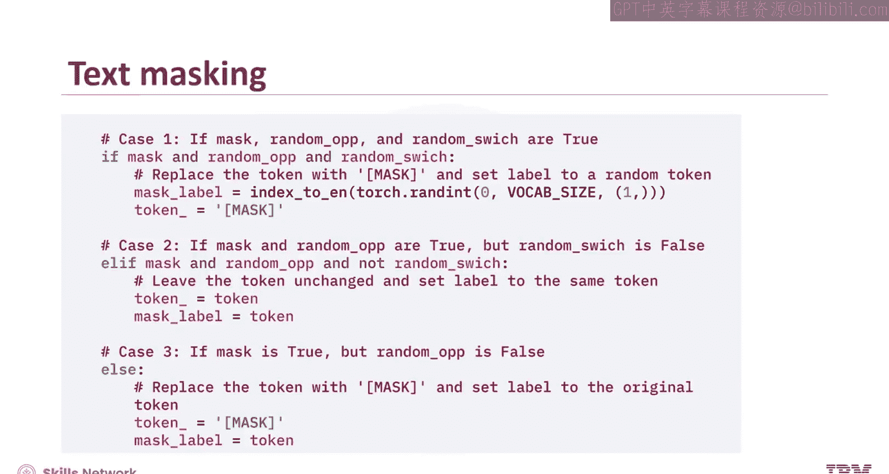

*   `PAD_IDX` 用于表示填充标记。
*   `CLS_IDX` 代表序列的开始。
*   `SEP_IDX` 用作序列之间的分隔符。
*   `MASK_IDX` 用于掩码语言建模。
*   `UNK_IDX` 代表未知标记。

## 掩码函数 🔍

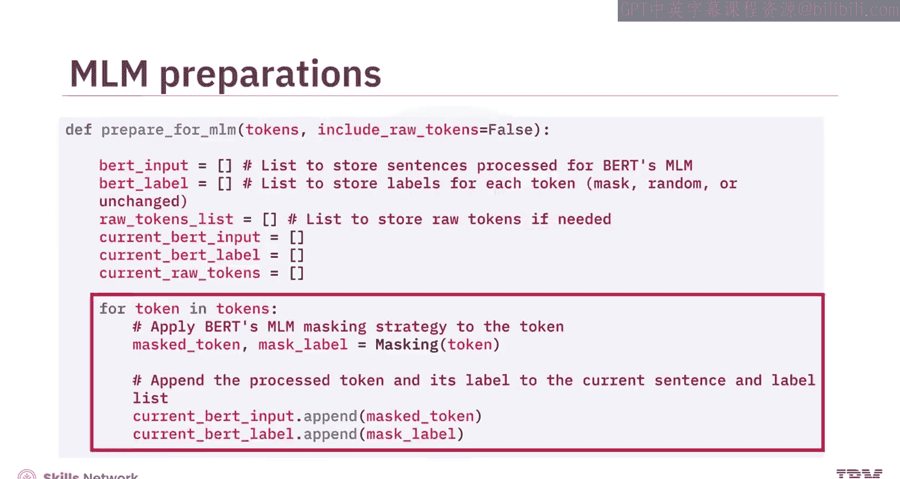

掩码函数用于对标记执行掩码操作。它接收一个标记作为输入，并决定是否对其进行掩码。如果掩码标志为假，函数立即返回原始标记和一个填充标签。如果掩码标志为真，函数会随机选择一种操作，每种操作有50%的概率。

以下是掩码函数的逻辑：

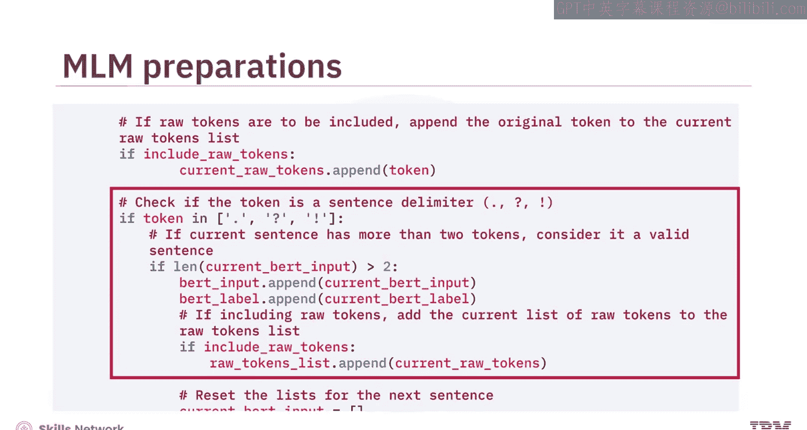

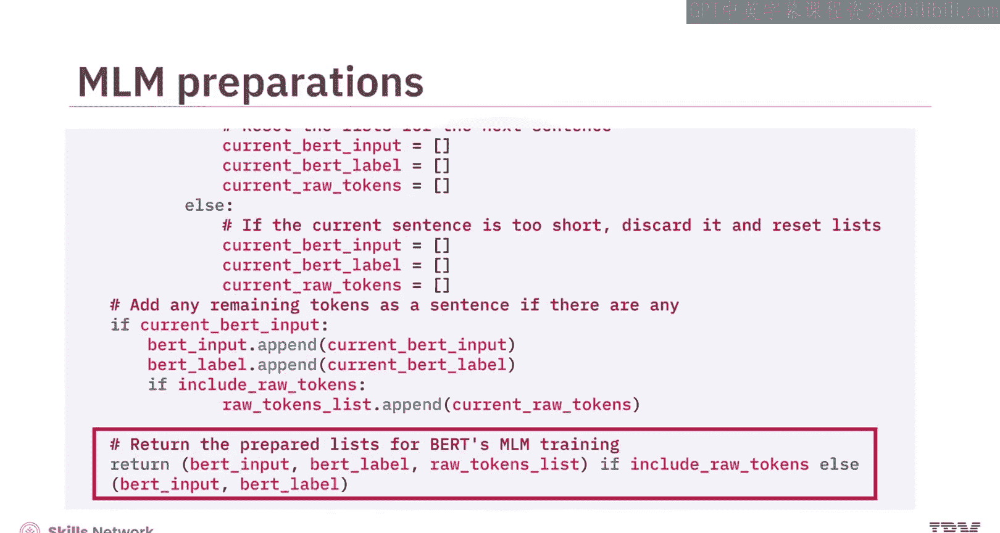

1.  标记被替换为 `[MASK]`，标签被设置为从词汇表中随机选择的一个标记。
2.  标记保持不变，标签被设置为同一个标记。
3.  标记被替换为 `[MASK]`，标签被设置为原始标记。

函数随后返回修改后的标记及其对应的标签。

## 为MLM准备数据 🎯

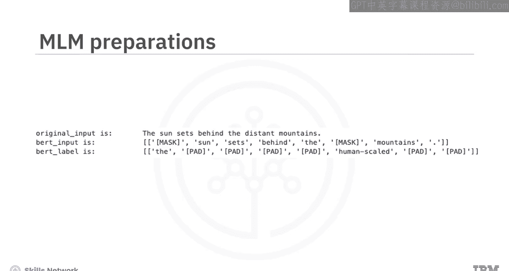

`prepare_for_mlm` 函数用于为BERT的掩码语言建模训练准备分词后的文本。

该函数接收一个标记列表作为输入，并初始化列表来存储处理后的句子、每个标记的标签以及原始标记（如果需要）。它对每个标记应用BERT的MLM掩码策略，将其替换为掩码标记，并分配一个标签来指示该标记是被掩码了还是保持不变。

函数会检查标记是否为句子分隔符。如果找到一个包含多于两个标记的有效句子，它会将当前句子及其标签添加到相应的列表中。如果包含原始标记，原始标记也会被存储。函数持续这个过程，直到所有标记都被处理完毕。

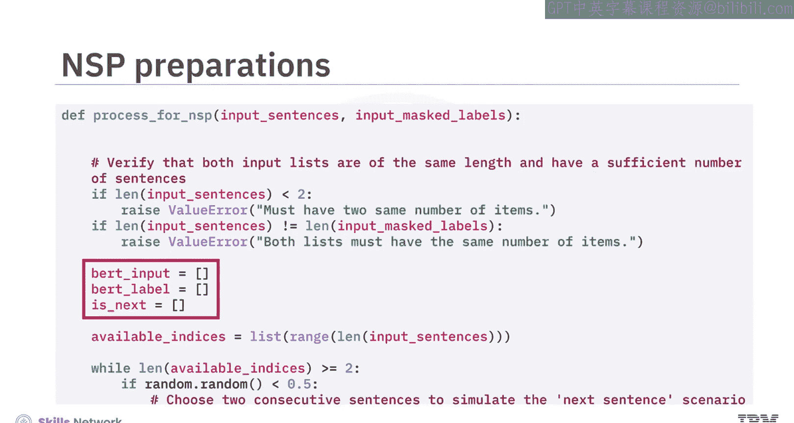

任何剩余的标记（如果存在）会被添加为一个句子。最后，函数返回为BERT的MLM训练准备好的列表。

### MLM输出示例

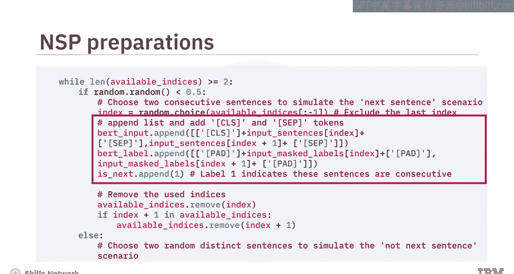

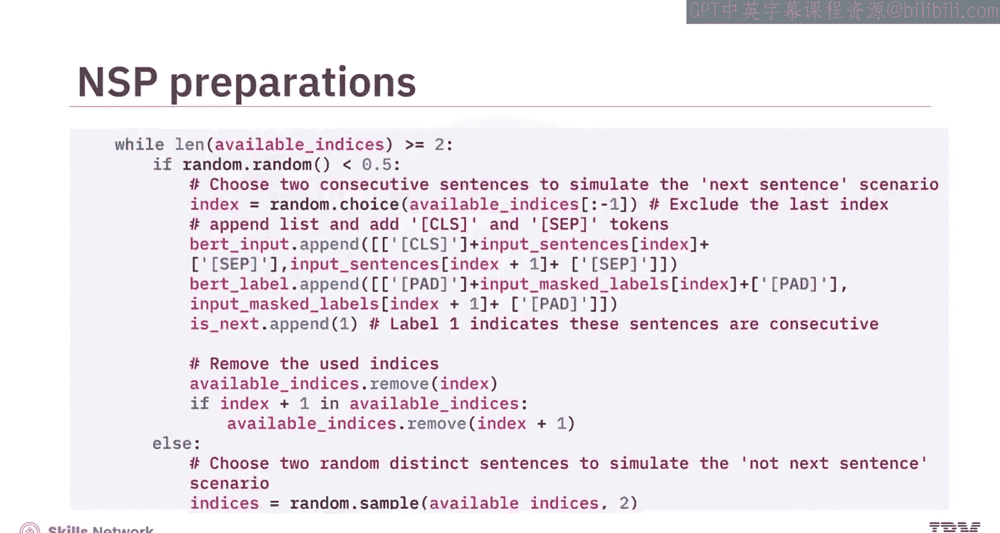

让我们查看一个MLM输出示例。句子中的每个标记都会根据应用于该标记的掩码操作被标记。

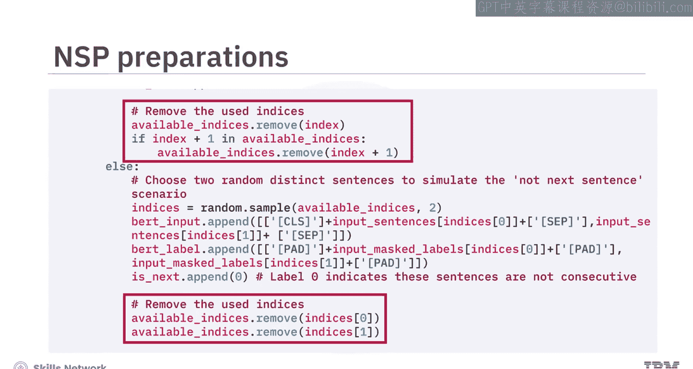

在这个例子中：
*   第一个“the”被掩码。因此，BERT输入是 `[MASK]`，其BERT标签是“the”。
*   标记“sun”、“sets”、“behind”、“and”、“the”、“last”、“the”没有改变。所以它们对应的标签是 `[PAD]`。
*   “Dis”被掩码并替换为一个随机标记。因此，BERT输入是 `[MASK]`，其BERT标签是“human scaled”。
*   最后，“mountains”和句号“.”没有改变，所以它们对应的标签是 `[PAD]`。

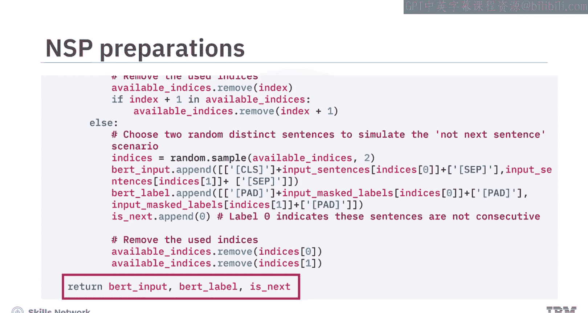

## 为NSP准备数据 🔗

`process_for_nsp` 函数用于为BERT训练中的下一句预测任务准备数据。

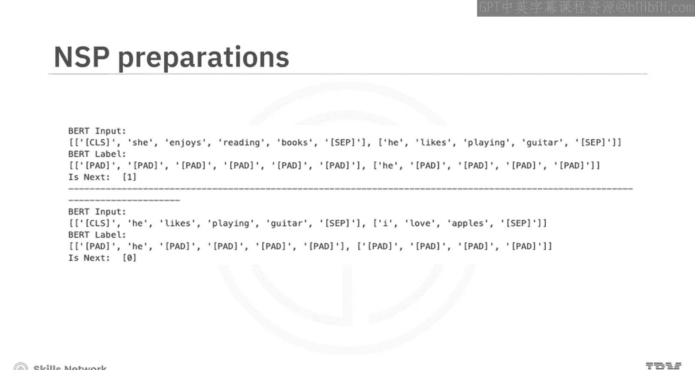

该函数接收一个分词后的句子列表和一个对应的掩码标签列表作为输入。它验证两个列表长度相同且有足够的句子。函数初始化列表来存储BERT输入的句子对、句子对的掩码标签以及指示句子是否连续的二元标签。

使用一个while循环，函数生成句子对，直到至少有两个可用的索引剩余。它随机选择是创建一个“下一句”场景还是一个“非下一句”场景。

*   对于“下一句”场景，它选择两个连续的句子，添加 `[CLS]` 和 `[SEP]` 标记，分配相应的标签，并将 `is_next` 标签设为1。
*   对于“非下一句”场景，它选择两个随机且不同的句子，添加 `[CLS]` 和 `[SEP]` 标记，分配相应的标签，并将 `is_next` 标签设为0。

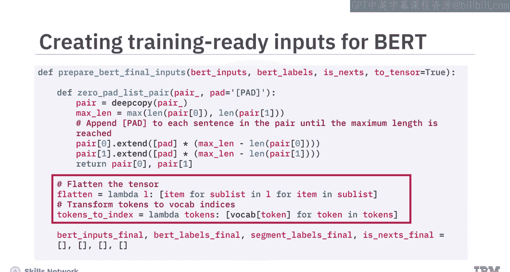

处理完每一对后，已使用的索引会从可用索引列表中移除。最后，函数返回为BERT的NSP任务准备好的列表：句子对、掩码标签和 `is_next` 标签。

### NSP输出示例

让我们查看一个输出示例。特殊符号 `[CLS]` 和 `[SEP]` 首先被添加到输入句子中。BERT标签是使用 `prepare_for_mlm` 函数创建的。

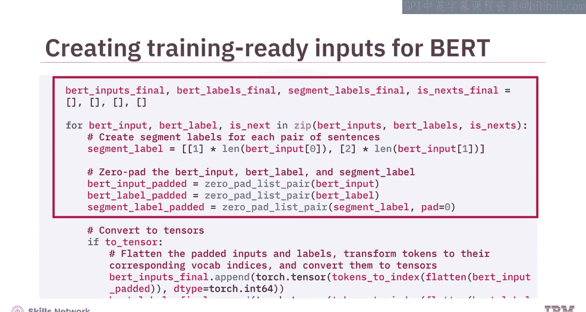

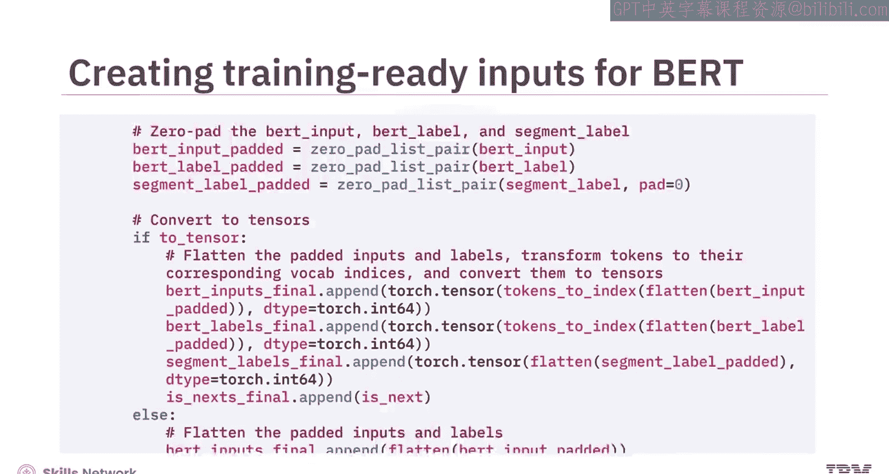

*   在第一个例子中，第二句紧接第一句。因此 `is_next` 是1。
*   在第二个例子中，第二句不紧接第一句。因此 `is_next` 是0。

## 准备BERT最终输入 📦

`prepare_bert_final_inputs` 函数用于准备BERT训练的最终输入列表。它接收BERT输入、BERT标签和 `is_next` 列表作为输入，并进行填充、重新格式化、重塑并转换为张量。

函数内部有一个名为 `zero_pad_list_pair` 的嵌套函数，用于用 `[PAD]` 标记对输入对进行零填充，以确保它们具有相同的长度。这对于在训练期间保持一致的输入形状非常重要。

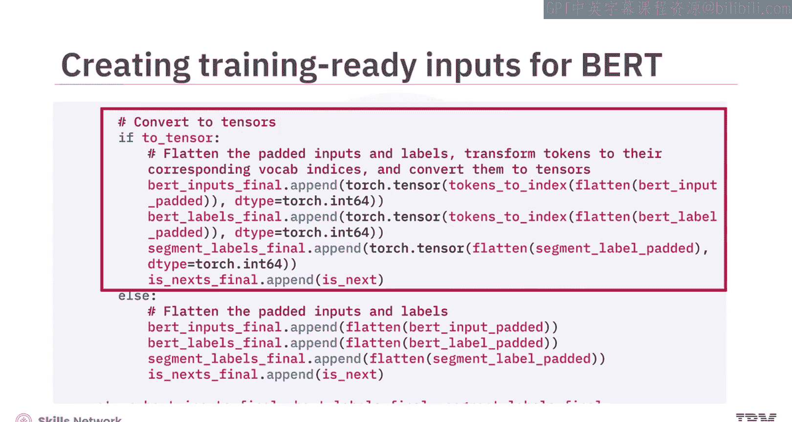

该函数还包括用于展平嵌套列表的 `flatten` 函数和用于将标记转换为其对应词汇索引的 `tokens_to_index` 函数。

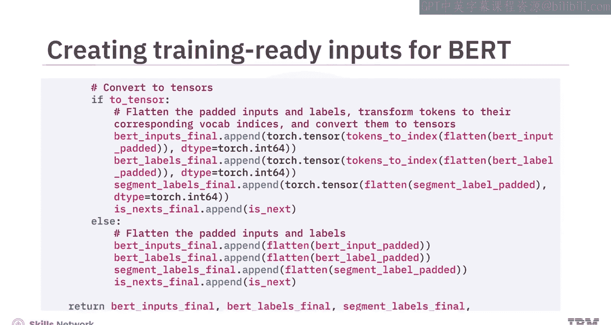

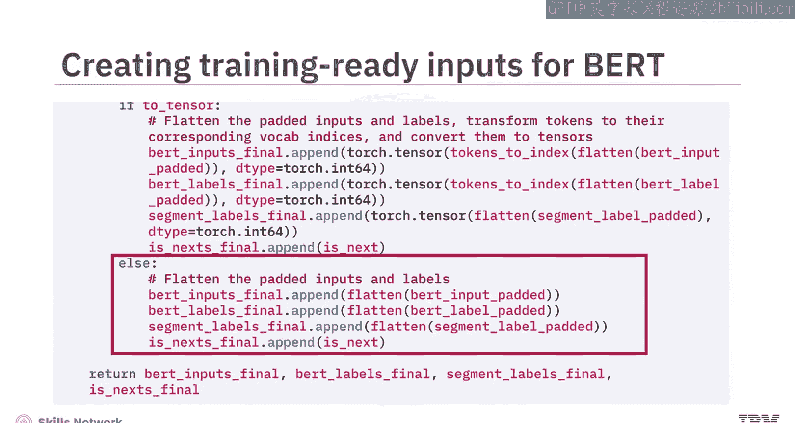

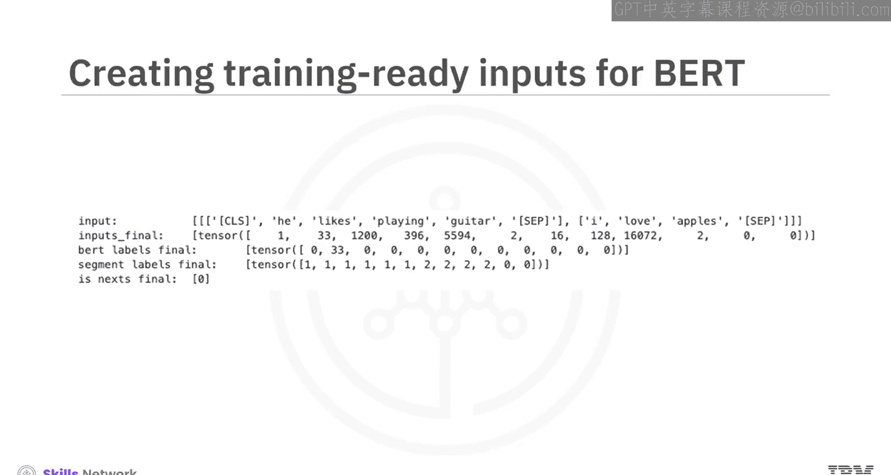

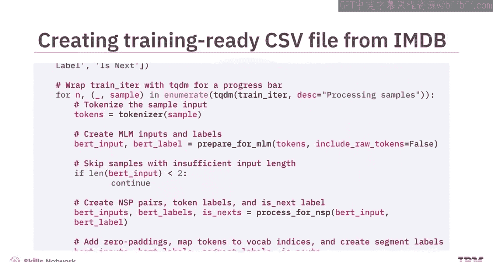

函数遍历每个输入对，为每对句子创建段标签，并使用 `zero_pad_list_pair` 函数对输入对和段标签应用零填充。在BERT中，段嵌入用于区分两个输入句子。这是必要的，因为BERT的输入由一对句子组成（用于NSP或问答类任务），模型需要理解哪些标记属于哪个句子。

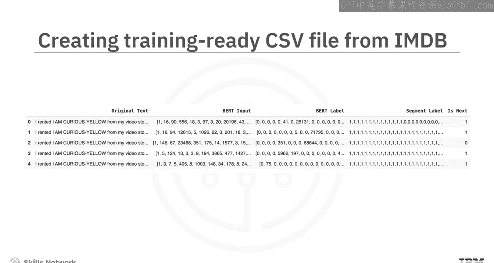

如果 `to_tensor` 标志设置为真，函数会展平填充后的输入和标签，将标记转换为索引，并将它们转换为PyTorch张量。否则，如果 `to_tensor` 为假，则直接将展平后的填充输入、标签、段标签和 `is_next` 值附加到最终的输出列表中。

### 最终输入示例

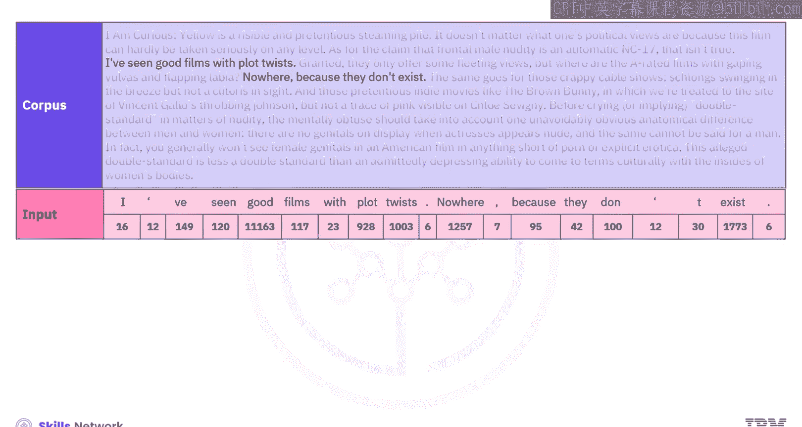

让我们查看一个输出示例。句子被零填充，每个标记被映射到其词汇索引（例如，`[CLS]` 到1，“he”到33，`[SEP]` 到2，`[PAD]` 到0）。掩码标签也被填充并映射到词汇索引。在本例中，除了标记“he”被掩码外，所有标记都未改变。接下来创建段标签，其中第一句的标记标记为1，第二句的标记标记为2，零填充标记标记为0。最后，返回 `is_next` 以指示第二句不紧接第一句。

## 数据写入与完整流程示例 💾

此代码将处理后的互联网电影数据库数据写入CSV文件。输出将如下所示。

让我们查看一个数据准备输出的完整示例。给定一个语料库，会创建句子对作为输入。输入被分词和数字化，添加特殊标记 `[CLS]` 和 `[SEP]`，然后进行零填充。接着，应用掩码策略。根据掩码策略，创建BERT标签，其中除掩码标记外，每个标记的标签都是0。同时创建段标签，显示每个标记属于哪个句子。最后，`is_next` 标签显示第二句是否紧接第一句。

## 总结

本节课中，我们一起学习了为BERT准备数据的完整流程。


你了解到，对于数据准备，首先必须使用 `get_tokenizer` 函数初始化分词器，然后定义特殊符号及其对应的索引。掩码函数用于对标记执行掩码操作，它接收一个标记作为输入并决定是否对其进行掩码。`prepare_for_mlm` 函数接收一个标记列表作为输入，并初始化列表来存储处理后的句子、每个标记的标签以及原始标记（如果需要）。它对每个标记应用BERT的MLM掩码策略，将其替换为掩码标记，并分配一个标签来指示该标记是被掩码了还是保持不变。`process_for_nsp` 函数接收一个分词后的句子列表和一个对应的掩码标签列表作为输入。它验证两个列表长度相同且有足够的句子，并初始化列表来存储BERT输入的句子对、句子对的掩码标签以及指示句子是否连续的二元标签。`prepare_bert_final_inputs` 函数用于准备BERT训练的最终输入列表。它接收BERT输入、BERT标签和 `is_next` 列表作为输入。