# 生成式人工智能工程：13：使用PyTorch预训练BERT模型 🧠

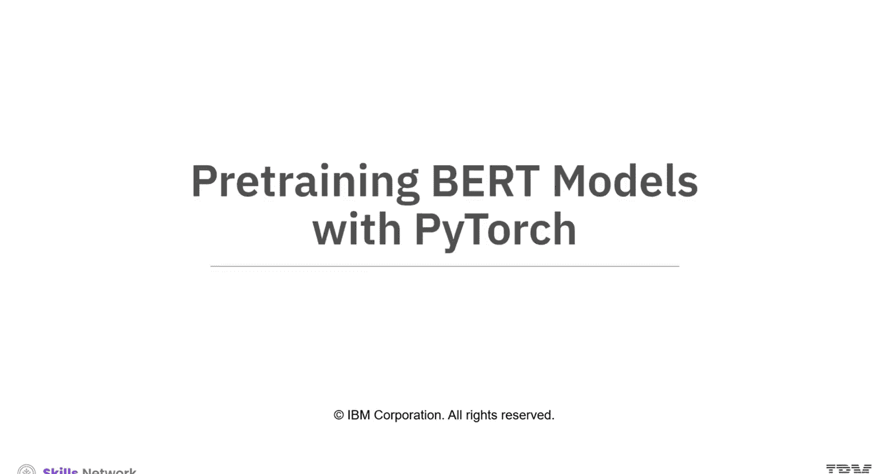

在本节课中，我们将学习如何使用PyTorch框架来预训练一个BERT模型。我们将涵盖从数据加载、模型构建到训练和评估的完整流程。

---

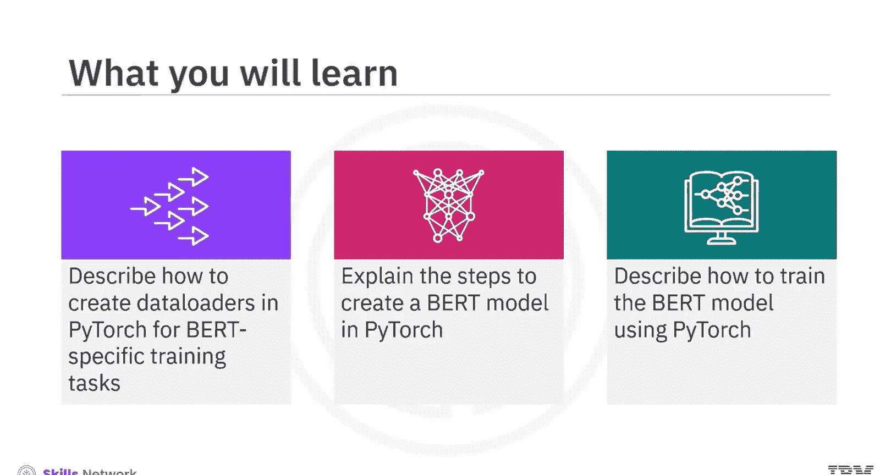

## 概述

我们将分步学习以下核心内容：如何为BERT的特定训练任务创建PyTorch数据加载器；如何构建一个BERT模型；以及如何使用PyTorch训练该模型。

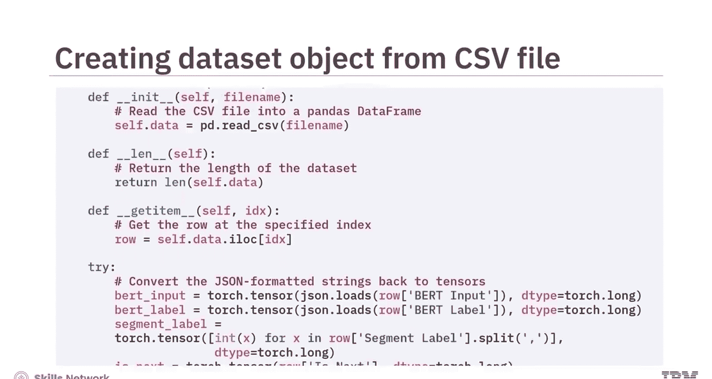

---

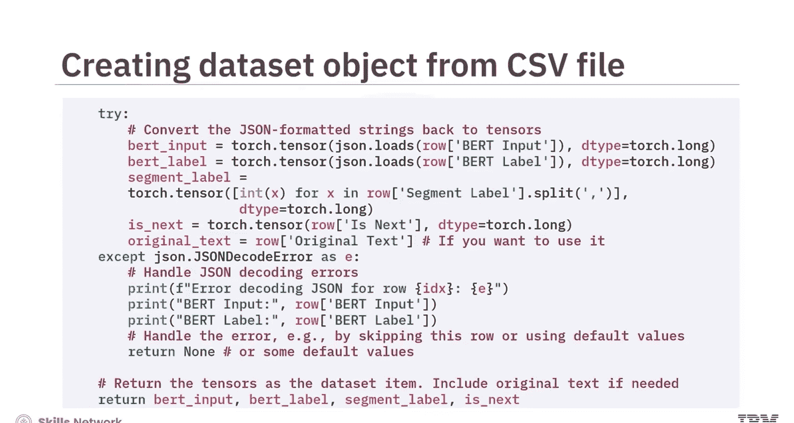

## 创建自定义数据集与数据加载器

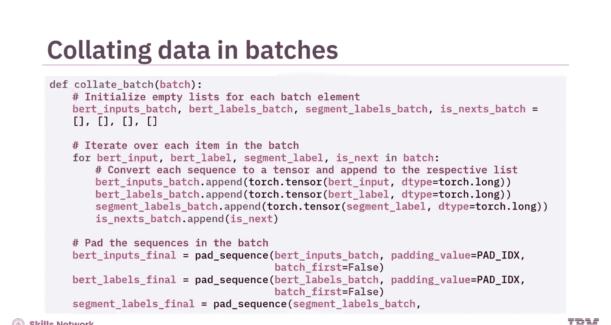

首先，我们需要创建一个自定义的数据集类，用于从CSV文件中加载数据到PyTorch的Dataset中。

这个类名为 `BRT_CSV_Dataset`。它的 `__getitem__` 方法根据索引 `idx` 从数据集中检索单个数据项。该方法会从数据帧中访问对应的行，并将JSON格式的字符串转换回张量。这些张量包括：BERT输入、BERT标签、片段标签和“下一个”标签。

为了在PyTorch DataLoader中进行批处理和序列填充，我们需要定义一个整理函数 `collate_batch`。

以下是创建训练和测试数据加载器的步骤：

1.  定义批处理大小 `batch_size`。
2.  指定训练和测试数据集的CSV文件路径。
3.  使用指定的文件路径，为训练集和测试集创建 `BRT_CSV_Dataset` 类的实例。
4.  最后，创建对应的DataLoader。

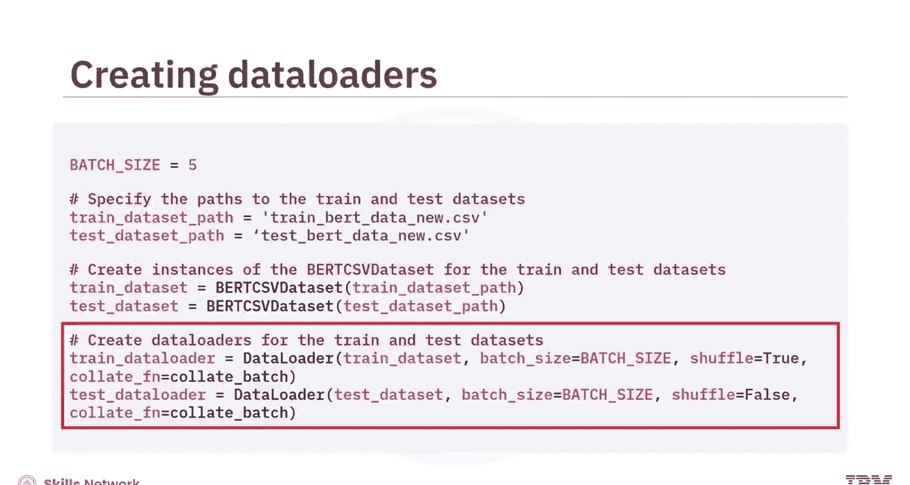

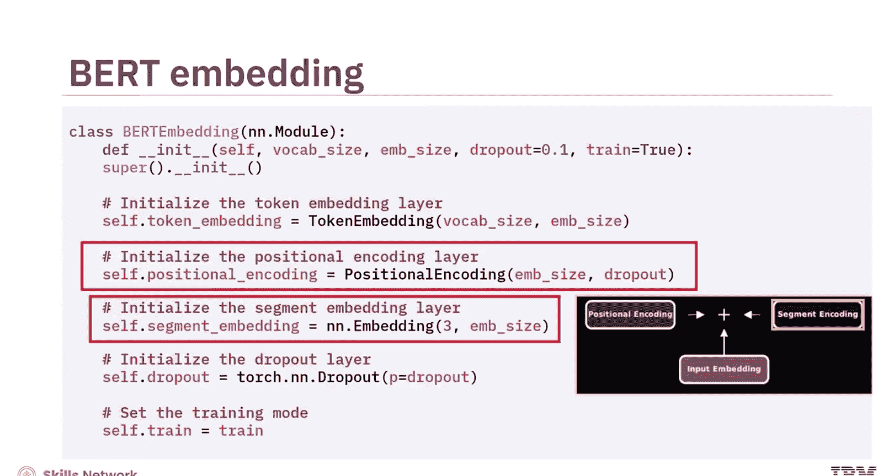

```python
# 示例代码结构
from torch.utils.data import Dataset, DataLoader
import pandas as pd
import torch

class BRT_CSV_Dataset(Dataset):
    def __init__(self, file_path):
        self.data = pd.read_csv(file_path)
    def __getitem__(self, idx):
        row = self.data.iloc[idx]
        # 将JSON字符串转换为张量
        bt_input = torch.tensor(eval(row[‘bt_input’]))
        bt_label = torch.tensor(eval(row[‘bt_label’]))
        segment_label = torch.tensor(eval(row[‘segment_label’]))
        is_next = torch.tensor(eval(row[‘is_next’]))
        return bt_input, bt_label, segment_label, is_next
    def __len__(self):
        return len(self.data)

def collate_batch(batch):
    # 实现批处理和填充逻辑
    bt_inputs = [item[0] for item in batch]
    # ... 填充操作 ...
    return padded_bt_inputs, ...

# 创建数据加载器
batch_size = 32
train_dataset = BRT_CSV_Dataset(‘train.csv’)
test_dataset = BRT_CSV_Dataset(‘test.csv’)
train_loader = DataLoader(train_dataset, batch_size=batch_size, collate_fn=collate_batch)
test_loader = DataLoader(test_dataset, batch_size=batch_size, collate_fn=collate_batch)
```

---

## 定义BERT模型架构

上一节我们准备好了数据，本节中我们来看看如何构建BERT模型。BERT模型的核心组成部分包括嵌入层、Transformer编码器层以及用于下游任务的线性层。

### BertEmbedding 类

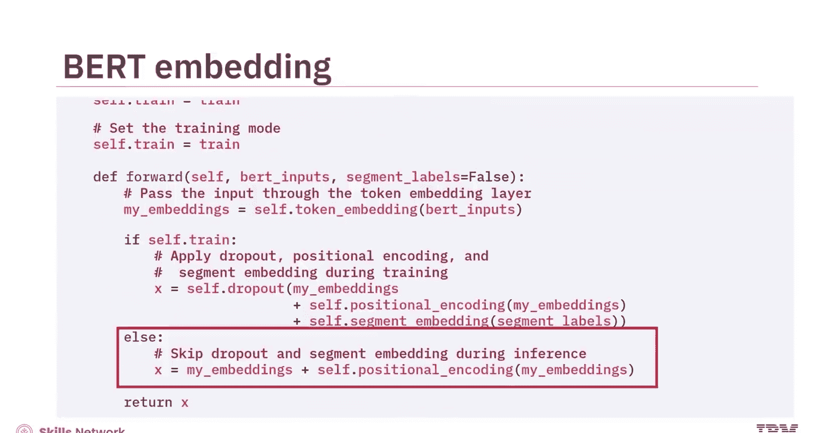

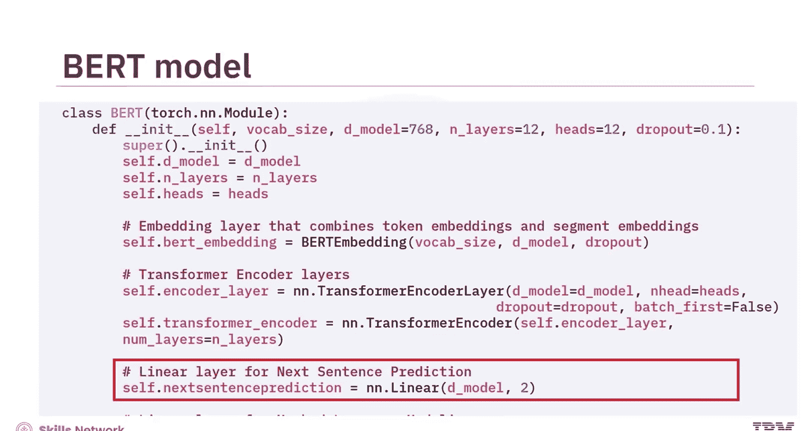

`BertEmbedding` 类是一个用于BERT模型中嵌入操作和位置编码的模块。与其他模型的主要区别在于，它**额外添加了片段嵌入**。

### 完整的BERT模型类

现在，让我们定义完整的BERT模型。定义一个名为 `BertModel` 的类，它是 `torch.nn.Module` 的子类。

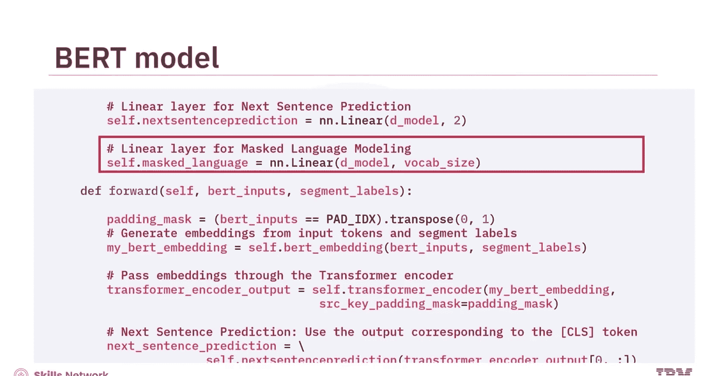

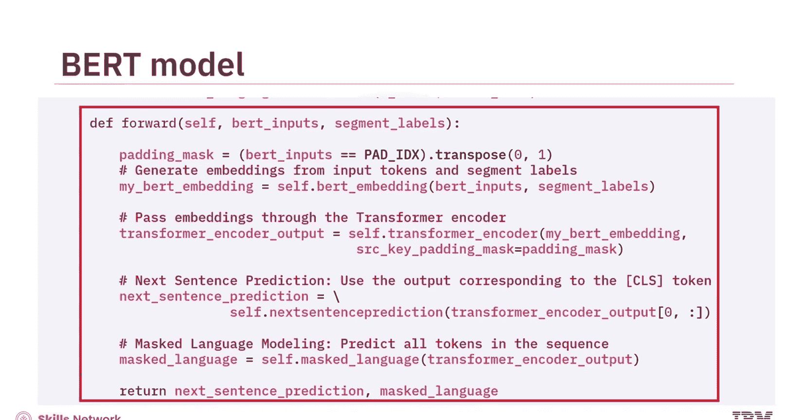

*   `__init__` 方法通过指定词汇表大小 `vocab_size`、模型维度 `d_model`、层数 `n_layers`、注意力头数 `n_heads` 和丢弃率 `dropout` 来初始化BERT模型。
*   BERT模型包含一个嵌入层，它结合了词元嵌入和片段嵌入。这通过之前定义的 `BertEmbedding` 类实现。
*   使用Transformer编码器层对输入嵌入进行编码。Transformer层的数量及其配置由参数 `n_layers`、`n_heads`、`dropout` 和 `d_model` 决定。
*   模型包含一个用于下一句预测的线性层，它预测两个连续句子之间的关系。该层以Transformer编码器的输出（形状为 `[序列长度, 批大小, 嵌入维度]`）作为输入，输入是每个序列的 `[CLS]` 嵌入。
*   类似地，模型包含一个用于掩码语言建模的线性层，它预测输入序列中被掩码的词元。该层以Transformer编码器的输出为基础，在整个词汇表上进行预测。期望的输出形状是 `[序列长度, 批大小, 词汇表大小]`。
*   `forward` 方法定义了BERT模型的前向传播过程。它以BERT输入（输入词元和片段标签）作为输入，并返回NSP和MLM的预测结果。

```python
import torch.nn as nn
import torch

class BertEmbedding(nn.Module):
    def __init__(self, vocab_size, d_model, max_len=512):
        super().__init__()
        self.token_embedding = nn.Embedding(vocab_size, d_model)
        self.segment_embedding = nn.Embedding(2, d_model) # 通常只有两种片段（如句子A和B）
        self.position_embedding = nn.Embedding(max_len, d_model)
    def forward(self, token_ids, segment_ids):
        # 组合三种嵌入
        pos_ids = torch.arange(token_ids.size(1), device=token_ids.device).unsqueeze(0)
        embeddings = self.token_embedding(token_ids) + self.segment_embedding(segment_ids) + self.position_embedding(pos_ids)
        return embeddings

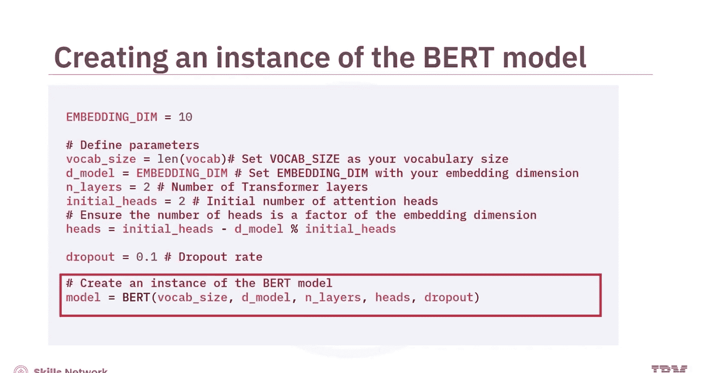

class BertModel(nn.Module):
    def __init__(self, vocab_size, d_model, n_layers, n_heads, dropout):
        super().__init__()
        self.embedding = BertEmbedding(vocab_size, d_model)
        encoder_layer = nn.TransformerEncoderLayer(d_model=d_model, nhead=n_heads, dropout=dropout, batch_first=True)
        self.transformer_encoder = nn.TransformerEncoder(encoder_layer, num_layers=n_layers)
        self.nsp_head = nn.Linear(d_model, 2) # 二分类：IsNext 或 NotNext
        self.mlm_head = nn.Linear(d_model, vocab_size)
    def forward(self, input_ids, segment_ids):
        embeddings = self.embedding(input_ids, segment_ids)
        encoded = self.transformer_encoder(embeddings)
        # 使用 [CLS] 标记的输出进行NSP预测
        cls_output = encoded[:, 0, :]
        nsp_logits = self.nsp_head(cls_output)
        # 使用所有位置的输出进行MLM预测
        mlm_logits = self.mlm_head(encoded)
        return nsp_logits, mlm_logits
```

---

## 实例化模型与设置训练参数

现在，让我们看看如何设置参数并创建BERT模型的实例。

*   嵌入维度 `d_model` 设为 10。
*   词汇表大小 `vocab_size` 根据词汇表 `vocab` 的长度确定。
*   这个迷你BERT模型有两个Transformer层，初始注意力头数设为 2。
*   丢弃率 `dropout` 设为 0.1。

利用这些参数，我们可以创建BERT模型实例以供后续使用。

```python
vocab = [‘[PAD]‘, ‘[UNK]‘, ‘[CLS]‘, ‘[SEP]‘, ‘[MASK]‘, ‘hello’, ‘world’, …] # 示例词汇表
vocab_size = len(vocab)
d_model = 10
n_layers = 2
n_heads = 2
dropout = 0.1

model = BertModel(vocab_size, d_model, n_layers, n_heads, dropout)
```

---

## 定义评估函数与训练循环

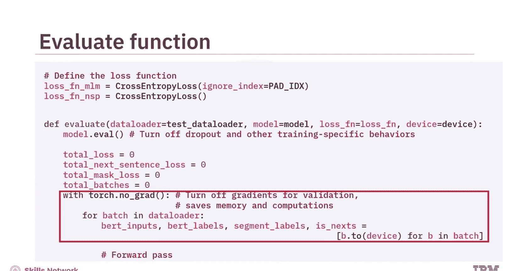

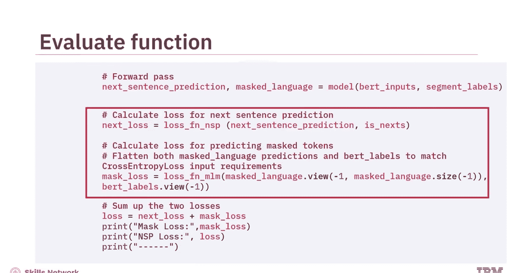

模型创建完成后，下一步是在数据上训练它并评估其性能。为了便于这个过程，我们可以定义一个评估函数。该函数用于评估BERT模型的性能，并在训练阶段评估模型的进展。

首先，定义损失函数。损失函数是交叉熵损失，可用于计算预测值与实际值之间的损失。

`evaluate` 函数接受几个参数：`data_loader`、`model`、`loss_fn` 和 `device`。在函数内部，使用 `model.eval()` 将BERT模型置于评估模式。这会禁用dropout和其他训练特定的行为。

初始化变量以跟踪总损失、总下一句损失、总掩码损失和总批次数。评估在关闭梯度的情况下进行，使用 `torch.no_grad()`。这节省了内存和计算，因为验证不需要梯度。

该函数遍历提供的DataLoader中的批次。使用BERT模型执行前向传播，以获得下一句和掩码语言任务的预测。然后计算两个损失，并将它们相加以获得该批次的总损失。

通过将总损失除以总批次数，可以计算平均损失、平均下一句损失和平均掩码损失。打印平均损失并从函数返回。

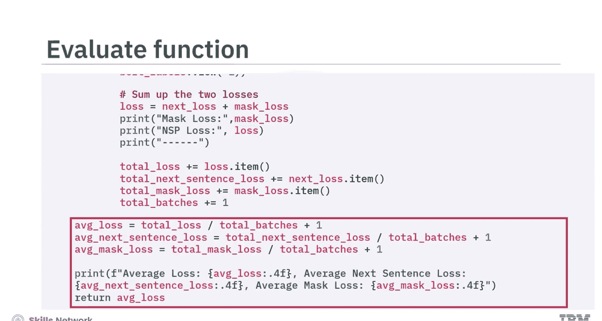

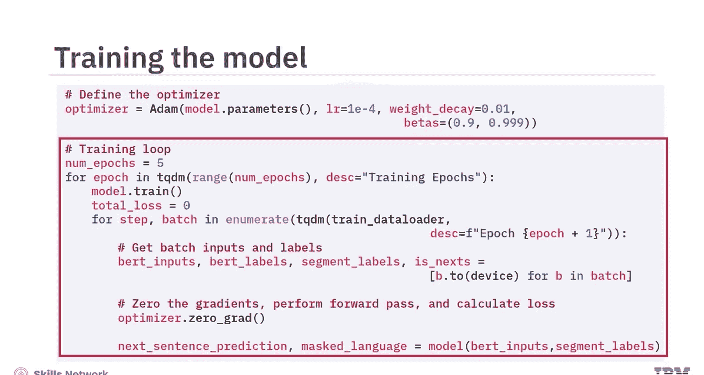

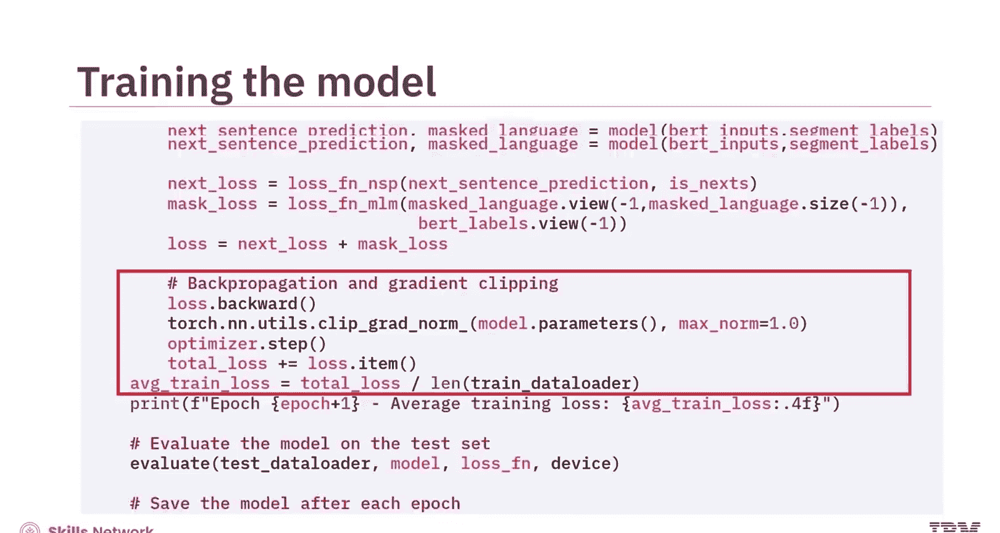

在训练开始之前，定义用于训练BERT模型的优化器。优化器是Adam。

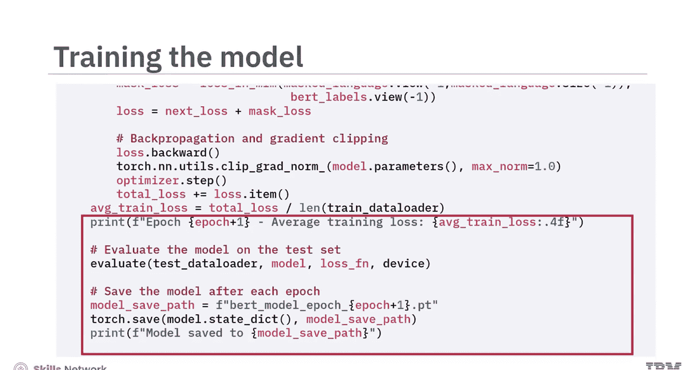

让我们看一下训练循环。在每个epoch内，可以按批次遍历训练数据。对于每个批次，执行前向传播，计算损失，并通过反向传播和梯度裁剪更新模型的参数。

每个epoch之后，可以打印平均训练损失，并在测试集上评估模型的性能。也可以在每个epoch后保存模型。

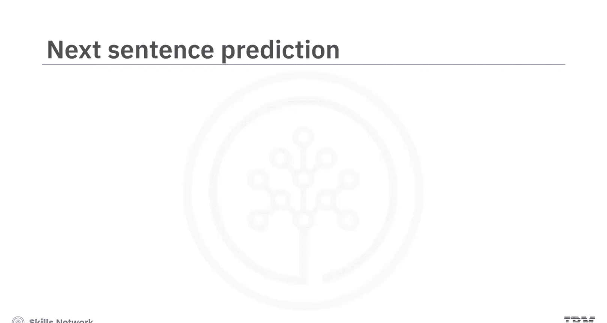

```python
import torch.optim as optim
from tqdm import tqdm

loss_fn = nn.CrossEntropyLoss()
optimizer = optim.Adam(model.parameters(), lr=1e-4)
device = torch.device(‘cuda’ if torch.cuda.is_available() else ‘cpu’)
model.to(device)

def evaluate(data_loader, model, loss_fn, device):
    model.eval()
    total_loss, total_nsp_loss, total_mlm_loss, num_batches = 0, 0, 0, 0
    with torch.no_grad():
        for batch in data_loader:
            input_ids, segment_ids, nsp_labels, mlm_labels = [b.to(device) for b in batch]
            nsp_logits, mlm_logits = model(input_ids, segment_ids)
            nsp_loss = loss_fn(nsp_logits, nsp_labels)
            mlm_loss = loss_fn(mlm_logits.view(-1, vocab_size), mlm_labels.view(-1))
            batch_loss = nsp_loss + mlm_loss
            total_loss += batch_loss.item()
            total_nsp_loss += nsp_loss.item()
            total_mlm_loss += mlm_loss.item()
            num_batches += 1
    avg_loss = total_loss / num_batches
    print(f“评估结果 - 平均损失: {avg_loss:.4f}“)
    model.train()
    return avg_loss

num_epochs = 10
for epoch in range(num_epochs):
    model.train()
    total_train_loss = 0
    for batch in tqdm(train_loader, desc=f“Epoch {epoch+1}“):
        input_ids, segment_ids, nsp_labels, mlm_labels = [b.to(device) for b in batch]
        optimizer.zero_grad()
        nsp_logits, mlm_logits = model(input_ids, segment_ids)
        nsp_loss = loss_fn(nsp_logits, nsp_labels)
        mlm_loss = loss_fn(mlm_logits.view(-1, vocab_size), mlm_labels.view(-1))
        loss = nsp_loss + mlm_loss
        loss.backward()
        torch.nn.utils.clip_grad_norm_(model.parameters(), max_norm=1.0) # 梯度裁剪
        optimizer.step()
        total_train_loss += loss.item()
    avg_train_loss = total_train_loss / len(train_loader)
    print(f“Epoch {epoch+1} - 平均训练损失: {avg_train_loss:.4f}“)
    # 在测试集上评估
    test_loss = evaluate(test_loader, model, loss_fn, device)
    # 保存模型检查点
    torch.save(model.state_dict(), f“bert_epoch_{epoch+1}.pth”)
```

---

## 使用训练好的模型进行预测

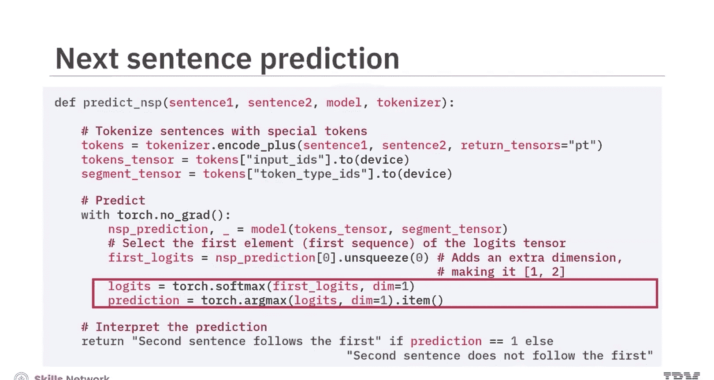

现在，让我们检查模型的性能。为此，定义一个名为 `predict_nsp` 的函数，它使用预训练的BERT模型预测第二个句子是否跟随第一个句子。

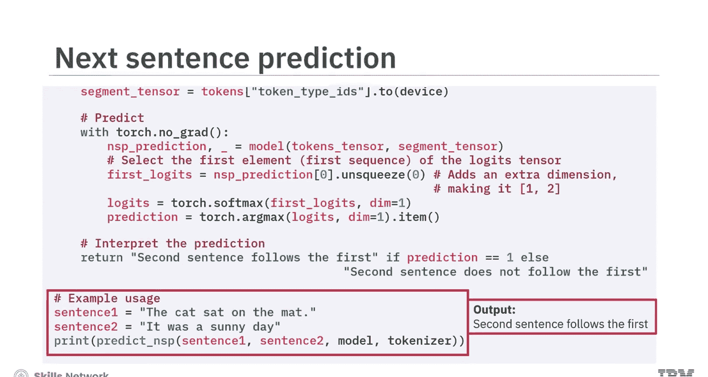

该函数接受两个句子、一个BERT模型和一个分词器作为输入。函数使用 `tokenizer.encode_plus` 方法对输入句子进行分词，该方法返回一个分词后输入的字典。然后将分词后的输入转换为张量，并移动到适当的设备进行处理。

通过传递词元张量和片段张量作为输入，使用BERT模型进行预测。选择logits张量的第一个元素并 `unsqueeze` 以添加一个额外的维度，使其形状变为 `[1, 2]`。logits通过softmax函数以获得概率，并通过取 `argmax` 获得预测结果。最后，将预测结果解释并返回为一个字符串，指示第二个句子是否跟随第一个。

例如，将两个句子与BERT模型和分词器一起传递给 `predict_nsp` 函数。打印结果，根据模型的预测指示第二个句子是否跟随第一个。

接下来，可以定义一个函数来使用预训练的BERT模型执行MLM。该函数接受一个句子、一个BERT模型和一个分词器作为输入。函数使用分词器对输入句子进行分词，并将其转换为词元ID，包括特殊词元。结果存储在 `tokens_tensor` 变量中。创建填充零的虚拟片段标签作为片段标签。

通过传递词元张量和片段标签作为输入，使用BERT模型进行预测。提取MLM logits作为预测。使用 `nonzero` 方法识别掩码词元的位置，并存储在 `masked_token_index` 变量中。请记住，除掩码词元外的所有词元都用0填充。通过取MLM logits在对应位置的 `argmax` 获得掩码词元的预测索引，其形状为 `[批大小, 序列长度, 词汇表大小]`。使用分词器的 `convert_ids_to_tokens` 方法将预测索引转换回词元。然后用预测的词元替换原始句子中掩码词元的位置，得到预测的句子。

调用 `predict_mlm` 函数，传入一个示例句子、BERT模型和分词器。打印预测的句子，其中掩码词元被预测的词元替换。

```python
# 假设我们有一个简单的分词器（此处为示意，实际使用Hugging Face的BertTokenizer）
class SimpleTokenizer:
    def encode_plus(self, text1, text2=None, return_tensors=‘pt’):
        # 简化的分词逻辑
        tokens = [‘[CLS]‘] + text1.split() + [‘[SEP]‘]
        segment_ids = [0] * len(tokens)
        if text2:
            tokens += text2.split() + [‘[SEP]‘]
            segment_ids += [1] * (len(text2.split()) + 1)
        # 将词转换为ID（此处简化）
        token_ids = [hash(t) % 100 for t in tokens] # 示例映射
        return {‘input_ids’: torch.tensor([token_ids]), ‘token_type_ids’: torch.tensor([segment_ids])}
    def convert_ids_to_tokens(self, ids):
        # 简化的反向转换
        return [f“token_{i}” for i in ids]

tokenizer = SimpleTokenizer()

def predict_nsp(sent1, sent2, model, tokenizer):
    inputs = tokenizer.encode_plus(sent1, sent2, return_tensors=‘pt’)
    input_ids = inputs[‘input_ids’].to(device)
    segment_ids = inputs[‘token_type_ids’].to(device)
    model.eval()
    with torch.no_grad():
        nsp_logits, _ = model(input_ids, segment_ids)
    probs = torch.softmax(nsp_logits, dim=-1)
    prediction = torch.argmax(probs, dim=-1).item()
    return “是下一句” if prediction == 1 else “不是下一句”

# 示例使用
result = predict_nsp(“今天天气很好”, “我们出去散步吧”, model, tokenizer)
print(f“NSP预测: {result}“)

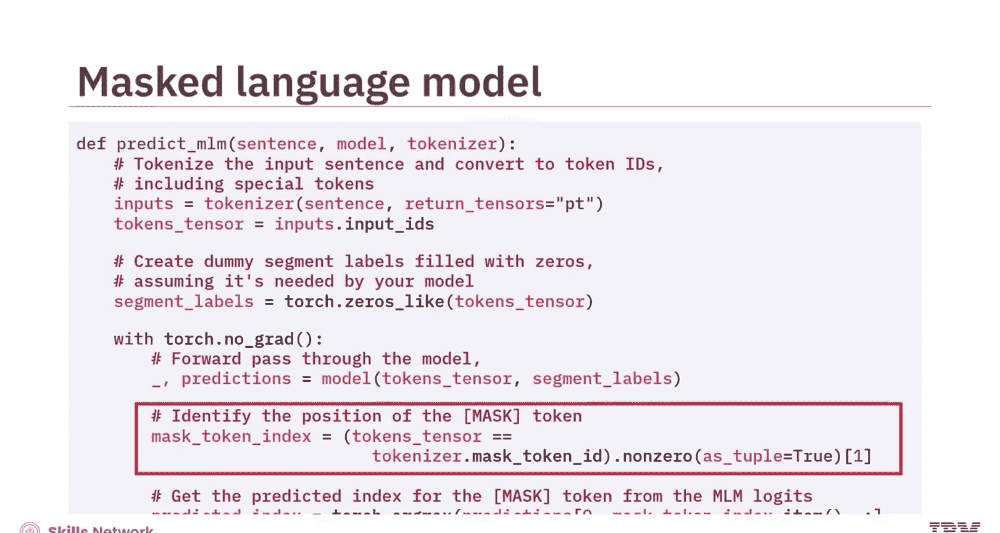

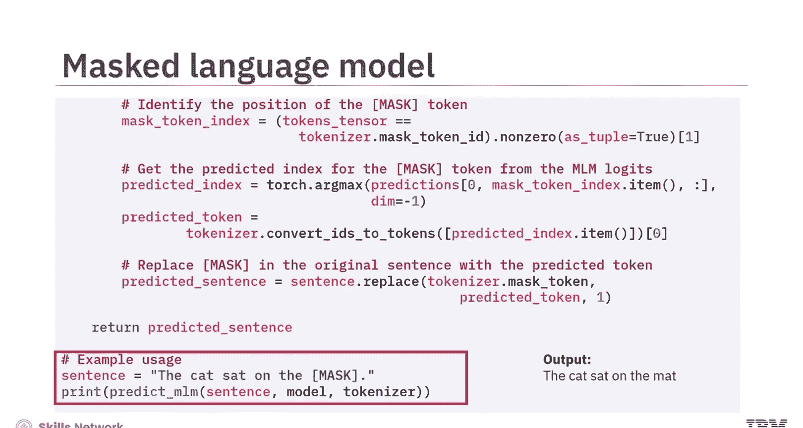

def predict_mlm(sentence, model, tokenizer):
    # 假设句子中有一个 `[MASK]` 词元
    inputs = tokenizer.encode_plus(sentence, return_tensors=‘pt’)
    input_ids = inputs[‘input_ids’].to(device)
    segment_ids = inputs[‘token_type_ids’].to(device)
    model.eval()
    with torch.no_grad():
        _, mlm_logits = model(input_ids, segment_ids)
    # 找到 [MASK] 的位置 (假设ID为4)
    masked_positions = (input_ids == 4).nonzero(as_tuple=True)[1]
    for pos in masked_positions:
        predicted_id = torch.argmax(mlm_logits[0, pos]).item()
        predicted_token = tokenizer.convert_ids_to_tokens([predicted_id])[0]
        # 在实际应用中，需要将input_ids中的[MASK] ID替换为predicted_id，然后解码回文本
        print(f“位置 {pos} 的预测词元: {predicted_token}“)
    # 此处应返回完整的预测句子，示例略
    return “预测的句子”

# 示例使用
mlm_result = predict_mlm(“今天天气很[MASK]”, model, tokenizer)
```

---

## 总结

本节课中，我们一起学习了使用PyTorch预训练BERT模型的完整流程：

1.  **创建数据加载器**：你需要创建一个自定义数据集类，将数据从CSV文件加载到PyTorch Dataset中。定义一个整理函数，并为训练集和测试集创建相应的数据加载器。
2.  **构建BERT模型**：你需要定义一个用于嵌入操作和位置编码的类，以及一个BERT模型类，两者都是 `torch.nn.Module` 的子类。在BERT模型类中，你需要定义嵌入层、Transformer编码器层、用于NSP和MLM的线性层以及BERT模型的前向传播过程。
3.  **训练与评估**：作为BERT模型训练的一部分，你需要定义一个函数来评估BERT模型的性能，定义用于训练BERT模型的优化器，定义训练循环并监控损失。

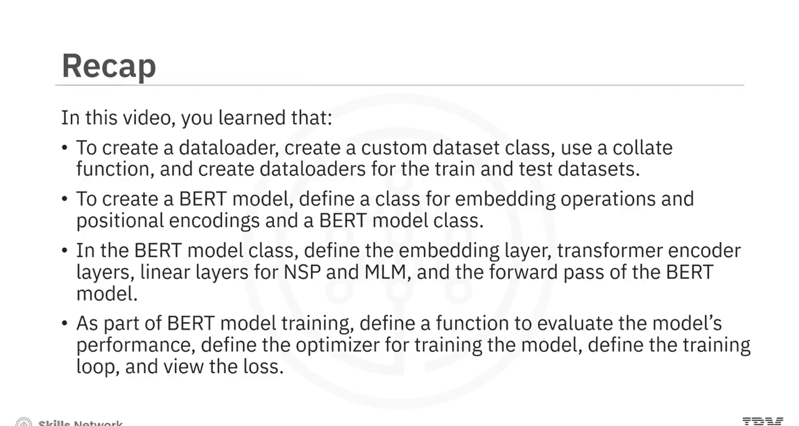


通过掌握这些步骤，你已经具备了使用PyTorch从头开始构建和训练一个基础BERT模型的能力。