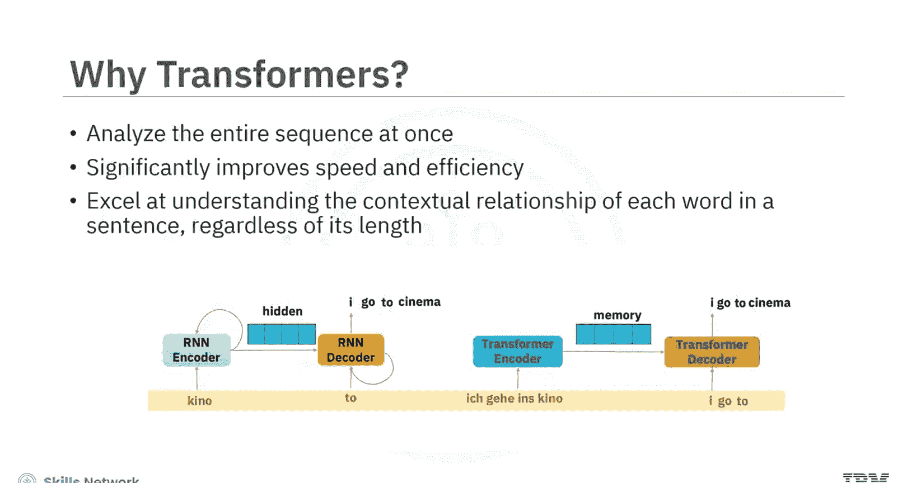
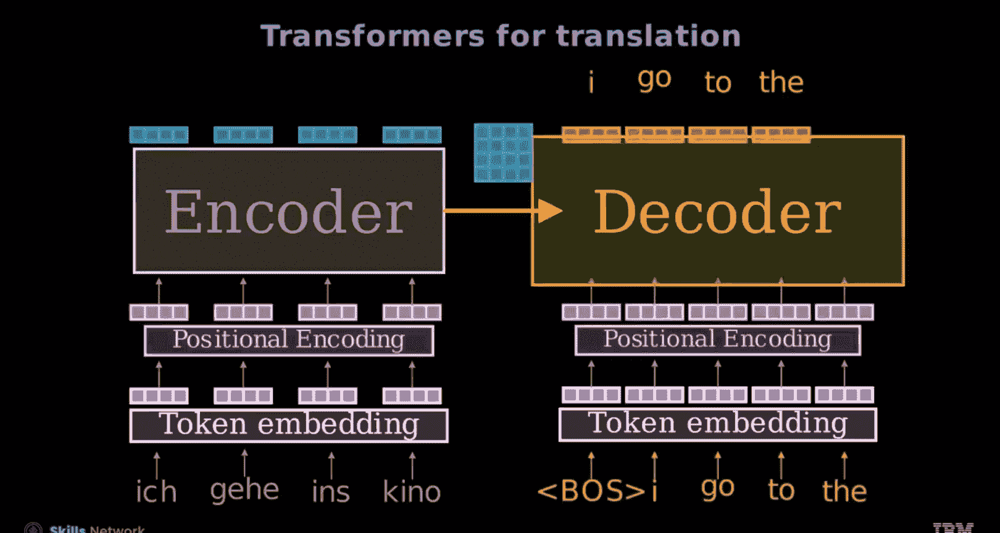
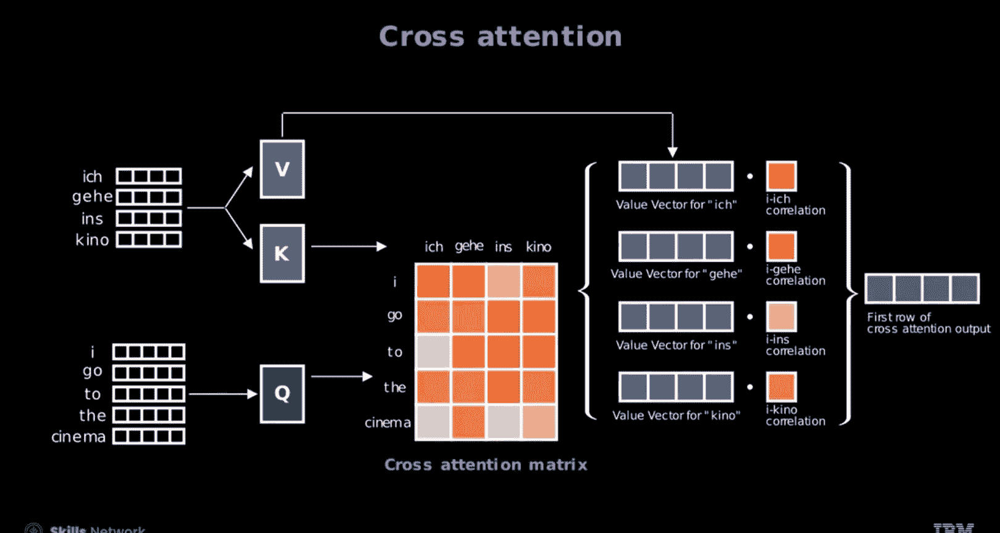

# 生成式人工智能工程：14：用于语言翻译的Transformer架构 🚀

在本节课中，我们将要学习Transformer架构如何应用于语言翻译任务。我们将详细描述其编码器-解码器结构，并解释模型如何生成翻译结果。

---

## 概述

传统的语言翻译模型，如RNN和LSTM，需要按顺序逐词处理文本。这种方法对于长文本序列来说速度慢且效率低，因为在大跨度文本中保持上下文连贯性具有挑战性。Transformer通过同时处理整个文本序列，彻底改变了语言翻译领域。这种方法极大地加速了翻译任务，并增强了对长文本序列的处理能力，实现了对上下文更深入、更连贯的理解。Transformer还具备其他多项优势，这些优势对于提升语言翻译效果尤为关键。

上一节我们介绍了Transformer的背景与优势，本节中我们来看看其具体的架构。

## 序列到序列Transformer模型架构

让我们探索一下在机器翻译中广泛使用的序列到序列Transformer模型架构。

首先，源文本被**分词**。每个词元被映射到词汇表中的对应索引，并转换为词嵌入向量。为了保持词序信息，会向这些嵌入向量中添加**位置编码**。

编码器处理这些嵌入向量，输出包含上下文信息的嵌入，称为**记忆**。它封装了在解码阶段翻译短语所需的全部信息。

翻译过程一次生成一个词。从**句子开始**标记开始。每个新生成的词元随后被嵌入并添加位置编码，同时利用来自编码器的记忆。解码器预测下一个词元。预测出的词元随后成为后续解码步骤的输入。

这个过程递归重复，直到完整序列被翻译完毕，确保翻译结果既连贯又符合上下文。

以下是翻译过程的步骤分解：
1.  **分词与嵌入**：源文本被分词并转换为词嵌入向量。
2.  **添加位置编码**：为嵌入向量添加位置信息。
3.  **编码器处理**：编码器生成包含上下文信息的“记忆”。
4.  **解码启动**：解码从`<BOS>`（句子开始）标记开始。
5.  **自回归生成**：解码器结合“记忆”，预测下一个词元，并将其反馈作为下一步的输入，直至生成`<EOS>`（句子结束）标记。

## 编码器内部工作原理

现在，让我们深入编码器的内部，追踪其内部的数据流。

一个源句子进入**嵌入层**，其中每个词元被转换为一个`d`维的嵌入向量。随后应用**位置编码**。接着，向量通过**多头注意力**层，该层允许模型同时关注句子的不同部分。然后通过一个**归一化层**。之后，一个**前馈网络**处理这些向量，产生相同维度`d`的输出。最后一个**归一化层**完成编码器的操作。

产生的**记忆**是一个张量，其维度等于序列长度乘以嵌入大小`d`。

## 解码器架构与关键机制

解码器架构与仅解码器模型相似，但有几个关键区别。

一个显著的变化是增加了**交叉注意力层**，该层专注于编码器输出的“记忆”。这个关键层使得解码器能够参考输入序列的完整上下文。

**掩码**是解码器机制的另一个重要组成部分。它确保模型按顺序预测每个词，只考虑目标序列中前面的词元，这对于自回归生成过程至关重要。

**线性层**将上下文嵌入转换为**逻辑值**，将向量映射到词汇表的维度。这些逻辑值为所有可能的词打分，指导模型预测下一个词。

例如，过程从`<BOS>`标记开始。解码器随后利用“记忆”生成词元“I”。这个词元被反馈回解码器，与“记忆”结合以生成下一个词“go”。这个过程重复进行，直到`<EOS>`标记指示序列结束或达到预定长度。

解码器使用**交叉注意力**来关注编码器的隐藏表示。它计算每个目标位置与编码器中所有源位置之间的注意力分数。这些注意力分数反映了每个源位置对当前目标位置的相关性或重要性。通过引入交叉注意力，解码器可以根据与当前解码步骤的相关性，关注输入序列的不同部分。这种机制帮助模型捕捉长距离依赖关系，并有效地对齐输入和输出序列，这对于准确翻译至关重要。

以下是解码过程的核心步骤：
1.  **输入与掩码**：解码器接收已生成序列（添加掩码确保只能看到前面词元）和编码器“记忆”。
2.  **自注意力与交叉注意力**：通过自注意力处理目标序列，通过交叉注意力关联“记忆”。
3.  **前馈网络与预测**：经前馈网络处理后，通过线性层输出词汇表所有词的概率分布。
4.  **词元选择与迭代**：选择概率最高的词元作为输出，并将其添加回输入序列，重复此过程。

## 总结

本节课中我们一起学习了Transformer在语言翻译中的应用。你了解到，与RNN不同，Transformer能同时处理整个文本序列进行语言翻译。

在**编码器**中，源句子进入嵌入层，然后应用位置编码。随后，向量通过多头注意力层和归一化层。接着，前馈网络处理向量，最后的归一化层完成编码器的操作。

在**解码器**中，交叉注意力层使解码器能够参考输入序列的完整上下文。掩码确保模型按顺序预测每个词，只考虑目标序列中前面的词元。线性层将上下文嵌入转换为逻辑值，将向量映射到词汇表维度。交叉注意力计算每个目标位置与解码器以及编码器中所有源位置之间的注意力分数。