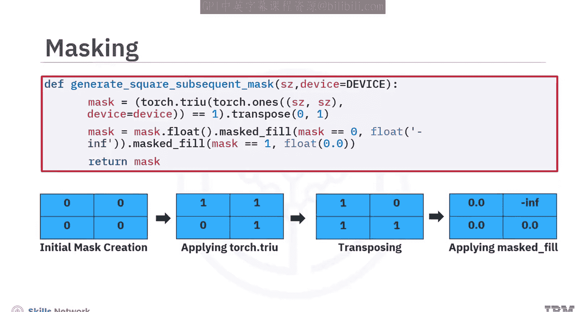
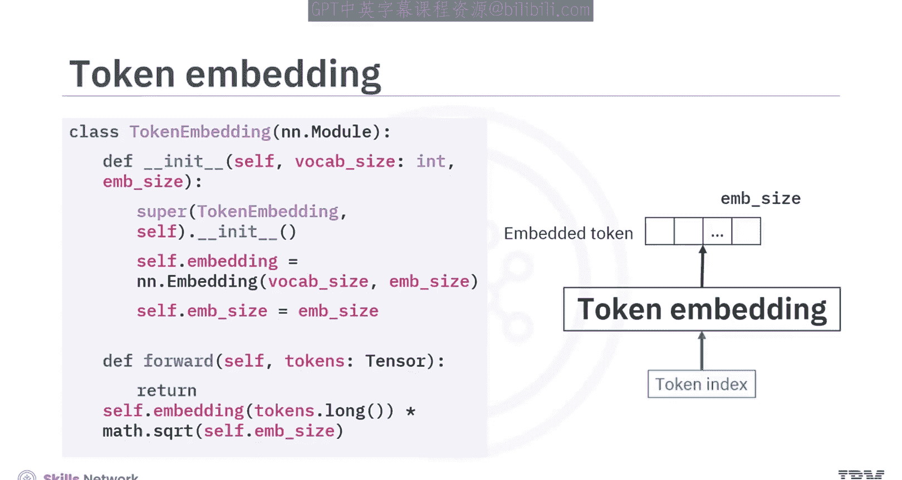
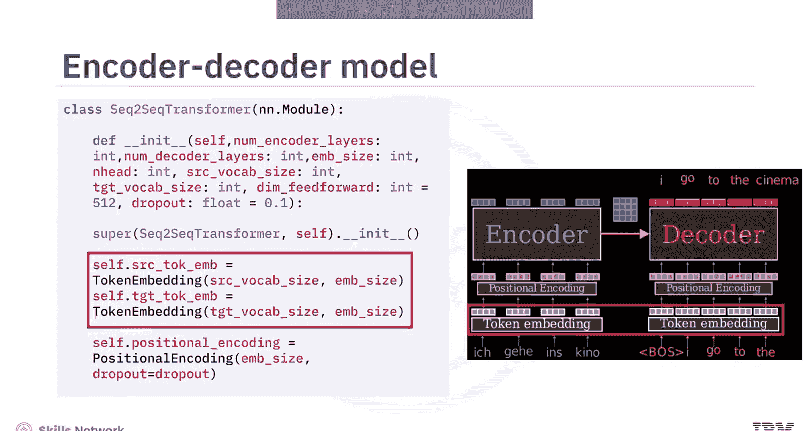
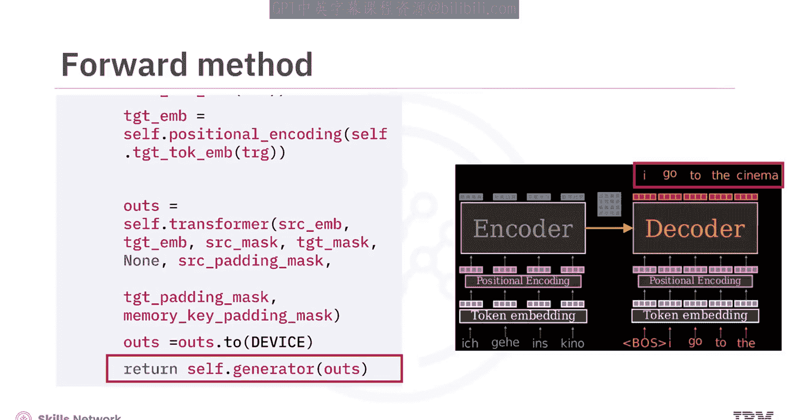
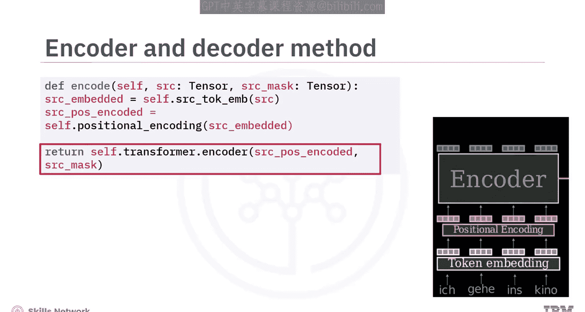
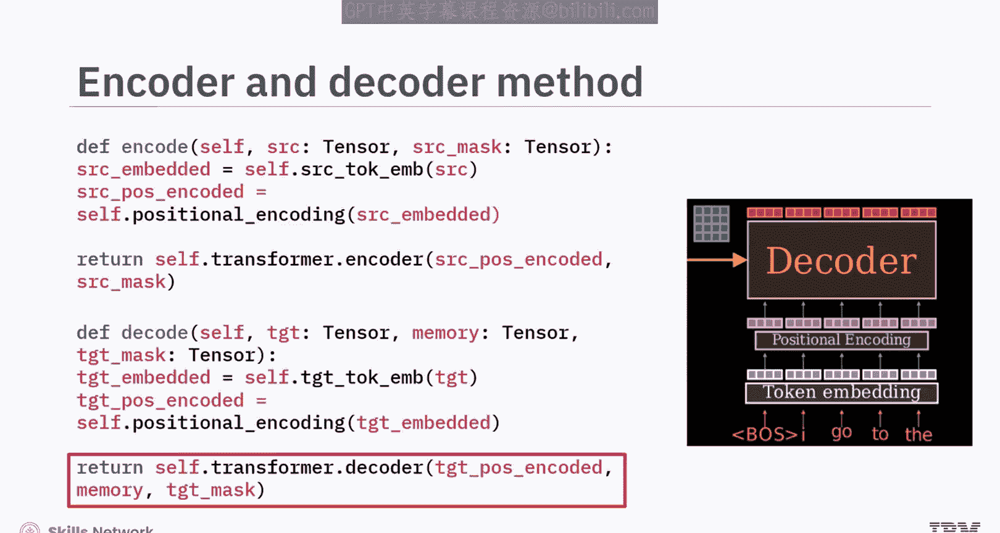
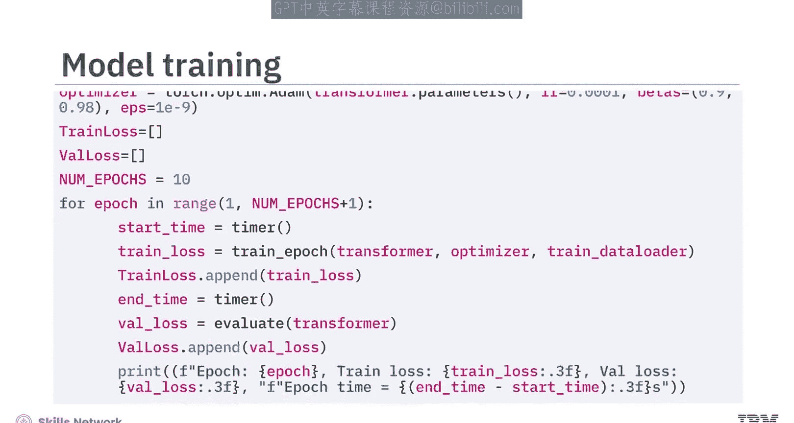
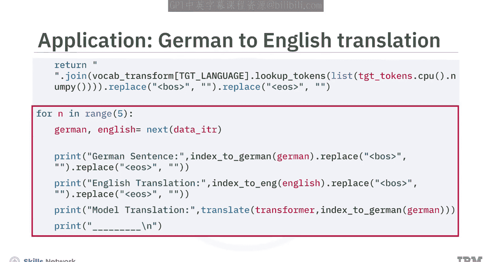
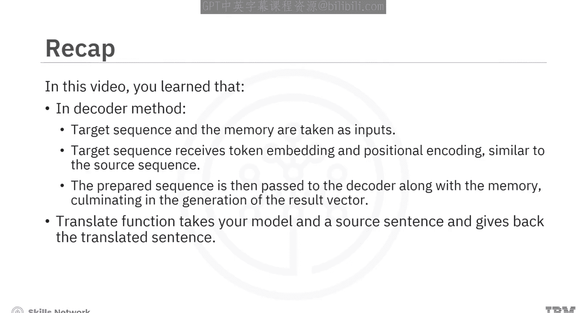

# 生成式人工智能工程：15：用于翻译的Transformer架构的PyTorch实现 🧠➡️🌐

在本节课中，我们将学习如何使用PyTorch实现一个用于翻译任务的编码器-解码器Transformer模型。我们将从加载数据集开始，逐步构建模型，并最终训练它来完成从德语到英语的翻译。

## 概述

我们将创建一个完整的翻译模型，其核心流程包括：数据准备、掩码生成、嵌入与位置编码、Transformer模型构建、训练循环以及推理过程。以下是实现的关键步骤。

## 数据加载与准备



首先，我们需要加载数据集。这里使用批量大小为100，这是一个可以在训练过程中调整的超参数。

```python
batch_size = 100
# 假设 load_dataset 函数返回 (src_sentences, tgt_sentences)
SRC, TGT = load_dataset(batch_size=batch_size)
```

加载过程会输出成对的德语句子（源语言，SRC）和英语句子（目标语言，TGT）。与训练解码器模型类似，需要确保模型在预测时不会“看到”未来的目标词，因此需要生成一个因果掩码。

## 构建掩码

`create_mask` 函数用于为Transformer模型中的源序列和目标序列构建掩码。

以下是该函数的核心逻辑：
1.  为**目标序列**调用之前定义的 `square_mask` 函数生成因果掩码。
2.  对于**源序列**，掩码通常是一个初始化为 `False` 的布尔值数组，因为在编码过程中，整个源序列应该一次性全部可见。
3.  该函数还会为**目标和源序列**生成填充掩码。这些掩码会将输入张量中通常用零标记的填充令牌位置标记为 `True`。

## 模型组件





接下来，我们介绍构成翻译模型的核心组件。

### 位置编码模块

位置编码模块用于向序列中的令牌注入关于其相对或绝对位置的信息。

### 令牌嵌入模块

令牌嵌入模块用于生成文本的向量形式嵌入。

## 组装编码器-解码器模型



现在，我们将所有组件组合在一起，创建用于翻译的编码器-解码器模型。



以下是构建步骤：
1.  为源语言和目标语言创建嵌入层。
2.  创建位置编码层。
3.  创建Transformer层。
4.  创建一个类似于神经网络输出层的生成器层。



在模型的 `forward` 方法中：
*   首先为源序列和目标序列生成令牌嵌入和位置编码。
*   然后将这些嵌入作为输入提供给包含编码器和解码器组件的Transformer模型。
*   同时，应用适当的掩码，指示Transformer在处理过程中有选择地忽略输入序列的某些部分。
*   最后，Transformer的输出通过一个线性层（图中未显示），该层负责生成作为模型预测结果的输出向量。

## 编码器与解码器方法

上一节我们介绍了模型的前向传播流程，本节中我们来看看专门为学习目的定义的编码器和解码器方法。请注意，在实践中，Transformer层本身会处理编码和解码过程。

### 编码器方法

在编码器方法中：
1.  源序列经过令牌嵌入和位置编码。
2.  随后，序列由实际的编码器处理，产生一个编码后的向量，通常称为 **memory**（记忆）。

```python
def encode(self, src, src_mask):
    # 嵌入与位置编码
    src_embeddings = self.src_embed(src)
    src_embeddings = self.positional_encoding(src_embeddings)
    # 通过编码器得到 memory
    memory = self.encoder(src_embeddings, src_mask)
    return memory
```

### 解码器方法

解码器方法以目标序列和来自编码器的 `memory` 作为输入。
1.  目标序列像源序列一样，接受令牌嵌入和位置编码。
2.  这个准备好的序列然后与 `memory` 一起传递给解码器，最终生成结果向量。

```python
def decode(self, tgt, memory, tgt_mask):
    # 嵌入与位置编码
    tgt_embeddings = self.tgt_embed(tgt)
    tgt_embeddings = self.positional_encoding(tgt_embeddings)
    # 通过解码器得到输出
    output = self.decoder(tgt_embeddings, memory, tgt_mask)
    return output
```

## 训练过程

Transformer的训练过程与其他方法有相似之处，但让我们关注关键区别。

以下是训练循环中的关键步骤：
1.  遍历每个批次中提供的源序列（SRC）和目标序列（TGT）。
2.  目标输入本质上是移除了最后一个令牌的序列。
3.  生成必要的掩码。
4.  通过模型进行前向传播以生成预测。在此阶段，你还需要输入目标输入。这个过程与推理或预测期间发生的情况类似，Transformer依赖于自己先前的输出来进行未来的预测。
5.  目标输出本质上是时间上向前移动的目标输入。在内部，Transformer使用掩码递归地进行预测，并基于其先前的输出。
6.  使用目标输出和模型的输出逻辑（logits）计算损失。

类似地，你可以使用验证数据评估模型在训练数据上的损失。

## 推理（解码）过程

推理或解码过程从准备输入开始。

以下是推理步骤：
1.  首先构建 **memory** 张量，这是通过将源输入及其对应的掩码传递给模型的 `encode` 函数得到的。在此，德语的源文本被编码。
2.  初始化一个名为 `ys` 的张量，将其维度设置为 `[1, 1]`，并用起始符号填充。该符号作为解码过程的初始令牌。
3.  在解码器中，你将输入掩码（确保只关注已预测的令牌）以及包含源输入编码上下文的 `memory` 张量。
4.  解码器的输出类似于神经网络的输出。在模型生成的概率分布中，识别与预测单词索引对应的最大值。然后使用该索引从词汇表中检索预测的单词。
5.  添加输出令牌索引，并将其作为下一次迭代的解码器输入。
6.  重复获取输出令牌索引的过程，直到看到结束符号（EOS）标记或达到最大迭代次数为止。



## 模型训练与翻译



现在，让我们开始训练模型。超参数和其他基本设置已精心配置。

以下是训练步骤：
1.  初始化数据加载器：训练数据加载器和验证数据加载器。
2.  使用参数实例化Transformer模型。
3.  为了优化，可以选择Adam优化器，同时定义学习率和动量。
4.  使用 `train_and_evaluate` 函数训练模型。

这里有一个名为 `translate` 的函数，它接收你的模型和一个源句子，并返回翻译后的句子。

在循环中，你可以从数据集中抽取句子，并打印原始的德语句子、其真实的英语翻译以及模型的翻译结果。

由于使用了基础的模型，你可以看到模型的翻译与实际英语翻译非常相似。

## 总结



本节课中我们一起学习了：
*   `create_mask` 函数用于为Transformer模型内的源序列和目标序列构建掩码。
*   线性层负责生成作为模型返回的预测结果的输出向量。
*   在实践中，Transformer层在编码器方法中处理编码和解码过程。源序列经过令牌嵌入和位置编码，然后由实际编码器处理，产生一个通常称为 **memory** 的编码向量。
*   解码器方法以目标序列和 **memory** 作为输入。目标序列像源序列一样接受令牌嵌入和位置编码，然后这个准备好的序列与 **memory** 一起传递给解码器，最终生成结果向量。
*   `translate` 函数接收你的模型和一个源句子，并返回翻译后的句子。